# TALO公会政策｜客户端与后台需求文档 PRD

生成时间：2026-06-12  
文档版本：V1.0  
输入材料：
- 业务建模：`TALO公会政策_产品视角功能层业务建模.md`
- 功能结构脑图：`TALO公会政策_客户端后台功能结构脑图.xmind`
- 原型图目录：`/Users/mac/心音跳动/TOPKHLIJ/原型图`

> 本 PRD 面向产品、设计、研发、测试、运营、财务、风控共同评审。  
> 本文档按客户端与后台两条产品线拆开描述，但工资、预支、提现、余额池、历史快照必须按同一条资金链闭环理解。  
> 所有涉及金额、工资、提现、预支、风控的规则，默认以系统记录和结算快照为准，不以页面实时展示值作为最终结算依据。

---

## 一、产品背景与目标

### 1.1 产品背景

TALO 公会政策系统用于支撑中东语聊新平台的公会招商、主播管理、工资结算、金币工资奖励、预支、提现、风控复核与财务对账。

当前业务同时存在：

| 业务对象 | 说明 |
|---|---|
| 公会 | 平台合作组织主体，负责招募和管理主播 |
| 公会长 | 公会经营者，拥有管理收益、主播转账余额和本人主播收益 |
| 主播 | 收礼、产生钻石流水、获得工资和金币工资奖励 |
| 送礼用户 | 充值金币并送礼，形成主播钻石流水 |
| 运营 | 配置政策、处理绑定、发起后台预支、协助结算 |
| 财务 | 审核结算、审核提现、处理付款和对账 |
| 风控 | 识别异常流水、冻结结算、处理套利和关联网络 |

### 1.2 产品目标

| 目标 | 说明 |
|---|---|
| 支撑公会政策落地 | 支持自由政策和非自由政策两套结算模式 |
| 支撑主播与公会长薪资透明展示 | 客户端可查看流水、工资项、预支扣减、余额池、历史结算 |
| 支撑多出口提现 | 支持提现金币、提现现金、主播提现给公会长等不同出口 |
| 支撑后台财务与风控闭环 | 后台完成结算、提现审核、资产操作、风控处置、审计追溯 |
| 防止套利和重复发钱 | 通过结算快照、余额池拆分、预支对冲、风控复核阻断重复提现和工资循环 |

### 1.3 产品范围

| 范围 | 是否包含 | 说明 |
|---|---:|---|
| 客户端公会入口 | 是 | 主播/公会长进入公会相关功能 |
| 客户端入会申请 | 是 | 主播申请加入公会，公会长处理申请 |
| 客户端薪资数据 | 是 | 主播、公会长、公会维度工资展示 |
| 客户端提现 | 是 | 金币、现金、提现给公会长等流程 |
| 客户端预支记录 | 是 | 第一期客户端仅展示预支记录，不默认开放自助申请 |
| 后台公会/主播管理 | 是 | 公会、主播、归属、状态、申请处理 |
| 后台政策与结算 | 是 | 政策模板、公会绑定、主播分成、月度结算 |
| 后台提现审核 | 是 | 提现申请审核、打款、驳回、失败回滚 |
| 后台用户资产操作 | 是 | 人工加减资产、预支/借支/赠送/充币等操作 |
| 后台币商交易记录 | 是 | 币商交易查询和对账 |
| 完整财务付款系统 | 部分 | 本 PRD 定义审核和状态流，具体付款通道对接另行补充 |
| 完整自动风控模型 | 部分 | 本 PRD 定义风控事件、冻结、复核、处置链路，算法细节另行补充 |

---

## 二、核心业务模型

### 2.1 一句话业务模型

```text
用户充值金币 → 用户送礼 → 主播收礼形成钻石流水 → 公会政策结算 → 工资项拆分 → 预支对冲 → 余额池生成 → 主播/公会长提现 → 后台审核打款 → 快照审计追溯
```

### 2.2 端口划分

| 端口 | 使用角色 | 核心任务 |
|---|---|---|
| 客户端 | 主播、公会长、公会代理/协作者 | 入会、查看薪资、管理主播、发起提现、查看历史和预支记录 |
| 后台 | 运营、财务、风控、管理员 | 管理公会/主播/政策/结算/提现/资产/风控/审计 |

### 2.3 核心业务闭环图

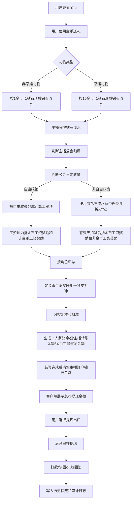
```mermaid
flowchart TD
    A[用户充值金币] --> B[用户使用金币送礼]
    B --> C{礼物类型}
    C -->|非幸运礼物| D[按1金币=1钻石形成钻石流水]
    C -->|幸运礼物| E[按10金币=1钻石形成钻石流水]
    D --> F[主播获得钻石流水]
    E --> F
    F --> G[判断主播公会归属]
    G --> H[判断公会当前政策]
    H -->|自由政策| I[按自由政策分成计算工资项]
    H -->|非自由政策| J[按月度钻石流水命中档位并拆X/Y/Z]
    I --> K[工资项内拆金币工资奖励和非金币工资奖励]
    J --> L[有效天扣减后拆金币工资奖励和非金币工资奖励]
    K --> M[按角色汇总]
    L --> M
    M --> N[非金币工资奖励用于预支对冲]
    N --> O[风控复核和扣减]
    O --> P[生成个人薪资余额/主播转账余额/金币工资奖励余额]
    P --> P1[结算完成后清空主播账户钻石余额]
    P1 --> Q[客户端展示总可提现金额]
    Q --> R[用户选择提现出口]
    R --> S[后台审核提现]
    S --> T[打款/驳回/失败回滚]
    T --> U[写入历史快照和审计日志]
```

### 2.3A 核心业务流程图补充

#### 2.3A.1 一级货币到工资的完整链路


```mermaid
flowchart TD
    A[用户充值现金] --> B[用户获得金币]
    B --> C[用户使用金币送礼]
    C --> D{礼物类型}
    D -->|非幸运礼物| E[1金币 = 1钻石]
    D -->|幸运礼物| F[10金币 = 1钻石]
    E --> G[主播获得钻石]
    F --> G
    G --> H[形成主播钻石流水]
    H --> I{公会绑定政策类型}
    I -->|自由政策| J[按统一钻石流水计算分成工资]
    I -->|非自由政策| K[按统一钻石流水命中档位并计算工资]
    J --> L[主播工资/公会长收益]
    K --> L
    L --> M[预支对冲/扣减/余额池拆分/提现]
```

#### 2.3A.2 钻石流水生成流程

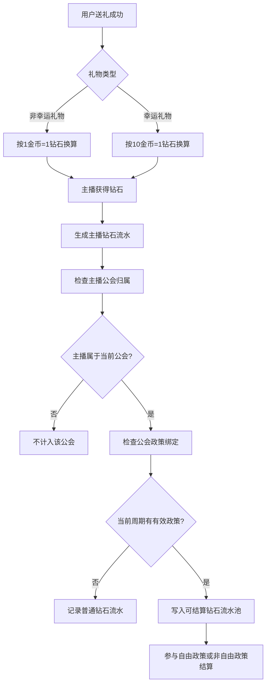
```mermaid
flowchart TD
    A[用户送礼成功] --> B{礼物类型}
    B -->|非幸运礼物| C[按1金币=1钻石换算]
    B -->|幸运礼物| D[按10金币=1钻石换算]
    C --> E[主播获得钻石]
    D --> E
    E --> F[生成主播钻石流水]
    F --> G[检查主播公会归属]
    G --> H{主播属于当前公会?}
    H -->|否| I[不计入该公会]
    H -->|是| J[检查公会政策绑定]
    J --> K{当前周期有有效政策?}
    K -->|否| L[记录普通钻石流水]
    K -->|是| M[写入可结算钻石流水池]
    M --> N[参与自由政策或非自由政策结算]
```

#### 2.3A.3 提现出口选择流程

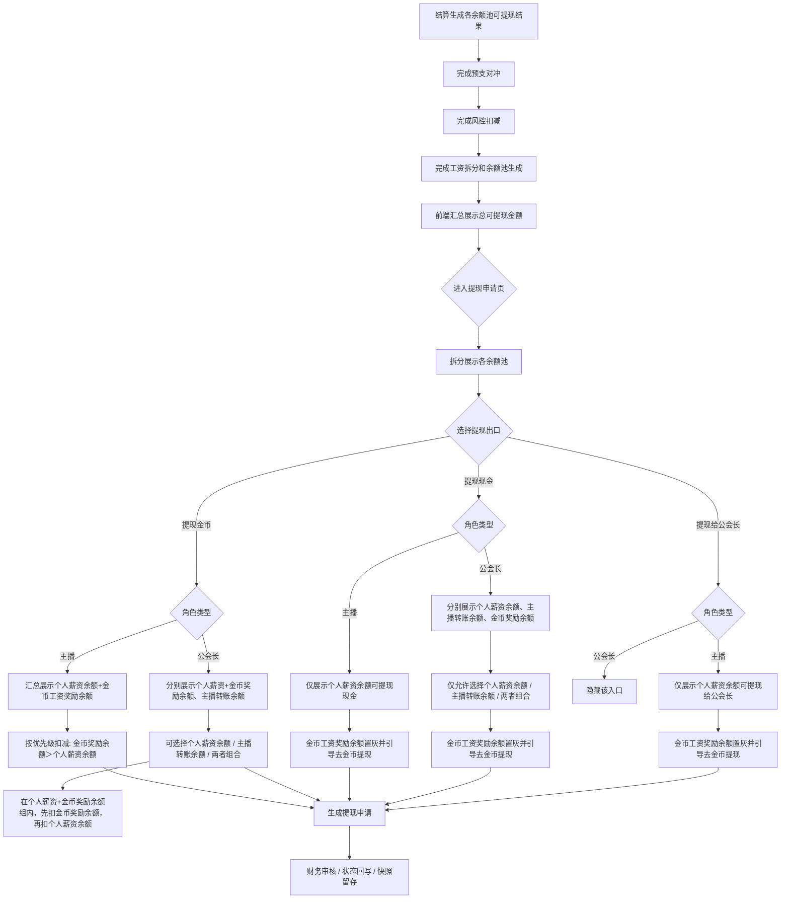
```mermaid
flowchart TD
    A[结算生成各余额池可提现结果] --> B[完成预支对冲]
    B --> C[完成风控扣减]
    C --> D[完成工资拆分和余额池生成]
    D --> E[前端汇总展示总可提现金额]
    E --> F{进入提现申请页}
    F --> G[拆分展示各余额池]
    G --> H{选择提现出口}

    H -->|提现金币| I{角色类型}
    I -->|主播| J[汇总展示个人薪资余额+金币工资奖励余额]
    J --> K[按优先级扣减: 金币奖励余额＞个人薪资余额]
    I -->|公会长| L[分别展示个人薪资+金币奖励余额、主播转账余额]
    L --> M[可选择个人薪资余额 / 主播转账余额 / 两者组合]
    M --> M1[在个人薪资+金币奖励余额组内，先扣金币奖励余额，再扣个人薪资余额]

    H -->|提现现金| N{角色类型}
    N -->|主播| O[仅展示个人薪资余额可提现现金]
    O --> P[金币工资奖励余额置灰并引导去金币提现]
    N -->|公会长| Q[分别展示个人薪资余额、主播转账余额、金币奖励余额]
    Q --> R[仅允许选择个人薪资余额 / 主播转账余额 / 两者组合]
    R --> S[金币工资奖励余额置灰并引导去金币提现]

    H -->|提现给公会长| T{角色类型}
    T -->|公会长| U[隐藏该入口]
    T -->|主播| V[仅展示个人薪资余额可提现给公会长]
    V --> W[金币工资奖励余额置灰并引导去金币提现]

    K --> X[生成提现申请]
    M --> X
    P --> X
    S --> X
    W --> X
    X --> Y[财务审核 / 状态回写 / 快照留存]
```

#### 2.3A.4 非自由政策月度结算流程

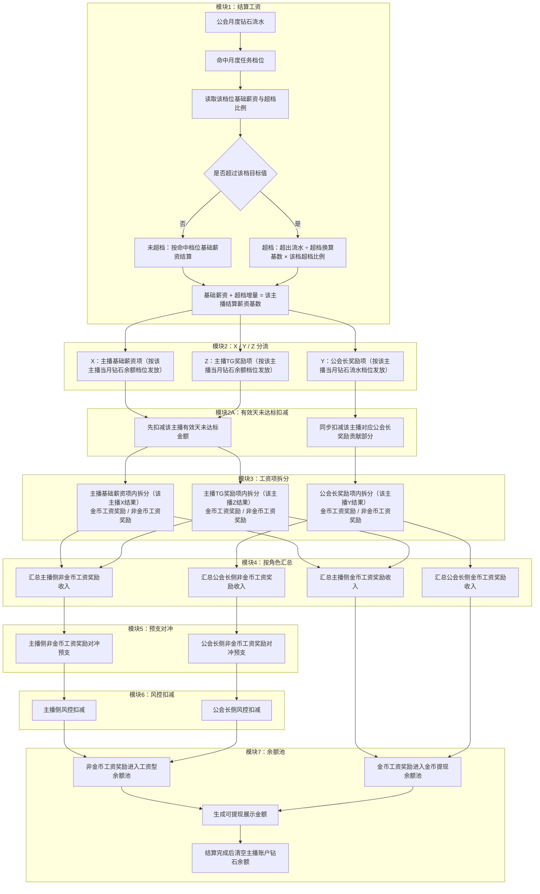
```mermaid
flowchart TD
    subgraph M1[模块1：结算工资]
        A1[公会月度钻石流水]
        A2[命中月度任务档位]
        A3[读取该档位基础薪资与超档比例]
        A4{是否超过该档目标值}
        A5[未超档：按命中档位基础薪资结算]
        A6[超档：超出流水 ÷ 超档换算基数 × 该档超档比例]
        A7[基础薪资 + 超档增量 = 该主播结算薪资基数]
        A1 --> A2 --> A3 --> A4
        A4 -->|否| A5 --> A7
        A4 -->|是| A6 --> A7
    end

    subgraph M2[模块2：X / Y / Z 分流]
        B1[X：主播基础薪资项（按该主播当月钻石余额档位发放）]
        B2[Y：公会长奖励项（按该主播当月钻石流水档位发放）]
        B3[Z：主播TG奖励项（按该主播当月钻石余额档位发放）]
    end

    subgraph M2A[模块2A：有效天未达标扣减]
        B4[先扣减该主播有效天未达标金额]
        B5[同步扣减该主播对应公会长奖励贡献部分]
    end

    subgraph M3[模块3：工资项拆分]
        C1[主播基础薪资项内拆分（该主播X结果）
金币工资奖励 / 非金币工资奖励]
        C2[主播TG奖励项内拆分（该主播Z结果）
金币工资奖励 / 非金币工资奖励]
        C3[公会长奖励项内拆分（该主播Y结果）
金币工资奖励 / 非金币工资奖励]
    end

    subgraph M4[模块4：按角色汇总]
        D1[汇总主播侧非金币工资奖励收入]
        D2[汇总主播侧金币工资奖励收入]
        E1[汇总公会长侧非金币工资奖励收入]
        E2[汇总公会长侧金币工资奖励收入]
    end

    subgraph M5[模块5：预支对冲]
        F1[主播侧非金币工资奖励对冲预支]
        F2[公会长侧非金币工资奖励对冲预支]
    end

    subgraph M6[模块6：风控扣减]
        G1[主播侧风控扣减]
        G2[公会长侧风控扣减]
    end

    subgraph M7[模块7：余额池]
        H1[非金币工资奖励进入工资型余额池]
        H2[金币工资奖励进入金币提现余额池]
        H3[生成可提现展示金额]
        H4[结算完成后清空主播账户钻石余额]
    end

    A7 --> B1
    A7 --> B2
    A7 --> B3
    B1 --> B4
    B2 --> B5
    B3 --> B4
    B4 --> C1
    B4 --> C2
    B5 --> C3
    C1 --> D1
    C2 --> D1
    C1 --> D2
    C2 --> D2
    C3 --> E1
    C3 --> E2
    D1 --> F1
    E1 --> F2
    F1 --> G1
    F2 --> G2
    G1 --> H1
    G2 --> H1
    D2 --> H2
    E2 --> H2
    H1 --> H3
    H2 --> H3
    H3 --> H4
```

#### 2.3A.5 自由政策月度结算流程

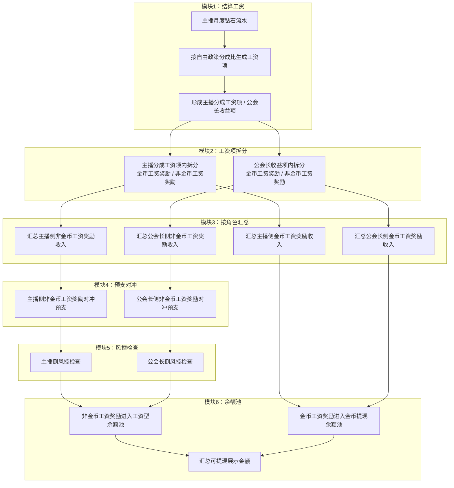
```mermaid
flowchart TD
    subgraph M1[模块1：结算工资]
        A1[主播月度钻石流水]
        A2[按自由政策分成比生成工资项]
        A3[形成主播分成工资项 / 公会长收益项]
        A1 --> A2 --> A3
    end

    subgraph M2[模块2：工资项拆分]
        B1[主播分成工资项内拆分
金币工资奖励 / 非金币工资奖励]
        B2[公会长收益项内拆分
金币工资奖励 / 非金币工资奖励]
    end

    subgraph M3[模块3：按角色汇总]
        C1[汇总主播侧非金币工资奖励收入]
        C2[汇总主播侧金币工资奖励收入]
        C3[汇总公会长侧非金币工资奖励收入]
        C4[汇总公会长侧金币工资奖励收入]
    end

    subgraph M4[模块4：预支对冲]
        D1[主播侧非金币工资奖励对冲预支]
        D2[公会长侧非金币工资奖励对冲预支]
    end

    subgraph M5[模块5：风控检查]
        E1[主播侧风控检查]
        E2[公会长侧风控检查]
    end

    subgraph M6[模块6：余额池]
        F1[非金币工资奖励进入工资型余额池]
        F2[金币工资奖励进入金币提现余额池]
        F3[汇总可提现展示金额]
    end

    A3 --> B1
    A3 --> B2
    B1 --> C1
    B1 --> C2
    B2 --> C3
    B2 --> C4
    C1 --> D1
    C3 --> D2
    D1 --> E1
    D2 --> E2
    E1 --> F1
    E2 --> F1
    C2 --> F2
    C4 --> F2
    F1 --> F3
    F2 --> F3
```

#### 2.3A.6 多公会拆分冲档识别流程

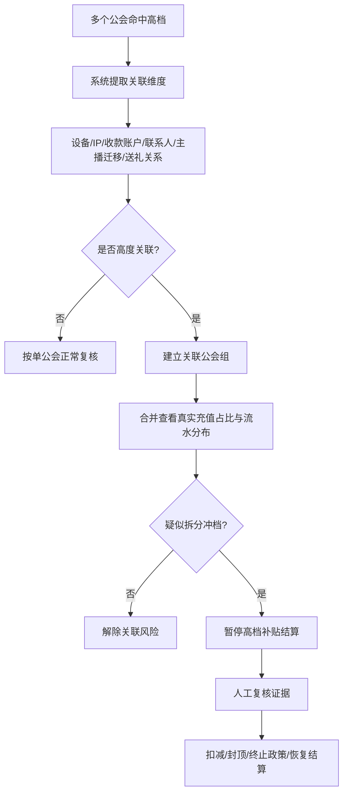
```mermaid
flowchart TD
    A[多个公会命中高档] --> B[系统提取关联维度]
    B --> C[设备/IP/收款账户/联系人/主播迁移/送礼关系]
    C --> D{是否高度关联?}
    D -->|否| E[按单公会正常复核]
    D -->|是| F[建立关联公会组]
    F --> G[合并查看真实充值占比与流水分布]
    G --> H{疑似拆分冲档?}
    H -->|否| I[解除关联风险]
    H -->|是| J[暂停高档补贴结算]
    J --> K[人工复核证据]
    K --> L[扣减/封顶/终止政策/恢复结算]
```

### 2.4 角色权限总览

| 功能/操作 | 主播 | 公会长 | 公会长本人作为主播 | 运营 | 财务 | 风控 |
|---|---|---|---|---|---|---|
| 申请加入公会 | 可 | 不适用 | 可 | 查看/协助 | - | 查看风险 |
| 审核入会申请 | - | 可 | 作为公会长可 | 可协助 | - | 查看风险 |
| 查看本人薪资 | 可 | 可 | 可 | 查看 | 查看 | 查看 |
| 查看公会薪资 | - | 可 | 作为公会长可 | 查看 | 查看 | 查看 |
| 修改本人政策 | 每月1号可 | 不可替他人 | 按主播本人规则 | 后台处理 | - | - |
| 修改主播分成比例 | 不可 | 每月1号可 | 作为公会长可改他人 | 后台处理 | - | - |
| 发起提现金币 | 可 | 可 | 可 | 查看 | 审核/付款 | 风险复核 |
| 发起提现现金 | 可 | 可 | 可 | 查看 | 审核/付款 | 风险复核 |
| 提现给公会长 | 可 | 不可见 | 作为主播可 | 查看 | 审核 | 风险复核 |
| 发起预支 | 第一期不可 | 第一期不可 | 第一期不可 | 可后台发起 | 审核/发放 | 风险复核 |
| 资产操作 | - | - | - | 可按权限 | 可按权限 | 查看/冻结 |
| 月度结算确认 | - | 查看 | 查看 | 生成/复核 | 确认 | 复核/冻结 |
| 风控处置 | - | - | - | 协助 | 查看 | 可操作 |

---

## 三、全局业务规则

### 3.1 政策类型规则

| 政策类型 | 业务定位 | 结算基础 | 结算方式 | 关键限制 |
|---|---|---|---|---|
| 自由政策 | 默认公开基础政策 | 主播月度钻石流水 | 按固定分成生成主播工资与公会长收益 | 同样需要拆金币工资奖励/非金币工资奖励，并进入预支对冲和余额池 |
| 非自由政策 | 战略公会/月度任务政策 | 公会月度钻石流水 | 命中档位后形成公会总政策收益，再按单个主播的X/Y/Z规则发放和汇总；若主播实际流水/余额超过命中档位目标值，则超档部分按该档位配置的超档比例追加结算 | 高档必须名单制、封顶、风控复核、结算快照 |

#### 3.1.1A 非自由政策超档规则

| 规则项 | 规则 |
|---|---|
| 适用范围 | 仅适用于非自由政策；自由政策仍按固定分成比结算，不走超档追加 |
| 命中方式 | 先按主播当期流水或余额命中基础档位，再判断是否超过该档目标值 |
| 超档口径 | 非自由政策下，超档部分不是重算到下一档，而是继续沿用当前命中档位配置的超档比例做追加换算 |
| 超档公式 | 超档增量 = （实际值 - 当前档目标值） ÷ 超档换算基数 × 当前档超档比例 |
| 总薪资基数 | 总薪资基数 = 当前档基础薪资 + 超档增量 |
| X/Y/Z拆分口径 | 主播底薪X、主播TG奖励Z、公会长分成Y，均以“总薪资基数”作为拆分基数，不得只对基础薪资拆分 |
| 档位冻结 | 一旦命中某档，本期超出部分仍按该档超档比例追加，不自动跳转为下一档基础薪资，除非下一轮结算重新按完整周期重算命中档 |
| 快照要求 | 结算快照必须记录：命中档位、目标值、实际值、超出值、超档换算基数、超档比例、超档增量、总薪资基数、X/Y/Z拆分结果 |

**示例说明：**

- 主播流水/余额命中 13 档，13 档目标值为 `20000`，该档基础薪资为 `10$`。
- 13 档配置的超档规则为：每超出 `1000`，追加 `1$`。
- 主播实际达到 `21000`，则超出部分为 `1000`。
- 超档增量 = `1000 ÷ 1000 × 1$ = 1$`。
- 总薪资基数 = `10$ + 1$ = 11$`。
- 各角色实际到手按总薪资基数拆分：
  - 主播底薪 = `11$ × x`
  - 主播TG奖励 = `11$ × z`
  - 公会长分成 = `11$ × y`

#### 3.1.1B 政策修改规则

| 规则项 | 规则 |
|---|---|
| 主播修改本人政策 | 主播含公会长本人作为主播，仅可修改本人政策 |
| 公会长修改主播政策 | 公会长不能替主播修改其本人政策 |
| 公会长修改主播政策 | 公会长可对每个主播的公会政策进行调整 |
| 公会政策调整规则 | 公会长对每个主播最多可调整3次，且每个月只能调整1次 |
| 普通政策主播薪资比例 | 公会长对每个普通政策主播每3个月可调整1次，且必须在每个月1号操作 |
| 可修改时间 | 仅每月1号可修改政策或分成比例 |
| 修改次数 | 同一自然月内本人政策最多修改1次；公会政策调整每个主播总计最多3次且每月最多1次；普通政策主播薪资比例每3个月最多调整1次 |
| 生效方式 | 当月1号修改成功后，当月按最新一次有效修改结果执行 |
| 留痕要求 | 记录修改前值、修改后值、操作人、操作对象、操作时间、所属自然月 |

### 3.2 钻石流水规则

| 环节 | 规则 |
|---|---|
| 用户充值 | 用户充值后获得金币，充值本身不直接进入工资结算 |
| 用户送礼 | 用户消费金币送礼 |
| 主播收礼 | 主播侧统一获得钻石 |
| 非幸运礼物 | 1金币 = 1钻石 |
| 幸运礼物 | 10金币 = 1钻石 |
| 结算基础 | 主播工资、公会长收益、公会政策结算统一使用钻石流水 |
| 无有效公会/政策 | 只记录普通钻石流水，不产生政策工资 |
| 风控冻结 | 钻石流水进入待复核池，暂缓结算或按复核结果扣减 |
| 月度结算后钻石余额处理 | 系统每月结算完成并生成结算快照、余额池后，必须清空主播账户上的钻石余额，避免同一批钻石余额进入下一周期重复结算 |
| 离会结算后钻石余额处理 | 主播离开公会前必须先完成离会结算；离会结算完成并生成快照后，同样清空主播账户上的钻石余额，再解除公会归属 |

### 3.3 工资拆分总原则

```text
不得先汇总主播或公会长工资后再统一拆金币工资奖励和非金币工资奖励。
必须先按每个工资项生成金额，再在每个工资项内同步拆分：
- 非金币工资奖励金额
- 金币工资奖励金额
之后再按角色汇总，进入预支对冲、余额池和提现流程。
```

### 3.4 余额池规则

| 角色 | 余额池 | 来源 | 可提现现金 | 可提现金币 | 可提现给公会长 |
|---|---|---|---:|---:|---:|
| 主播 | 个人薪资余额 | 主播非金币工资奖励 | 是 | 是 | 是 |
| 主播 | 金币工资奖励余额 | 主播金币工资奖励 | 否 | 是 | 否 |
| 公会长 | 个人薪资余额 | 公会长非金币工资奖励 + 本人主播身份工资型收入 | 是 | 是 | 否 |
| 公会长 | 主播转账余额 | 主播提现给公会长成功后入账 | 是 | 是 | 否 |
| 公会长 | 金币工资奖励余额 | 公会长金币工资奖励 | 否 | 是 | 否 |

### 3.5 预支规则

| 规则项 | 规则 |
|---|---|
| 第一期入口 | 不开放主播端自助预支申请 |
| 发起主体 | 由运营人员在后台发起 |
| 支持场景 | 预支给用户本人、预支给他人 |
| 债务归属 | 始终挂在预支人本人名下 |
| 扣减时点 | 发起成功不扣减；审核通过后才扣减预支金额 |
| 发放时点 | 审核通过后才发放所选货币 |
| 审核拒绝 | 不扣减、不发放，保留拒绝原因 |
| 对冲范围 | 仅非金币工资奖励可用于预支对冲 |
| 禁止项 | 金币工资奖励不得计入预支额度，也不得用于预支对冲 |
| 不足抵扣 | 形成待抵扣余额，后续工资优先抵扣 |

### 3.6 入会与离会规则

| 场景 | 规则 |
|---|---|
| 主播申请入会 | 已有公会时不能直接加入新公会，需先走离会流程 |
| 冷静期入会 | 离会冷静期未结束时不能加入新公会或按配置限制 |
| 入会成功 | 生成入会关系快照，进入新公会观察期 |
| 主播主动离会 | 不允许未结算直接离会，必须先完成当期结算并优先结清预支 |
| 公会主动移除 | 可发起移除，但不得跳过当期结算流程；默认不收主播违约金 |
| 结算后余额 | 结算完成后的余额、可提现余额挂主播本人，不跟后续公会绑定 |
| 结算后钻石余额 | 无论是系统月结还是离会结算，只要结算完成并写入快照，就清空主播账户上的钻石余额；后续新周期只累计新产生的钻石 |
| 新公会影响 | 新公会只影响离会后新产生的流水、工资和政策归属 |
| 历史快照 | 离会、移除、结算完成时间、余额结果必须留痕 |

---

## 四、客户端需求

### 4.1 客户端视角划分

客户端必须按两个使用视角拆成两个大模块，不能再按“功能散点”组织：

| 客户端大模块 | 使用人 | 主要目标 |
|---|---|---|
| 主播端 | 主播 | 申请加入公会、查看本人薪资、查看历史结算、发起提现、查看预支记录 |
| 公会长端 | 公会长（含本人兼主播） | 查看公会薪资、查看本人薪资、管理主播、处理入会申请、发起提现 |

> 说明：公会长本人兼主播时，页面入口可能出现在同一端内，但需求描述必须把“主播身份收入链路”和“公会长管理收益链路”拆开写，不能混成一个总工资。

---

## 五、主播端需求

> 主播端只描述主播本人能看到、能操作、能追溯的功能。公会长管理视角不混进本章，避免一个页面写成两种角色的杂交怪物。
>
> 主播端所有金额展示必须来自系统结算结果和余额池结果，不允许前端按页面展示值自行反推。页面可以汇总展示，但提交提现、查看历史、客服对账时必须能追到结算快照、余额池快照和操作留痕。

### 5.0 主播端模块边界

| 模块 | 主播端定位 | 关键业务链路 |
|---|---|---|
| 主播端首页 / 公会入口 | 判断主播当前公会身份，提供入会、薪资、提现、预支、金币奖励工资入口 | 公会关系状态 → 入口可见性 → 余额摘要 → 功能跳转 |
| 加入公会 | 主播申请加入目标公会 | 申请提交 → 公会长审核 → 入会关系快照 → 非自由政策薪资参数完善 |
| 主播本人薪资页 | 主播查看本人从钻石流水到余额池的完整工资链路 | 钻石流水 → 工资项 → 扣减 → 预支对冲 → 余额池 |
| 主播提现中心 | 主播按余额池规则发起金币、现金、提现给公会长 | 选择出口 → 校验余额池 → 冻结金额 → 审核 → 入账/驳回/回滚 |
| 金币奖励工资明细 | 解释金币工资奖励从哪里来、还能剩多少 | 结算单 → 金币工资奖励 → 金币余额池 → 提现金币记录 |
| 预支记录 | 展示后台发起的预支申请、发放和月结抵扣结果 | 后台预支 → 审核通过 → 发放 → 月结抵扣 → 待后续抵扣 |
| 历史结算记录 | 按月份查看历史工资、扣减、余额池和提现快照 | 结算快照 → 余额池快照 → 提现申请快照 |

---

### 5.1 主播端首页 / 公会入口

#### 对应原型

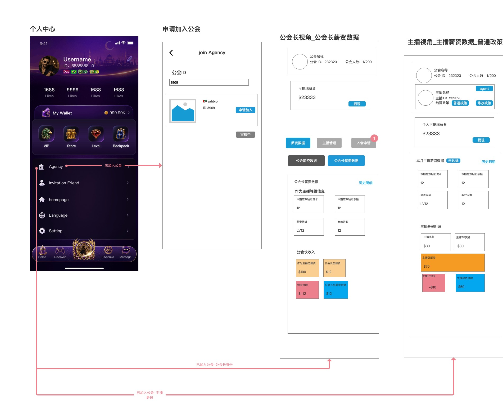

**功能描述：** 主播端首页公会入口，展示主播当前公会关系、申请状态、余额摘要和公会相关功能入口。
**关键交互：** 未入会时进入加入公会；已入会时进入薪资、提现、预支、历史结算等后续页面。

**功能说明：** 主播端首页用于承载主播当前公会状态、可提现余额摘要和核心功能入口。它不是单纯菜单页，而是主播判断“我现在能不能入会、能不能看工资、能不能提现吗”的状态总览页。

#### 前置条件

| 条件 | 处理规则 |
|---|---|
| 用户已登录 | 读取用户身份、当前公会关系、申请记录、余额池摘要 |
| 用户未加入公会 | 展示加入公会入口；隐藏薪资数据、提现、预支记录等依赖公会关系的入口 |
| 用户已加入公会 | 展示所属公会信息、本人薪资入口、提现入口、预支记录和金币奖励工资明细 |
| 用户处于申请中 | 展示申请状态，不允许再次提交新的入会申请 |
| 用户处于离会冷静期 | 展示冷静期结束时间，加入公会按钮置灰 |
| 用户处于风控冻结 | 保留查看入口；提现、预支相关入口按冻结规则置灰或提示人工复核 |

#### 字段与数据来源

| 字段 | 说明 | 数据来源 |
|---|---|---|
| 公会头像 | 当前所属公会头像；未加入时不展示 | 当前公会关系快照 + 公会资料 |
| 公会名称 | 当前所属公会名称 | 当前公会关系快照 + 公会资料 |
| 公会ID | 当前所属公会唯一编号 | 当前公会关系快照 |
| 公会人数 | 当前公会有效成员数量 | 公会成员关系汇总 |
| 当前身份 | 主播 / 公会长本人兼主播 / 未加入公会 | 用户角色关系 + 公会关系快照 |
| 当前公会状态 | 未加入、申请中、已加入、离会申请中、待结算保护期、冷静期、冻结 | 公会关系状态机 |
| 总可提现展示金额 | 页面汇总展示金额，不能直接等同本次可申请金额 | 个人薪资余额 + 金币工资奖励余额，按当前可见范围汇总 |
| 个人薪资余额 | 主播非金币工资奖励扣完预支、风控后的工资型余额 | 结算余额池 |
| 金币工资奖励余额 | 只能用于提现金币的余额 | 金币工资奖励余额池 |
| 提现按钮 | 进入主播提现中心 | 当前余额池状态 + 风控状态 |
| 薪资数据入口 | 进入主播本人薪资页 | 当前公会关系有效时展示 |
| 提现记录入口 | 查看主播本人提现申请和审核结果 | 提现申请记录 |
| 预支记录入口 | 查看主播本人预支记录；第一期仅展示 | 预支记录 |
| 金币奖励工资明细入口 | 查看金币工资奖励来源和提现消耗 | 金币工资奖励余额流水 |
| 入会申请入口 | 未加入公会且无申请中记录时展示 | 公会关系状态 + 入会申请记录 |
| 待处理状态提醒 | 申请中、审核中、提现审核中等提醒 | 申请记录 / 提现记录 / 预支记录 |

#### 状态与入口可见性

| 主播状态 | 页面主提示 | 可见入口 | 置灰或隐藏入口 |
|---|---|---|---|
| 未加入公会 | 提示加入公会 | 加入公会 | 薪资数据、提现、预支记录、金币奖励工资明细 |
| 入会申请中 | 展示目标公会和申请时间 | 申请详情、撤回申请（如产品开放） | 再次申请其他公会 |
| 已加入公会 | 展示公会信息和工资摘要 | 薪资数据、提现、提现记录、预支记录、金币奖励工资明细 | 无 |
| 离会申请中 | 展示离会处理中 | 薪资数据、历史结算、预支记录 | 新增入会申请、部分提现入口按规则控制 |
| 待结算保护期 | 提示需完成当期结算后离会 | 历史结算、预支抵扣查看 | 加入新公会、绕过结算提现 |
| 冷静期 | 展示冷静期结束时间 | 历史记录、提现记录 | 加入新公会 |
| 风控冻结 | 展示冻结说明或联系运营 | 薪资查看、历史记录 | 提现、预支相关入口 |

#### 交互逻辑

1. 主播进入公会入口页后，系统先读取当前公会关系状态。
2. 若主播未加入公会，页面展示加入公会入口，并提示当前无可查看薪资数据。
3. 若主播已有申请中记录，页面展示申请目标公会、申请时间和审核状态，提交新申请按钮置灰。
4. 若主播已加入公会，页面展示公会信息、可提现展示金额和功能入口。
5. 点击“薪资数据”进入主播本人薪资页，只展示本人数据，不展示公会长管理收益。
6. 点击“提现”进入主播提现中心，系统按主播角色加载可用余额池。
7. 点击“预支记录”进入预支记录页；第一期客户端不展示“发起预支”按钮。
8. 点击“金币奖励工资明细”进入金币奖励工资明细页，用于解释金币工资奖励来源和剩余额度。

#### 系统后台核心逻辑

| 逻辑点 | 规则 |
|---|---|
| 状态优先级 | 风控冻结 > 待结算保护期 > 离会申请中 > 冷静期 > 入会申请中 > 已加入公会 > 未加入公会 |
| 金额来源 | 首页金额只读取结算后的余额池结果，不由前端按薪资字段自行计算 |
| 金额刷新 | 页面展示金额需带刷新时间；提交提现时重新读取余额池并校验，避免页面缓存导致超额提现 |
| 入口权限 | 功能入口按角色、关系状态、风控状态动态控制；隐藏不等于无记录，历史记录仍可查 |
| 快照要求 | 首页展示当前态；历史争议、客服查询、财务对账必须读取历史结算快照和提现快照 |

#### 边界情况

| 场景 | 处理规则 |
|---|---|
| 主播刚被公会长通过但非自由政策薪资参数未完善 | 首页展示“入会处理中 / 待完善薪资参数”，薪资结算能力暂不生效 |
| 主播离会但原周期未结算 | 首页展示待结算保护期，不允许直接加入新公会 |
| 主播余额为0 | 提现按钮可展示但进入后提示暂无可提现金额，或首页直接置灰 |
| 风控冻结部分金额 | 首页总额应区分可用余额与冻结提示，提现时只能使用可用余额 |

---

### 5.2 加入公会

#### 对应原型

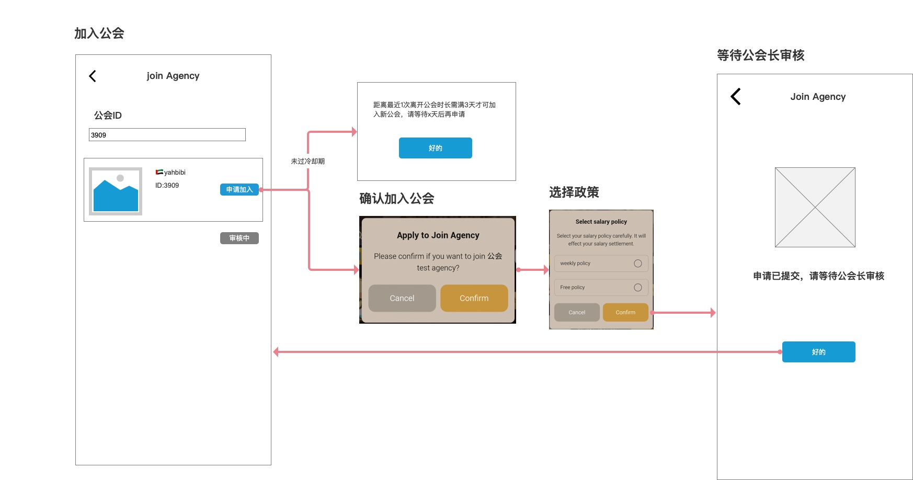

**功能描述：** 主播加入公会申请页，展示目标公会信息、政策提示和入会申请提交入口。
**关键交互：** 主播提交申请前，系统校验是否已有申请中记录；同一时间只能申请1个公会。

**功能说明：** 加入公会用于主播向目标公会提交入会申请。该流程的重点不是“提交一条申请”这么简单，而是要限制并发申请、承接离会冷却、接入公会政策类型，并在审核通过后生成可追溯的入会关系快照。

#### 前置条件

| 条件 | 规则 |
|---|---|
| 当前没有有效公会 | 已加入公会的主播不能直接申请新公会，必须先走离会流程 |
| 当前无申请中记录 | 主播同一时间只能申请1个公会；存在申请中记录时必须等待处理或撤回后再申请 |
| 离会冷静期已结束 | 冷静期未结束时，提交按钮置灰并展示可重新申请时间 |
| 目标公会存在且状态正常 | 目标公会被冻结、停用、清退时不能申请 |
| 风控信息 | 加入前风控信息可记录、可提示运营关注，但默认不作为主播加入公会的阻塞条件 |

#### 字段与数据来源

| 字段 | 说明 | 数据来源 |
|---|---|---|
| 公会ID输入框 | 主播输入目标公会ID或通过入口进入目标公会 | 用户输入 / 公会资料 |
| 目标公会名称 | 搜索或进入后展示 | 公会资料 |
| 目标公会头像 | 目标公会头像 | 公会资料 |
| 公会人数 | 目标公会当前有效成员数 | 公会成员关系汇总 |
| 当前政策类型 | 自由政策 / 非自由政策 | 公会当前政策绑定快照 |
| 主播ID | 提交申请的主播账号 | 用户资料 |
| 主播昵称 | 主播展示名 | 用户资料 |
| 当前公会状态 | 未加入、冷静期、申请中等 | 主播公会关系状态 |
| 申请说明 | 主播填写给公会长看的备注 | 用户输入 |
| 联系方式 / 备注 | 供公会长联系或判断的补充信息 | 用户输入 |
| 提交申请按钮 | 提交入会申请 | 前置校验结果 |
| 申请时间 | 系统记录的提交时间 | 入会申请记录 |
| 审核状态 | 申请中、已通过、已拒绝、已撤回 | 入会申请记录 |
| 拒绝原因 | 公会长拒绝时填写 | 入会申请记录 |

#### 业务流程图

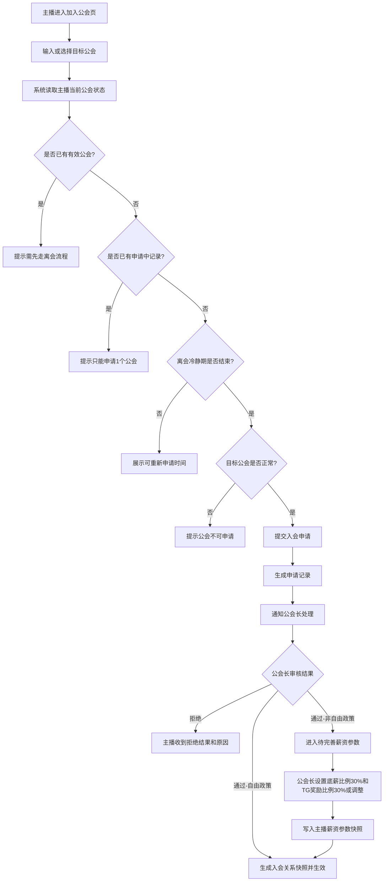
```mermaid
flowchart TD
    A[主播进入加入公会页] --> B[输入或选择目标公会]
    B --> C[系统读取主播当前公会状态]
    C --> D{是否已有有效公会?}
    D -->|是| E[提示需先走离会流程]
    D -->|否| F{是否已有申请中记录?}
    F -->|是| G[提示只能申请1个公会]
    F -->|否| H{离会冷静期是否结束?}
    H -->|否| I[展示可重新申请时间]
    H -->|是| J{目标公会是否正常?}
    J -->|否| K[提示公会不可申请]
    J -->|是| L[提交入会申请]
    L --> M[生成申请记录]
    M --> N[通知公会长处理]
    N --> O{公会长审核结果}
    O -->|拒绝| P[主播收到拒绝结果和原因]
    O -->|通过-自由政策| Q[生成入会关系快照并生效]
    O -->|通过-非自由政策| R[进入待完善薪资参数]
    R --> S[公会长设置底薪比例30%和TG奖励比例30%或调整]
    S --> T[写入主播薪资参数快照]
    T --> Q
```

#### 交互逻辑

1. 主播进入加入公会页后，系统先校验主播当前是否已有有效公会关系。
2. 主播输入公会ID或从推荐入口进入目标公会，页面展示目标公会基础信息和当前政策类型。
3. 主播填写申请说明后点击提交。
4. 系统提交前再次校验：当前无有效公会、无申请中记录、冷静期已结束、目标公会状态正常。
5. 校验通过后生成入会申请记录，状态为“申请中”。
6. 主播返回公会入口时，看到申请中状态，不允许再次申请其他公会。
7. 公会长拒绝后，主播可查看拒绝原因；若产品允许再次申请，则需按拒绝后规则重新提交。
8. 公会长通过后：自由政策公会直接生成入会关系快照；非自由政策公会必须先完成薪资参数设置，未完成前不进入正式可结算状态。

#### 系统后台核心逻辑

| 逻辑点 | 规则 |
|---|---|
| 申请并发 | 主播同一时间只能存在1条申请中记录；不存在“审核通过时已被其他公会通过”的并发场景 |
| 状态写入 | 提交成功写入申请记录：主播、公会、申请时间、申请说明、状态、来源入口 |
| 公会政策读取 | 申请时记录目标公会当前政策类型；审核通过时再读取绑定快照，防止页面展示和审核时配置变化 |
| 自由政策通过 | 生成入会关系快照，主播进入正常可结算状态 |
| 非自由政策通过 | 生成“待完善薪资参数”中间态；底薪比例和TG奖励比例默认各30%，公会长可在允许范围内调整后确认 |
| 薪资参数快照 | 非自由政策的底薪比例、TG奖励比例、操作人、确认时间必须写入主播薪资参数快照，历史结算读取快照 |
| 风控记录 | 主播历史风险、公会风险可进入运营关注，不默认阻塞加入；若后台人工冻结则按冻结状态处理 |

#### 状态设计

| 状态 | 进入条件 | 主播可见表现 | 可执行操作 | 退出条件 |
|---|---|---|---|---|
| 未申请 | 未加入公会且无申请中记录 | 显示加入公会入口 | 提交申请 | 申请提交成功 |
| 申请中 | 主播提交申请后 | 展示目标公会和申请时间 | 查看申请状态、撤回（如开放） | 公会长通过/拒绝/主播撤回 |
| 已拒绝 | 公会长拒绝 | 展示拒绝原因 | 重新申请（按规则） | 再次提交新申请 |
| 待完善薪资参数 | 非自由政策申请通过但薪资参数未确认 | 提示公会处理中 | 仅查看状态 | 公会长完成参数设置 |
| 已加入 | 入会关系快照生效 | 展示公会入口和薪资入口 | 查看工资、提现等 | 离会或冻结 |

#### 边界情况

| 场景 | 处理规则 |
|---|---|
| 主播重复点击提交 | 以申请记录唯一约束拦截，不能生成两条申请中记录 |
| 目标公会审核期间被冻结 | 公会长处理时应提示公会状态异常，禁止通过或转人工处理 |
| 公会政策在申请后变更 | 审核通过时以当前可生效政策绑定快照为准，并写入入会快照 |
| 非自由政策参数未完善 | 主播不进入正式可结算状态；钻石流水按普通记录保留，结算是否追溯需按政策快照规则处理 |

---

### 5.3 主播本人薪资页

#### 对应原型

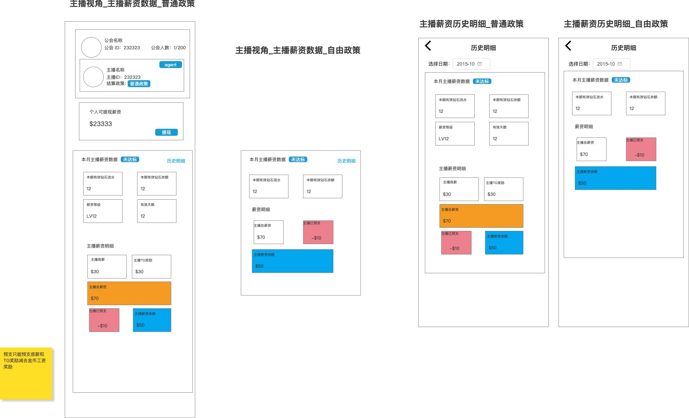

**功能描述：** 主播本人薪资页，展示当前周期钻石流水、政策类型、工资项、扣减、预支对冲和余额池结果。
**关键交互：** 主播可从本页进入金币奖励工资明细、预支记录、提现中心和历史结算记录。

**功能说明：** 主播本人薪资页用于解释主播本期工资怎么来的，而不是只展示一个“本月工资”。页面必须从钻石流水开始，依次展示政策类型、工资项、扣减、预支对冲、金币工资奖励/非金币工资奖励、余额池和可提现展示金额。

#### 前置条件

| 条件 | 规则 |
|---|---|
| 主播已加入公会 | 才展示当前周期薪资数据 |
| 主播处于待完善薪资参数 | 可展示“暂不可结算”提示，不展示完整工资结果 |
| 主播处于离会待结算保护期 | 展示当前待结算周期数据和离会结算提示；待结算完成前不得清空钻石余额 |
| 主播处于风控冻结 | 展示工资链路，但提现相关金额需标记冻结或不可用 |

#### 展示规则总表

| 政策类型 | 页面展示规则 |
|---|---|
| 自由政策 | 自由政策主播不展示薪资等级，不展示有效天数；展示钻石流水、分成工资、预支对冲、金币工资奖励、非金币工资奖励、余额池结果 |
| 非自由政策 | 展示薪资等级、有效天数、命中档目标值、实际完成值、超档值、超档增量、主播基础薪资X、主播TG奖励Z、有效天扣减、预支对冲、金币工资奖励、非金币工资奖励、余额池结果；其中X和Z按该主播当月钻石余额匹配档位后的总薪资基数发放，若超出命中档目标值则按该档超档比例追加 |
| 待完善薪资参数 | 展示公会处理中提示，不展示可结算工资结果 |
| 历史周期 | 读取历史快照；历史展示字段按当期政策类型决定，不读取当前政策配置 |

#### 字段与数据来源

| 字段 | 说明 | 统计方式（计算公式） | 数据来源 |
|---|---|---|---|
| 主播名称 | 当前主播昵称 | 直接读取 | 用户资料 |
| 主播ID | 当前主播账号ID | 直接读取 | 用户资料 |
| 所属公会 | 当前或历史结算周期所属公会 | 按结算周期读取关系快照 | 公会关系快照 |
| 当前政策类型 | 自由政策 / 非自由政策 / 待完善参数 | 按公会政策绑定快照读取 | 政策绑定快照 |
| 本期有效钻石流水 | 本周期可进入工资计算的主播钻石流水 | 非幸运礼物按1金币=1钻石；幸运礼物按10金币=1钻石；再扣除无效/冻结流水 | 钻石流水 + 风控结果 |
| 本期有效钻石余额 | 页面展示的当期钻石余额或可用钻石口径 | 按平台钻石账户余额口径读取；一旦该周期完成月结或离会结算，该账户钻石余额清空，历史页面仅从快照读取结算前口径 | 钻石账户 + 结算快照 |
| 薪资等级 | 非自由政策下的主播薪资档位或等级 | 按非自由政策结算快照读取；自由政策不展示 | 政策结算快照 |
| 有效天数 | 非自由政策下当月有效天统计 | 每日上麦时长≥3小时计1天；当月有效天数>14天为达标；自由政策不展示 | 上麦时长日志 |
| 新手保护期 | 主播首次加入公会当月是否保护 | 按首次绑定关系所在自然月判断 | 主播关系快照 |
| 自由政策分成工资 | 自由政策主播工资项 | 自由政策分成工资 = 主播钻石流水 × 主播分成比例 | 自由政策快照 + 钻石流水 |
| 命中档目标值 | 非自由政策当前命中档对应的目标门槛 | 按结算时命中的档位快照读取 | 非自由政策结算快照 |
| 实际完成值 | 非自由政策用于结算的实际流水或余额值 | 按当期有效口径统计 | 结算统计结果 |
| 超档值 | 非自由政策超出命中档目标值的部分 | max（实际完成值 - 命中档目标值，0） | 非自由政策结算快照 |
| 超档增量 | 非自由政策因超档追加的薪资金额 | （超档值 ÷ 超档换算基数）× 当前档超档比例 | 非自由政策结算快照 |
| 主播基础薪资X | 非自由政策主播基础薪资项 | 主播基础薪资X属于X拆分池中的主播底薪部分，按该主播当月钻石余额匹配对应档位后的总薪资基数发放 | 非自由政策结算快照 |
| 主播TG奖励Z | 非自由政策主播TG奖励项 | 主播TG奖励Z属于Z拆分池中的主播奖励部分，按该主播当月钻石余额匹配对应档位后的总薪资基数发放 | 非自由政策结算快照 |
| 有效天扣减 | 非自由政策有效天未达标扣减 | 有效天扣减 = （主播基础薪资X + 主播TG奖励Z）× 15%，新手保护期不扣；其中X和Z均以该主播当月钻石余额匹配档位后的结果为基数 | 有效天统计 + 结算规则 |
| 预支对冲 | 月结时抵扣主播已预支金额 | 预支对冲 = min（非金币工资奖励，已预支金额 + 待抵扣余额） | 预支记录 + 结算单 |
| 风控扣减 | 退款、拒付、异常流水等扣减 | 按风控复核结论扣减 | 风控事件 |
| 非金币工资奖励 | 可进入现金提现、提现给公会长和预支对冲的工资型金额 | 工资项扣减有效天后，按金币工资奖励比例拆分得到非金币部分 | 工资项拆分结果 |
| 金币工资奖励 | 只能进入金币工资奖励余额池的金额 | 工资项扣减有效天后，按金币工资奖励比例拆分得到金币奖励部分 | 工资项拆分结果 |
| 个人薪资余额 | 主播工资型余额 | 个人薪资余额 = 非金币工资奖励 - 预支对冲 - 风控扣减 | 结算余额池 |
| 金币工资奖励余额 | 主播金币奖励余额 | 金币工资奖励余额 = 金币工资奖励 - 已提现金币对应扣减 | 金币工资奖励余额池 |
| 总可提现展示金额 | 页面汇总展示，不等于单次申请金额 | 总可提现展示金额 = 个人薪资余额 + 金币工资奖励余额 | 余额池汇总 |
| 提现金币可用金额 | 主播可提现为金币的余额 | 个人薪资余额 + 金币工资奖励余额；扣减优先级为金币工资奖励余额＞个人薪资余额 | 余额池 |
| 提现现金可用金额 | 主播可提现为现金的余额 | 仅个人薪资余额；金币工资奖励余额不可提现现金 | 余额池 |
| 提现给公会长可用金额 | 主播可转给公会长的余额 | 仅个人薪资余额；金币工资奖励余额不可转给公会长 | 余额池 |

#### 交互逻辑

1. 主播进入薪资页后，系统读取当前结算周期、当前公会关系快照和政策绑定快照。
2. 页面先展示“钻石流水 → 工资项 → 扣减项 → 余额池”的链路，不只展示最终金额。
3. 若主播为自由政策，页面隐藏薪资等级和有效天数字段，避免把非自由政策考核项塞给自由政策主播。
4. 若主播为非自由政策，页面展示薪资等级、有效天、X/Z工资项和有效天扣减。
5. 点击“历史明细”进入历史结算记录，按月份读取历史快照。
6. 点击“提现”进入主播提现中心，并携带当前余额池摘要；提现提交时仍需后台重新校验余额。
7. 点击“金币奖励工资明细”进入金币奖励工资明细页，用于查看金币奖励工资来源和消耗。
8. 点击“预支记录”进入预支记录页，用于查看预支发放和抵扣结果。

#### 系统后台核心逻辑

| 逻辑点 | 规则 |
|---|---|
| 结算读取 | 当前周期未结算时展示预估或待结算状态；已结算周期读取结算快照 |
| 政策裁剪 | 自由政策和非自由政策页面字段必须按政策类型裁剪，不能共用一套字段模板 |
| 工资拆分顺序 | 工资项生成 → 有效天扣减（如适用）→ 金币工资奖励/非金币工资奖励拆分 → 预支对冲 → 风控扣减 → 余额池 |
| 预支对冲范围 | 预支只能使用非金币工资奖励对冲，金币工资奖励不得用于预支对冲 |
| 余额池生成 | 非金币工资奖励进入个人薪资余额；金币工资奖励进入金币工资奖励余额池 |
| 钻石余额清空 | 当前周期完成月结或离会结算并成功写入结算快照后，系统清空主播账户上的钻石余额；清空动作必须与结算快照写入绑定，禁止只清余额不留快照 |
| 历史快照 | 历史薪资页必须读取当期政策版本、工资项拆分结果、扣减结果、余额池结果，不因当前配置变化重算 |

#### 边界情况

| 场景 | 处理规则 |
|---|---|
| 非自由政策有效天未达标且非新手保护期 | 扣减该主播按当月钻石余额档位发放的主播基础薪资X和主播TG奖励Z合计的15%，再进入后续拆分 |
| 非自由政策命中档后发生超档 | 超档部分按当前命中档位配置的超档比例追加换算，不直接跳下一档；追加后的总薪资基数再参与X/Y/Z拆分和后续扣减 |
| 非自由政策有效天未达标但处于新手保护期 | 不扣减，页面展示新手保护期说明 |
| 最终工资不足抵扣预支 | 实际抵扣后形成待抵扣余额，后续周期优先抵扣 |
| 风控冻结部分流水 | 页面展示冻结或复核提示，冻结部分不进入可提现余额 |
| 主播转会或离会 | 当前周期按归属快照展示；离会前必须完成当期结算并优先结清预支；结算完成后清空主播账户钻石余额，再进入新公会周期 |

---

### 5.4 主播提现总流程

#### 对应原型

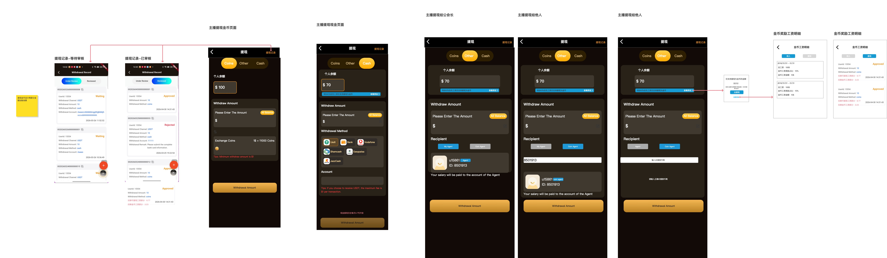

**功能描述：** 主播提现总流程页用于汇总展示主播可用提现出口、当前可提现展示金额和各出口的进入关系。它承接的是“主播从工资结果进入提现分流”的总入口，不直接承载具体申请表单。  
**关键交互：** 主播从总流程页选择提现金币、提现现金或提现给公会长；系统根据角色、余额池和时间窗口控制各入口是否可见或可用。

#### 前置条件

| 条件 | 规则 |
|---|---|
| 主播已有可用余额 | 至少存在个人薪资余额或金币工资奖励余额 |
| 主播未被冻结 | 风控冻结时提现入口置灰或提交后进入人工复核 |
| 提现出口开放 | 现金提现仅每月1号开放入口；默认按系统主时区从每月1号00:00:00开放至1号23:59:59，节假日不顺延，失败后重新提交仍需在该开放窗口内；金币提现按平台配置开放 |
| 公会关系有效 | 提现给公会长时，需存在有效公会关系和目标公会长 |

#### 字段与数据来源

##### 总览字段

| 字段 | 说明 | 数据来源 |
|---|---|---|
| 总可提现展示金额 | 主播当前可见总额 | 个人薪资余额 + 金币工资奖励余额 |
| 可提现金币入口 | 进入金币提现申请页的入口 | 页面配置 + 余额池规则 |
| 可提现现金入口 | 进入现金提现申请页的入口 | 页面配置 + 时间窗口规则 |
| 提现给公会长入口 | 进入转给公会长申请页的入口 | 页面配置 + 公会关系快照 |
| 出口说明 | 每个出口对应可用余额池提示 | 提现规则配置 |
| 当前审核中的申请数 | 当前待审核提现申请数量 | 提现申请记录 |

#### 交互逻辑

**入口与初始化**
1. 主播从首页或薪资页点击提现，进入提现总流程页。
2. 系统按主播角色和余额池加载可用出口：提现金币、提现现金、提现给公会长。

**页面交互**
3. 主播切换不同出口前，页面先展示各出口可用余额池、不可用余额池和入口说明。
4. 主播点击具体出口后，进入对应申请页；总流程页本身不提交提现申请。

**结果与后续**
5. 若当前存在审核中的申请，页面展示申请状态并提供进入提现记录的入口。

#### 系统后台核心逻辑

- 提现总流程页只负责出口分流，不直接消耗余额池。
- 出口可见性必须由后台规则控制，不能只靠前端硬编码。
- 现金提现开放期、冻结状态、公会关系有效性都必须在进入具体申请页前校验。
- 总流程页展示金额仅作引导，提交时必须以具体申请页重算余额池为准。

#### 边界情况

| 场景 | 处理规则 |
|---|---|
| 无任何可提现余额 | 展示空状态，不显示可提交入口 |
| 仅有金币工资奖励余额 | 仅开放提现金币，不开放现金和提现给公会长 |
| 当前存在审核中申请 | 允许查看记录，但新的可用动作按冻结后余额重新计算 |
| 现金提现非开放日 | 现金入口置灰并展示开放时间 |

### 5.5 主播提现为金币

#### 对应原型

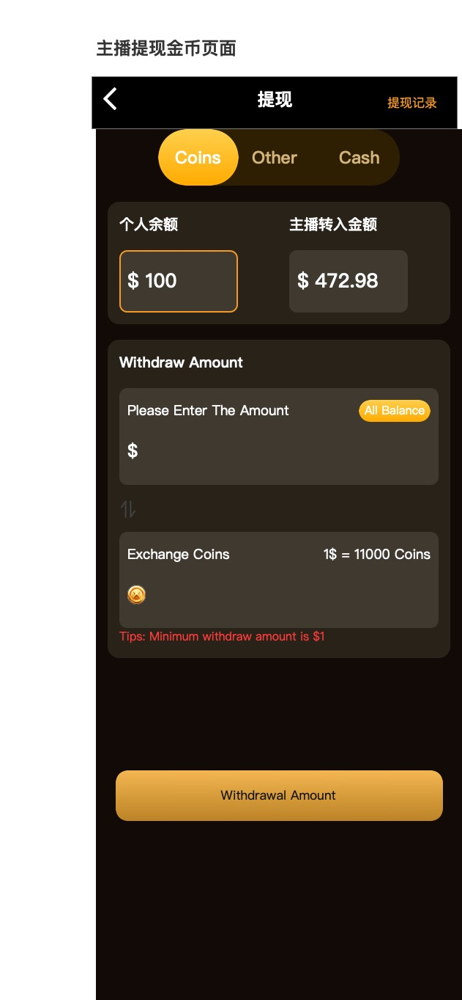

**功能描述：** 主播提现为金币申请页，专门处理个人薪资余额和金币工资奖励余额的金币提现申请。这个页面回答的是“主播这次提现吗、先扣哪一池、折成多少金币”。  
**关键交互：** 主播输入提现金额后，系统按“金币工资奖励余额＞个人薪资余额”的优先级冻结和扣减余额，并生成 Waiting 状态提现单。

#### 前置条件

| 条件 | 规则 |
|---|---|
| 主播存在可提现金币余额 | 个人薪资余额和/或金币工资奖励余额大于0 |
| 主播未被冻结 | 风控冻结时禁止提交 |
| 提现金额合法 | 金额必须大于0且不超过金币出口可用总额 |
| 汇率可用 | 当前金币提现汇率配置有效 |

#### 字段与数据来源

##### 表单字段

| 字段 | 说明 | 数据来源 |
|---|---|---|
| 个人薪资余额 | 可参与金币提现的工资型余额 | 余额池 |
| 金币工资奖励余额 | 只能用于金币提现的余额 | 金币工资奖励余额池 |
| 可提现金币金额 | 金币出口下的可申请金额 | 个人薪资余额 + 金币工资奖励余额 |
| 提现金额 | 主播本次申请金额 | 用户输入 |
| 全部余额按钮 | 一键填入可提现金币总额 | 当前出口余额池计算结果 |
| 金币汇率 | 美元到金币换算比例 | 提现汇率配置快照 |
| 预计到账金币 | 提现后预计到账金币数量 | 提现金额 × 金币汇率配置 |
| 提现状态 | Waiting、Approved、Rejected、打款失败、已回滚 | 提现申请记录 |
| 所选余额池 | 本次申请消耗的余额池组合 | 提现申请快照 |
| 扣减顺序 | 本次申请的余额池扣减优先级 | 提现申请快照 |

#### 交互逻辑

**入口与初始化**
1. 主播进入金币提现页后，系统展示个人薪资余额和金币工资奖励余额。

**页面交互**
2. 主播输入提现金额时，系统即时校验是否大于0、是否超过可提现金币总额。
3. 页面同步展示预计到账金币数量。

**提交与结果**
4. 主播提交后，系统优先冻结金币工资奖励余额，不足部分再冻结个人薪资余额。
5. 提交成功后生成提现申请，状态进入 Waiting。

#### 系统后台核心逻辑

- 提交前重新读取余额池，不以页面缓存金额为准。
- 主播提现金币时，扣减顺序固定为金币工资奖励余额＞个人薪资余额，并写入申请快照。
- 申请提交后冻结对应余额，审核通过后正式扣减并发放金币。
- 审核拒绝时释放冻结余额，打款失败时进入失败回滚链路。

#### 边界情况

| 场景 | 处理规则 |
|---|---|
| 只有金币工资奖励余额 | 全部从金币奖励余额扣减 |
| 只有个人薪资余额 | 全部从个人薪资余额扣减 |
| 组合扣减 | 快照必须记录两池分别消耗金额 |
| 提交后余额变化 | 以提交时冻结快照为准 |

### 5.6 主播提现为现金

#### 对应原型

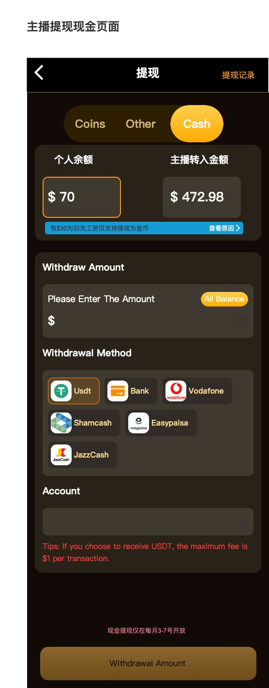

**功能描述：** 主播提现为现金申请页，专门处理主播工资型余额的现金提现。它承接的是“主播把工资型余额走外部收款方式提走”，不允许混用金币工资奖励余额。  
**关键交互：** 主播填写提现金额、提现方式和收款账号后提交；系统冻结个人薪资余额并生成 Waiting 状态提现单。

#### 前置条件

| 条件 | 规则 |
|---|---|
| 现金入口开放 | 现金提现仅每月1号开放入口；默认按系统主时区从每月1号00:00:00开放至1号23:59:59，节假日不顺延，失败后重新提交仍需在该开放窗口内 |
| 主播存在个人薪资余额 | 现金出口只读取个人薪资余额 |
| 主播未被冻结 | 风控冻结时禁止提交 |
| 收款方式有效 | 需填写并校验提现方式和收款账号 |

#### 字段与数据来源

##### 表单字段

| 字段 | 说明 | 数据来源 |
|---|---|---|
| 个人薪资余额 | 现金出口可用余额 | 余额池 |
| 金币工资奖励余额 | 页面展示为不可用说明 | 金币工资奖励余额池 |
| 提现金额 | 本次申请金额 | 用户输入 |
| 提现方式 | USDT、Bank、Vodafone、Starpay、EasyPaisa、JazzCash 等 | 提现渠道配置 |
| 提现账号 | 现金提现收款账号 | 用户输入 / 历史收款账户 |
| 提现状态 | Waiting、Approved、Rejected、打款失败、已回滚 | 提现申请记录 |
| 所选余额池 | 本次申请消耗的余额池 | 提现申请快照 |

#### 交互逻辑

**入口与初始化**
1. 主播进入现金提现页后，系统只展示个人薪资余额为可用余额。
2. 页面置灰显示金币工资奖励余额，并提示该余额只能用于提现金币。

**页面交互**
3. 主播输入提现金额、提现方式和收款账号后，系统即时校验金额、账号和出口开放时间。

**提交与结果**
4. 提交成功后，系统冻结个人薪资余额并生成 Waiting 状态提现申请。
5. 主播后续在提现记录中查看审核、打款、失败和回滚结果。

#### 系统后台核心逻辑

- 金币工资奖励余额不得提现现金，系统必须阻断而不是只前端置灰。
- 提交时冻结个人薪资余额；审核通过后正式扣减并执行外部打款。
- 审核拒绝时释放冻结余额；打款失败时进入失败回滚链路。
- 申请快照必须记录提现方式、账号、金额和当时可用余额。

#### 边界情况

| 场景 | 处理规则 |
|---|---|
| 非开放日进入页面 | 按入口控制不允许提交，展示开放时间 |
| 收款账号为空或格式错误 | 禁止提交并提示补充正确账号 |
| 金额超过个人薪资余额 | 禁止提交并提示余额不足 |
| 审核拒绝后再次提现 | 释放余额后允许重新发起申请 |

### 5.7 提现给公会长

#### 对应原型

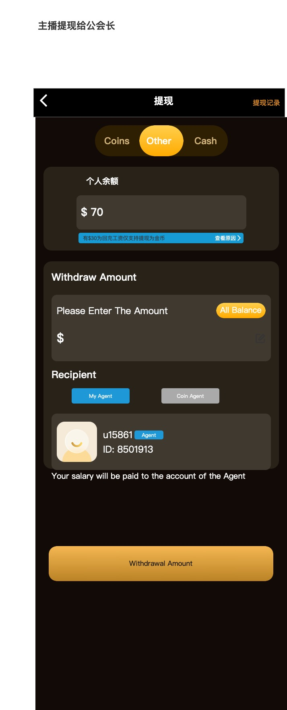

**功能描述：** 提现给公会长申请页，用于主播将个人薪资余额转入公会长侧主播转账余额。这个页面承接的是“主播把工资转给公会长”的内部转账链路，不等同于现金或金币提现。  
**关键交互：** 主播确认收款公会长和金额后提交审核；审核通过后金额进入公会长主播转账余额。

#### 前置条件

| 条件 | 规则 |
|---|---|
| 公会关系有效 | 存在当前有效公会关系和目标公会长 |
| 主播存在个人薪资余额 | 仅个人薪资余额可用于该出口 |
| 金币工资奖励余额不可用 | 金币工资奖励余额不得用于该出口 |
| 主播未被冻结 | 风控冻结时禁止提交 |

#### 字段与数据来源

##### 表单字段

| 字段 | 说明 | 数据来源 |
|---|---|---|
| 个人薪资余额 | 可用于转给公会长的余额 | 余额池 |
| 收款公会长 | 目标公会长信息 | 当前公会关系快照 |
| 提现金额 | 本次转账金额 | 用户输入 |
| 提现状态 | Waiting、Approved、Rejected、打款失败、已回滚 | 提现申请记录 |
| 所选余额池 | 本次申请使用的余额池 | 提现申请快照 |
| 入账结果 | 公会长侧主播转账余额入账结果 | 入账记录 |

#### 交互逻辑

**入口与初始化**
1. 主播进入提现给公会长页面后，系统展示当前可转金额和目标公会长信息。

**页面交互**
2. 主播输入金额时，系统校验金额是否超过个人薪资余额。

**提交与结果**
3. 提交后，系统冻结主播个人薪资余额并生成 Waiting 状态申请。
4. 审核通过后，金额入账公会长主播转账余额；审核失败则释放冻结金额。
5. 主播可在提现记录中查看审核和入账结果。

#### 系统后台核心逻辑

- 提现给公会长只允许消耗个人薪资余额，金币工资奖励余额不得参与。
- 审核通过后，金额必须入账到公会长主播转账余额，而不是公会长个人薪资余额。
- 审核失败或入账失败时，必须回滚主播侧冻结金额。
- 申请快照必须记录目标公会长、申请金额和扣减余额池。

#### 边界情况

| 场景 | 处理规则 |
|---|---|
| 公会长关系失效 | 禁止提交 |
| 金额超过个人薪资余额 | 禁止提交并提示余额不足 |
| 审核通过但入账失败 | 进入失败回滚链路 |
| 同一申请重复处理 | 使用申请状态和入账幂等控制 |

### 5.8 提现记录（主播视角）

#### 对应原型

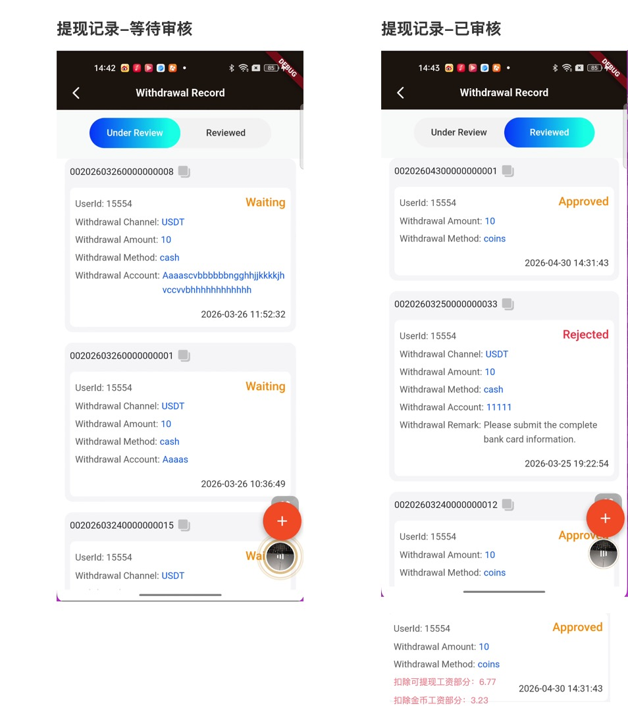

**功能描述：** 主播提现记录页用于查看金币提现、现金提现、提现给公会长三类申请的审核、打款、回滚结果。它承接的是“申请之后发生了什么”，不是提现入口页。  
**关键交互：** 主播按出口和状态查看历史申请，进入单笔记录详情查看所选余额池、扣减顺序、审核状态、打款状态和失败原因。

#### 前置条件

| 条件 | 规则 |
|---|---|
| 存在提现申请记录 | 展示提现历史 |
| 无提现申请记录 | 展示空状态 |
| 历史快照可读 | 每条记录都可回看申请快照 |
| 主播有权限查看本人记录 | 仅查看本人申请，不可查看他人记录 |

#### 字段与数据来源

##### 列表字段

| 字段 | 说明 | 数据来源 |
|---|---|---|
| 提现单号 | 申请编号 | 提现申请 |
| 提现出口 | 金币、现金、提现给公会长 | 提现申请 |
| 提现金额 | 本次申请金额 | 提现申请 |
| 所选余额池 | 本次申请的余额池组合 | 提现申请快照 |
| 扣减顺序 | 申请时的扣减顺序 | 提现申请快照 |
| 提现方式/收款对象 | 外部渠道账号或公会长 | 提现申请 |
| 审核状态 | Waiting、Approved、Rejected | 审核记录 |
| 打款状态 | 待打款、成功、失败、已回滚 | 打款记录 |
| 实际到账金额 | 最终到账结果 | 打款记录 |
| 拒绝/失败原因 | 审核拒绝或打款失败原因 | 审核记录/打款记录 |

#### 交互逻辑

**入口与初始化**
1. 主播进入提现记录页后，系统按时间倒序展示历史申请。

**页面交互**
2. 主播可按提现出口、审核状态、打款状态筛选记录。
3. 点击某条记录时，系统展示申请快照、审核结果、打款结果和回滚记录。

**异常与回退**
4. 若记录为拒绝或失败状态，页面展示原因和余额恢复结果。

#### 系统后台核心逻辑

- 提现记录页必须沉淀完整历史链路：申请快照、审核结果、打款结果、失败回滚结果。
- 审核状态和打款状态分开存储，不能合并为一个状态字段。
- 历史记录读取申请时快照，不能用当前余额池反推历史申请。
- 提现给公会长记录也必须在主播侧提现记录中可见其审核和入账结果。

#### 边界情况

| 场景 | 处理规则 |
|---|---|
| 申请被驳回 | 展示驳回原因，并确认冻结余额已释放 |
| 审核通过但打款失败 | 展示失败和回滚结果 |
| 记录快照字段缺失 | 标记异常记录，禁止作为正常对账依据 |
| 多次重试打款 | 保留每次尝试和最终结果 |

### 5.9 金币奖励工资明细

#### 对应原型

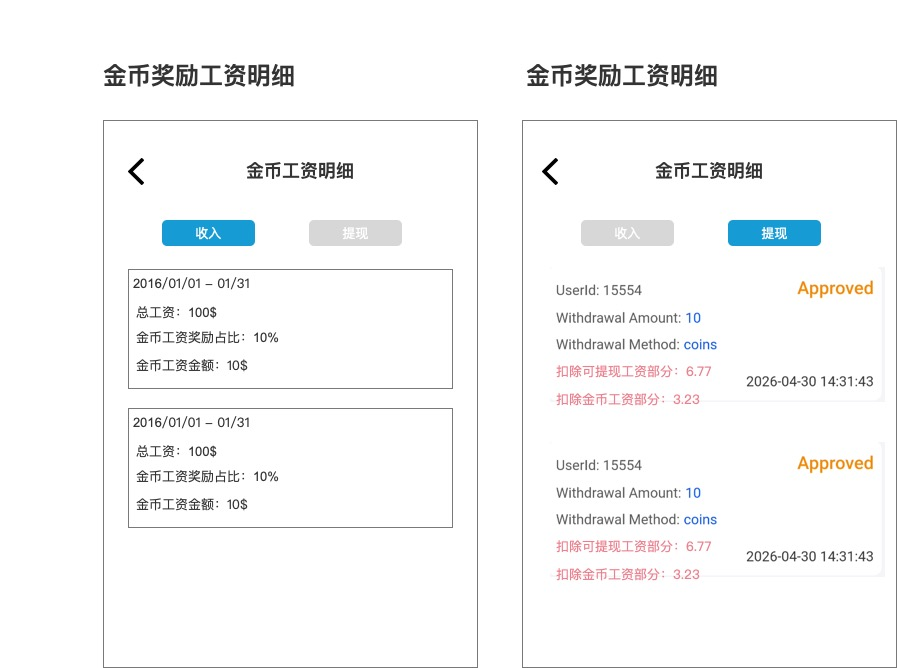

**功能描述：** 金币奖励工资明细页，展示金币工资奖励的来源结算单、金额、余额变化和提现消耗记录。
**关键交互：** 主播查看每笔金币奖励工资的生成原因、入账时间、剩余余额和金币提现使用记录。

**功能说明：** 金币奖励工资明细用于解释“金币工资奖励余额”为什么有、来自哪次结算、已经提现了多少、还剩多少。这个页面是金币工资奖励余额池的明细账，不是普通工资账单。

#### 前置条件

| 条件 | 规则 |
|---|---|
| 主播存在金币工资奖励记录 | 展示收入和提现消耗明细 |
| 主播暂无金币工资奖励 | 展示空状态和说明：金币工资奖励来自工资结算拆分 |
| 主播发起过金币提现 | 需要关联金币提现申请，展示已提现和剩余 |

#### 字段与数据来源

| 字段 | 说明 | 数据来源 |
|---|---|---|
| 收入 / 提现页签 | 区分金币工资奖励入账记录和金币提现消耗记录 | 页面状态 |
| 结算周期 | 金币工资奖励归属月份 | 结算单 |
| 来源结算单 | 产生该金币工资奖励的结算单编号 | 结算单 |
| 政策类型 | 自由政策 / 非自由政策 | 政策快照 |
| 工资项来源 | 主播分成工资、按该主播当月钻石余额档位发放的主播基础薪资X、主播TG奖励Z等 | 工资项拆分明细 |
| 金币工资奖励比例 | 当期工资项拆分为金币奖励的比例 | 政策快照 |
| 金币工资奖励金额 | 本次结算产生的金币奖励工资金额 | 工资项拆分结果 |
| 金币汇率快照 | 该笔金额折算金币时使用的汇率 | 结算快照 / 汇率配置快照 |
| 折算金币数量 | 金币工资奖励金额折算后的金币数 | 金币工资奖励金额 × 汇率快照 |
| 已提现金币 | 已通过金币提现消耗的金币数量 | 提现金币申请记录 |
| 剩余金币余额 | 当前仍可用于提现金币的余额 | 金币工资奖励余额池 |
| 状态 | 未提现、部分提现、已提现、冻结 | 余额池状态 |
| 关联提现单 | 消耗该余额的提现申请编号 | 提现申请快照 |

#### 交互逻辑

1. 主播进入页面后，默认展示金币工资奖励收入列表。
2. 主播可切换收入 / 提现页签，查看金币奖励工资的入账和消耗。
3. 点击某条收入记录，进入详情，展示来源结算单、政策类型、工资项来源、金币工资奖励比例和汇率快照。
4. 点击关联提现单，可查看该笔金币奖励余额被哪次提现申请消耗。
5. 若余额已冻结，页面展示冻结原因和对应提现申请或风控事件。

#### 系统后台核心逻辑

| 逻辑点 | 规则 |
|---|---|
| 入账时机 | 月度结算生成余额池时写入金币工资奖励余额记录 |
| 来源血缘 | 每笔金币工资奖励必须能追溯到结算单、工资项、政策版本和拆分比例 |
| 出口限制 | 金币工资奖励余额只能用于提现金币，不能提现现金，不能提现给公会长，不能用于预支对冲 |
| 消耗记录 | 提现金币时如消耗金币工资奖励余额，必须记录消耗金额、消耗金币、提现单和扣减顺序 |
| 历史快照 | 详情页读取生成时快照，不因后续汇率变化重算历史金币数量 |

#### 边界情况

| 场景 | 处理规则 |
|---|---|
| 同一结算单产生多笔金币奖励 | 按工资项拆分展示，不能合并成一条不可解释记录 |
| 部分提现 | 明细显示原始入账、已提现、剩余三段金额 |
| 提现申请被拒绝 | 已冻结金额释放，金币奖励余额恢复可用 |
| 风控冻结 | 展示冻结状态，禁止发起提现金币 |

---

### 5.10 预支记录

#### 对应原型

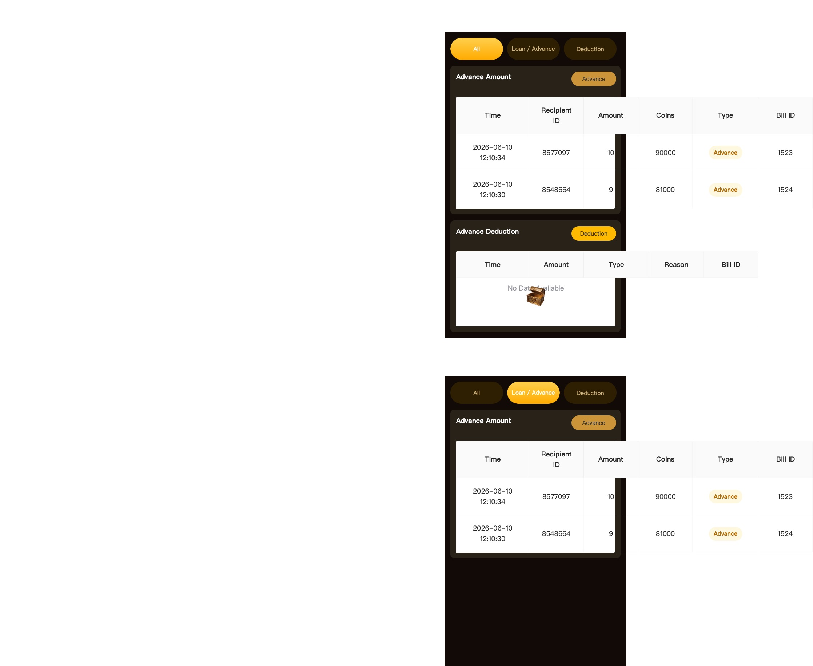

**功能描述：** 主播预支记录页，展示后台发起的预支申请、审核、发放、月结抵扣和待后续抵扣状态。
**关键交互：** 主播一期只查看本人预支记录，不在客户端自助发起预支申请。

**功能说明：** 预支记录用于主播查看后台为其发起的预支申请、审核、发放和月结抵扣结果。第一期不开放主播端自助发起预支申请，客户端只展示记录和抵扣链路。

#### 前置条件

| 条件 | 规则 |
|---|---|
| 存在预支记录 | 展示申请、审核、发放、抵扣状态 |
| 无预支记录 | 展示空状态，不显示发起按钮 |
| 预支存在待抵扣余额 | 在薪资页和预支详情中展示待后续抵扣金额 |

#### 字段与数据来源

| 字段 | 说明 | 数据来源 |
|---|---|---|
| 预支单号 | 预支记录唯一编号 | 预支记录 |
| 预支人ID | 承担预支债务的主播ID | 预支记录 |
| 收款人ID | 实际收到货币的用户；预支给本人时等于预支人 | 预支记录 |
| 当前公会 | 发起预支时主播所属公会 | 公会关系快照 |
| 当前政策 | 发起预支时公会绑定政策 | 政策绑定快照 |
| 预计主播工资 | 发起时用于计算预支额度的预计工资 | 预计工资计算结果 |
| 可预支金额 | 发起时可预支额度 | 预计主播工资 × 预支比例 - 已预支金额 - 冻结金额 |
| 预支金额 | 本次预支申请金额 | 预支记录 |
| 到账货币 | 后台选择发放的货币类型 | 预支记录 |
| 申请时间 | 后台发起预支时间 | 预支记录 |
| 审核状态 | 申请中、已通过、已拒绝、已取消 | 审核记录 |
| 发放状态 | 待发放、已发放、发放失败 | 发放记录 |
| 抵扣状态 | 待结算抵扣、已抵扣、部分抵扣、待后续抵扣 | 结算抵扣单 |
| 已预支金额 | 当前周期已发放预支总额 | 预支记录汇总 |
| 待抵扣余额 | 工资不足抵扣后剩余待扣金额 | 结算抵扣单 |
| 结算抵扣单 | 月结时关联的抵扣结果 | 结算单 |
| 拒绝原因 | 审核拒绝时填写 | 审核记录 |

#### 状态设计

| 状态 | 含义 | 页面展示 |
|---|---|---|
| 申请中 | 后台已发起，等待审核 | 展示申请金额和申请时间 |
| 已取消 | 申请被取消 | 展示取消时间和原因 |
| 已拒绝 | 审核未通过 | 展示拒绝原因，不扣减工资，不发放货币 |
| 已通过待发放 | 审核通过，等待发放 | 展示待发放状态 |
| 已发放 | 货币已发放给收款人 | 展示发放货币、数量和时间 |
| 待结算抵扣 | 已发放，等待月结抵扣 | 展示待抵扣金额 |
| 已抵扣 | 月结时全额抵扣 | 展示抵扣完成 |
| 部分抵扣 | 月结工资不足以抵扣全部预支 | 展示已抵扣和剩余待抵扣 |
| 待后续抵扣 | 剩余债务进入后续周期 | 展示待后续抵扣余额 |

#### 交互逻辑

1. 主播进入预支记录页，系统按时间倒序展示预支记录。
2. 点击某条记录进入详情，展示预支人、收款人、申请金额、到账货币、审核状态、发放状态和抵扣状态。
3. 若预支给他人，页面必须明确“债务归属预支人本人，收款人只接收货币”。
4. 若记录已进入月结抵扣，页面展示关联结算周期、实际抵扣金额和待抵扣余额。
5. 第一阶段客户端不展示“发起预支”按钮；如后续开放，需要另行补充自助申请流程。

#### 系统后台核心逻辑

| 逻辑点 | 规则 |
|---|---|
| 发起主体 | 第一期统一由后台运营发起，主播端不自助申请 |
| 债务归属 | 预支债务始终挂在预支人本人名下，不挂在收款人名下 |
| 扣减时点 | 发起成功不扣减；审核通过后才扣减可预支额度并发放货币 |
| 审核拒绝 | 不扣减当期工资，不发放货币，保留拒绝原因 |
| 对冲范围 | 月结时只能用非金币工资奖励对冲预支，金币工资奖励不得对冲 |
| 待抵扣 | 最终工资不足抵扣时，差额进入主播个人待抵扣余额，后续周期优先抵扣 |
| 离会影响 | 主播离会前必须完成当期结算，并优先用当期工资抵扣预支；未结清部分继续挂主播本人 |

#### 边界情况

| 场景 | 处理规则 |
|---|---|
| 预支给他人但收款人不存在 | 后台发起时禁止提交；客户端不应出现有效记录 |
| 审核通过后发放失败 | 状态显示发放失败，后台可重新发放或取消处理 |
| 月结时工资为0 | 全额形成待抵扣余额，后续周期优先抵扣 |
| 主播转会 | 预支债务跟主播本人走，不因加入新公会而消失 |

---

### 5.11 历史结算记录列表（主播视角）

#### 对应原型

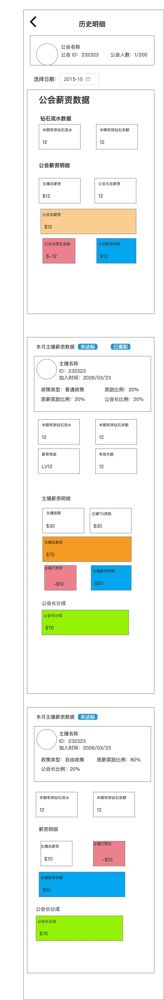

**功能描述：** 主播历史结算列表页，按月份展示已锁定的结算记录、状态和详情入口。
**关键交互：** 主播点击某月记录进入详情；列表只展示历史快照结果，不触发重新计算。

**功能说明：** 历史结算记录列表用于主播定位某个历史结算周期，并查看该期是否已结算、是否存在异常或可追溯入口。

#### 前置条件

| 条件 | 规则 |
|---|---|
| 存在历史结算快照 | 按月份展示记录 |
| 当前政策发生变化 | 历史记录仍读取当期快照，不受当前配置影响 |
| 主播已离会或转会 | 历史记录仍归主播本人可见，余额结果不被新公会接管 |

#### 字段与数据来源

| 字段 | 业务定义 | 计算方式 / 取值规则 | 数据来源 |
|---|---|---|---|
| 历史明细 | 当前历史结算列表主体 | 原型字段名沿用“历史明细”；业务上定义为主播历史结算周期列表 | 结算快照 |
| 选择日期 | 切换历史结算周期的筛选入口 | 按月份或日期区间读取对应历史快照 | 结算快照 |
| 本月主播薪资数据 | 当前列表页显示的历史薪资视图 | 原型字段名沿用“本月主播薪资数据”；业务上定义为当前所选周期的薪资摘要区 | 页面区块 / 结算快照 |
| 本期有效钻石流水 | 历史周期内参与工资计算的有效钻石流水摘要 | 汇总该期有效钻石流水；冻结、拒付、无效流水不计入 | 钻石流水快照 |
| 本期有效钻石余额 | 历史周期结束时用于结算的有效钻石余额口径摘要 | 按有效钻石余额快照读取；这是结算前留痕的历史口径，不代表当前主播账户仍保留该钻石余额 | 钻石账户 / 余额快照 |
| 薪资等级 | 非自由政策当期命中的薪资等级摘要 | 按结算快照读取；自由政策不展示 | 结算快照 |
| 有效天数 | 非自由政策当期有效天统计摘要 | 按该期有效天快照读取；自由政策不展示 | 有效天快照 |
| 主播总薪资 | 当前历史周期的主播应发工资合计摘要 | 自由政策：主播分成工资；非自由政策：主播底薪 + 主播TG奖励 - 有效天扣减 - 预支对冲 - 风控扣减 | 主播结算明细 |
| 主播预支 / 主播已预支 | 当前历史周期已发生并被对冲的预支金额摘要 | 原型在不同页签中显示“主播预支”或“主播已预支”；统一定义为该期预支记录金额 | 预支记录 / 结算抵扣单 |
| 主播薪资余额 / 主播净余额 | 当前历史周期结算后的工资型余额结果摘要 | 原型在不同页面展示“主播薪资余额”或“主播净余额”；统一定义为该期工资型余额结果 | 余额池快照 |

#### 交互逻辑

1. 主播进入历史结算记录页，默认展示最近结算月份。
2. 主播通过月份筛选切换历史周期。
3. 列表展示每个周期的核心金额和结算状态。
4. 点击某条历史记录后，进入历史结算详情页查看完整链路。

#### 系统后台核心逻辑

| 逻辑点 | 规则 |
|---|---|
| 快照不可重算 | 历史结算记录只读取当期快照，不因政策、公会、主播归属变化重算 |
| 字段按政策裁剪 | 列表摘要按当期政策类型展示字段，自由政策不补展示非自由政策字段 |
| 余额归属 | 结算后余额挂主播本人，和后续属于哪个公会无关 |
| 对账用途 | 客服、财务、主播争议处理均以该历史快照为准 |

#### 边界情况

| 场景 | 处理规则 |
|---|---|
| 历史周期存在风控冻结 | 列表展示异常或冻结提示 |
| 预支未完全抵扣 | 列表展示待后续抵扣标识 |
| 提现失败后回滚 | 列表展示失败申请标识 |
| 政策版本已停用 | 历史仍展示当期政策版本，不读当前可绑定版本 |

### 5.12 历史结算记录详情（主播视角）

#### 对应原型

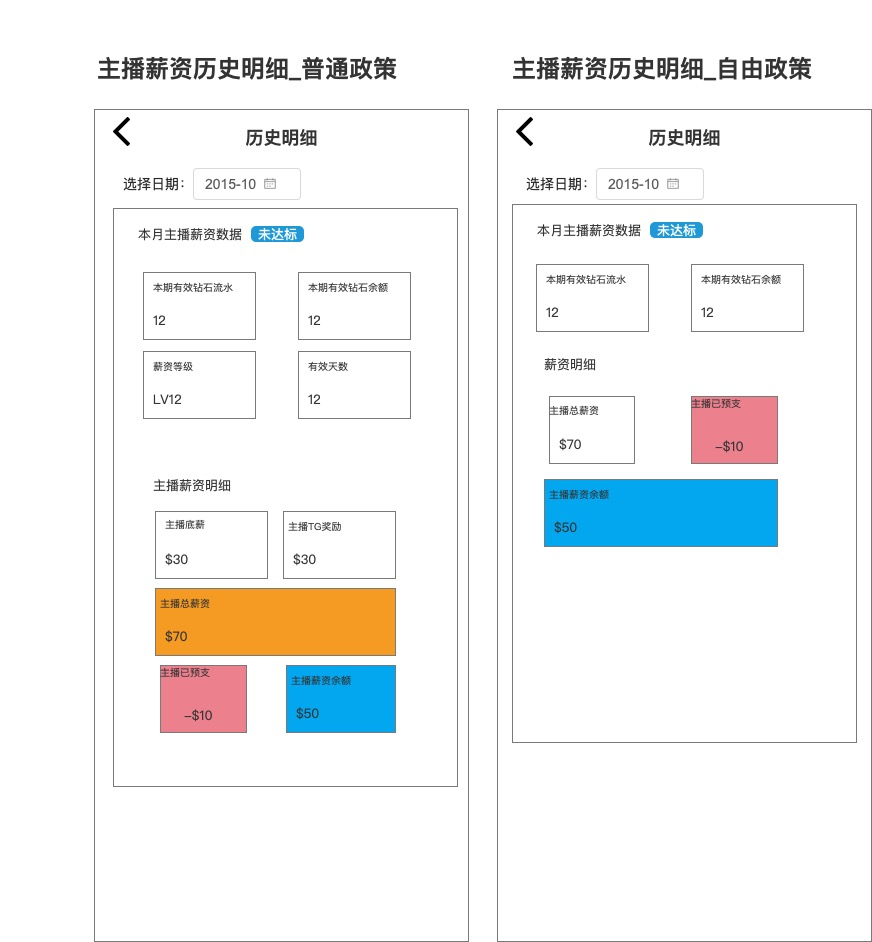

**功能描述：** 主播历史结算详情页，展示当期政策、钻石流水、工资项、扣减项、预支对冲和余额池结果。
**关键交互：** 主播查看该期金额来源和去向；系统读取结算快照，不读取当前最新政策配置。

**功能说明：** 历史结算详情用于主播按单个历史周期追溯完整工资链路，回答“当时怎么结、为什么这样扣、最后剩下多少能提”。

#### 前置条件

| 条件 | 规则 |
|---|---|
| 已进入某个历史结算周期 | 详情页必须绑定具体结算周期 |
| 结算快照存在 | 详情页所有金额读取当期快照 |
| 主播有权限查看本人历史记录 | 仅查看本人历史，不可查看他人记录 |

#### 字段与数据来源

| 字段 | 业务定义 | 计算方式 / 取值规则 | 数据来源 |
|---|---|---|---|
| 历史明细 | 当前历史结算详情主体 | 原型字段名沿用“历史明细”；业务上定义为主播某一历史结算周期的完整工资链路数据 | 结算快照 |
| 选择日期 | 切换历史结算周期的筛选入口 | 按月份或日期区间读取对应历史快照 | 结算快照 |
| 本月主播薪资数据 | 当前历史记录页面对应的薪资数据视图 | 原型字段名沿用“本月主播薪资数据”；业务上定义为当前所选历史周期内的主播薪资视图 | 页面区块 / 结算快照 |
| 本期有效钻石流水 | 历史周期内参与工资计算的有效钻石流水 | 汇总该期有效钻石流水；冻结、拒付、无效流水不计入 | 钻石流水快照 |
| 本期有效钻石余额 | 历史周期结束时用于结算的有效钻石余额口径 | 按有效钻石余额快照读取；这是结算前留痕的历史口径，不代表当前主播账户仍保留该钻石余额 | 钻石账户 / 余额快照 |
| 薪资等级 | 非自由政策当期命中的薪资等级 | 按结算快照读取；自由政策不展示 | 结算快照 |
| 有效天数 | 非自由政策当期有效天统计 | 按该期有效天快照读取；自由政策不展示 | 有效天快照 |
| 主播薪资明细 / 薪资明细 | 当前历史周期的工资项明细区块 | 原型中普通政策展示“主播薪资明细”，自由政策展示“薪资明细”；均定义为该期工资项明细区 | 页面区块 / 结算快照 |
| 主播底薪 | 非自由政策基础薪资项 | 按该期该主播当月钻石余额匹配档位后的主播基础薪资X读取；自由政策不适用时显示“-” | 结算快照 |
| 主播TG奖励 | 非自由政策奖励项 | 按该期该主播当月钻石余额匹配档位后的主播TG奖励Z读取；自由政策不适用时显示“-” | 结算快照 |
| 主播总薪资 | 当前历史周期的主播应发工资合计 | 自由政策：主播分成工资；非自由政策：主播底薪 + 主播TG奖励 - 有效天扣减 - 预支对冲 - 风控扣减 | 主播结算明细 |
| 主播预支 / 主播已预支 | 当前历史周期已发生并被对冲的预支金额 | 原型在不同页签中显示“主播预支”或“主播已预支”；统一定义为该期预支记录金额 | 预支记录 / 结算抵扣单 |
| 主播薪资余额 / 主播净余额 | 当前历史周期结算后的工资型余额结果 | 原型在不同页面展示“主播薪资余额”或“主播净余额”；统一定义为该期工资型余额结果 | 余额池快照 |
| 金币工资奖励 | 当前历史周期只能提现金币的工资部分 | 读取该期金币工资奖励快照结果 | 余额池快照 |
| 金币工资奖励余额结果 | 当前历史周期结算后生成的金币奖励余额 | 读取该期余额池结果 | 余额池快照 |
| 提现申请快照 | 当期相关提现申请的余额池和扣减顺序 | 用于追溯提现从哪个余额池出的 | 提现申请快照 |

#### 交互逻辑

1. 主播从历史结算列表进入某期详情页。
2. 详情页展示政策快照、钻石流水、工资项、扣减项、预支对冲、余额池和提现申请快照。
3. 自由政策详情不展示薪资等级和有效天数；非自由政策详情展示当期薪资等级和有效天结果。
4. 主播离会或转会后，仍可查看本人历史结算详情；新公会不接管旧周期余额。

#### 系统后台核心逻辑

| 逻辑点 | 规则 |
|---|---|
| 快照不可重算 | 历史结算详情只读取当期快照，不因政策、公会、主播归属变化重算 |
| 字段按政策裁剪 | 历史详情按当期政策类型展示字段，自由政策不补展示非自由政策字段 |
| 提现追溯 | 历史提现必须能追到申请时各余额池余额、所选出口、扣减顺序和审核结果 |
| 对账用途 | 客服、财务、主播争议处理均以该历史快照为准 |

#### 边界情况

| 场景 | 处理规则 |
|---|---|
| 历史周期存在风控冻结 | 详情展示冻结金额、冻结原因和处置结果 |
| 预支未完全抵扣 | 展示已抵扣和待后续抵扣余额 |
| 提现失败后回滚 | 展示失败申请和回滚金额 |
| 政策版本已停用 | 历史仍展示当期政策版本，不读当前可绑定版本 |

---

## 六、公会长端需求

> 公会长端是经营视角，不是主播端换皮。公会长既可能作为公会经营者获得管理收益，也可能本人兼主播获得主播工资。两个身份的收入路径必须分开展示、分开解释，最后再汇总到可提现余额池。

### 6.0 公会长端模块边界

| 模块 | 公会长端定位 | 关键业务链路 |
|---|---|---|
| 公会长端首页 / 公会入口 | 公会长经营入口和可提现摘要 | 公会信息 → 待处理事项 → 薪资 / 主播管理 / 提现入口 |
| 入会申请管理 | 处理主播申请并承接非自由政策薪资参数设置 | 审核申请 → 设置底薪/TG比例 → 入会关系快照 |
| 公会长薪资数据页 | 展示公会长本人双身份收入链路 | 公会长管理收益 + 本人主播收益 → 扣减 / 对冲 → 余额池 |
| 公会薪资数据页 | 查看公会整体结算和成员分账 | 公会总账 → 主播分账 → 公会长收益 → 总账校验 |
| 主播管理 | 管理主播状态、比例、薪资参数、移除/离会 | 主播列表 → 分成比例调整 → 参数快照 → 强制结算 |
| 公会长提现中心 | 公会长按余额池发起金币/现金提现 | 个人薪资余额 / 主播转账余额 / 金币奖励余额 → 出口规则 |
| 历史结算记录 | 公会长按月份追溯公会和本人收益 | 政策快照 → 公会总账 → 成员分账 → 提现快照 |
| 主播移除与离会处理 | 公会长主动移除主播时的结算保护流程 | 移除申请 → 待结算保护 → 预支抵扣 → 离会/冷却 |

---

### 6.1 公会长端首页 / 公会入口

#### 对应原型


**功能描述：** 公会长端首页公会入口，展示管理公会、待处理事项、本人收益摘要和提现入口。
**关键交互：** 公会长进入入会申请、主播管理、公会薪资、公会长提现和历史结算等管理页面。

**功能说明：** 公会长端首页用于承载公会经营入口、待处理事项、本人收益摘要和提现入口。公会长在这里看到的是“我管理的公会当前怎么样、还有什么待处理、我能拿多少钱”，不是主播个人首页。

#### 前置条件

| 条件 | 规则 |
|---|---|
| 用户为公会长 | 展示公会长端入口和管理功能 |
| 用户本人也作为主播 | 首页可展示本人主播收益入口，但不得和管理收益混成一个不可解释金额 |
| 公会被冻结或清退 | 管理入口按状态置灰或提示；历史记录仍可查 |
| 存在待处理申请 | 入会申请入口显示红点或待处理数量 |

#### 字段与数据来源

| 字段 | 说明 | 数据来源 |
|---|---|---|
| 公会头像 | 公会展示头像 | 公会资料 |
| 公会名称 | 公会名称 | 公会资料 |
| 公会ID | 公会唯一编号 | 公会资料 |
| 公会人数 | 当前有效主播数量 | 公会成员关系 |
| 当前政策 | 公会当前绑定政策类型和版本 | 政策绑定快照 |
| 待处理入会申请数 | 当前未处理的主播入会申请 | 入会申请记录 |
| 公会薪资数据入口 | 进入公会整体薪资数据页 | 公会长权限 |
| 公会长薪资数据入口 | 进入公会长本人收益页 | 公会长权限 |
| 主播管理入口 | 查看/管理公会主播 | 公会长权限 |
| 限制兑钻余额数配置入口 | 配置公会内主播钻石余额达到阈值后无法兑钻 | 公会长权限 + 限制兑钻配置快照 |
| 提现入口 | 进入公会长提现中心 | 余额池 + 风控状态 |
| 个人薪资余额 | 公会长本人主播身份和管理收益中的工资型余额 | 余额池 |
| 主播转账余额 | 主播提现给公会长后形成的余额 | 主播转账记录 |
| 金币工资奖励余额 | 公会长金币奖励工资余额 | 金币工资奖励余额池 |
| 总可提现展示金额 | 页面汇总展示 | 个人薪资余额 + 主播转账余额 + 金币工资奖励余额 |

#### 交互逻辑

1. 公会长进入公会入口后，系统加载公会基础资料、政策绑定、待处理事项和余额池摘要。
2. 点击“入会申请”进入入会申请管理；若存在待处理申请，入口展示红点或数量。
3. 点击“公会薪资数据”进入公会薪资数据页，查看公会总账和主播分账。
4. 点击“公会长薪资数据”进入本人收益页，查看管理收益和本人主播收益。
5. 点击“主播管理”进入主播列表，可处理比例、参数、移除等管理动作。
6. 点击“限制兑钻余额数配置”时，系统打开配置弹窗，展示字段“限制兑钻余额数”；默认值为0，0表示不限制兑钻。
7. 弹窗说明文案展示为“主播钻石余额大于等于阈值时，将无法兑换钻石”；点击“确认”后立即生效，点击“取消”则不保存。
8. 点击“提现”进入公会长提现中心，按公会长余额池规则发起提现。

#### 系统后台核心逻辑

| 逻辑点 | 规则 |
|---|---|
| 权限判断 | 只有公会长或具备公会管理权限的账号能进入公会长端入口 |
| 双身份金额 | 公会长本人作为主播的收入和作为公会长的管理收益必须有血缘，不得只汇总一个金额 |
| 待办提醒 | 入会申请、提现审核、预支关联风险等可形成待办提醒，但页面只展示公会长可处理的事项 |
| 风控状态 | 公会冻结时，提现和新增申请处理可被限制；历史数据仍可查 |
| 限制兑钻余额数配置 | 仅对公会内主播生效，不包含公会长本人；阈值=0表示不限制；当主播当前钻石余额大于等于阈值时禁止兑钻 |
| 配置生效与留痕 | 限制兑钻余额数配置每月仅允许调整1次，确认后即时生效，并写入配置快照和审计日志 |
| 快照读取 | 首页展示当前状态；历史薪资和提现争议读取结算快照/提现快照 |

#### 边界情况

| 场景 | 处理规则 |
|---|---|
| 公会长本人不作为主播 | 公会长薪资页不展示本人主播收益路径，只展示管理收益 |
| 公会被冻结 | 首页展示冻结提示，提现入口按风控结果控制 |
| 公会长有多个余额池 | 首页可汇总展示，但提现申请页必须拆开余额池 |
| 本月重复调整限制兑钻余额数 | 禁止保存，toast提示“本月已完成限制兑钻余额数调整” |
| 阈值为0 | 表示不限制兑钻，所有主播按原兑换规则执行 |
| 主播钻石余额大于等于阈值 | 该主播无法执行兑钻；前端置灰并提示限制说明 |

---

### 6.2 入会申请管理（公会长）

#### 对应原型

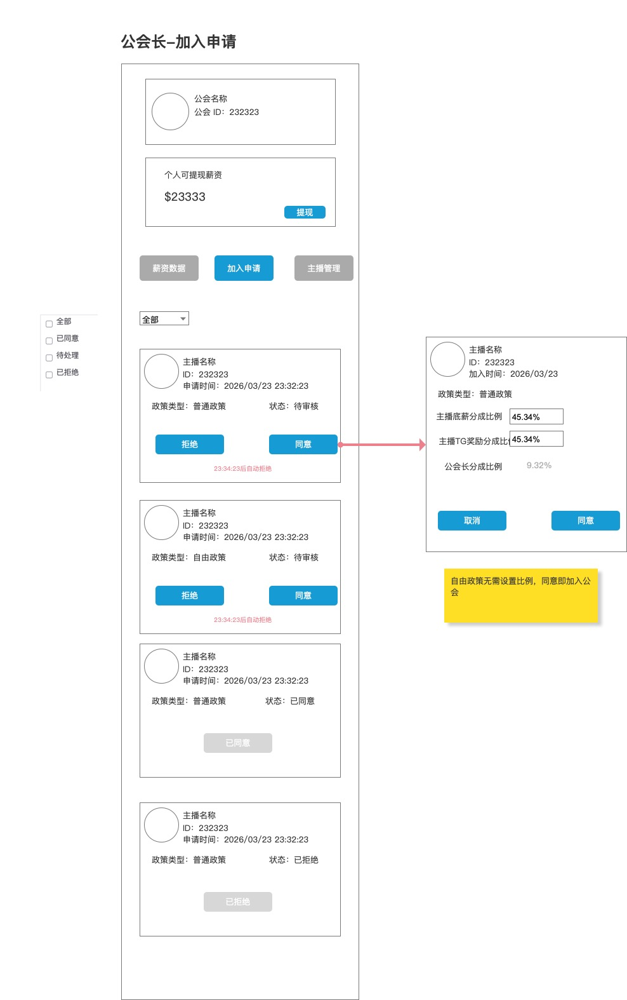

**功能描述：** 公会长入会申请管理页，展示待处理主播申请、公会信息、政策类型和审核操作。
**关键交互：** 公会长通过或拒绝申请；非自由政策通过前必须配置底薪比例和 TG 奖励比例。

**功能说明：** 入会申请管理用于公会长查看并处理主播入会申请。该功能直接影响主播是否进入公会结算体系；非自由政策下，通过申请后还必须完成主播薪资参数设置，否则不能进入正式可结算状态。

#### 前置条件

| 条件 | 规则 |
|---|---|
| 当前用户为公会长 | 只能处理自己公会的入会申请 |
| 公会状态正常 | 公会被冻结、清退、停用时不能通过新申请 |
| 申请状态为申请中 | 已拒绝、已通过、已撤回的申请不能重复处理 |
| 申请主播仍无有效公会关系 | 因主播只能申请1个公会，正常不会出现被其他公会先通过的并发场景；系统仍以申请状态为准处理 |

#### 字段与数据来源

| 字段 | 说明 | 数据来源 |
|---|---|---|
| 申请人头像 | 主播头像 | 用户资料 |
| 主播ID / 昵称 | 申请加入的主播 | 用户资料 |
| 申请时间 | 主播提交申请时间 | 入会申请记录 |
| 当前状态 | 申请中、已通过、已拒绝、已撤回 | 入会申请记录 |
| 当前公会状态 | 主播是否已加入公会、冷静期等 | 主播公会关系状态 |
| 风险提示 | 主播历史迁移、频繁离会、风控标签 | 风控记录 |
| 申请说明 | 主播提交的备注 | 入会申请记录 |
| 过往公会信息 | 主播历史公会关系摘要 | 公会关系历史 |
| 冷静期结束时间 | 主播如处于冷静期时展示 | 离会冷却记录 |
| 拒绝原因 | 公会长拒绝时填写 | 公会长输入 |
| 底薪比例 | 非自由政策通过后需设置；默认30% | 公会长输入 / 默认规则 |
| TG奖励比例 | 非自由政策通过后需设置；默认30% | 公会长输入 / 默认规则 |
| 参数确认时间 | 非自由政策薪资参数确认时间 | 主播薪资参数快照 |
| 操作人 | 处理申请的公会长账号 | 操作日志 |

#### 业务流程图

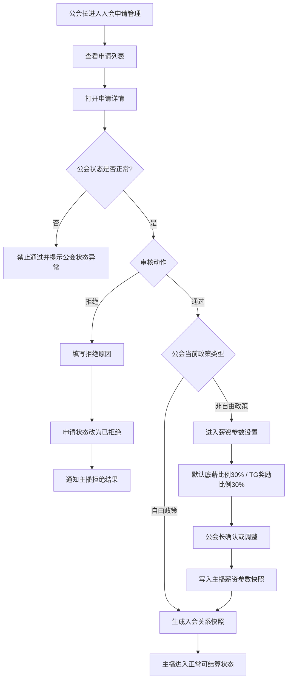
```mermaid
flowchart TD
    A[公会长进入入会申请管理] --> B[查看申请列表]
    B --> C[打开申请详情]
    C --> D{公会状态是否正常?}
    D -->|否| E[禁止通过并提示公会状态异常]
    D -->|是| F{审核动作}
    F -->|拒绝| G[填写拒绝原因]
    G --> H[申请状态改为已拒绝]
    H --> I[通知主播拒绝结果]
    F -->|通过| J{公会当前政策类型}
    J -->|自由政策| K[生成入会关系快照]
    K --> L[主播进入正常可结算状态]
    J -->|非自由政策| M[进入薪资参数设置]
    M --> N[默认底薪比例30% / TG奖励比例30%]
    N --> O[公会长确认或调整]
    O --> P[写入主播薪资参数快照]
    P --> K
```

#### 交互逻辑

1. 公会长进入入会申请管理，列表默认展示申请中记录。
2. 公会长点击申请卡片进入详情，查看主播资料、申请说明、历史公会信息和风险提示。
3. 点击拒绝时，弹出拒绝原因输入；确认后申请状态改为已拒绝，并通知主播。
4. 点击通过时，系统判断公会当前政策类型。
5. 若为自由政策，系统直接生成入会关系快照，主播进入正常可结算状态。
6. 若为非自由政策，系统弹出或跳转到薪资参数设置：底薪比例默认30%，TG奖励比例默认30%。
7. 公会长确认参数后，系统写入主播薪资参数快照，再生成正式入会关系快照。
8. 未完成参数确认时，主播处于待完善薪资参数状态，不能进入正式可结算状态。

#### 系统后台核心逻辑

| 逻辑点 | 规则 |
|---|---|
| 处理权限 | 公会长只能处理自己公会的申请，不能跨公会处理 |
| 申请唯一性 | 主播同一时间只能申请1个公会；审核流程不需要处理“已被其他公会通过”的并发分支 |
| 拒绝留痕 | 拒绝必须记录原因、操作人、操作时间，并通知主播 |
| 自由政策通过 | 直接生成入会关系快照，写入公会、主播、政策类型、入会时间 |
| 非自由政策通过 | 必须先生成薪资参数快照，再进入正式可结算状态 |
| 参数默认值 | 非自由政策底薪比例默认30%，TG奖励比例默认30%，公会长可按配置范围调整 |
| 参数快照 | 记录调整前值、调整后值、操作人、操作时间、所属自然月，历史结算读取快照 |
| 审计日志 | 通过、拒绝、参数设置都必须写操作日志 |

#### 边界情况

| 场景 | 处理规则 |
|---|---|
| 公会冻结后仍有申请中记录 | 公会长可查看，但不能通过；可拒绝并说明原因 |
| 公会长未完成非自由政策参数设置 | 申请不得直接变为正式入会成功；主播端展示待完善薪资参数 |
| 底薪比例/TG奖励比例超出配置范围 | 禁止保存，提示按后台配置范围调整 |
| 公会长重复点击通过 | 使用申请状态和操作幂等控制，只生成一次入会关系快照 |

---

### 6.3 公会长薪资数据页

#### 对应原型

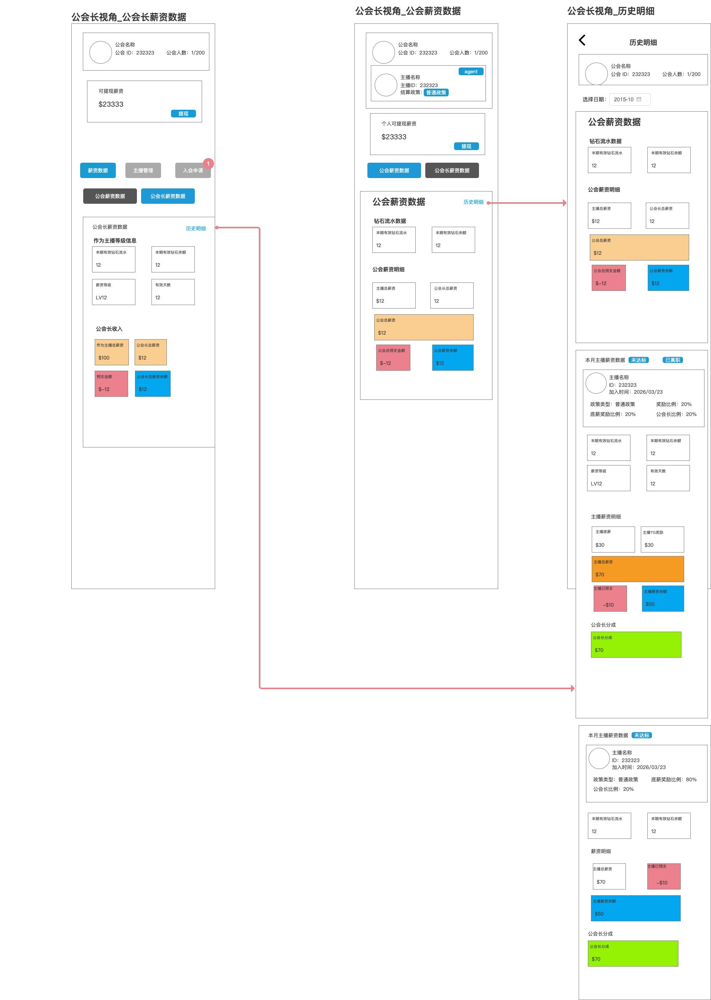

**功能描述：** 公会长薪资数据页，展示公会长管理收益、本人兼主播收益、扣减、预支对冲和余额池结果。
**关键交互：** 公会长可查看本人收益链路，并进入公会薪资、主播分账、提现和历史结算。

**功能说明：** 公会长薪资数据页展示公会长本人收益链路，包括“作为公会长的管理收益”和“本人兼主播时的主播工资”。这两条链必须分开解释，再汇总进入公会长余额池。

#### 前置条件

| 条件 | 规则 |
|---|---|
| 用户为公会长 | 可查看公会长收益数据 |
| 公会长本人兼主播 | 展示本人主播工资路径；否则不展示本人主播字段 |
| 当前周期已结算 | 展示正式结算结果；未结算时展示预估或待结算状态 |
| 存在预支 | 只对公会长本人主播身份下的预支做对冲说明，不替其他主播还债 |

#### 字段与数据来源

| 字段 | 业务定义 | 计算方式 / 取值规则 | 数据来源 |
|---|---|---|---|
| 公会名称 | 当前管理公会名称 | 直接读取，不参与金额计算 | 公会资料 |
| 公会 ID | 当前管理公会编号 | 直接读取，不参与金额计算 | 公会资料 |
| 公会人数 | 当前公会成员总数 | 汇总当前有效成员数 | 公会成员关系 |
| 可提现薪资 | 公会长当前可见的总可提现薪资摘要 | 原型字段名沿用“可提现薪资”；业务上定义为公会长当前页面总览层看到的可提现结果汇总 | 余额池汇总 |
| 个人可提现薪资 | 公会长本人可直接支配的个人可提现工资型余额 | 个人可提现薪资 = 个人薪资余额 + 可用于当前出口的个人工资型余额；不含未生效或冻结部分 | 公会长余额池 |
| 主播名称 | 公会长本人作为主播时的主播名称，或当前查看的主播名称入口 | 直接读取；若本人非主播则按页面隐藏或显示“-” | 用户资料 |
| 主播ID | 公会长本人作为主播时的主播账号ID，或当前查看的主播ID入口 | 直接读取；若本人非主播则按页面隐藏或显示“-” | 用户资料 |
| 结算政策 | 当前公会长页面使用的结算政策结构 | 读取当期绑定快照；原型命名为“结算政策”，文档定义为当前公会长收益/主播收益计算所采用的政策结构 | 政策绑定快照 |
| 作为主播数据信息 | 公会长本人作为主播时的独立数据区块 | 原型字段名沿用“作为主播数据信息”；业务上定义为公会长本人兼主播时的主播侧工资信息汇总区 | 页面区块 / 结算快照 |
| 本期有效钻石流水 | 当前周期内参与公会长本人主播结算的有效钻石流水 | 汇总公会长本人主播身份下的有效钻石流水；冻结、拒付、无效流水不计入 | 钻石流水快照 |
| 本期有效钻石合薪 | 当前周期内按有效钻石口径形成的薪资基数 | 原型字段名沿用“本期有效钻石合薪”；业务上定义为按有效钻石流水折算后的有效薪资基数，具体口径按当期政策快照读取 | 结算快照 |
| 薪资等级 | 当前公会长本人主播身份命中的薪资等级 | 非自由政策按结算快照读取；自由政策不适用时显示“-” | 结算快照 |
| 有效天数 | 当前公会长本人主播身份当月有效天统计 | 上麦≥3小时计1天；自由政策前端不展示时，公会长端可按结算快照保留字段 | 上麦时长日志 / 有效天快照 |
| 公会长收入 | 公会长作为管理者的收益结果 | 原型字段名沿用“公会长收入”；业务上定义为汇总所有主播按其当月钻石流水匹配档位后形成的公会长奖励结果，或自由政策下的公会长分成结果 | 公会长收益明细 |
| 作为主播总薪资 | 公会长本人作为主播时的工资总额 | 自由政策：本人主播分成工资；非自由政策：按该主播当月钻石余额匹配档位发放的主播底薪X + 主播TG奖励Z - 有效天扣减 - 预支对冲 - 风控扣减（按展示口径读取） | 主播结算明细 |
| 公会长私播薪 | 公会长本人作为主播时的私播相关薪资结果 | 原型字段名沿用“公会长私播薪”；业务上定义为公会长本人主播身份下的工资型收入结果，具体以下钻快照为准 | 主播结算明细 / 余额池 |
| 预支金额 | 公会长本人主播身份下已发生并待对冲的预支金额 | 汇总该身份下预支记录和当期对冲结果 | 预支记录 / 结算抵扣单 |
| 公会长部署奖金 | 公会长部署类奖金结果 | 原型字段名沿用“公会长部署奖金”；业务上定义为公会长侧部署/奖金类收入，具体按结算快照读取 | 公会长收益明细 / 结算快照 |

#### 交互逻辑

1. 公会长进入薪资页后，默认展示公会长薪资数据或按上次选择恢复。
2. 页面分区展示本人主播身份数据和公会长管理收益数据。
3. 若公会长本人不是主播，则隐藏本人主播工资区。
4. 点击“公会薪资数据”切换到公会整体薪资页。
5. 点击“历史明细”进入公会长视角历史结算记录。
6. 点击“提现”进入公会长提现中心，系统加载公会长可用余额池。

#### 系统后台核心逻辑

| 逻辑点 | 规则 |
|---|---|
| 双身份拆分 | 公会长本人作为主播的收益和公会长管理收益必须分别生成工资项，不能先汇总再拆分 |
| 预支对冲对象 | 公会长侧预支对冲只处理公会长本人主播身份下的预支，不替其他主播偿还预支 |
| 金币奖励拆分 | 公会长各工资项也必须同步拆分金币工资奖励和非金币工资奖励 |
| 余额池生成 | 非金币工资奖励进入个人薪资余额；金币工资奖励进入金币工资奖励余额池；主播转账单独进入主播转账余额 |
| 历史追溯 | 历史公会长收益读取当期政策快照、身份快照、工资项拆分快照 |

#### 边界情况

| 场景 | 处理规则 |
|---|---|
| 公会长本人兼主播但有效天未达标 | 本人主播X/Z部分按有效天规则扣减；管理收益按公会长收益规则处理 |
| 公会长本人有待抵扣预支 | 仅用本人侧非金币工资奖励抵扣，不使用金币工资奖励 |
| 主播转账余额存在审核中记录 | 审核中金额不计入可提现余额，审核通过后入主播转账余额 |
| 管理收益被风控冻结 | 冻结部分不进入可提现余额，历史记录展示冻结原因 |

---

### 6.4 公会薪资数据页

#### 对应原型


**功能描述：** 公会薪资数据页，从公会总账维度展示总钻石流水、命中政策、X/Y/Z拆分、主播分账和公会长收益。
**关键交互：** 公会长可下钻到主播明细、扣减明细、预支对冲明细和历史结算快照。

**功能说明：** 公会薪资数据页用于公会长查看整个公会的结算总账和主播分账。页面必须能让公会长知道：公会本期钻石流水是多少、主播总薪资是多少、公会长收益是多少、预支扣了多少、成员分账是否能对上总账。

#### 前置条件

| 条件 | 规则 |
|---|---|
| 用户为公会长 | 只能查看本人管理公会的数据 |
| 当前公会有结算数据 | 展示总账和成员分账 |
| 当前周期未结算 | 展示预估或待结算状态，并标明最终以结算快照为准 |

#### 字段与数据来源

| 字段 | 业务定义 | 计算方式 / 取值规则 | 数据来源 |
|---|---|---|---|
| 公会薪资数据 | 当前页面所属的数据视图 | 原型字段名沿用“公会薪资数据”；业务上定义为公会总账视角下的薪资结算总盘子页面 | 页面状态 |
| 公会名称 | 当前结算公会名称 | 直接读取，不参与金额计算 | 公会资料 |
| 公会ID | 当前结算公会编号 | 直接读取，不参与金额计算 | 公会资料 |
| 公会薪资明细 | 公会薪资数据下的明细查看维度 | 原型字段名沿用“公会薪资明细”；业务上定义为公会总账下钻后的成员分账和收入明细区域 | 页面区块 / 结算明细 |
| 主播总薪资 | 当前公会内所有主播侧工资合计 | 自由政策：汇总主播分成工资；非自由政策：汇总各主播按各自当月钻石余额档位发放的基础薪资X和TG奖励Z，再叠加/扣减对应处理 | 主播结算明细 |
| 公会长总薪资 | 当前公会内公会长侧工资合计 | 自由政策：汇总公会长分成；非自由政策：汇总所有主播按各自当月钻石流水档位形成的公会长奖励Y贡献，再叠加公会长本人兼主播收益 | 公会长收益明细 + 主播结算明细 |
| 公会总薪资 | 当前公会当期工资总盘子 | 公会总薪资 = 主播总薪资 + 公会长总薪资（按当前展示口径读取，不再重复扣减有效天、风控、预支） | 结算单 |
| 公会结算奖金 | 当前公会当期结算奖金结果 | 原型字段名沿用“公会结算奖金”；业务上定义为公会在当前结算周期内形成的奖金/结算奖励结果，具体按结算快照读取 | 结算单 / 结算快照 |
| 公会部署奖金 | 当前公会当期部署奖金结果 | 原型字段名沿用“公会部署奖金”；业务上定义为部署类奖金/奖励结果，具体按结算快照读取 | 结算单 / 结算快照 |
| 历史明细 | 查看历史结算明细的入口 | 点击后进入公会历史结算列表或详情 | 历史结算记录 |

#### 交互逻辑

1. 公会长从薪资页切换到“公会薪资数据”。
2. 页面顶部展示公会基础信息和当前政策。
3. 页面展示公会总账：钻石流水、主播总薪资、公会长总薪资、预支金额、公会薪资总额。
4. 页面展示主播/代理信息卡或成员分账列表，支持查看单个主播薪资链路。
5. 点击历史明细，按月份进入历史公会结算快照。
6. 若总账和成员分账不一致，页面展示校验异常提示，进入后台复核链路。

#### 系统后台核心逻辑

| 逻辑点 | 规则 |
|---|---|
| 总账生成 | 公会结算单生成时同步生成公会总账和成员分账 |
| 成员分账 | 每位主播和公会长收益都必须有独立明细，不能只保留总额 |
| 校验关系 | 公会薪资总额必须能被主播明细、公会长收益明细、扣减、预支对冲解释 |
| 历史快照 | 历史公会薪资页读取结算快照，不读取实时流水重算 |
| 权限范围 | 公会长只能查看本人公会范围内成员分账，不能查看其他公会 |

#### 边界情况

| 场景 | 处理规则 |
|---|---|
| 主播月中离会 | 离会前强制结算后的工资仍按历史快照展示，余额挂主播本人 |
| 某主播风控冻结 | 公会总账展示冻结金额，成员明细展示对应主播冻结原因 |
| 非自由政策主播有效天未达标 | 成员分账展示主播扣减和对应公会长贡献扣减 |
| 总账校验不一致 | 禁止财务确认结算，进入后台复核 |

---

### 6.5 主播管理（公会长）

#### 对应原型

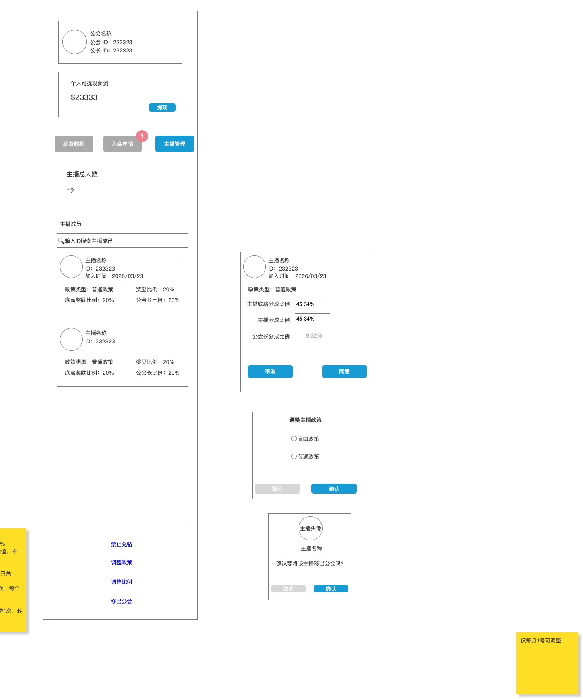

**功能描述：** 公会长主播管理页，展示公会内主播列表、当前政策、分成比例、有效天、薪资参数和管理操作。
**关键交互：** 公会长可查看主播详情、调整分成比例、处理移除/离会和查看主播薪资链路。

**功能说明：** 主播管理用于公会长查看和管理公会内主播。该模块承接三个核心链路：入会后完善非自由政策薪资参数、每月1号调整主播分成比例、主播移除/离会前强制结算。

#### 前置条件

| 条件 | 规则 |
|---|---|
| 用户为公会长 | 只能管理本人公会内主播 |
| 主播已加入当前公会 | 才出现在主播列表 |
| 主播处于待完善薪资参数 | 列表需突出提示并提供参数完善入口 |
| 分成比例调整 | 公会政策调整每月仅可操作1次；普通政策主播薪资比例每3个月仅可调整1次，且必须在每月1号 |

#### 字段与数据来源

| 字段 | 说明 | 数据来源 |
|---|---|---|
| 主播头像 / 昵称 / ID | 主播基础资料 | 用户资料 |
| 加入时间 | 主播进入当前公会的时间 | 入会关系快照 |
| 政策类型 | 当前主播适用的公会政策类型 | 政策绑定快照 |
| 分成比例 | 自由政策或通用分成比例 | 主播分成比例快照 |
| 底薪比例 | 非自由政策主播基础薪资分配比例 | 主播薪资参数快照 |
| TG奖励比例 | 非自由政策主播TG奖励分配比例 | 主播薪资参数快照 |
| 有效天数 | 非自由政策当月有效天统计 | 上麦时长日志 |
| 新手保护期 | 是否处于首次加入公会当月保护 | 主播关系快照 |
| 本月钻石流水 | 主播本周期钻石流水 | 钻石流水统计 |
| 预支状态 | 是否存在已预支或待抵扣 | 预支记录 |
| 主播状态 | 正常、未达标、待完善参数、离会申请中、冻结、已离职 | 主播关系状态 |
| 查看薪资 | 跳转主播薪资明细 | 权限控制 |
| 调整比例 | 每月1号可操作 | 分成比例管理规则 |
| 完善薪资参数 | 非自由政策待完善参数时可操作 | 入会申请审核结果 |
| 限制兑钻余额数配置 | 公会维度配置项：限制公会内主播兑钻 | 限制兑钻配置快照 |
| 移除主播 | 公会主动移除入口 | 离会/移除规则 |

#### 交互逻辑

**入口与初始化**
1. 公会长进入主播管理页，系统展示当前公会所有有效主播。
2. 列表优先标记待处理状态：待完善薪资参数、有效天未达标、存在预支待抵扣、风控冻结、离会申请中。

**查看与调整**
3. 点击“查看薪资”进入该主播工资明细，只能查看本公会范围内数据。
4. 点击“调整比例”时，系统先判断当前主播是否为普通政策主播；若不是普通政策主播，按钮点击后 toast 提示“当前主播不是普通政策主播，不能使用普通政策薪资比例调整规则”。
5. 若为普通政策主播，系统继续校验是否为每月1号；若不是每月1号，toast 提示“普通政策主播薪资比例每3个月只能调整1次，且必须在每月1号操作”。
6. 若当前日期为每月1号，系统继续校验距离上次薪资比例调整是否已满3个月；若未满3个月，toast 提示“距离上次普通政策薪资比例调整未满3个月，请在满足3个月后于当月1号再操作”。
7. 上述校验全部通过后，系统打开“调整比例”弹窗，展示当前比例、可调整范围、最近一次调整时间和本次生效说明。
8. 点击“调整主播政策”时，系统先校验是否为每月1号；若不是每月1号，toast 提示“主播政策调整每月只能操作1次，且必须在每月1号发起”。
9. 若当前日期为每月1号，系统继续校验该主播累计政策调整次数是否已达3次；若已达3次，toast 提示“该主播政策累计最多只能调整3次，当前已达调整上限”。
10. 若累计次数未达上限，系统继续校验该主播当月是否已调整过1次；若当月已调整，toast 提示“该主播本月已完成1次政策调整，本月不可再次调整”。
11. 上述校验全部通过后，系统打开“调整主播政策”弹窗，展示当前政策、可选目标政策、本次调整后生效说明和累计已调整次数。
12. 点击“完善薪资参数”时，进入底薪比例和TG奖励比例确认；默认均为30%，保存后写入参数快照。

**移除与结果**
7. 点击“移除主播”时，进入移除确认流程，不得直接把主播移出公会。

#### 分成比例 / 薪资参数规则

| 操作 | 可操作时间 | 次数限制 | 生效规则 | 留痕要求 |
|---|---|---|---|---|
| 调整主播政策 | 每月1号 | 每个主播累计最多3次，且同一自然月仅1次 | 当月按最新一次有效调整执行 | 调整前政策、调整后政策、操作人、操作时间、累计调整次数 |
| 调整普通政策主播薪资比例 | 每月1号 | 每3个月仅可调整1次 | 当月按最新一次有效调整执行 | 调整前比例、调整后比例、操作人、操作时间、最近一次调整时间 |
| 限制兑钻余额数配置 | 每月任意时间仅可调整1次 | 公会维度每月仅1次 | 确认后即时生效；0表示不限制兑钻 | 调整前阈值、调整后阈值、操作人、操作时间、所属自然月 |
| 主播本人修改政策 | 每月1号 | 本人同月仅1次 | 当月按最新一次有效修改执行 | 修改前后政策、操作人、时间 |
| 非自由政策薪资参数确认 | 入会通过后必须完成 | 入会参数确认1次；后续调整按规则控制 | 确认后主播进入可结算状态 | 底薪比例、TG奖励比例、确认人、确认时间 |

#### 系统后台核心逻辑

| 逻辑点 | 规则 |
|---|---|
| 权限范围 | 公会长只能管理自己公会主播，不能跨公会查看或操作 |
| 参数快照 | 分成比例、底薪比例、TG奖励比例都必须写入快照，历史结算读取快照 |
| 每月1号限制 | 非1号提交政策调整或薪资比例调整必须后端拒绝，不能只前端置灰 |
| 公会政策调整次数 | 每个主播的公会政策累计最多调整3次，且同一自然月最多1次 |
| 普通政策比例调整限制 | 普通政策主播薪资比例每3个月最多调整1次，且必须在每月1号发起 |
| 限制兑钻余额数配置 | 仅对公会内主播生效，不包含公会长本人；阈值=0时不限制兑钻；当主播当前钻石余额大于等于阈值时禁止兑钻 |
| 待完善参数 | 非自由政策主播未完成参数确认前，不进入正式可结算状态 |
| 移除主播 | 移除直接结算 | 公会长发起移除后，系统直接走该主播当期结算，并处理预支抵扣与风控冻结 |
| 冷静期 | 被公会移出后也进入冷静期，冷静期内不可重新加入公会 |
| 审计日志 | 比例调整、参数确认、移除发起都写审计日志 |

#### 边界情况

| 场景 | 处理规则 |
|---|---|
| 公会长尝试替主播修改本人政策 | 禁止；主播政策只能主播本人每月1号修改 |
| 公会长调整自己作为主播的政策 | 按主播本人修改本人政策规则执行 |
| 非1号调整比例或政策 | 按钮置灰；后端同时拦截 |
| 公会政策累计调整已达3次 | 禁止继续调整，提示已达上限 |
| 普通政策主播3个月内重复调薪资比例 | 禁止提交，提示未到下次可调整时间 |
| 本月重复调整限制兑钻余额数 | 禁止提交，toast提示“本月已完成限制兑钻余额数调整” |
| 主播钻石余额大于等于阈值 | 该主播无法执行兑钻；前端置灰并提示限制说明 |
| 主播冻结 | 可查看信息，分成调整、政策调整、兑钻限制配置和移除按风控状态控制 |

---

### 6.6 公会长提现总流程

#### 对应原型

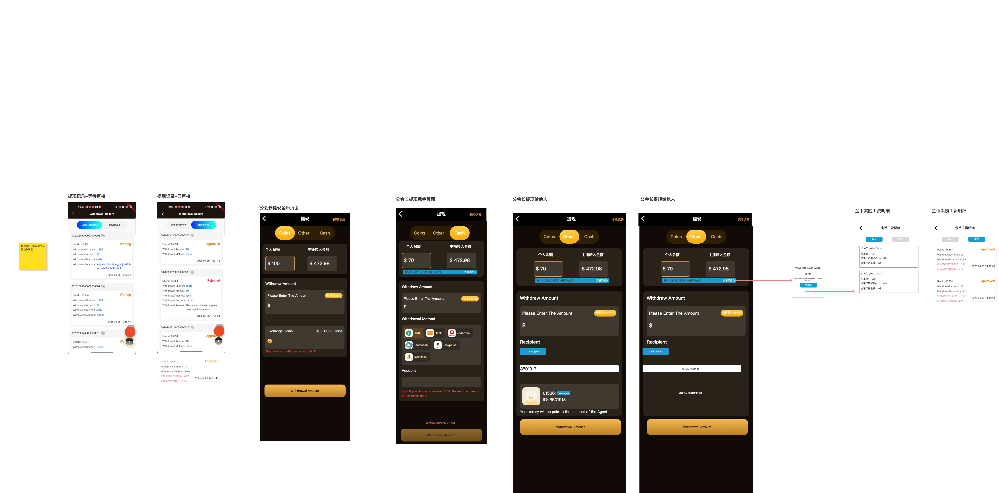

**功能描述：** 公会长提现总流程页用于汇总展示公会长可用余额池、可选提现出口和当前可申请金额。它是公会长从收益结果进入提现分流的入口，不直接提交申请。  
**关键交互：** 公会长从总流程页选择提现金币或提现现金；系统根据余额池类型、时间窗口和角色规则控制各出口可见性。

#### 前置条件

| 条件 | 规则 |
|---|---|
| 公会长存在可用余额 | 至少存在个人薪资余额、主播转账余额或金币工资奖励余额 |
| 公会长未被冻结 | 风控冻结时限制提现入口 |
| 出口开放 | 现金提现仅每月1号开放 |
| 提现关系有效 | 提现逻辑读取当前余额池和角色规则 |

#### 字段与数据来源

##### 总览字段

| 字段 | 说明 | 数据来源 |
|---|---|---|
| 总可提现展示金额 | 公会长当前可见总额 | 个人薪资余额 + 主播转账余额 + 金币工资奖励余额 |
| 提现金币入口 | 进入金币提现申请页 | 页面配置 + 余额池规则 |
| 提现现金入口 | 进入现金提现申请页 | 页面配置 + 时间窗口规则 |
| 余额池说明 | 各入口可用/不可用余额池说明 | 提现规则配置 |
| 当前审核中的申请数 | 当前待审核提现申请数量 | 提现申请记录 |

#### 交互逻辑

1. 公会长从首页或薪资页进入提现总流程页。
2. 系统展示个人薪资余额、主播转账余额、金币工资奖励余额的摘要。
3. 页面按规则开放提现金币和提现现金两个出口。
4. 点击具体出口后，进入对应申请页；总流程页本身不提交申请。
5. 若当前存在审核中的申请，页面展示申请状态并提供进入提现记录的入口。

#### 系统后台核心逻辑

- 提现总流程页只负责分流和规则展示，不直接消耗余额池。
- 各出口可见性必须由后台规则控制，不能只靠前端写死。
- 提交时必须在具体申请页重新读取余额池和冻结状态。
- 总流程页展示金额仅作引导，不作为最终申请金额依据。

#### 边界情况

| 场景 | 处理规则 |
|---|---|
| 仅有金币工资奖励余额 | 只开放提现金币 |
| 仅有主播转账余额 | 可提现金币或现金，按出口规则处理 |
| 无任何可提现余额 | 展示空状态，不显示提交入口 |
| 现金提现非开放日 | 现金入口置灰并展示开放时间 |

### 6.7 公会长提现为金币

#### 对应原型

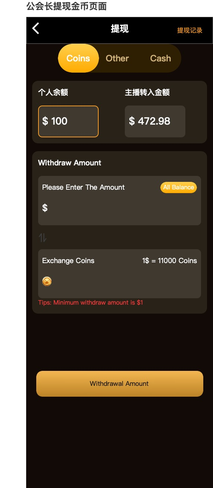

**功能描述：** 公会长提现为金币申请页，处理个人薪资余额、主播转账余额和金币工资奖励余额参与金币提现的组合申请。这个页面回答的是“公会长这次提多少、用哪几池、先扣哪池、折成多少金币”。  
**关键交互：** 公会长选择余额池组合并输入金额后提交；系统在个人薪资组内优先扣金币工资奖励余额，再扣个人薪资余额，主播转账余额按所选金额独立扣减。

#### 前置条件

| 条件 | 规则 |
|---|---|
| 公会长存在可提现金币余额 | 至少有个人薪资余额、主播转账余额或金币工资奖励余额 |
| 公会长未被冻结 | 风控冻结时禁止提交 |
| 提现金额合法 | 金额必须大于0且不超过金币出口可用总额 |
| 汇率可用 | 当前金币提现汇率配置有效 |

#### 字段与数据来源

##### 表单字段

| 字段 | 说明 | 数据来源 |
|---|---|---|
| 个人薪资余额 | 公会长本人工资型余额 | 公会长余额池 |
| 主播转账余额 | 主播转给公会长形成的余额 | 主播转账记录 |
| 金币工资奖励余额 | 公会长金币奖励工资余额 | 金币工资奖励余额池 |
| 余额池选择项 | 本次提现选择哪些余额池 | 用户选择 |
| 提现金额 | 本次申请金额 | 用户输入 |
| 金币汇率 | 金币提现换算汇率 | 汇率配置快照 |
| 预计到账金币 | 预计到账金币数量 | 提现金额 × 汇率配置 |
| 提现状态 | Waiting、Approved、Rejected、打款失败、已回滚 | 提现申请记录 |
| 所选余额池快照 | 申请时所选余额池及余额 | 提现申请快照 |
| 扣减顺序快照 | 本次申请实际扣减顺序 | 提现申请快照 |

#### 交互逻辑

1. 公会长进入金币提现页后，系统展示个人薪资余额、主播转账余额和金币工资奖励余额。
2. 公会长选择要参与提现的余额池组合。
3. 输入提现金额后，系统即时校验是否超过所选余额池可用金额。
4. 页面同步展示预计到账金币数量。
5. 提交成功后，系统冻结对应余额池金额并生成 Waiting 状态提现申请。

#### 系统后台核心逻辑

- 个人薪资组内部扣减顺序固定为金币工资奖励余额＞个人薪资余额。
- 主播转账余额与个人薪资组分开记录来源和扣减金额，不允许混成一个来源字段。
- 提交时冻结所选余额池；审核通过后正式扣减并发放金币。
- 审核拒绝或打款失败时，必须按原余额池释放或回滚。

#### 边界情况

| 场景 | 处理规则 |
|---|---|
| 仅选主播转账余额 | 只扣主播转账余额 |
| 组合选择多个余额池 | 快照必须记录各余额池实际消耗金额 |
| 金额超过某一池可用余额 | 允许组合补足；若总额不足则禁止提交 |
| 提交后余额变化 | 以提交时冻结快照为准 |

### 6.8 公会长提现为现金

#### 对应原型

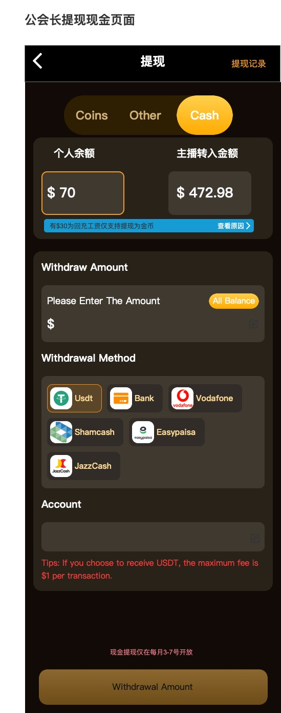

**功能描述：** 公会长提现为现金申请页，处理公会长工资型余额的现金提现。它承接的是“公会长把工资型余额按外部收款方式提走”，金币工资奖励余额在这里不可用。  
**关键交互：** 公会长选择个人薪资余额、主播转账余额或两者组合，填写提现金额和收款方式后提交；系统冻结对应工资型余额并生成 Waiting 状态提现单。

#### 前置条件

| 条件 | 规则 |
|---|---|
| 现金入口开放 | 现金提现仅每月1号开放入口 |
| 公会长存在工资型余额 | 至少存在个人薪资余额或主播转账余额 |
| 金币工资奖励余额不可用 | 该余额不能提现现金 |
| 收款方式有效 | 需填写并校验收款方式和账号 |

#### 字段与数据来源

##### 表单字段

| 字段 | 说明 | 数据来源 |
|---|---|---|
| 个人薪资余额 | 公会长本人工资型余额 | 公会长余额池 |
| 主播转账余额 | 主播转入公会长的工资型余额 | 主播转账记录 |
| 金币工资奖励余额 | 页面展示为不可用说明 | 金币工资奖励余额池 |
| 余额池选择项 | 本次提现选择哪些工资型余额池 | 用户选择 |
| 提现金额 | 本次申请金额 | 用户输入 |
| 提现方式 | USDT、Bank、Vodafone、Bkash、EasyPaisa、JazzCash 等 | 提现渠道配置 |
| 收款账号 | 现金提现账号 | 用户输入 / 历史账号 |
| 提现状态 | Waiting、Approved、Rejected、打款失败、已回滚 | 提现申请记录 |
| 所选余额池快照 | 申请时所选余额池及余额 | 提现申请快照 |

#### 交互逻辑

1. 公会长进入现金提现页后，系统展示个人薪资余额和主播转账余额为可选余额。
2. 页面置灰展示金币工资奖励余额，并提示该余额只能用于提现金币。
3. 公会长选择工资型余额池组合、填写金额和收款方式后，系统即时校验金额、账号和开放时间。
4. 提交成功后，系统冻结对应工资型余额并生成 Waiting 状态提现申请。
5. 审核、打款、失败和回滚结果在提现记录中查看。

#### 系统后台核心逻辑

- 金币工资奖励余额不得提现现金，系统必须阻断而不是只前端置灰。
- 提交时冻结所选工资型余额池；审核通过后正式扣减并执行外部打款。
- 主播转账余额与公会长个人薪资余额虽同属工资型余额，但来源必须分开记录。
- 审核拒绝和打款失败时，必须按原余额池释放或回滚。

#### 边界情况

| 场景 | 处理规则 |
|---|---|
| 只选主播转账余额 | 允许提交现金提现 |
| 金币奖励余额尝试提现现金 | 禁止提交并提示转到金币提现 |
| 收款账号为空或格式错误 | 禁止提交 |
| 非开放日进入页面 | 允许查看，不允许提交 |

### 6.9 历史结算记录列表（公会长视角）

#### 对应原型


**功能描述：** 公会长历史结算记录列表页，按月份展示公会结算、公会长收益和分账状态。它承接的是“公会长先看哪几个月有账、状态怎么样、要不要点进去对账”。  
**关键交互：** 公会长按月份查看历史记录，点击某期进入详情，用于对账、申诉和财务确认。

#### 前置条件

| 条件 | 规则 |
|---|---|
| 用户为公会长 | 只能查看本人管理公会历史结算 |
| 存在历史结算快照 | 按月份展示记录 |
| 公会已停用或解散 | 历史已结算数据仍可查 |

#### 字段与数据来源

##### 列表字段

| 字段 | 说明 | 数据来源 |
|---|---|---|
| 结算月份 | 历史结算所属月份 | 结算快照 |
| 公会ID / 名称 | 当期结算公会 | 公会快照 |
| 政策类型 | 当期自由政策或非自由政策 | 政策绑定快照 |
| 公会钻石流水 | 当期可结算钻石流水摘要 | 钻石流水快照 |
| 主播总薪资 | 当期主播侧工资合计 | 主播结算明细 |
| 公会长管理收益 | 当期公会长收益摘要 | 公会长收益明细 |
| 审核状态 | 结算、提现、风控审核结果摘要 | 审核记录 |

#### 交互逻辑

1. 公会长进入历史结算列表页后，默认展示最近已结算月份。
2. 公会长通过月份筛选切换历史周期。
3. 点击某期记录时，进入该期历史结算详情。
4. 列表页只负责周期定位和摘要展示，不在此页展开完整金额链路。

#### 系统后台核心逻辑

- 列表页读取历史结算快照摘要，不读取实时流水重算。
- 公会长权限只允许查看本人公会范围内的历史记录。
- 列表摘要金额必须与详情页快照口径一致，不能一页一个算法。
- 公会停用、解散、主播离会都不影响历史列表可追溯性。

#### 边界情况

| 场景 | 处理规则 |
|---|---|
| 历史快照缺失 | 标记异常记录，禁止作为正常对账依据 |
| 公会已解散 | 历史列表仍保留 |
| 主播已离会 | 不影响历史期摘要展示 |
| 退款/拒付后续处置 | 列表显示原期结果，具体处置在详情页查看 |

### 6.10 历史结算记录详情（公会长视角）

#### 对应原型


**功能描述：** 公会长历史结算详情页，展示公会总账、公会长本人收益、主播分账、扣减、预支对冲和提现路径。它承接的是“这一期钱到底怎么算出来的”，是公会长和平台对账的核心页面。  
**关键交互：** 公会长按角色和余额池追溯金额来源，查看公会总账、主播分账、公会长收益、预支抵扣、风控扣减和提现申请快照。

#### 前置条件

| 条件 | 规则 |
|---|---|
| 已进入某期历史记录 | 详情页必须绑定具体结算周期 |
| 结算快照存在 | 所有金额读取当期快照 |
| 公会长权限有效 | 只能查看本人公会范围内明细 |
| 历史记录可追溯 | 提现申请快照、风控处置记录、预支对冲记录可读 |

#### 字段与数据来源

##### 详情字段

| 字段 | 业务定义 | 计算方式 / 取值规则 | 数据来源 |
|---|---|---|---|
| 历史明细 | 当前查看的历史结算详情页数据主体 | 原型字段名在列表入口中表现为“历史明细”；业务上定义为某一结算周期的完整总账/分账详情 | 历史结算快照 |
| 公会总薪资 | 当前历史结算周期的公会总工资盘子 | 公会总薪资 = 主播总薪资 + 公会长总薪资（按该期快照口径读取，不再重复扣减有效天、风控、预支） | 结算单 |
| 公会长总薪资 | 当前历史结算周期的公会长侧工资合计 | 自由政策：公会长分成；非自由政策：汇总所有主播按各自当月钻石流水档位形成的公会长奖励Y贡献，再叠加公会长本人兼主播收益 | 公会长收益明细 + 主播结算明细 |
| 主播总薪资 | 当前历史结算周期的主播侧工资合计 | 汇总全部主播工资项、扣减、预支对冲和余额池结果后的主播侧工资总盘子 | 主播结算明细 |
| 公会结算奖金 | 当前历史结算周期的结算奖金结果 | 原型字段名沿用“公会结算奖金”；业务上定义为该期结算产生的奖金/奖励结果，具体按结算快照读取 | 结算单 / 结算快照 |
| 公会部署奖金 | 当前历史结算周期的部署奖金结果 | 原型字段名沿用“公会部署奖金”；业务上定义为部署类奖金/奖励结果，具体按结算快照读取 | 结算单 / 结算快照 |
| 公会钻石流水 | 当前历史结算周期的可结算钻石流水 | 汇总该期有效钻石流水；冻结、拒付、无效流水不计入 | 钻石流水快照 |
| 命中档位 | 非自由政策在该期命中的档位 | 按当期有效钻石流水与档位门槛匹配；自由政策不适用时显示“-” | 政策结算快照 |
| 有效天扣减 | 该期主播未达标导致的扣减总额 | 汇总该期所有未达标主播的有效天扣减，以及对应公会长贡献扣减 | 有效天快照 / 结算单 |
| 预支对冲 | 该期主播和公会长本人预支抵扣总额 | 按该期快照汇总所有预支对冲结果；金币工资奖励不得用于对冲 | 结算抵扣单 |
| 风控扣减 | 该期因异常流水或风控处置产生的扣减总额 | 汇总冻结、扣减、追回等结果 | 风控处置记录 |
| 公会总金币工资奖励 | 该期公会范围内只能提现金币的工资总额 | 汇总主播和公会长各工资项拆分出的金币工资奖励部分 | 余额池快照 |
| 公会总薪资余额 | 该期公会范围内工资型余额总额 | 汇总主播和公会长非金币工资奖励进入余额池后的剩余工资型余额 | 余额池快照 |
| 提现申请快照 | 该期相关提现所选余额池、出口、扣减顺序 | 用于追溯历史提现从哪个余额池出的 | 提现申请快照 |
| 审核状态 | 该期结算、提现、风控审核结果 | 汇总展示审核链路最终状态或阶段状态 | 审核记录 |

#### 交互逻辑

1. 公会长从历史列表进入某期详情页。
2. 页面分区展示公会总账、公会长收益、主播分账、扣减项、预支对冲、余额池和提现申请快照。
3. 点击某个分账或提现记录时，系统展示对应链路详情和快照内容。
4. 详情页用于对账和申诉，不提供修改历史结果的动作。

#### 系统后台核心逻辑

- 历史详情读取结算时锁定的政策、主播归属、工资项拆分和余额池结果。
- 公会总账必须能解释为：主播明细 + 公会长收益 - 扣减 - 预支对冲。
- 每笔提现记录必须能追到余额池组合和扣减顺序。
- 冻结、扣减、恢复都要在历史详情中可见，便于风控和财务追溯。

#### 边界情况

| 场景 | 处理规则 |
|---|---|
| 公会已解散 | 历史详情继续保留并可按权限查看 |
| 主播已离会 | 该主播历史贡献仍保留在当期公会结算快照中 |
| 结算后发生退款/拒付 | 追加处置记录，不覆盖原快照 |
| 提现失败回滚 | 详情展示失败原因和回滚到哪个余额池 |

### 6.11 主播移除与离会处理（公会长发起）

#### 对应原型


**功能描述：** 主播管理中的离会/移除处理入口，用于公会长发起主动移除或查看主播离会状态。
**关键交互：** 发起移除后系统进入待结算保护；结算完成前主播不得直接脱离原公会结算链路。

**功能说明：** 公会长可发起移除主播，但不得绕过结算。主播被移除前，系统必须先处理当期未结算工资、预支抵扣、风控冻结和余额归属，避免主播带着未结算工资或未抵扣预支直接离开。

#### 前置条件

| 条件 | 规则 |
|---|---|
| 公会长拥有管理权限 | 只能移除本人公会内主播 |
| 主播属于当前公会 | 已离会主播不可重复移除 |
| 系统读取结算状态 | 判断是否存在未结算工资、预支待抵扣、风控冻结 |
| 公会主动移除场景 | 默认不对主播收取违约金；被公会移出后也进入冷静期 |

#### 字段与数据来源

| 字段 | 说明 | 数据来源 |
|---|---|---|
| 主播ID / 昵称 | 被移除主播 | 用户资料 |
| 当前公会 | 主播当前所属公会 | 公会关系快照 |
| 当前政策 | 主播当前适用政策 | 政策绑定快照 |
| 当前待结算金额 | 主播当前周期待结算工资 | 结算预估 / 待结算记录 |
| 已预支金额 | 主播当前周期已预支金额 | 预支记录 |
| 待抵扣余额 | 历史未结清预支余额 | 结算抵扣单 |
| 风控冻结金额 | 当前被冻结或待复核金额 | 风控事件 |
| 是否进入待结算保护期 | 系统判断是否必须先结算 | 结算状态 |
| 是否进入离会冷静期 | 公会主动移除后进入冷静期 | 冷静期配置 |
| 冷静期结束时间 | 进入冷静期后展示结束时间 | 冷静期配置 |
| 结算后余额 | 当期结算后挂主播本人的余额 | 余额池快照 |
| 操作人 / 操作时间 | 公会长发起记录 | 审计日志 |

#### 业务流程图

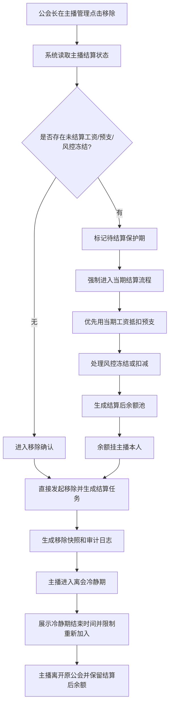
```mermaid
flowchart TD
    A[公会长在主播管理点击移除] --> B[系统读取主播结算状态]
    B --> C{是否存在未结算工资/预支/风控冻结?}
    C -->|无| D[进入移除确认]
    C -->|有| E[标记待结算保护期]
    E --> F[强制进入当期结算流程]
    F --> G[优先用当期工资抵扣预支]
    G --> H[处理风控冻结或扣减]
    H --> I[生成结算后余额池]
    I --> J[余额挂主播本人]
    D --> K[直接发起移除并生成结算任务]
    J --> K
    K --> L[生成移除快照和审计日志]
    L --> M[主播进入离会冷静期]
    M --> N[展示冷静期结束时间并限制重新加入]
    N --> O[主播离开原公会并保留结算后余额]
```

#### 交互逻辑

**入口与初始化**
1. 公会长在主播管理列表点击“移除主播”。
2. 系统弹出移除确认页，展示主播基础信息、当前待结算金额、已预支金额、待抵扣余额、风控冻结、冷静期和对提现影响。

**确认与执行**
3. 公会长确认移除后，系统直接发起该主播当期结算，不要求填写移出原因。
4. 系统同步处理预支抵扣、风控冻结和结算后余额归属。

**结果与后续**
5. 结算完成后形成的余额、可提现余额、提现资格挂主播本人，不跟原公会绑定，也不被新公会接管。
6. 被公会移出后，主播进入冷静期，冷静期内不可重新加入公会。
7. 系统生成移除记录、结算快照和冷静期记录。

#### 系统后台核心逻辑

| 逻辑点 | 规则 |
|---|---|
| 不允许直接移除 | 公会主动移除可以发起，但不得跳过当期结算流程 |
| 预支优先抵扣 | 当期工资优先用于抵扣主播本人预支，未结清部分继续挂主播本人 |
| 违约金 | 公会主动移除默认不对主播收取违约金；如产品后续另有规则需单独配置 |
| 余额归属 | 结算后的余额和可提现资格挂主播本人，不随主播后续公会变化转移 |
| 历史流水归属 | 移除前已产生流水仍按原公会快照结算 |
| 审计日志 | 记录移除发起人、发起时间、结算完成时间、余额快照 |
| 冷静期 | 公会主动移除后进入冷静期，冷静期内不可重新加入公会 |

#### 边界情况

| 场景 | 处理规则 |
|---|---|
| 主播存在未结算工资 | 进入待结算保护期，结算完成后才能正式离开 |
| 主播有未抵扣预支 | 当期工资优先抵扣，不足部分继续挂主播本人 |
| 主播有风控冻结 | 冻结金额需按风控复核处理，不能直接释放给主播 |
| 公会主动移除无过错主播 | 默认豁免违约金 |
| 移除后主播加入新公会 | 新公会只影响离会后新产生流水，不接管旧周期余额 |

---

## 九、后台需求

### 9.1 后台工作台

#### 功能说明

后台工作台用于运营、财务、风控快速查看当前公会政策业务运行状态和待办事项。

#### 字段与数据来源

| 字段 | 说明 | 统计方式 | 数据来源 |
|---|---|---|---|
| 当月钻石流水 | 当前月所有有效公会钻石流水 | 按自然月汇总 | 钻石流水 |
| 待结算公会数 | 当前周期需要结算但未确认的公会数 | 结算状态=待确认 | 结算单 |
| 待审核提现单数 | Waiting 状态提现单数量 | 状态汇总 | 提现申请 |
| 待处理预支单数 | 待审核或待发放预支单数量 | 状态汇总 | 预支记录 |
| 风控冻结金额 | 当前冻结中的结算或提现金额 | 冻结记录汇总 | 风控事件 |
| 高风险公会数 | 触发高风险标签的公会数量 | 风险标签汇总 | 风控事件/公会资料 |

### 9.2 公会管理

#### 对应原型

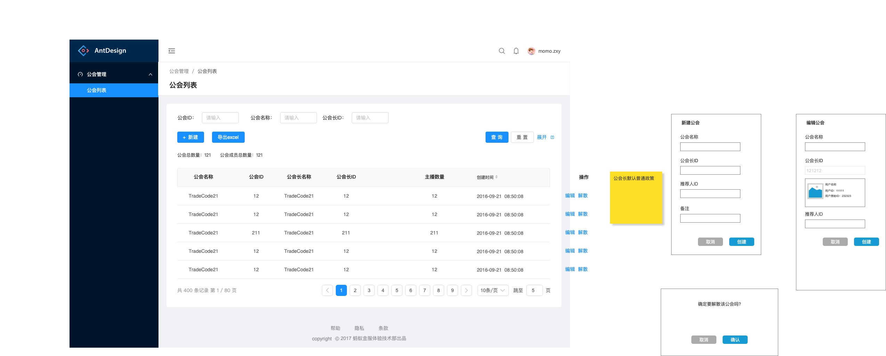

**功能描述：** 后台公会管理页，用于管理公会主体资料、负责人、政策绑定、公会状态、关联主播规模、结算状态和风险状态。它承接的是“平台怎么识别一个公会、给它什么政策、它现在处于什么经营/风控阶段”，不是简单的名单页。  
**关键交互：** 运营可新增公会、编辑资料、查看详情、绑定政策、调整状态；财务和风控可穿透查看该公会的结算、提现、风险记录和历史快照。

#### 前置条件

| 条件 | 处理规则 |
|---|---|
| 操作人权限 | 操作人已登录后台，并具备公会管理查看权限 |
| 公会主体有效 | 新增或编辑公会时，必须存在有效公会主体资料、负责人账号和收款主体 |
| 政策绑定前置 | 绑定政策前，公会状态必须为正常或运营允许处理状态 |
| 状态变更留痕 | 冻结、解散、清退类操作必须填写原因并写入审计日志 |

#### 字段与数据来源

##### 列表字段

| 字段 | 说明 | 数据来源 |
|---|---|---|
| 公会名称 | 公会展示名称 | 公会资料 |
| 公会ID | 公会唯一编号 | 公会资料 |
| 公会长名称 | 当前公会长名称 | 公会关系 / 用户资料 |
| 公会长ID | 当前公会长账号ID | 公会关系 / 用户资料 |
| 主播数量 | 当前有效主播数量 | 公会成员关系 |
| 创建时间 | 公会创建时间 | 公会资料 |
| 操作 | 编辑、解散 | 权限配置 |

##### 弹窗字段

| 字段 | 说明 | 数据来源 |
|---|---|---|
| 公会名称 | 新建/编辑公会时填写的公会名称 | 公会资料 / 用户输入 |
| 公会长ID | 新建/编辑公会时填写的公会长账号ID | 用户资料 / 用户输入 |
| 推荐人ID | 新建公会时填写的推荐人账号ID | 用户资料 / 用户输入 |
| 备注 | 新建公会时的补充说明 | 用户输入 |
| 用户名称 | 编辑公会时公会长信息卡片中的用户名称 | 用户资料 |
| 用户ID | 编辑公会时公会长信息卡片中的用户账号ID | 用户资料 |
| 用户昵称ID | 编辑公会时公会长信息卡片中的昵称或业务ID | 用户资料 |

##### 校验规则

| 校验项 | 规则 |
|---|---|
| 公会长ID存在性 | 输入公会长ID后，系统必须校验该账号是否存在；不存在则禁止创建/保存 |
| 公会长ID唯一性 | 输入公会长ID后，系统必须校验该账号是否已存在于其他公会；若已绑定其他公会，则禁止重复创建/保存 |
| 公会名称必填 | 未填写公会名称时禁止创建/保存 |
| 解散确认 | 点击“解散”时弹出二次确认“确定要解散该公会吗?”，确认后才执行 |
| 编辑限制 | 历史结算快照和历史主体关系不允许直接通过编辑弹窗篡改 |

#### 交互逻辑

1. 运营进入公会管理页后，默认查看公会列表。
2. 点击“新建”时，系统打开“新建公会”弹窗，展示字段：公会名称、公会长ID、推荐人ID、备注。
3. 输入公会长ID后，系统立即校验该ID是否存在；若不存在，禁止创建并提示公会长ID不存在。
4. 若公会长ID存在，系统继续校验该ID是否已存在于其他公会；若已绑定其他公会，禁止创建并提示该公会长已存在公会。
5. 所有校验通过后，点击“创建”才允许生成公会记录。
6. 点击“编辑”时，系统打开“编辑公会”弹窗，展示公会名称、公会长ID、推荐人以及公会长信息卡片（用户名称、用户ID、用户昵称ID）。
7. 编辑时同样校验公会长ID存在性和唯一性；校验失败则禁止保存。
8. 点击“解散”时，系统弹出二次确认“确定要解散该公会吗?”，只有点击“确认”后才执行解散。

#### 系统后台核心逻辑

- 创建公会时，公会长ID必须经过“存在性 + 唯一性”双校验，任何一项失败都不得落库。
- 公会状态直接影响主播入会、结算、预支、提现，不允许只改前台展示状态。
- 政策绑定必须生成绑定快照，结算读取快照而不是读取最新编辑值。
- 公会解散时必须走确认动作，不得无确认直接执行。
- 公会解散或清退时，必须先处理未结算流水、主播工资、预支和余额归属，不能直接删除主体关系。
- 公会详情中的历史结算、历史提现、历史风险事件都必须可回溯到具体快照或日志。

#### 边界情况

| 场景 | 处理规则 |
|---|---|
| 公会状态为冻结 | 禁止新增绑定、限制新增预支和现金提现，已产生流水进入复核池 |
| 公会无有效政策 | 只记录钻石流水，不进入政策结算，需运营补绑定或确认默认政策 |
| 公会已解散 | 历史结算和余额仍保留，不能因主体状态变化而丢失快照 |
| 公会被清退 | 主播工资、公会长收益、预支和提现按风控结论分别处理 |

### 9.3 主播列表

#### 对应原型

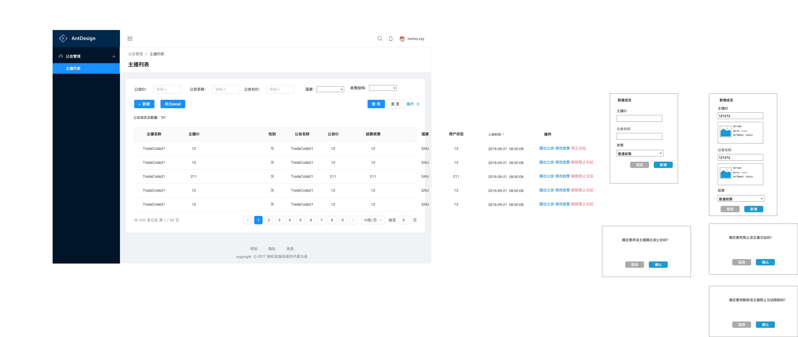

**功能描述：** 后台主播列表页，用于管理主播基础资料、公会归属、政策类型、有效天、薪资状态、预支状态和风控状态。它承接的是“主播现在挂在哪个公会、走哪套政策、有没有结算/提现/预支风险”，不是单纯搜索页。  
**关键交互：** 运营可查看主播详情、处理归属异常、冻结/解冻、查看入会状态；财务和风控可查看主播薪资、预支、提现和风险链路。

#### 前置条件

| 条件 | 处理规则 |
|---|---|
| 操作人权限 | 操作人具备主播资料查看权限 |
| 关系快照可读 | 主播列表读取当前主播状态，并可回看最近一次公会关系快照 |
| 敏感操作权限 | 冻结、解冻、移除、归属调整必须具备对应操作权限并填写原因 |
| 数据范围控制 | 财务/风控查看薪资或提现信息时，只能读取授权范围内数据 |

#### 字段与数据来源

##### 筛选项

| 字段 | 说明 | 数据来源 |
|---|---|---|
| 公会ID | 按公会ID筛选主播 | 公会关系快照 |
| 公会名称 | 按公会名称筛选主播 | 公会关系快照 |
| 公会长ID | 按公会长ID筛选主播 | 公会关系快照 / 用户资料 |
| 国家 | 按国家筛选主播所属公会 | 公会资料 |
| 政策结构 | 按主播当前政策结构筛选 | 政策绑定快照 |

##### 列表字段

| 字段 | 说明 | 数据来源 |
|---|---|---|
| 主播名称 | 主播名称 | 用户资料 |
| 主播ID | 主播唯一编号 | 用户资料 |
| 性别 | 主播性别 | 用户资料 |
| 公会名称 | 当前有效公会名称 | 公会关系快照 |
| 公会ID | 当前有效公会ID | 公会关系快照 |
| 结算政策 | 当前主播所属结算政策 | 政策绑定快照 |
| 国家 | 主播所属公会国家 | 公会资料 |
| 用户状态 | 正常、冻结、已离会等 | 主播状态 |
| 入会时间 | 当前公会加入时间 | 公会关系快照 |
| 操作 | 踢出公会、修改政策、禁止兑钻、解除禁止兑钻 | 权限配置 |

##### 弹窗与操作字段

| 字段 | 说明 | 数据来源 |
|---|---|---|
| 新增成员 | 新增成员弹窗标题 | 页面状态 |
| 主播ID | 新增成员时输入的主播ID | 用户输入 / 用户资料 |
| 会长长ID | 新增成员时显示或绑定的会长ID字段 | 用户输入 / 用户资料 |
| 政策 | 新增成员时选择的政策字段 | 政策绑定快照 / 用户输入 |
| 普通政策 | 政策字段的可选项之一 | 政策配置 |
| 用户名 | 主播信息卡片中的用户名 | 用户资料 |
| 用户id | 主播信息卡片中的用户账号ID | 用户资料 |
| 踢出公会确认文案 | “确定要将该主播踢出该公会吗?” | 页面文案 |
| 禁止兑钻确认文案 | “确定要将禁止该主播兑钻吗?” | 页面文案 |
| 解除禁止兑钻确认文案 | “确定要将解除该主播禁止兑钻限制吗?” | 页面文案 |

#### 交互逻辑

1. 运营进入主播列表页后，默认按公会ID、公会名称、公会长ID、国家、政策结构筛选主播。
2. 点击“新增”时，系统打开“新增成员”弹窗，展示字段：主播ID、会长长ID、政策。
3. 输入主播ID后，系统读取并展示主播信息卡片（用户名、用户id）。
4. 点击“踢出公会”时，弹出确认文案“确定要将该主播踢出该公会吗?”；确认后才执行踢出逻辑。
5. 点击“修改政策”时，打开政策修改动作，按当前主播政策规则进行校验和保存。
6. 点击“禁止兑钻”时，弹出确认文案“确定要将禁止该主播兑钻吗?”；确认后将该主播状态改为禁止兑钻。
7. 点击“解除禁止兑钻”时，弹出确认文案“确定要将解除该主播禁止兑钻限制吗?”；确认后解除该主播兑钻限制。

#### 系统后台核心逻辑

- 主播列表中的所属公会必须读取当前有效关系；历史薪资和历史结算仍以结算快照为准。
- “禁止兑钻 / 解除禁止兑钻”必须写入主播状态或单独限制记录，不能只改前端按钮展示。
- “踢出公会”必须走确认动作和后续结算保护流程，不得直接删关系。
- “修改政策”必须读取当前主播政策和可选政策范围，保存后写入快照。
- 主播离会或被移除前，必须先走当期结算保护和预支抵扣，不允许直接切断工资归属。

#### 边界情况

| 场景 | 处理规则 |
|---|---|
| 主播处于申请中 | 只展示申请状态，不允许再次提交新的入会申请 |
| 主播待完善薪资参数 | 非自由政策下不得直接进入正式可结算状态 |
| 主播被冻结 | 限制新增预支、现金提现和离会结算动作 |
| 主播已离会 | 历史结算和历史余额仍可追溯，当前公会关系置空 |

### 9.4 主播薪资

#### 对应原型

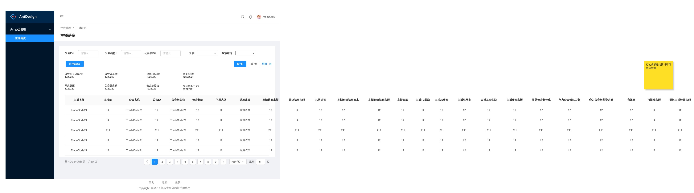

**功能描述：** 后台主播薪资页，按主播维度展示从钻石流水到工资项、扣减、预支对冲、余额池的完整结算链路。这个页面是财务、运营、风控核对“这笔钱怎么来的、为什么变少、最后落到哪个余额池”的主页面。  
**关键交互：** 财务和运营可按结算月份、公会、主播、政策类型筛选；日期筛选只允许选择单月范围，不能跨月查询；查看主播工资项、有效天扣减、预支对冲、金币工资奖励/非金币工资奖励、历史结算快照和异常标记。

#### 前置条件

| 条件 | 处理规则 |
|---|---|
| 周期已确定 | 页面查询必须指定结算月份；默认展示最近一个可结算周期 |
| 日期筛选合法 | 日期筛选只允许选择单月范围；开始日期和结束日期必须落在同一个自然月内 |
| 数据已生成 | 已生成或预生成当前周期主播薪资数据 |
| 政策类型明确 | 自由政策和非自由政策使用不同薪资字段结构，不得用同一套模板硬套 |
| 金额来源可信 | 薪资明细金额必须读取系统结算快照或预结算结果，不能读取页面展示值反算 |

#### 字段与数据来源

##### 筛选项

| 字段 | 说明 | 数据来源 |
|---|---|---|
| 公会ID | 按公会ID筛选所属公会 | 公会资料 |
| 公会名称 | 按公会名称筛选所属公会 | 公会资料 |
| 公会长ID | 按公会长ID筛选主播归属范围 | 公会关系 / 用户资料 |
| 结算月份 | 按结算自然月筛选主播薪资数据 | 结算周期配置 / 结算快照 |
| 结算日期范围 | 选择该结算月份内的开始日期和结束日期；仅允许单月内查询 | 结算周期配置 / 用户输入 |
| 国家 | 按国家筛选主播归属公会 | 公会资料 |
| 政策结构 | 按当前主播适用的政策结构筛选 | 政策绑定快照 |

##### 列表字段

| 字段 | 业务定义 | 计算方式 / 取值规则 | 数据来源 |
|---|---|---|---|
| 主播名称 | 当前被结算主播的名称 | 直接读取，不参与金额计算 | 用户资料 |
| 主播ID | 当前被结算主播的账号ID | 直接读取，不参与金额计算 | 用户资料 |
| 公会名称 | 当前结算周期归属公会名称 | 读取结算快照或当前有效公会关系快照 | 公会关系快照 |
| 公会ID | 当前结算周期归属公会编号 | 读取结算快照或当前有效公会关系快照 | 公会关系快照 |
| 公会长名称 | 当前公会绑定的公会长名称 | 读取当前有效公会关系和用户资料 | 公会关系 / 用户资料 |
| 公会长ID | 当前公会绑定的公会长账号ID | 读取当前有效公会关系 | 公会关系 / 用户资料 |
| 所属大区 | 当前主播所属运营大区 | 直接读取或按主播归属关系映射 | 用户资料 / 归属关系 |
| 结算政策 | 当前主播当期结算采用的政策结构 | 读取当期绑定快照；原型命名为“结算政策”，文档定义为当前主播工资计算采用的政策结构 | 政策绑定快照 |
| 起始钻石余额 | 当前结算周期开始时主播维度钻石余额 | 读取周期起点快照余额 | 钻石余额快照 |
| 最终钻石余额 | 当前结算周期结束时主播维度钻石余额 | 读取周期结束快照余额 | 钻石余额快照 |
| 兑换钻石 | 当前周期内发生的兑换钻石量 | 汇总该主播维度兑换类钻石变动 | 钻石流水 / 兑换记录 |
| 本期有效钻石流水 | 当前周期内参与主播结算的有效钻石流水 | 汇总该主播当前周期有效钻石流水；冻结、拒付、无效流水不计入 | 钻石流水快照 |
| 本期有效钻石余额 | 当前周期结算前用于结算的有效钻石余额快照 | 读取有效钻石余额口径快照；结算完成后主播账户钻石余额会被清空，因此此处展示的是结算快照值，不是当前账户实时余额 | 钻石余额快照 |
| 主播底薪 | 当前主播基础薪资项 | 自由政策不适用时显示“-”；非自由政策下按该主播当月钻石余额匹配档位后的主播基础薪资X读取 | 结算单 |
| 主播TG奖励 | 当前主播TG奖励项 | 自由政策不适用时显示“-”；非自由政策下按该主播当月钻石余额匹配档位后的主播TG奖励Z读取 | 结算单 |
| 主播总薪资 | 当前主播当期应发工资合计 | 自由政策：主播分成工资；非自由政策：主播底薪 + 主播TG奖励 - 有效天扣减 - 预支对冲 - 风控扣减（按展示口径读取） | 主播结算明细 |
| 主播总预支 | 当前主播当期已发生并待对冲的预支总额 | 汇总该主播预支记录和当期抵扣结果 | 预支记录 / 结算抵扣单 |
| 金币工资奖励 | 当前主播只能提现金币的工资部分 | 工资项拆分后的金币工资奖励金额 | 结算单 / 余额池快照 |
| 主播薪资余额 | 当前主播工资型余额 | 主播薪资余额 = 非金币工资奖励 - 预支对冲 - 风控扣减（按当前口径展示结算后结果时使用） | 余额池 |
| 贡献公会长分成 | 当前主播对公会长侧形成的贡献收益 | 按该主播当月钻石流水匹配档位后形成的公会长奖励Y贡献；自由政策按公会长分成链路读取 | 公会长收益明细 / 结算单 |
| 作为公会长总工资 | 当前主播若本人兼公会长时的公会长侧工资 | 仅在主播本人兼公会长时有值；否则显示“-” | 公会长收益明细 |
| 作为公会长薪资余额 | 当前主播若本人兼公会长时的公会长侧工资型余额 | 仅在主播本人兼公会长时有值；否则显示“-” | 余额池 |
| 有效天 | 当前主播当月有效天数 | 上麦≥3小时计1天；自由政策前端不展示时，后台仍可保留筛查字段 | 上麦时长日志 |
| 可提现余额 | 当前主播当前口径下可提现余额 | 汇总个人薪资余额、可提现金币余额、可提现现金余额等当前可申请结果，具体以下钻快照为准 | 余额池 / 提现规则快照 |
| 通过主播转账金额 | 当前主播通过“提现给公会长”已转出的金额 | 汇总该主播成功转给公会长的金额 | 主播转账记录 |

##### 详情区块

| 字段 | 业务定义 | 说明 / 取值规则 | 数据来源 |
|---|---|---|---|
| 结算快照版本 | 当前读取的结算快照版本 | 用于追溯主播在该周期使用的政策版本、归属关系和工资拆分结果 | 结算快照 |
| 扣减原因 | 当期所有扣减的来源说明 | 包括有效天扣减、风控扣减、预支对冲等原因；用于解释主播总薪资和余额变化 | 结算单 / 风控记录 / 预支记录 |
| 提现去向摘要 | 该主播余额池后续被如何提现或转账的摘要 | 查看金币提现、现金提现、提现给公会长等去向结果 | 提现申请快照 / 主播转账记录 |

#### 交互逻辑

1. 财务或运营先选择结算月份，再选择该月份内的日期范围、公会、主播，系统加载该主播当期结算链路。
2. 列表页先展示钻石流水、政策命中、工资项、扣减项、预支对冲、余额池结果。
3. 点击某期明细时，系统下钻到主播级结算详情，展示工资项拆分、扣减明细、预支抵扣和余额池结果。
4. 点击历史快照时，系统读取该期结算快照，而不是当前最新政策或最新公会关系。
5. 标记异常时，系统要求填写异常原因，并同步写入审计日志或风控记录。

#### 系统后台核心逻辑

- 主播薪资必须先按工资项生成金额，再拆金币工资奖励和非金币工资奖励，不能先汇总后倒拆。
- 后台主播薪资页的日期筛选必须绑定结算月份，开始日期和结束日期只能落在同一个自然月；一旦跨月，系统禁止查询并提示重新选择。
- 有效天扣减发生在工资项拆分前；公式为：有效天扣减 = （主播基础薪资X + 主播TG奖励Z）× 15%；其中X和Z以该主播当月钻石余额匹配档位后的结果为基数。
- 预支对冲只能使用非金币工资奖励；公式为：预支对冲 = min（非金币工资奖励，已预支金额 + 待抵扣余额）。
- 金币工资奖励直接进入金币工资奖励余额池，不参与现金提现，也不参与预支对冲。
- 历史已确认薪资读取结算快照，不因主播后续转会、离会或政策变更重算。

#### 边界情况

|| 场景 | 处理规则 |
||---|---|
|| 日期范围跨月 | 不允许查询；提示“后台主播薪资仅支持单月范围查询，请重新选择同一自然月内日期” |
|| 自由政策主播 | 不展示薪资等级和有效天数作为前端必显字段 |
|| 非自由政策主播未达标 | 先扣有效天，再继续后续拆分和对冲 |
|| 预支大于当期非金币工资奖励 | 形成待抵扣余额，继续挂在主播本人名下 |
|| 主播转会后查看历史 | 历史结果仍按原快照展示，不按当前公会归属重算 |

### 9.5 公会薪资

#### 对应原型

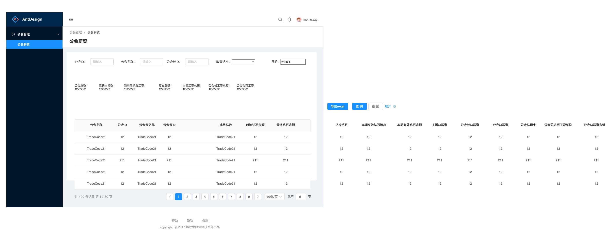

**功能描述：** 后台公会薪资页，按公会维度生成、预览、复核、确认和导出月度结算。它承接的是“整个月公会到底产出了多少流水、命中了什么政策、主播和公会长怎么分账、总账和分账是否对得上”的后台总账逻辑。  
**关键交互：** 运营/财务选择结算月份后，再选择该月份内的单月日期范围；系统汇总公会钻石流水、匹配政策、计算工资、拆余额池，生成结算快照，并支持下钻查看主播分账、公会长收益和扣减明细；日期筛选不允许跨月。

#### 前置条件

| 条件 | 处理规则 |
|---|---|
| 政策绑定有效 | 公会在当前结算周期存在有效政策绑定快照，或按默认自由政策规则进入结算 |
| 日期筛选合法 | 日期筛选只允许选择单月范围；开始日期和结束日期必须落在同一个自然月内 |
| 数据已汇总 | 当前周期钻石流水、主播归属、有效天、预支和风控结果已完成汇总 |
| 高档先复核 | 高档非自由政策结算必须先完成风控复核 |
| 快照不可改写 | 结算确认前可预览和复核；结算确认后只能查看快照，不允许直接改历史结果 |

#### 字段与数据来源

##### 筛选项

| 字段 | 说明 | 数据来源 |
|---|---|---|
| 公会ID | 按公会ID查询目标公会 | 公会资料 |
| 公会名称 | 按公会名称查询目标公会 | 公会资料 |
| 公会长ID | 按公会长ID查询公会 | 公会关系 / 用户资料 |
| 结算月份 | 按结算自然月查询目标公会薪资 | 结算周期配置 / 结算快照 |
| 结算日期范围 | 选择该结算月份内的开始日期和结束日期；仅允许单月内查询 | 结算周期配置 / 用户输入 |
| 国家 | 按国家筛选公会 | 公会资料 |
| 政策结构 | 按公会当前政策结构筛选 | 政策绑定快照 |

##### 列表字段

| 字段 | 业务定义 | 计算方式 / 取值规则 | 数据来源 |
|---|---|---|---|
| 公会ID | 当前被结算公会的唯一编号 | 直接读取，不参与金额计算 | 公会资料 |
| 公会名称 | 当前被结算公会的名称 | 直接读取，不参与金额计算 | 公会资料 |
| 公会长ID | 当前公会绑定的公会长账号ID | 读取当前有效公会关系 | 公会关系 / 用户资料 |
| 国家 | 当前公会所属国家或运营国家维度 | 直接读取，不参与金额计算 | 公会资料 |
| 政策结构 | 当前结算使用的政策结构 | 读取当期绑定快照；原型命名为“政策结构”，文档定义为当前公会结算采用的政策类型/结构 | 政策绑定快照 |
| 公会总数 | 当前查询条件下汇总的公会数量 | 按当前筛选条件统计公会条数；若为单公会查询则通常为1 | 公会资料 / 查询结果 |
| 活跃主播数 | 当前公会当期进入有效结算范围的主播数量 | 统计当期存在有效钻石流水或有效结算记录的主播数 | 主播结算明细 / 钻石流水快照 |
| 当前周赠总工资 | 当前周口径下已形成的工资总额摘要 | 原型字段名沿用“当前周赠总工资”；业务上定义为当前周赠送相关结算工资的汇总值，具体统计窗口按系统周结算口径读取 | 周结算统计 / 结算单 |
| 预支出总额 | 当前公会范围内已经支出的预支金额总和 | 汇总已发放预支记录；强调“已支出”而非待申请 | 预支记录 |
| 预支总额 | 当前公会范围内预支申请金额总和 | 汇总申请中、已通过、已发放等预支记录金额；如需区分状态，以详情或下钻页为准 | 预支记录 |
| 借支总额 | 当前公会范围内借支金额总和 | 汇总借支类资产操作或借支记录金额 | 资产操作记录 / 借支记录 |
| 主播工资总额 | 当期所有主播侧应发工资合计 | 自由政策：汇总主播分成工资；非自由政策：汇总各主播按各自当月钻石余额档位发放的基础薪资X和TG奖励Z，再叠加/扣减对应处理 | 主播结算明细 |
| 公会长工资总额 | 当期公会长侧应发工资合计 | 自由政策：汇总公会长分成；非自由政策：汇总所有主播按各自当月钻石流水档位形成的公会长奖励Y贡献，再叠加公会长本人兼主播收益 | 公会长收益明细 + 主播结算明细 |
| 公会会员工资 | 当前公会会员工资汇总结果 | 原型字段名沿用“公会会员工资”；业务上定义为公会内成员薪资汇总，可理解为主播侧成员工资盘子，明细以下钻结果为准 | 主播结算明细 |

##### 详情区块

| 字段 | 业务定义 | 说明 / 取值规则 | 数据来源 |
|---|---|---|---|
| 公会名称 | 当前详情对应的公会名称 | 直接读取，不参与计算 | 公会资料 |
| 公会ID | 当前详情对应的公会编号 | 直接读取，不参与计算 | 公会资料 |
| 公会长名称 | 当前公会绑定的公会长名称 | 读取当前有效公会关系和用户资料 | 公会关系 / 用户资料 |
| 公会长ID | 当前公会绑定的公会长账号ID | 读取当前有效公会关系 | 公会关系 / 用户资料 |
| 成员总数 | 当前公会成员总数 | 汇总当前有效成员数；用于和活跃主播数区分总成员盘子与活跃结算盘子 | 公会成员关系 |
| 起始钻石余额 | 当前结算周期开始时公会维度钻石余额 | 读取周期起点快照余额 | 钻石余额快照 |
| 最终钻石余额 | 当前结算周期结束时公会维度钻石余额 | 读取周期结束快照余额 | 钻石余额快照 |
| 兑换钻石 | 当前周期内发生的兑换钻石量 | 汇总该公会维度兑换类钻石变动 | 钻石流水 / 兑换记录 |
| 本期有效钻石流水 | 当前周期内参与结算的有效钻石流水 | 汇总有效主播的可结算钻石流水；冻结、拒付、无效流水不计入 | 钻石流水快照 |
| 本期有效钻石余额 | 当前周期结算前用于结算的有效钻石余额快照 | 读取有效钻石余额口径快照；结算完成后主播账户钻石余额会被清空，因此此处展示的是结算快照值，不是当前账户实时余额 | 钻石余额快照 |
| 主播总薪资 | 当前详情内所有主播侧工资合计 | 与列表字段口径一致；用于解释主播分账总盘子 | 主播结算明细 |
| 公会长总薪资 | 当前详情内公会长侧工资合计 | 与列表字段口径一致；用于解释公会长收益总盘子 | 公会长收益明细 + 主播结算明细 |
| 公会总薪资 | 当前公会当期工资总盘子 | 公会总薪资 = 主播总薪资 + 公会长总薪资（按当前口径展示结算后结果读取，不再重复扣减有效天、风控、预支） | 结算单 |
| 公会总预支 | 当前公会范围内已发生并待对冲的预支总额 | 汇总主播及公会长本人相关预支记录和当期对冲结果 | 预支记录 / 结算抵扣单 |
| 公会总金币工资奖励 | 当前公会内只能提现金币的工资总额 | 汇总主播和公会长各工资项拆分出的金币工资奖励部分 | 余额池快照 |
| 公会总薪资余额 | 当前公会维度工资型余额总额 | 汇总主播和公会长非金币工资奖励进入余额池后的剩余工资型余额 | 余额池快照 |
| 快照版本 | 本次结算读取的政策/绑定/关系快照版本 | 必须能追溯到政策版本、公会绑定快照、主播归属快照 | 结算快照 |
| 导出状态 | 当前结算单是否已导出、由谁导出、何时导出 | 便于财务和运营追溯历史导出操作 | 导出日志 |

#### 交互逻辑

1. 运营或财务先选择结算月份，再选择该月份内的日期范围、公会后，系统加载该公会当期结算草稿或历史结算记录。
2. 页面先展示公会总钻石流水、命中政策、总政策收益和 X/Y/Z 拆分结果。
3. 点击“查看主播分账”时，系统下钻到主播级结算列表，展示每位主播工资项、扣减项和余额池结果。
4. 点击“查看公会长收益”时，系统展示公会长管理收益、本人兼主播收益和余额池结果。
5. 点击“确认结算”前，系统要求完成必要的风控复核和预支对冲，并生成结算快照。

#### 系统后台核心逻辑

- 结算单生成时必须锁定政策版本、公会绑定、主播归属、流水和计算结果。
- 后台公会薪资页的日期筛选必须绑定结算月份，开始日期和结束日期只能落在同一个自然月；跨月选择直接拦截，不进入结算查询。
- 已确认结算快照不因后续政策、公会、主播归属变化自动重算。
- 高风险公会或高档政策结算必须先过风控复核。
- 结算确认后才能开放对应余额池提现。
- 总账页必须能追溯到主播分账和公会长收益，不能只保留一个总结果值。

#### 边界情况

|| 场景 | 处理规则 |
||---|---|
|| 日期范围跨月 | 不允许查询；提示“后台公会薪资仅支持单月范围查询，请重新选择同一自然月内日期” |
|| 公会无有效政策 | 只记录钻石流水，不生成政策工资 |
|| 高档政策未复核 | 只允许预览，不允许确认结算 |
|| 公会存在冻结主播 | 冻结主播部分按风控结论处理，不得自动并入正常分账 |
|| 历史结算导出后发现新问题 | 不能直接覆盖旧结果，应生成新复核记录或冲正链路 |

### 9.6 政策与分成管理

#### 功能说明

后台支持政策模板、公会政策绑定和主播分成比例管理。

#### 政策模板字段

| 字段 | 说明 | 是否必填 |
|---|---|---:|
| 政策名称 | 后台展示名称 | 是 |
| 政策类型 | 自由政策/非自由政策 | 是 |
| 适用对象 | 公会、公会名单、分层公会 | 是 |
| 生效时间 | 政策允许绑定开始时间 | 是 |
| 终止时间 | 政策失效时间，高档必须填 | 条件必填 |
| 档位表 | 非自由政策档位门槛和比例 | 非自由必填 |
| 固定分成比 | 自由政策分成比例 | 自由必填 |
| X/Y/Z | 非自由政策总收益拆分 | 非自由必填 |
| 金币工资奖励比例 | 工资中金币工资奖励占比 | 是 |
| 周期封顶 | 高档政策补贴上限 | 高档必填 |
| 风控规则组 | 绑定风控规则 | 是 |
| 政策状态 | 草稿、待启用、可绑定、使用中、已停用、历史版本 | 是 |
| 版本号 | 每次启用生成新版本 | 系统生成 |

#### 系统后台核心逻辑

- 使用中政策不允许直接改已生效版本，只能复制新版本。
- 结算读取绑定时的政策快照。
- X + Y + Z 必须等于 100%。
- 高档政策必须配置名单、周期、封顶和高级风控规则。

### 9.7 后台提现审核

#### 对应原型

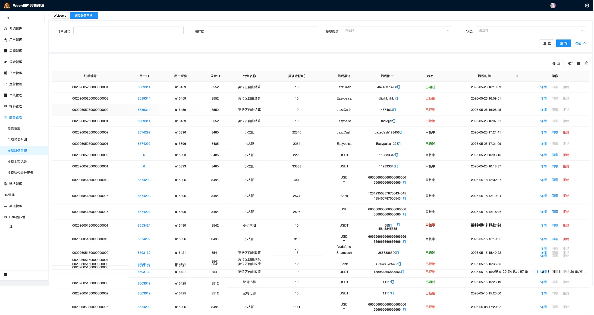

**功能描述：** 后台提现审核页，用于处理待审核提现申请，重点承接“这笔提现来自哪个角色、走哪个出口、用掉哪些余额池、审核通过后会扣哪里、驳回后退哪里”。它不是历史查询页，而是动作页。  
**关键交互：** 财务查看申请快照、余额池组合、提现出口、扣减顺序和收款信息后，执行通过或拒绝；通过后进入扣减和打款链路，拒绝后释放冻结金额。

#### 前置条件

| 条件 | 处理规则 |
|---|---|
| 申请已提交 | 提现申请已由客户端提交，并生成提现申请快照 |
| 金额已锁定 | 申请金额对应余额池已被冻结或锁定，防止重复提交消耗同一余额 |
| 审核权限 | 财务审核人具备提现审核权限 |
| 出口合规 | 提现出口必须符合角色和余额池规则，如金币奖励余额不能提现现金 |

#### 字段与数据来源

##### 筛选项

| 字段 | 说明 | 数据来源 |
|---|---|---|
| 提现单号 | 精确查询提现申请 | 提现申请 |
| 用户ID/昵称 | 查询申请人 | 用户资料/提现申请 |
| 角色 | 主播/公会长 | 提现申请 |
| 提现出口 | 金币/现金/提现给公会长 | 提现申请 |
| 状态 | Waiting、Approved、Rejected、打款失败、已回滚 | 提现申请 |
| 申请时间 | 按提交时间筛选 | 提现申请 |

##### 审核区块字段

| 字段 | 说明 | 数据来源 |
|---|---|---|
| 提现单号 | 当前审核申请编号 | 提现申请 |
| 申请人信息 | 申请人ID、昵称、角色、公会信息 | 提现申请/用户资料 |
| 提现金额 | 本次申请金额 | 提现申请 |
| 所选余额池 | 本次使用的余额池组合 | 提现申请快照 |
| 扣减顺序 | 余额池扣减规则 | 提现申请快照 |
| 提现方式 | 外部渠道或内部转账 | 提现申请 |
| 收款账号/收款人 | 外部账号或公会长 | 提现申请 |
| 手续费 | 渠道手续费 | 渠道配置/提现申请 |
| 实际到账金额 | 扣手续费后的到账金额 | 系统计算 |
| 审核意见 | 财务通过/拒绝意见 | 审核记录 |

#### 交互逻辑

**入口与初始化**
1. 财务进入提现审核页后，优先查看 Waiting 状态申请。
2. 点击某条申请时，系统展示申请快照、余额池组合、扣减顺序、出口类型和收款信息。

**审核处理**
3. 点击“通过”时，系统先校验余额池冻结状态，再进入扣减和打款链路。
4. 点击“拒绝”时，系统要求填写拒绝原因，并释放冻结金额。

**结果回写**
5. 审核完成后，系统回写审核状态、审核人、审核时间和后续打款状态。

#### 系统后台核心逻辑

- 审核前不得实际扣减余额池；提交申请时只允许冻结本次申请金额。
- 审核通过后先进入“审核通过待打款”中间态，再执行扣减和打款；若打款失败，必须回滚冻结或扣减结果。
- 审核驳回必须填写原因，并释放冻结金额。
- 所有提现申请必须记录申请时余额池快照和扣减顺序，方便财务追溯。
- 审核页只处理动作和申请快照，不作为历史明细沉淀页替代历史记录页。

#### 边界情况

| 场景 | 处理规则 |
|---|---|
| 余额池冻结丢失 | 禁止通过，进入异常处理 |
| 金币奖励余额申请现金提现 | 审核前即判定不合法，不允许通过 |
| 同一申请重复审核 | 使用申请状态和审核幂等控制，只允许一次有效审核结果 |
| 打款失败 | 进入失败回滚链路，恢复余额池或恢复冻结状态 |

### 9.8 后台提现记录

#### 对应原型

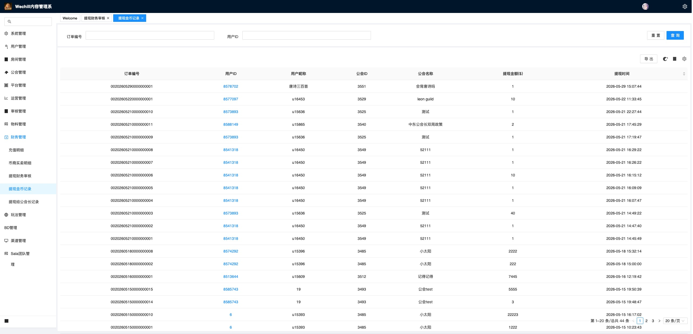

**功能描述：** 后台提现记录页，用于查看已提交提现申请的审核状态、打款状态、到账金额、失败回滚和快照信息。它承接的是“这笔提现后来怎么样了”，和审核页的“现在批不批”是两件事。  
**关键交互：** 财务按状态、用户、出口、时间筛选记录；查看每笔申请的所选余额池、扣减顺序、审核结果、打款结果和异常回滚情况。

#### 前置条件

| 条件 | 处理规则 |
|---|---|
| 历史记录可读 | 提现申请已生成历史记录和快照 |
| 审核链路存在 | 提现记录至少存在申请状态、审核状态或打款状态 |
| 查询权限 | 财务、运营、风控按权限读取对应范围记录 |
| 快照可回溯 | 历史记录必须可回看申请时的余额池、出口和扣减顺序 |

#### 字段与数据来源

##### 筛选项

| 字段 | 说明 | 数据来源 |
|---|---|---|
| 提现单号 | 精确查询历史申请 | 提现申请 |
| 用户ID/昵称 | 查询申请人 | 用户资料/提现申请 |
| 角色 | 主播/公会长 | 提现申请 |
| 提现出口 | 金币/现金/提现给公会长 | 提现申请 |
| 审核状态 | Waiting、Approved、Rejected | 审核记录 |
| 打款状态 | 待打款、成功、失败、已回滚 | 打款记录 |
| 时间范围 | 按申请、审核、打款时间筛选 | 提现申请/审核记录/打款记录 |

##### 列表字段

| 字段 | 说明 | 数据来源 |
|---|---|---|
| 提现单号 | 申请编号 | 提现申请 |
| 申请人信息 | 申请人ID、昵称、角色 | 提现申请/用户资料 |
| 提现金额 | 本次申请金额 | 提现申请 |
| 所选余额池 | 本次使用的余额池 | 提现申请快照 |
| 扣减顺序 | 余额池扣减规则 | 提现申请快照 |
| 提现方式 | 外部渠道或内部转账 | 提现申请 |
| 收款账号/收款人 | 外部账号或公会长 | 提现申请 |
| 手续费 | 渠道手续费 | 渠道配置/提现申请 |
| 实际到账金额 | 扣手续费后的到账金额 | 打款记录 |
| 审核状态 | 当前审核状态 | 审核记录 |
| 打款状态 | 当前打款状态 | 打款记录 |
| 审核人/审核时间 | 最近一次审核信息 | 审核记录 |

#### 交互逻辑

**入口与筛选**
1. 财务进入提现记录页后，可按申请人、出口、审核状态、打款状态、时间范围筛选历史记录。

**详情查看**
2. 点击某条记录时，系统展示申请快照、审核结果、打款结果和回滚记录。
3. 若记录为失败或回滚状态，系统展示失败原因和余额恢复结果。

**导出与复盘**
4. 导出记录时，系统按查询条件导出申请、审核、打款和快照字段。

#### 系统后台核心逻辑

- 提现记录页必须沉淀完整历史链路：申请快照、审核结果、打款结果、失败回滚结果。
- 审核状态和打款状态要分开存储，不能用一个字段混写。
- 历史记录读取的是当时快照，不能用当前余额池反推历史申请。
- 导出必须保留查询条件、导出时间和导出人，便于财务复盘和审计。

#### 边界情况

| 场景 | 处理规则 |
|---|---|
| 审核通过但打款失败 | 展示为打款失败或已回滚，不回退成 Waiting |
| 申请已驳回 | 保留驳回记录和驳回原因，不得物理删除 |
| 历史快照字段缺失 | 标记异常记录，禁止作为正常对账依据 |
| 多次重试打款 | 保留每次打款尝试和最终结果 |

### 9.9 后台提现到公会长记录

#### 对应原型

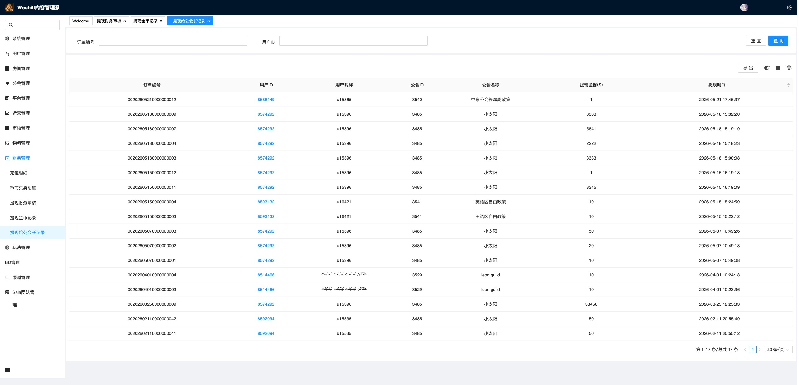

**功能描述：** 后台提现到公会长记录页，专门追踪主播转账给公会长的申请、审核和公会长侧入账结果。它不是普通提现记录的重复页，而是针对“主播工资转给公会长”这条专属链路做单独追溯。  
**关键交互：** 财务按主播、公会长、申请状态、审核状态查看记录；核对主播侧冻结金额、公会长侧主播转账余额入账结果和失败回滚记录。

#### 前置条件

| 条件 | 处理规则 |
|---|---|
| 申请类型明确 | 申请必须为“提现给公会长”出口 |
| 主播与公会长关系有效 | 提交申请时必须存在有效公会关系或允许的历史结算关系 |
| 金额冻结有效 | 主播侧申请金额已冻结或锁定 |
| 公会长账户有效 | 审核通过前必须确认目标公会长账户可入账 |

#### 字段与数据来源

##### 筛选项

| 字段 | 说明 | 数据来源 |
|---|---|---|
| 提现单号 | 精确查询申请 | 提现申请 |
| 主播ID/昵称 | 查询发起主播 | 用户资料/提现申请 |
| 公会长ID/昵称 | 查询接收方公会长 | 用户资料/提现申请 |
| 状态 | Waiting、Approved、Rejected、打款失败、已回滚 | 提现申请/审核记录/打款记录 |
| 申请时间 | 按提交时间筛选 | 提现申请 |

##### 列表字段

| 字段 | 说明 | 数据来源 |
|---|---|---|
| 提现单号 | 申请编号 | 提现申请 |
| 主播信息 | 发起主播ID、昵称 | 用户资料/提现申请 |
| 公会长信息 | 接收方公会长ID、昵称 | 用户资料/提现申请 |
| 申请金额 | 本次转账金额 | 提现申请 |
| 主播侧扣减余额池 | 主播使用的余额池 | 提现申请快照 |
| 审核状态 | 当前审核状态 | 审核记录 |
| 公会长入账状态 | 是否已入账主播转账余额 | 入账记录 |
| 回滚状态 | 失败后是否已回滚 | 回滚记录 |
| 审核人/审核时间 | 最近一次审核信息 | 审核记录 |

#### 交互逻辑

**入口与筛选**
1. 财务进入提现到公会长记录页后，可按主播、公会长、时间和状态查询记录。

**详情查看**
2. 点击某条申请时，系统展示主播侧余额池扣减信息、公会长侧目标账户信息和申请快照。

**审核与结果**
3. 审核通过后，系统将金额入账到公会长主播转账余额。
4. 审核失败或入账失败时，系统释放或回滚主播冻结金额，并记录失败原因。

#### 系统后台核心逻辑

- 提现给公会长审核通过后，金额必须入账公会长主播转账余额，而不是公会长个人薪资余额。
- 审核失败时，系统释放主播侧冻结金额，不得产生半扣减半入账的脏状态。
- 公会长侧入账结果必须可追溯到主播原始申请和申请快照。
- 该页面必须单独保留“主播→公会长”链路，不可与普通金币/现金提现混为一谈。

#### 边界情况

| 场景 | 处理规则 |
|---|---|
| 公会长账户异常 | 禁止入账，申请进入失败处理 |
| 主播申请已冻结但审核失败 | 释放主播侧冻结金额 |
| 入账成功后历史关系变化 | 不影响已入账历史记录 |
| 重复入账风险 | 使用申请状态和入账幂等控制，只允许一次有效入账 |

### 9.10 后台预支管理

#### 功能说明

第一期预支由后台运营发起，支持预支给本人和预支给他人。

#### 发起字段

| 字段 | 说明 | 必填 |
|---|---|---:|
| 预支人ID | 债务归属用户 | 是 |
| 预支类型 | 预支给本人/预支给他人 | 是 |
| 收款人ID | 预支给他人时填写 | 条件必填 |
| 预支金额 | 本次预支金额 | 是 |
| 到账货币 | 发放的货币类型 | 是 |
| 到账数量 | 实际发放数量 | 是 |
| 预支原因 | 后台操作说明 | 是 |

#### 预支流程图

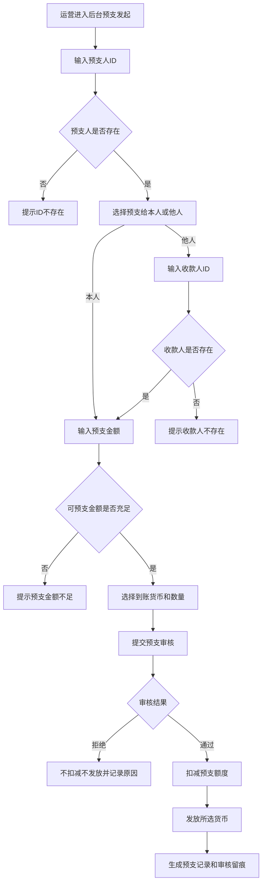
```mermaid
flowchart TD
    A[运营进入后台预支发起] --> B[输入预支人ID]
    B --> C{预支人是否存在}
    C -->|否| D[提示ID不存在]
    C -->|是| E[选择预支给本人或他人]
    E -->|本人| F[输入预支金额]
    E -->|他人| G[输入收款人ID]
    G --> H{收款人是否存在}
    H -->|否| I[提示收款人不存在]
    H -->|是| F
    F --> J{可预支金额是否充足}
    J -->|否| K[提示预支金额不足]
    J -->|是| L[选择到账货币和数量]
    L --> M[提交预支审核]
    M --> N{审核结果}
    N -->|拒绝| O[不扣减不发放并记录原因]
    N -->|通过| P[扣减预支额度]
    P --> Q[发放所选货币]
    Q --> R[生成预支记录和审核留痕]
```

#### 系统后台核心逻辑

- 预支发起成功仅生成待审核记录。
- 审核通过后才扣减预支额度和发放货币。
- 预支债务挂预支人本人，不挂收款人。
- 月结时对冲预支人当期工资，不扣收款人工资。

### 9.11 用户资产操作

#### 对应原型

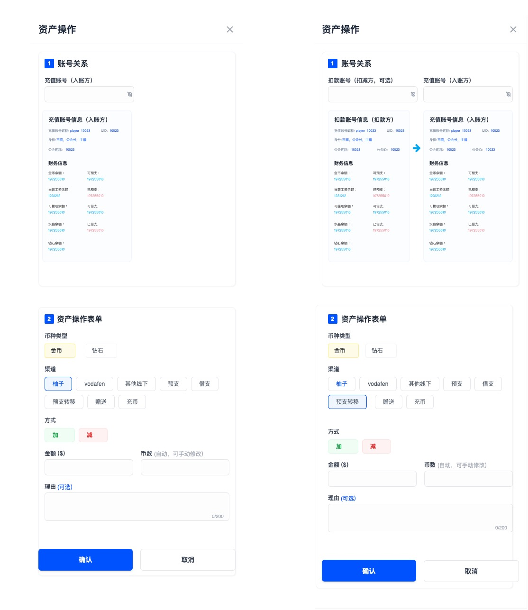

**功能描述：** 后台用户资产操作页，用于对用户资产做单边加减、双账号划转和预支/借支/线下处理。这个模块承接的是“平台主动改用户资产”这类强后台动作，因此重点不是表单长什么样，而是操作会影响哪些余额、哪些历史链路、如何留痕。  
**关键交互：** 操作人先确认账号关系和资产快照，再选择币种、渠道、加减方式、金额和理由，提交后系统写入资产快照和审计日志；高风险动作需二次确认。

#### 前置条件

| 条件 | 处理规则 |
|---|---|
| 操作权限 | 操作人具备资产操作权限，高风险资产操作需二次确认或高级权限 |
| 账号有效 | 扣款账号、充值账号必须能检索到有效用户；双账号划转时两者都必须确认 |
| 余额预览 | 提交前必须展示操作前余额、预计操作后余额、币种、渠道和原因 |
| 敏感操作依据 | 减资产、借支、预支转移、线下处理、赠送等敏感操作必须记录审批或操作依据 |

#### 字段与数据来源

##### 表单字段

| 字段 | 类型 | 必填 | 说明 |
|---|---|---:|---|
| 扣款账号 | 用户选择/搜索 | 否 | 双账号划转时作为扣减方 |
| 充值账号 | 用户选择/搜索 | 是 | 入账方 |
| 扣款账号信息 | 系统展示 | 否 | 昵称、UID、身份、公会、余额等 |
| 充值账号信息 | 系统展示 | 是 | 昵称、UID、身份、公会、余额等 |
| 币种类型 | 单选 | 是 | 金币/钻石 |
| 渠道 | 单选 | 是 | 柚子、vodafen、其他线下、预支、借支、预支转移、赠送、充币 |
| 方式 | 单选 | 是 | 加/减 |
| 金额 | 数字输入 | 是 | 美元金额或业务金额 |
| 币数 | 数字输入 | 是 | 自动换算，可手动修改 |
| 理由 | 文本 | 建议必填 | 操作原因，最多200字 |

##### 快照字段

| 字段 | 说明 | 数据来源 |
|---|---|---|
| 操作前余额 | 提交前账户余额 | 资产账户 |
| 预计操作后余额 | 本次操作后的余额预估 | 系统计算 |
| 操作快照编号 | 本次操作快照唯一编号 | 资产操作快照 |
| 审批依据 | 高风险动作审批依据 | 审批记录/操作记录 |

#### 交互逻辑

1. 操作人进入资产操作页后，先选择充值账号，必要时选择扣款账号。
2. 系统加载双方账户摘要，展示当前余额、身份、公会等基础信息。
3. 操作人选择币种、渠道、方式、金额和理由后，系统即时校验组合是否合法。
4. 对敏感操作，系统弹出二次确认，提示可能影响结算、提现、预支或历史对账结果。
5. 提交成功后，系统生成资产操作快照和审计日志，再写入正式结果。

#### 系统后台核心逻辑

- 所有资产操作必须先生成操作快照，记录操作前余额、操作后余额、币种、渠道、金额和操作人。
- 双账号划转必须同时记录扣款方和入账方，不允许只记录入账结果。
- 预支、借支、预支转移类操作必须接入预支记录或资产审计链路，不能只改余额。
- 敏感操作提交后不可物理删除，只能通过反向调整或冲正记录修正。
- 资产操作产生的金币或钻石是否进入政策流水，必须按结算规则读取资产来源和用途配置；默认规则为：预支、借支、预支转移、赠送、线下处理、人工加钻石/金币均不直接计入政策流水，只有被明确配置为可计入结算口径的充值/兑换类来源才允许进入后续工资结算。

#### 边界情况

| 场景 | 处理规则 |
|---|---|
| 扣款账号余额不足 | 禁止提交，提示余额不足 |
| 双账号关系非法 | 禁止划转，提示账号关系不合法 |
| 渠道和币种组合非法 | 禁止提交，提示按后台配置选择合法组合 |
| 敏感操作缺审批依据 | 禁止提交，提示补充审批或操作依据 |

### 9.12 币商交易记录

#### 对应原型

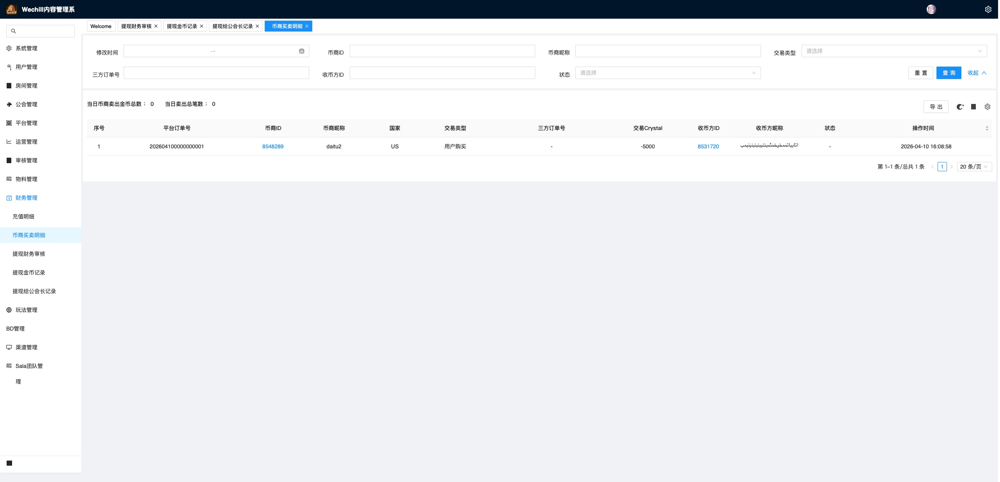

**功能描述：** 后台币商交易记录页，用于查询币商订单、金币来源、交易状态、对账金额和风控线索。它承接的是“这笔币商交易到底发生了什么、钱和币怎么流、能不能进后续风控和对账链路”，不是单纯订单流水表。  
**关键交互：** 支持按币商、用户、订单号、交易类型、状态、时间范围查询和导出；财务用于对账，风控用于关联高频、异常、退款和拒付线索。

#### 前置条件

| 条件 | 处理规则 |
|---|---|
| 数据已同步 | 币商交易数据已从充值/币商系统同步到后台 |
| 权限控制 | 查询人具备交易记录查看权限；导出需单独权限控制 |
| 状态可追溯 | 币商订单状态、支付状态、到账状态必须可追溯，不得只展示最终结果 |
| 链路可回溯 | 涉及结算和风控的交易记录必须能回溯到用户金币到账和送礼流水 |

#### 字段与数据来源

##### 筛选项

| 字段 | 说明 | 数据来源 |
|---|---|---|
| 订单号 | 查询唯一交易 | 币商交易记录 |
| 币商信息 | 按币商筛选 | 币商资料 |
| 用户信息 | 查询买方或相关用户 | 用户资料/交易记录 |
| 交易类型 | 买入/卖出/充值等 | 交易记录 |
| 状态 | 待处理、成功、失败、异常 | 交易记录 |
| 时间范围 | 按创建/完成时间筛选 | 交易记录 |

##### 列表字段

| 字段 | 说明 | 数据来源 |
|---|---|---|
| 订单号 | 交易唯一编号 | 币商交易记录 |
| 币商信息 | 币商ID/名称 | 币商资料 |
| 用户信息 | 买方或相关用户 | 用户资料/交易记录 |
| 币种/资产类型 | 金币、钻石等 | 交易记录 |
| 数量 | 交易数量 | 交易记录 |
| 单价 | 交易单价 | 交易记录 |
| 总金额 | 数量×单价 | 交易记录/系统计算 |
| 手续费 | 交易手续费 | 交易记录 |
| 交易类型 | 买入/卖出/充值等 | 交易记录 |
| 状态 | 待处理、成功、失败、异常 | 交易记录 |
| 创建时间 | 订单创建时间 | 交易记录 |
| 完成时间 | 交易完成时间 | 交易记录 |

##### 详情区块

| 字段 | 说明 | 数据来源 |
|---|---|---|
| 支付结果 | 支付结果与支付渠道摘要 | 交易记录/支付记录 |
| 到账结果 | 金币到账结果 | 交易记录/资产记录 |
| 风险线索 | 当前订单关联的风险标签 | 风控事件 |
| 导出记录 | 导出条件、导出时间、导出人 | 导出日志 |

#### 交互逻辑

1. 财务或风控进入币商交易记录页后，可按币商、用户、订单号、交易类型、状态、时间范围筛选订单。
2. 点击某条记录时，系统展示订单金额、到账结果、状态变化、支付结果和关联风险线索。
3. 点击导出时，系统按当前筛选条件导出记录，并记录导出人和导出时间。
4. 对异常或高频订单，风控可从详情进入关联复核链路。

#### 系统后台核心逻辑

- 币商交易记录用于辅助判断金币来源，但当前结算基础仍统一使用主播收礼后的钻石流水。
- 交易状态异常、退款、拒付或重复订单必须进入风控复核，不得直接参与结算放款。
- 币商交易导出必须保留查询条件、导出人和导出时间，便于财务对账。
- 同一用户、同一币商、同一时间窗口内异常高频交易，应形成风险线索并关联提现审核。
- 历史币商交易记录不得因后续用户归属、公会政策变更而重写。

#### 边界情况

| 场景 | 处理规则 |
|---|---|
| 订单状态异常 | 标记异常订单，不作为正常对账依据 |
| 到账成功但后续退款 | 进入风控复核和结算扣减链路 |
| 用户归属后续变化 | 不影响历史订单本身内容和时间戳 |
| 导出时筛选过宽 | 按权限限制导出范围，并记录导出日志 |

### 9.13 风控复核

#### 功能说明

风控复核用于处理异常流水、异常结算、异常提现和关联套利风险。

#### 风险事件字段

| 字段 | 说明 | 数据来源 |
|---|---|---|
| 风险等级 | 低/中/高/严重 | 风控规则 |
| 触发规则 | 命中的风控规则 | 风控扫描结果 |
| 涉及金额 | 风险影响金额 | 结算/提现/流水 |
| 涉及公会 | 风险关联公会 | 风控事件 |
| 涉及主播 | 风险关联主播 | 风控事件 |
| 涉及送礼用户 | 风险关联送礼账号 | 风控事件 |
| 证据 | 设备、IP、收款账户、充值批次、送礼关系、时间集中度 | 风控证据 |
| 处置结果 | 通过、扣减、冻结、终止、补材料 | 风控处理记录 |

#### 风控流程图

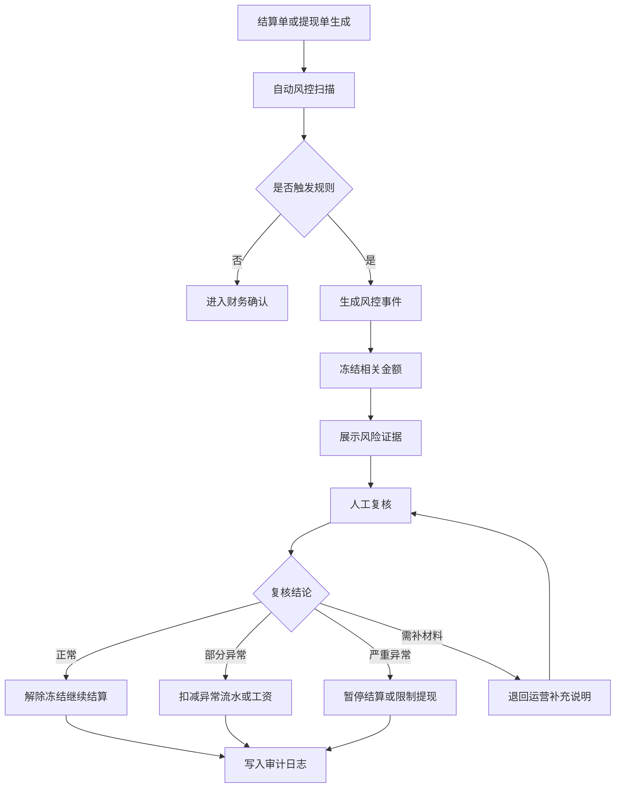
```mermaid
flowchart TD
    A[结算单或提现单生成] --> B[自动风控扫描]
    B --> C{是否触发规则}
    C -->|否| D[进入财务确认]
    C -->|是| E[生成风控事件]
    E --> F[冻结相关金额]
    F --> G[展示风险证据]
    G --> H[人工复核]
    H --> I{复核结论}
    I -->|正常| J[解除冻结继续结算]
    I -->|部分异常| K[扣减异常流水或工资]
    I -->|严重异常| L[暂停结算或限制提现]
    I -->|需补材料| M[退回运营补充说明]
    M --> H
    J --> N[写入审计日志]
    K --> N
    L --> N
```

### 9.14 审计日志与快照中心

#### 功能说明

审计日志和快照中心用于支撑财务对账、客服争议处理、风控追溯和历史重算审查。

#### 快照类型

| 快照类型 | 记录内容 | 产生时机 |
|---|---|---|
| 政策快照 | 政策版本、档位、比例、X/Y/Z、金币工资奖励比例 | 政策绑定或结算生成 |
| 公会绑定快照 | 公会、政策、开始结束时间、审批信息 | 公会绑定政策时 |
| 主播归属快照 | 主播、公会、加入/离会/移除时间 | 主播关系变更时 |
| 结算快照 | 流水、工资项、扣减、预支、余额池 | 月度结算生成时 |
| 提现申请快照 | 余额池余额、提现出口、扣减顺序、金额、账户 | 提交提现申请时 |
| 资产操作快照 | 操作前后余额、币种、渠道、金额、原因 | 后台资产操作提交时 |
## 十、核心状态机

### 10.1 提现状态机

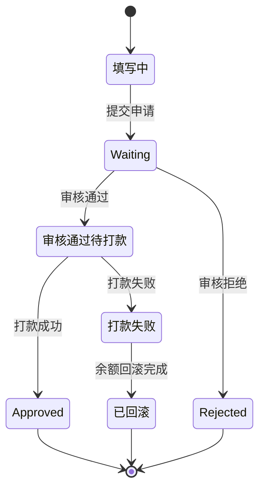
```mermaid
stateDiagram-v2
    [*] --> 填写中
    填写中 --> Waiting: 提交申请
    Waiting --> 审核通过待打款: 审核通过
    Waiting --> Rejected: 审核拒绝
    审核通过待打款 --> Approved: 打款成功
    审核通过待打款 --> 打款失败: 打款失败
    打款失败 --> 已回滚: 余额回滚完成
    Approved --> [*]
    Rejected --> [*]
    已回滚 --> [*]
```

### 10.2 预支状态机

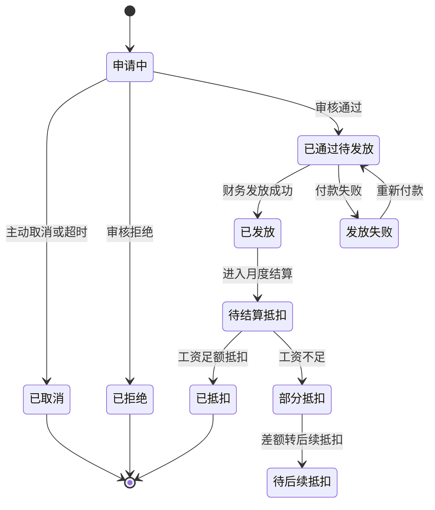
```mermaid
stateDiagram-v2
    [*] --> 申请中
    申请中 --> 已取消: 主动取消或超时
    申请中 --> 已拒绝: 审核拒绝
    申请中 --> 已通过待发放: 审核通过
    已通过待发放 --> 已发放: 财务发放成功
    已通过待发放 --> 发放失败: 付款失败
    发放失败 --> 已通过待发放: 重新付款
    已发放 --> 待结算抵扣: 进入月度结算
    待结算抵扣 --> 已抵扣: 工资足额抵扣
    待结算抵扣 --> 部分抵扣: 工资不足
    部分抵扣 --> 待后续抵扣: 差额转后续抵扣
    已拒绝 --> [*]
    已取消 --> [*]
    已抵扣 --> [*]
```

### 10.3 主播公会关系状态机

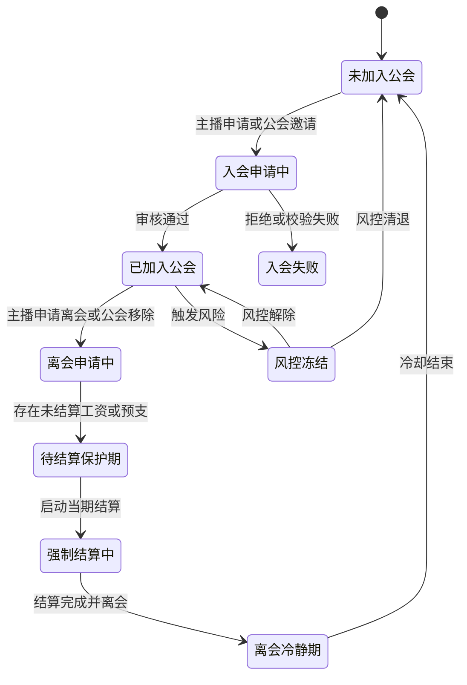
```mermaid
stateDiagram-v2
    [*] --> 未加入公会
    未加入公会 --> 入会申请中: 主播申请或公会邀请
    入会申请中 --> 已加入公会: 审核通过
    入会申请中 --> 入会失败: 拒绝或校验失败
    已加入公会 --> 离会申请中: 主播申请离会或公会移除
    离会申请中 --> 待结算保护期: 存在未结算工资或预支
    待结算保护期 --> 强制结算中: 启动当期结算
    强制结算中 --> 离会冷静期: 结算完成并离会
    离会冷静期 --> 未加入公会: 冷却结束
    已加入公会 --> 风控冻结: 触发风险
    风控冻结 --> 已加入公会: 风控解除
    风控冻结 --> 未加入公会: 风控清退
```

---

## 十一、待产品确认点

| 编号 | 待确认点 | 影响模块 | 建议默认值 |
|---|---|---|---|
| C1 | 客户端 `Other` 页签在原型中存在命名歧义 | 提现首页、提现记录、余额池展示 | 当前按“其他提现/内部转账”理解，但原型示例命名不作为最终需求依据 |
| C2 | 原型中金币汇率出现 `1$=1100 Coins` 与 `1$=11000 Coins` 的差异 | 提现金币、金币奖励工资明细、后台配置 | 以后台汇率配置为唯一需求依据，原型示例数字不作为需求口径 |
| C3 | 公会长端“主播收入金额/主播转入金额”是否等同于业务建模中的“主播转账余额” | 公会长提现、余额池、历史快照 | 建议统一命名为“主播转账余额” |
| C5 | `公会长私薪资` 的正式命名 | 薪资页面、结算单、历史明细 | 建议统一为“公会长管理收益” |
| C8 | 入会申请是否允许公会长主动邀请主播 | 加入公会、入会申请管理 | 建议支持邀请，但主播必须确认 |

---

## 十二、源材料覆盖核对

| 源材料 | 覆盖章节 |
|---|---|
| `TALO公会政策_产品视角功能层业务建模.md` | 全局业务规则、政策、钻石流水、结算、预支、提现、风控、边界、权限 |
| `TALO公会政策_客户端后台功能结构脑图.xmind` | 端口结构、客户端模块、后台模块、数据对象、流程、待确认点 |
| `公会入口.jpg` | 5.1 主播端首页 / 公会入口、6.1 公会长端首页 / 公会入口 |
| `加入公会.jpg` | 5.2 加入公会 |
| `主播申请管理.jpg` | 6.2 入会申请管理（公会长） |
| `薪资页面.jpg` / `薪资页面_1.jpg` | 5.3 主播本人薪资页、6.3 公会长薪资数据页、6.4 公会薪资数据页 |
| `历史结算记录.jpg` / `历史结算记录_1.jpg` | 5.7 历史结算记录（主播视角）、6.7 历史结算记录（公会长视角） |
| `主播提现总流程.jpg` | 5.4 主播提现中心 |
| `公会长提现总流程.jpg` | 6.6 公会长提现中心 |
| `公会长提现-提现为金币.jpg` / `_1.jpg` | 5.4 主播提现中心、6.6 公会长提现中心 |
| `公会长提现-提现为现金.jpg` / `_1.jpg` | 5.4 主播提现中心、6.6 公会长提现中心 |
| `提现给公会长.jpg` | 5.4 主播提现中心 |
| `提现记录.jpg` | 5.4 主播提现中心 |
| `金币奖励工资明细.jpg` | 5.5 金币奖励工资明细 |
| `预支记录.jpg` | 5.6 预支记录 |
| `主播管理.jpg` | 6.5 主播管理（公会长） |
| `后台-公会管理.jpg` | 9.2 公会管理 |
| `后台-主播列表.jpg` | 9.3 主播列表 |
| `后台-主播薪资.jpg` | 9.4 主播薪资 |
| `后台-公会薪资.jpg` | 9.5 公会薪资 |
| `后台-提现.jpg` / `后台-提现记录.jpg` / `后台-提现到公会长记录.jpg` | 9.7 提现审核与记录 |
| `后台-用户资产操作.jpg` | 9.9 用户资产操作 |
| `后台-币商交易记录.jpg` | 9.10 币商交易记录 |

---

## 十三、逻辑暗坑审计结论

| 编号 | 类型 | 风险点 | 当前处理 |
|---|---|---|---|
| G1 | 金钱口径 | 页面汇总可提现金额容易被误当成可直接提现金额 | PRD明确提现申请页必须拆余额池 |
| G2 | 预支对冲 | 若金币工资奖励也用于预支，会造成金币奖励被现金债务吃掉 | PRD明确只允许非金币工资奖励对冲 |
| G3 | 双身份 | 公会长本人作为主播时，主播收入和管理收益容易混算 | PRD明确两条链路分别计算，页面可合并展示 |
| G4 | 离会边界 | 未结算直接离会会导致工资和预支债务悬空 | PRD明确强制先结算再离会 |
| G5 | 历史追溯 | 当前政策变更后可能误重算历史工资 | PRD明确历史读取结算快照 |
| G6 | 提现失败 | 审核通过但打款失败若无回滚会造成余额丢失 | PRD明确打款失败需回滚并留痕 |
| G7 | 汇率冲突 | 原型内金币汇率示例不一致 | PRD列为待确认，建议以后台配置为准 |
| G8 | 资产操作 | 后台人工加减资产高风险 | PRD明确二次确认、余额校验、前后余额快照、审计日志 |

---

## 十四、交付结论

本 PRD 已将客户端和后台拆成两套产品结构，但工资、预支、提现、余额池和历史快照按同一条业务资金链闭环。

开发和测试最需要盯死的主链路是：

```text
钻石流水 → 政策结算 → 工资项拆分 → 预支对冲 → 余额池 → 提现申请 → 后台审核 → 打款/驳回/回滚 → 历史快照
```

任何一个环节偷懒，都会导致主播、公会长、财务、客服和风控互相甩锅。

