# TALO公会政策｜客户端与后台需求文档 PRD

生成时间：2026-06-12  
文档版本：V1.0  
输入材料：
- 业务建模：`TALO公会政策_产品视角功能层业务建模.md`
- 功能结构脑图：`TALO公会政策_客户端后台功能结构脑图.xmind`
- 原型图目录：`/Users/mac/心音跳动/TOPKHLIJ/原型图`

> 本文档按客户端与后台两条产品线拆开描述，但工资、预支、提现、余额池、历史快照必须按同一条资金链闭环理解。  

---

## 一、产品背景与目标

### 1.1 产品背景


当前业务同时存在：

| 业务对象 | 说明 |
|---|---|
| 公会 | 平台合作组织主体，负责招募和管理主播 |
| 公会长 | 公会经营者，拥有管理收益、主播转入薪资余额和本人主播收益 |
| 主播 | 收礼、产生钻石流水、获得工资和金币工资奖励 |
| 送礼用户 | 充值金币并送礼，形成主播钻石流水 |
| 运营 | 配置政策、处理绑定、发起后台预支、协助结算 |
| 财务 | 审核结算、审核提现、处理付款和对账 |

### 1.2 产品目标

| 目标 | 说明 |
|---|---|
| 支撑公会政策落地 | 支持自由政策和非自由政策两套结算模式 |
| 支撑主播与公会长薪资透明展示 | 客户端可查看流水、工资项、预支扣减、余额池、历史结算 |
| 支撑多出口提现 | 支持提现金币、提现现金、主播提现给公会长等不同出口 |

### 1.3 产品范围

| 范围 | 是否包含 | 说明 |
|---|---:|---|
| 客户端公会入口 | 是 | 主播/公会长进入公会相关功能 |
| 客户端入会申请 | 是 | 主播申请加入公会，公会长处理申请 |
| 客户端薪资数据 | 是 | 主播、公会长、公会维度工资展示 |
| 客户端提现 | 是 | 金币、现金、提现给公会长等流程 |
| 客户端预支记录 | 是 | 第一期客户端仅展示预支记录，不默认开放自助申请 |
| 后台公会/主播管理 | 是 | 公会、主播、归属、状态、申请处理 |
| 后台政策与结算 | 是 | 政策模板、公会绑定、主播分成、月度结算 |
| 后台提现审核 | 是 | 提现申请审核、打款、驳回、失败回滚 |
| 后台用户资产操作 | 是 | 人工加减资产、预支/借支/赠送/充币等操作 |
| 后台币商交易记录 | 是 | 币商交易查询和对账 |
| 完整财务付款系统 | 部分 | 本 PRD 定义审核和状态流，具体付款通道对接另行补充 |

---

## 二、核心业务模型

### 2.1 一句话业务模型

```text
用户充值金币 → 用户送礼 → 主播收礼形成钻石流水 → 公会政策结算 → 工资项拆分 → 预支对冲 → 余额池生成 → 主播/公会长提现 → 后台审核打款 → 快照审计追溯
```

### 2.2 端口划分

| 端口 | 使用角色 | 核心任务 |
|---|---|---|
| 客户端 | 主播、公会长、公会代理/协作者 | 入会、查看薪资、管理主播、发起提现、查看历史和预支记录 |

### 2.3 核心业务闭环图

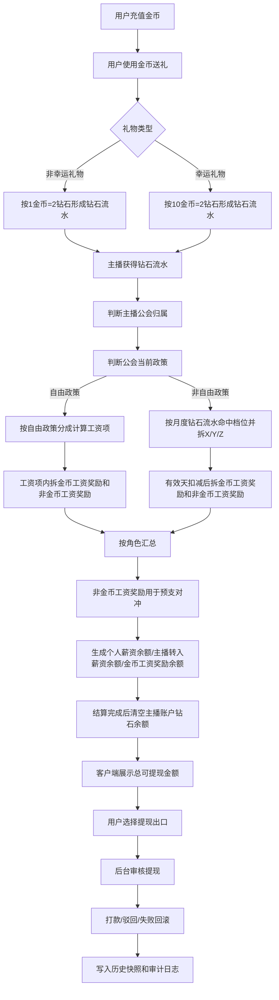

### 2.3A 核心业务流程图补充

#### 2.3A.1 一级货币到工资的完整链路

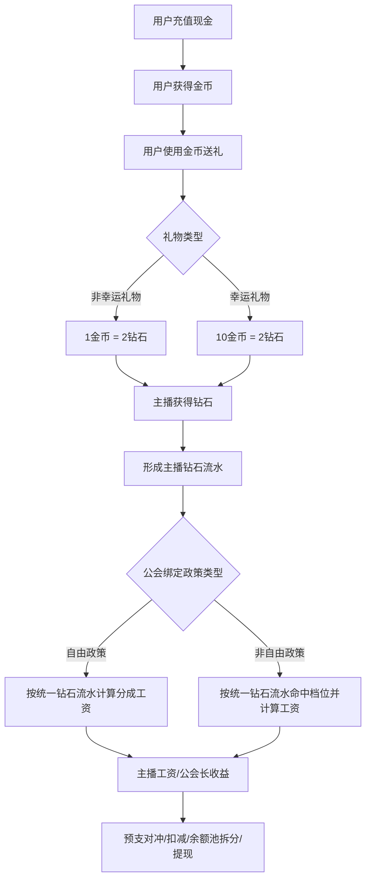

#### 2.3A.2 钻石流水生成流程


#### 2.3A.3 提现出口选择流程

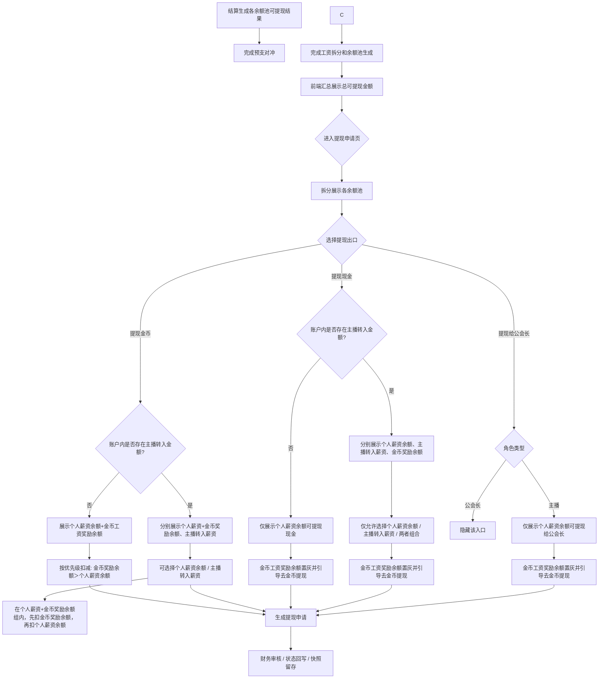

#### 2.3A.4 非自由政策月度结算流程

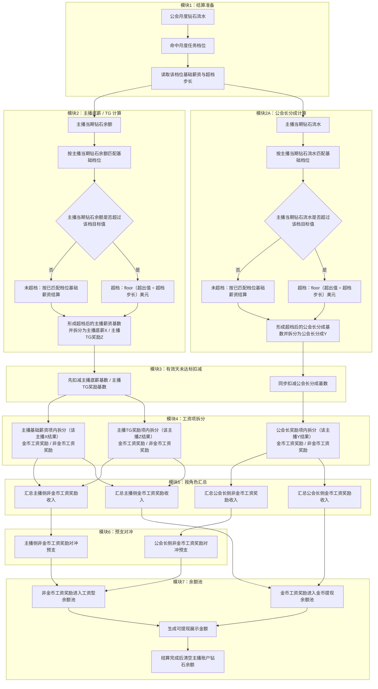

#### 2.3A.5 自由政策月度结算流程

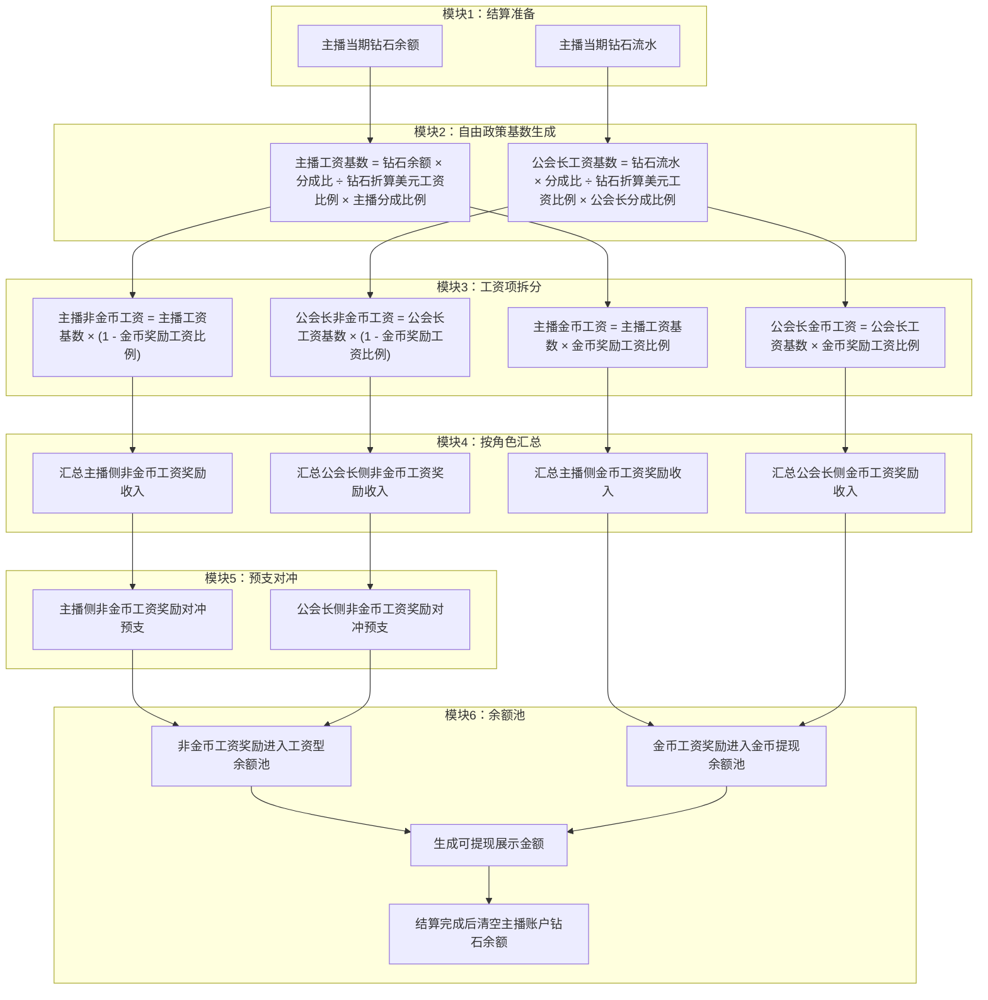

### 2.4 角色权限总览

| 功能/操作 | 主播 | 公会长 | 公会长本人作为主播 | 运营 | 财务 |  |
|---|---|---|---|---|---|---|
| 申请加入公会 | 可 | 不适用 | 可 | 查看/协助 | - | 查看风险 |
| 审核入会申请 | - | 可 | 作为公会长可 | 可协助 | - | 查看风险 |
| 查看本人薪资 | 可 | 可 | 可 | 查看 | 查看 | 查看 |
| 查看公会薪资 | - | 可 | 作为公会长可 | 查看 | 查看 | 查看 |
| 修改本人政策 | 每月1号可 | 不可替他人 | 按主播本人规则 | 后台处理 | - | - |
| 修改主播分成比例 | 不可 | 每月1号可 | 作为公会长可改他人 | 后台处理 | - | - |
| 发起提现金币 | 可 | 可 | 可 | 查看 | 审核/付款 | 风险复核 |
| 发起提现现金 | 可 | 可 | 可 | 查看 | 审核/付款 | 风险复核 |
| 提现给公会长 | 可 | 不可见 | 作为主播可 | 查看 | 审核 | 风险复核 |
| 发起预支 | 第一期不可 | 第一期不可 | 第一期不可 | 可后台发起 | 审核/发放 | 风险复核 |
| 资产操作 | - | - | - | 可按权限 | 可按权限 | 查看/冻结 |
| 月度结算确认 | - | 查看 | 查看 | 生成/复核 | 确认 | 复核/冻结 |

---

## 三、全局业务规则

### 3.1 政策类型规则

| 政策类型 | 业务定位 | 结算基础 | 结算方式 | 关键限制 |
|---|---|---|---|---|
| 自由政策 | 默认公开基础政策 | 主播月度有效钻石余额 + 政策流水快照 | 主播工资按有效钻石余额和固定分成比例换算；公会长收益按政策流水口径计算 | 同样需要拆金币工资奖励/非金币工资奖励，并进入预支对冲和余额池 |
| 非自由政策 | 战略公会/月度任务政策 | 公会月度钻石流水 | 命中档位后形成公会总政策收益，再按单个主播的X/Y/Z规则发放和汇总；若主播实际流水/余额超过命中档位目标值，则按超档规则计算超档增量 | 结算快照 |

#### 3.1.1 自由政策钻石换算美元工资规则

| 规则项 | 规则 |
|---|---|
| 钻石折算美元工资比例 | 钻石折算美元工资比例 = 每 1 USD 对应钻石数；当前政策示例中 `1 USD = 1500 金币`、`1 金币 = 2 钻石`，因此 `1 USD = 3000 钻石` |
| 主播非金币工资 | 主播非金币工资 = 钻石余额 × 分成比 ÷ 钻石折算美元工资比例 × 主播分成比例 × (1 - 金币奖励工资比例) |
| 主播金币工资 | 主播金币工资 = 钻石余额 × 分成比 ÷ 钻石折算美元工资比例 × 主播分成比例 × 金币奖励工资比例 |
| 公会长非金币工资 | 公会长非金币工资 = 钻石流水 × 分成比 ÷ 钻石折算美元工资比例 × 公会长分成比例 × (1 - 金币奖励工资比例) |
| 公会长金币工资 | 公会长金币工资 = 钻石流水 × 分成比 ÷ 钻石折算美元工资比例 × 公会长分成比例 × 金币奖励工资比例 |
| 角色总工资 | 主播总工资 = 主播非金币工资 + 主播金币工资；公会长总工资 = 公会长非金币工资 + 公会长金币工资 |
| 示例说明 | 若钻石余额和钻石流水同为 300,000，钻石折算美元工资比例为 3000，分成比为 102%，主播分成比例80%、公会长分成比例20%，则主播总工资81.6 USD、公会长总工资20.4 USD；再按金币奖励工资比例拆入不同余额池 |
| 后续拆分 | 非金币工资进入工资型余额池，可用于现金提现和预支对冲；金币工资进入金币提现余额池，不得用于现金提现、提现给公会长或预支对冲 |
| 快照要求 | 结算快照必须记录钻石余额、钻石流水、钻石折算美元工资比例、分成比、主播分成比例、公会长分成比例、金币奖励工资比例和四项拆分结果 |

#### 3.1.1A 非自由政策超档规则

| 规则项 | 规则 |
|---|---|
| 适用范围 | 仅适用于非自由政策；自由政策仍按固定分成比结算，不走超档追加 |
| 命中方式 | 先按主播当期流水或余额命中基础档位；若实际值刚好达到下一档目标值，则直接按下一档结算 |
| 超档口径 | 非自由政策下，超档判断必须发生在 X/Y/Z 拆分之前；主播底薪X/主播TG奖励Z先按主播当期钻石余额判断是否超档，公会长分成Y先按主播当期钻石流水判断是否超档 |
| 超档公式 | 超档增量 = floor((实际值 - 当前档目标值) / 超档步长) 美元 |
| 总薪资基数 | 总薪资基数 = 当前档基础薪资 + 超档增量 |
| X/Y/Z拆分口径 | 先形成超档后的薪资基数，再拆分为 X/Y/Z：主播当期钻石余额形成的超档后薪资基数拆为主播底薪X和主播TG奖励Z；主播当期钻石流水形成的超档后薪资基数拆为公会长分成Y |
| 快照要求 | 结算快照必须记录：命中档位、目标值、实际值、超出值、超档步长、超档增量、总薪资基数、X/Y/Z拆分结果 |

**示例说明：**

- 主播流水/余额命中 13 档，13 档目标值为 `20000`，该档基础薪资为 `10$`。
- 13 档配置的超档规则为：超档步长为 `1000`。
- 主播实际达到 `21000`，则超出部分为 `1000`。
- 超档增量 = `floor(1000 / 1000) 美元 = 1$`。
- 总薪资基数 = `10$ + 1$ = 11$`。
- 各角色实际到手按总薪资基数拆分：
  - 主播底薪 = `11$ × x`
  - 主播TG奖励 = `11$ × z`
  - 公会长分成 = `11$ × y`

#### 3.1.1B 政策修改规则

| 规则项 | 规则 |
|---|---|
| 主播修改本人政策 | 主播含公会长本人作为主播，仅可修改本人政策 |
| 公会长修改主播政策 | 公会长不能替主播修改其本人政策 |
| 公会长修改主播政策 | 公会长可对每个主播的公会政策进行调整 |
| 公会政策调整规则 | 公会长对每个主播最多可调整3次，且每个月只能调整1次 |
| 普通政策主播薪资比例 | 公会长对每个普通政策主播每3个月可调整1次，且必须在每个月1号操作 |
| 可修改时间 | 仅每月1号可修改政策或分成比例 |
| 修改次数 | 同一自然月内本人政策最多修改1次；公会政策调整每个主播总计最多3次且每月最多1次；普通政策主播薪资比例每3个月最多调整1次 |
| 生效方式 | 当月1号修改成功后，当月按最新一次有效修改结果执行 |
| 留痕要求 | 记录修改前值、修改后值、操作人、操作对象、操作时间、所属自然月 |

### 3.2 钻石流水规则

| 环节 | 规则 |
|---|---|
| 用户充值 | 用户充值后获得金币，充值本身不直接进入工资结算 |
| 用户送礼 | 用户消费金币送礼 |
| 主播收礼 | 主播侧统一获得钻石 |
| 非幸运礼物 | 1金币 = 2钻石 |
| 幸运礼物 | 10金币 = 2钻石 |
| 结算基础 | 主播工资统一使用主播薪资余额/有效钻石余额进入政策换算；公会长收益和公会政策结算仍使用政策流水口径 |
| 无有效公会/政策 | 只记录普通钻石流水，不产生政策工资 |
| 月度结算后钻石余额处理 | 系统每月结算完成并生成结算快照、余额池后，必须清空主播账户上的钻石余额，避免同一批钻石余额进入下一周期重复结算 |
| 离会结算后钻石余额处理 | 主播离开公会前必须先完成离会结算；离会结算完成并生成快照后，同样清空主播账户上的钻石余额，再解除公会归属 |

### 3.3 工资拆分总原则

```text
不得先汇总主播或公会长工资后再统一拆金币工资奖励和非金币工资奖励。
必须先按每个工资项生成金额，再在每个工资项内同步拆分：
- 非金币工资奖励金额
- 金币工资奖励金额
之后再按角色汇总，进入预支对冲、余额池和提现流程。
```

### 3.4 余额池规则

| 角色 | 余额池 | 来源 | 可提现现金 | 可提现金币 | 可提现给公会长 |
|---|---|---|---:|---:|---:|
| 主播 | 个人薪资余额 | 主播非金币工资奖励 | 是 | 是 | 是 |
| 主播 | 金币工资奖励余额 | 主播金币工资奖励 | 否 | 是 | 否 |
| 全角色通用 | 主播转入薪资余额 | 其他主播提现转入本账户成功后入账 | 是 | 是 | 否 |
| 公会长 | 个人薪资余额 | 公会长非金币工资奖励 + 本人主播身份工资型收入 | 是 | 是 | 否 |
| 公会长 | 金币工资奖励余额 | 公会长金币工资奖励 | 否 | 是 | 否 |

### 3.5 预支规则

| 规则项 | 规则 |
|---|---|
| 第一期入口 | 不开放主播端自助预支申请 |
| 发起主体 | 由运营人员在后台发起 |
| 支持场景 | 预支给用户本人、预支给他人 |
| 债务归属 | 始终挂在预支人本人名下 |
| 扣减时点 | 发起成功不扣减；审核通过后才扣减预支金额 |
| 发放时点 | 审核通过后才发放所选货币 |
| 审核拒绝 | 不扣减、不发放，保留拒绝原因 |
| 对冲范围 | 仅非金币工资奖励可用于预支对冲 |
| 禁止项 | 金币工资奖励不得计入预支额度，也不得用于预支对冲 |
| 可预支金额计算 | 可预支金额 = 当前周期已结算但未提现、未转账、未被冻结的非金币工资奖励余额 - 已审核通过且尚未完成抵扣的预支金额 - 待抵扣余额；计算结果小于0时按0展示 |
| 金币工资排除 | 主播/公会长本人仅支持提现为金币的部分，只在转账或提现时单独提示，不进入可预支金额，也不参与预支抵扣 |
| 不足抵扣 | 形成待抵扣余额，后续工资优先抵扣 |

### 3.6 入会与离会规则

| 场景 | 规则 |
|---|---|
| 主播申请入会 | 已有公会时不能直接加入新公会，需先走离会流程 |
| 冷静期入会 | 离会冷静期未结束时不能加入新公会或按配置限制 |
| 入会成功 | 生成入会关系快照，进入新公会观察期 |
| 主播主动离会 | 不允许未结算直接离会，必须先完成当期结算并优先结清预支 |
| 公会主动移除 | 可发起移除，但不得跳过当期结算流程；默认不收主播违约金 |
| 结算后余额 | 结算完成后的余额、可提现余额挂主播本人，不跟后续公会绑定 |
| 结算后钻石余额 | 无论是系统月结还是离会结算，只要结算完成并写入快照，就清空主播账户上的钻石余额；后续新周期只累计新产生的钻石 |
| 新公会影响 | 新公会只影响离会后新产生的流水、工资和政策归属 |
| 历史快照 | 离会、移除、结算完成时间、余额结果必须留痕 |

### 3.7 结算周期与结算日期规则

| 规则项 | 规则 |
|---|---|
| 结算周期定义 | 一个结算周期 = 一个自然月，即每月1日00:00:00至次月1日00:00:00（左闭右开） |
| 月度结算发起时间 | 系统于每月1日对上一个自然月发起月度结算 |
| 结算确认与提现开放顺序 | 必须先完成上一个自然月的结算确认，再开放当期提现；现金提现开放日为每月1日，但前提是上一周期结算结果已生成并可读 |

---

## 四、客户端需求

### 4.1 客户端视角划分

客户端必须按两个使用视角拆成两个大模块，不能再按“功能散点”组织：

| 客户端大模块 | 使用人 | 主要目标 |
|---|---|---|
| 主播端 | 主播 | 申请加入公会、查看本人薪资、查看历史结算、发起提现、查看预支记录 |
| 公会长端 | 公会长（含本人兼主播） | 查看公会薪资、查看本人薪资、管理主播、处理入会申请、发起提现 |

> 说明：公会长本人兼主播时，页面入口可能出现在同一端内，但需求描述必须把“主播身份收入链路”和“公会长管理收益链路”拆开写，不能混成一个总工资。

---

## 五、主播端需求

> 主播端只描述主播本人能看到、能操作、能追溯的功能。公会长管理视角不混进本章，避免一个页面写成两种角色的杂交怪物。
>
> 主播端所有金额展示必须来自系统结算结果和余额池结果，不允许前端按页面展示值自行反推。页面可以汇总展示，但提交提现、查看历史、客服对账时必须能追到结算快照、余额池快照和操作留痕。

### 5.0 主播端模块边界

| 模块 | 主播端定位 | 关键业务链路 |
|---|---|---|
| 主播端首页 / 公会入口 | 判断主播当前公会身份，提供入会、薪资、提现、预支、金币奖励工资入口 | 公会关系状态 → 入口可见性 → 余额摘要 → 功能跳转 |
| 加入公会 | 主播申请加入目标公会 | 申请提交 → 公会长审核 → 入会关系快照 → 非自由政策薪资参数完善 |
| 主播本人薪资页 | 主播查看本人从有效钻石余额到余额池的完整工资链路 | 有效钻石余额 → 工资项 → 扣减 → 预支对冲 → 余额池 |
| 主播提现中心 | 主播按余额池规则发起金币、现金、提现给公会长 | 选择出口 → 校验余额池 → 冻结金额 → 审核 → 入账/驳回/回滚 |
| 金币奖励工资明细 | 解释金币工资奖励从哪里来、还能剩多少 | 结算单 → 金币工资奖励 → 金币余额池 → 提现金币记录 |
| 预支记录 | 展示后台发起的预支申请、发放和月结抵扣结果 | 后台预支 → 审核通过 → 发放 → 月结抵扣 → 待后续抵扣 |
| 历史结算记录 | 按月份查看历史工资、扣减、余额池和提现快照 | 结算快照 → 余额池快照 → 提现申请快照 |

---

### 5.1 主播端首页 / 公会入口

#### 对应原型


**功能描述：** 主播端在个人中心通过 `Agency` 入口进入公会相关功能。未加入公会时，`Agency` 行展示“未加入公会”，点击后进入加入公会流程；已加入公会后，入口按主播身份进入本人薪资、公会信息和后续提现、历史明细等页面。
**关键交互：** 主播从个人中心点击 `Agency`；系统根据主播当前公会关系状态跳转到加入公会、审核中状态页或主播薪资数据页。


#### 前置条件

| 条件 | 规则 |
|---|---|
| 用户已登录 | 才展示个人中心与 `Agency` 入口 |
| 用户未加入公会 | `Agency` 行展示“未加入公会”，点击进入加入公会 |
| 用户已加入公会 | 点击 `Agency` 后进入当前身份对应的公会/薪资页面 |
| 用户申请审核中 | 点击入口后展示审核中状态或申请结果，不允许重复提交新申请 |

#### 页面字段与数据来源

| 字段 | 业务定义 | 取值规则 | 数据来源 |
|---|---|---|---|
| 用户头像 | 个人中心顶部头像 | 读取当前用户头像 | 用户资料 |
| 用户名 | 个人中心展示名称 | 读取当前用户昵称 | 用户资料 |
| 用户ID | 个人中心展示 ID，例如 `6888888` | 读取当前用户ID，支持复制 | 用户资料 |
| My Wallet | 钱包入口 | 点击进入钱包页面 | 钱包模块 |
| 钱包余额 | `My Wallet` 右侧展示的余额摘要 | 读取钱包当前展示余额 | 钱包账户 |
| VIP / Store / Level / Backpack | 个人中心功能入口 | 点击进入对应功能 | 客户端导航 |
| Agency | 公会入口 | 点击进入公会相关流程 | 公会关系状态 |
| Agency 状态 | 图上示例为“未加入公会” | 未加入公会时展示“未加入公会”；已加入后不展示该文案 | 公会关系状态 |

#### 交互逻辑

1. 用户进入个人中心，页面展示个人资料、钱包入口和功能菜单。
2. 用户点击 `Agency`。
3. 若用户未加入公会，进入加入公会页面。
4. 若用户已有入会申请审核中，进入审核中状态，不允许再次提交其他公会申请。
5. 若用户已加入公会，按当前身份进入主播薪资数据页或公会长薪资数据页。
6. 如果用户处于离会冷却期，进入加入公会流程时展示冷却期提示，不在个人中心字段表里提前展示冷却规则。

#### 系统后台核心逻辑

| 逻辑点 | 规则 |
|---|---|
| 入口状态判断 | `Agency` 入口按用户当前公会关系状态决定跳转目标 |
| 申请唯一性 | 同一时间只允许存在一个申请中记录 |
| 冷却期承接 | 冷却期校验发生在加入公会页面或提交前校验，不作为个人中心展示字段 |
| 权限裁剪 | 主播和公会长进入不同后续页面，不能把公会长管理字段写入主播个人中心 |

#### 边界情况

| 场景 | 处理规则 |
|---|---|
| 用户未加入公会 | 点击 `Agency` 进入加入公会 |
| 用户申请审核中 | 展示审核中结果，不重复创建申请 |
| 用户已加入公会 | 进入对应身份的公会/薪资页面 |
| 用户处于冷却期 | 在加入公会页展示冷却期弹窗或提示 |


### 5.2 加入公会

#### 对应原型


**功能描述：** 加入公会页用于主播输入公会ID、查看目标公会、确认申请加入，并在必要时选择薪资政策。页面包含冷却期提示、确认加入弹窗、选择政策弹窗和等待公会长审核状态。
**关键交互：** 主播输入公会ID后点击“申请加入”；若未过冷却期，展示冷却期提示；若允许申请，先确认加入公会，再选择 `weekly policy` 或 `Free policy`，提交后展示“申请已提交，请等待公会长审核”。

**功能说明：** 加入公会不是单个按钮提交，而是一条可见交互链：输入公会ID → 查看公会卡片 → 申请加入 → 确认加入 → 选择政策 → 等待审核。业务建模中的冷却期、申请唯一性和政策快照在系统逻辑中承接，页面字段表只保留原型真实可见内容。

#### 前置条件

| 条件 | 规则 |
|---|---|
| 主播当前无有效公会 | 才可进入加入公会申请流程 |
| 当前无申请中记录 | 同一时间只能申请1个公会 |
| 离会冷却期已结束 | 冷却期未结束时展示提示，不允许继续提交 |
| 目标公会存在 | 输入公会ID后可展示目标公会卡片 |

#### 页面字段与数据来源

| 字段 | 业务定义 | 取值规则 | 数据来源 |
|---|---|---|---|
| join Agency | 页面导航标题 | 固定展示 | 页面标题 |
| 公会ID | 公会搜索输入框 | 主播输入目标公会ID，例如 `3909` | 用户输入 |
| 公会头像 | 搜索结果中的公会头像 | 读取目标公会头像或占位图 | 公会资料 |
| 公会名称 | 搜索结果中的公会名称，示例 `yahbibi` | 按公会ID查询后展示 | 公会资料 |
| 公会ID展示 | 搜索结果中的 `ID:3909` | 与输入公会ID匹配 | 公会资料 |
| 申请加入 | 加入申请按钮 | 点击后进入确认加入流程 | 页面按钮 |
| 审核中 | 已提交申请后的状态按钮/状态文案 | 申请提交后展示 | 入会申请记录 |
| 未过冷却期提示 | 冷却期阻断弹窗标题 | 冷却期未结束时展示 | 公会关系状态 |
| 冷却期说明 | “距离最近1次离开公会时长需满3天才可加入新公会，请等待x天后再申请” | 按剩余冷却时间展示 | 公会关系状态 |
| 确认加入公会 | 申请确认弹窗标题 | 点击申请加入后展示 | 页面弹窗 |
| 选择政策 | 薪资政策选择弹窗标题 | 确认加入后展示 | 政策选择 |
| weekly policy | 普通政策选择项 | 主播选择普通政策时选中 | 政策配置 |
| Free policy | 自由政策选择项 | 主播选择自由政策时选中 | 政策配置 |
| Cancel | 弹窗取消按钮 | 取消当前确认或政策选择 | 页面按钮 |
| Confirm | 弹窗确认按钮 | 确认加入或确认政策选择 | 页面按钮 |
| 申请已提交，请等待公会长审核 | 提交成功提示 | 申请成功后展示 | 入会申请记录 |
| 好的 | 提示弹窗确认按钮 | 点击后返回或关闭提示 | 页面按钮 |

#### 业务流程图

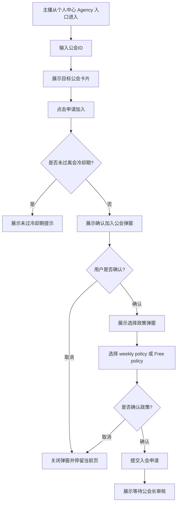

#### 交互逻辑

1. 主播输入公会ID，系统展示匹配到的公会卡片。
2. 点击“申请加入”后，系统先校验冷却期和是否已有申请中记录。
3. 冷却期未结束时，展示“未过冷却期”提示和剩余等待天数。
4. 校验通过后，展示“确认加入公会”弹窗，主播可取消或确认。
5. 确认后进入“选择政策”弹窗，主播选择 `weekly policy` 或 `Free policy`。
6. 点击 `Confirm` 后提交申请，页面展示“申请已提交，请等待公会长审核”。

#### 系统后台核心逻辑

| 逻辑点 | 规则 |
|---|---|
| 申请唯一性 | 主播同一时间只能存在一个申请中记录 |
| 冷却期校验 | 最近一次离开公会未满配置天数时禁止提交 |
| 政策选择快照 | 主播申请时选择的政策类型写入申请记录，供公会长审核时读取 |
| 审核承接 | 提交后进入公会长入会申请管理，由公会长审核同意或拒绝 |
| 非自由政策后续 | 选择 `weekly policy` 后，公会长同意时仍需设置比例参数并写入快照 |

#### 边界情况

| 场景 | 处理规则 |
|---|---|
| 公会ID不存在 | 不展示可申请公会卡片，提示公会不存在 |
| 冷却期未结束 | 展示冷却期提示，不创建申请 |
| 已有申请中记录 | 不允许再次申请其他公会 |
| 选择政策后取消 | 不提交申请，停留当前流程 |
| 申请提交成功 | 展示等待审核提示，按钮状态变为审核中 |


### 5.3 主播本人薪资页

#### 对应原型


**功能描述：** 主播本人薪资页用于展示主播当前周期的薪资结果。`主播视角-薪资页面` 是该模块总览图，展示普通政策、自由政策、历史明细入口和两类历史详情的完整链路；下方再按自由政策和普通政策分别引用专属页面图，避免把普通政策字段硬塞到自由政策页面里。
**关键交互：** 主播在本页查看当前周期薪资结果；点击 `提现` 进入主播提现总流程；点击 `历史明细` 进入历史明细页并按政策展示不同字段；涉及金币工资奖励时，可进入金币奖励工资明细查看收入和提现消耗。

**功能说明：** 主播本人薪资页只描述原型真实可见字段。自由政策侧重展示有效钻石余额、主播总薪资、主播已预支和主播薪资余额；普通政策（即非自由政策）在此基础上额外展示本期有效钻石余额、薪资等级、有效天数、主播底薪和主播TG奖励。

**端内薪资口径备注：** 主播端所有薪资类字段默认包含金币奖励工资部分；普通政策下展示的主播底薪、主播TG奖励、主播总薪资、主播薪资余额均为已扣除未达标天数罚金后的结果。

#### 前置条件

| 条件 | 规则 |
|---|---|
| 主播已加入公会 | 才展示当前周期薪资数据 |
| 主播处于待完善薪资参数 | 可展示“暂不可结算”提示，不展示完整工资结果 |
| 主播处于离会待结算保护期 | 展示当前待结算周期数据和离会结算提示 |

#### 自由政策页面字段


| 字段 | 说明 | 统计方式（计算公式） | 数据来源 |
|---|---|---|---|
| 公会名称 | 当前所属公会名称 | 直接读取 | 公会关系快照 + 公会资料 |
| 公会 ID | 当前所属公会编号 | 直接读取 | 公会关系快照 |
| 公会人数 | 当前公会人数摘要 | 直接读取页面展示结果 | 公会成员关系 |
| 主播名称 | 当前主播昵称 | 直接读取 | 用户资料 |
| 主播ID | 当前主播账号ID | 直接读取 | 用户资料 |
| 结算政策 | 页面展示的结算政策类型 | 自由政策 | 政策绑定快照 |
| 个人可提现薪资 | 页面顶部展示的个人可提现薪资摘要 | 主播薪资余额 + 金币工资奖励余额；薪资结果包含金币奖励工资部分，普通政策结果已扣除未达标天数罚金 | 余额池汇总 |
| 本期有效钻石流水 | 本期进入结算的有效钻石流水 | 非幸运礼物按1金币=2钻石；幸运礼物按10金币=2钻石；再扣除无效/冻结流水 | 钻石流水 + 处理结果 |
| 本期有效钻石余额 | 页面展示的本期有效钻石余额 | 读取当期有效钻石余额结果 | 结算快照 |
| 主播总薪资 | 页面展示的主播总薪资 | 自由政策主播工资结果 = 有效钻石余额 × 自由政策分成比 ÷ 钻石折算美元工资比例 × 主播分成比例；包含金币工资奖励部分 | 主播结算明细 |
| 主播已预支 | 页面展示的主播已预支金额 | 汇总本周期已发放且已进入抵扣链路的预支金额 | 预支记录 / 结算抵扣单 |
| 主播薪资余额 | 主播净余额（页面原词为“主播薪资余额”） | 主播总薪资 - 主播已预支；包含金币奖励工资部分对应的结算结果 | 余额池快照 |

#### 普通政策页面字段


| 字段 | 说明 | 统计方式（计算公式） | 数据来源 |
|---|---|---|---|
| 公会名称 | 当前所属公会名称 | 直接读取 | 公会关系快照 + 公会资料 |
| 公会 ID | 当前所属公会编号 | 直接读取 | 公会关系快照 |
| 公会人数 | 当前公会人数摘要 | 直接读取页面展示结果 | 公会成员关系 |
| 主播名称 | 当前主播昵称 | 直接读取 | 用户资料 |
| 主播ID | 当前主播账号ID | 直接读取 | 用户资料 |
| 结算政策 | 页面展示的结算政策类型 | 普通政策 | 政策绑定快照 |
| 个人可提现薪资 | 页面顶部展示的个人可提现薪资摘要 | 主播薪资余额 + 金币工资奖励余额；薪资结果包含金币奖励工资部分，普通政策结果已扣除未达标天数罚金 | 余额池汇总 |
| 本期有效钻石流水 | 页面展示的原始政策流水参考值 | 非幸运礼物按1金币=2钻石；幸运礼物按10金币=2钻石；再扣除无效/冻结流水；不直接作为主播工资换算基数 | 钻石流水 + 处理结果 |
| 本期有效钻石余额 | 页面展示的本期有效钻石余额 | 读取当期有效钻石余额结果 | 结算快照 |
| 薪资等级 | 页面展示的薪资等级 | 按当期结算快照读取 | 结算快照 |
| 有效天数 | 页面展示的有效天数 | 按当期有效天结果读取 | 有效天快照 |
| 有效天达标状态 | 页面展示当前档位有效天是否达标，展示“已达标”或“未达标” | 当前有效天数 >= 当前薪资等级对应有效天要求时展示“已达标”，否则展示“未达标” | 有效天快照 + 薪资等级快照 |
| 主播底薪 | 页面展示的主播底薪 | 非自由政策下按该主播当月钻石余额匹配档位，并扣除未达标天数罚金后的主播基础薪资结果，包含金币奖励工资部分 | 主播结算明细 |
| 主播TG奖励 | 页面展示的主播TG奖励 | 非自由政策下按该主播当月钻石余额匹配档位，并扣除未达标天数罚金后的主播TG奖励结果，包含金币奖励工资部分 | 主播结算明细 |
| 主播总薪资 | 页面展示的主播总薪资 | 主播底薪 + 主播TG奖励；普通政策下为已扣除未达标天数罚金后的结果，包含金币奖励工资部分 | 主播结算明细 |
| 主播已预支 | 页面展示的主播已预支金额 | 汇总本周期已发放且已进入抵扣链路的预支金额 | 预支记录 / 结算抵扣单 |
| 主播薪资余额 | 主播净余额（页面原词为“主播薪资余额”） | 主播总薪资 - 主播已预支；包含金币奖励工资部分对应的结算结果 | 余额池快照 |

#### 交互逻辑

1. 主播进入薪资页后，系统读取当前结算周期、当前公会关系快照和政策绑定快照。
2. 若当前结算政策为自由政策，则展示自由政策原型对应字段。
3. 若当前结算政策为普通政策，则展示普通政策原型（即非自由政策）对应字段。
4. 普通政策页面中，系统按当前薪资等级读取对应有效天要求，并与当前有效天数比较：满足要求展示“已达标”，未满足要求展示“未达标”。
5. 点击“历史明细”进入历史结算记录，按月份读取历史快照。
6. 点击“提现”进入主播提现中心。
7. 点击“金币奖励工资明细”进入金币奖励工资明细页。
8. 点击“预支记录”进入预支记录页。

#### 系统后台核心逻辑

| 逻辑点 | 规则 |
|---|---|
| 政策裁剪 | 自由政策和普通政策页面字段必须严格按原型裁剪，不能共用一套字段模板 |
| 工资拆分顺序 | 工资项生成 → 有效天扣减（如适用）→ 金币工资奖励/非金币工资奖励拆分 → 预支对冲 → 余额池 |
| 预支对冲范围 | 预支只能使用非金币工资奖励对冲，金币工资奖励不得用于预支对冲 |
| 余额池生成 | 非金币工资奖励进入个人薪资余额；金币工资奖励进入金币工资奖励余额池 |
| 历史快照 | 历史薪资页必须读取当期政策版本、工资项拆分结果、扣减结果、余额池结果，不因当前配置变化重算 |

#### 边界情况

| 场景 | 处理规则 |
|---|---|
| 普通政策有效天未达标且非新手保护期 | 按当期结算规则执行扣减，再进入后续拆分 |
| 普通政策有效天未达标但处于新手保护期 | 不扣减，页面展示新手保护期说明 |
| 普通政策当前档位有效天已达标 | 有效天达标状态展示“已达标”，不展示有效天未达标扣减提示 |
| 普通政策当前档位有效天未达标 | 有效天达标状态展示“未达标”，并按是否处于新手保护期决定是否扣减 |
| 最终工资不足抵扣预支 | 实际抵扣后形成待抵扣余额，后续周期优先抵扣 |
| 主播转会或离会 | 当前周期按归属快照展示；离会前必须完成当期结算并优先结清预支 |

---
### 5.4 主播提现总流程

#### 对应原型


**功能描述：** 主播提现总流程页用于汇总展示主播可用提现出口、当前可提现展示金额和各出口的进入关系。该图只对应“主播从工资结果进入提现分流”的总入口，不直接承载金币/现金/提现给公会长的具体申请表单。  
**关键交互：** 主播从总流程页选择提现金币、提现现金或提现给公会长；系统根据主播余额池、金币工资奖励限制、现金开放窗口和公会关系控制各入口是否可见或可用。

#### 前置条件

| 条件 | 规则 |
|---|---|
| 主播已有可用余额 | 至少存在个人余额、主播转入金额或金币工资奖励余额 |
| 提现出口开放 | 现金提现仅每月1号开放入口；默认按系统主时区从每月1号00:00:00开放至1号23:59:59，节假日不顺延，失败后重新提交仍需在该开放窗口内；金币提现按平台配置开放 |
| 公会关系有效 | 提现给公会长时，需存在有效公会关系和目标公会长 |

#### 字段与数据来源

##### 总览字段

| 字段 | 说明 | 数据来源 |
|---|---|---|
| 总可提现展示金额 | 个人余额 + 主播转入金额 + 金币工资奖励余额；薪资结果包含金币奖励工资部分，普通政策结果已扣除未达标天数罚金 | 主播当前可见总额 |
| 可提现金币入口 | 进入金币提现申请页的入口 | 页面配置 + 余额池规则 |
| 可提现现金入口 | 进入现金提现申请页的入口 | 页面配置 + 时间窗口规则 |
| 金币工资奖励限制提示 | 当存在仅支持提现为金币的金币工资奖励余额时，在转账给他人、提现现金或提现给公会长等非金币入口下方单独提示该金额 | 金币工资奖励余额 |
| 查看原因 | 打开“仅支持提现为金币的金额”说明弹窗 | 页面操作 |
| 出口说明 | 每个出口对应可用余额池提示 | 提现规则配置 |
| 当前审核中的申请数 | 当前待审核提现申请数量 | 提现申请记录 |

#### 交互逻辑

**入口与初始化**
1. 主播从首页或薪资页点击提现，进入提现总流程页。
2. 系统按主播角色和当前可用余额加载可用出口：提现金币、提现现金、提现给公会长。

**页面交互**
3. 主播切换不同出口前，页面先展示各出口可用余额池、不可用余额池和入口说明。
4. 当主播存在金币工资奖励余额，且当前操作为提现现金或提现给公会长等非金币出口时，页面必须在金额区域下方单独展示提示：“有$X为回充工资仅支持提现为金币”，右侧展示“查看原因 >”。
5. 主播点击具体出口后，进入对应申请页；总流程页本身不提交提现申请。

**金币工资奖励说明弹窗**
6. 点击“查看原因 >”后，弹出“仅支持提现为金币的金额”说明弹窗，展示仅支持提现为金币的金额、限制原因、主按钮“去提现”和次级入口“查看明细”。
7. 点击“去提现”时，切换或跳转到提现金币流程；点击“查看明细”时，进入金币工资明细页，默认展示收入 Tab。

**结果与后续**
8. 若当前存在审核中的申请，页面展示申请状态并提供进入提现记录的入口。

#### 系统后台核心逻辑

- 提现总流程页只负责出口分流，不直接消耗余额池。
- 出口可见性必须由后台规则控制，不能只靠前端硬编码。
- 现金提现开放期、冻结状态、公会关系有效性都必须在进入具体申请页前校验。
- 总流程页展示金额仅作引导，提交时必须以具体申请页重算余额池为准。

#### 边界情况

| 场景 | 处理规则 |
|---|---|
| 无任何可提现余额 | 展示空状态，不显示可提交入口 |
| 仅有金币工资奖励余额 | 仅开放提现金币，不开放现金和提现给公会长 |
| 当前存在审核中申请 | 允许查看记录，但新的可用动作按冻结后余额重新计算 |
| 现金提现非开放日 | 现金入口置灰并展示开放时间 |
### 5.5 主播提现为金币

#### 对应原型


**功能描述：** 主播提现为金币申请页，处理主播个人余额、主播转入金额和金币工资奖励余额的金币提现申请。该 `_1` 图为主播端金币提现表单图，主播端也必须展示“主播转入金额”：用于承接用户曾经是公会长时遗留的主播转入余额，避免历史余额凭空消失。  
**关键交互：** 主播进入提现页后必须先选择本次使用的余额池：`个人余额` 或 `主播转入金额`，默认都不选；选择后再输入提现金额。系统按所选余额池校验金额并生成 Waiting 状态提现单；金币工资奖励余额只能在金币出口消耗，不能转到现金或提现给公会长。

#### 前置条件

| 条件 | 规则 |
|---|---|
| 主播存在可提现金币余额 | 个人余额、主播转入金额和/或金币工资奖励余额大于0 |
| 提现金额合法 | 必须先选择余额池；金额必须大于0且不超过所选余额池可用余额 |
| 汇率可用 | 当前金币提现汇率配置有效 |

#### 字段与数据来源

##### 表单字段

| 字段 | 说明 | 数据来源 |
|---|---|---|
| 可提现金币金额 | 个人余额 + 主播转入金额 + 金币工资奖励余额 | 金币出口下的可申请金额 |
| 个人余额 | 主播本人个人薪资余额 | 主播余额池；默认未选中 |
| 主播转入金额 | 历史上由其他主播提现给该账号形成的转入余额；用户曾经是公会长时可能遗留该余额 | 主播转入余额池；默认未选中 |
| 余额选择 | 本次提现使用的余额池 | 用户必须选择“个人余额”或“主播转入金额”，默认都不选 |
| 提现金额 | 主播本次申请金额 | 用户输入；按所选余额池校验 |
| 去提现 | 从金币工资奖励说明弹窗进入金币提现流程的主按钮 | 页面操作 |
| 提现状态 | Waiting、Approved、Rejected、打款失败、已回滚 | 提现申请记录 |

#### 交互逻辑

**入口与初始化**
1. 主播进入金币提现页后，系统展示当前可用于金币提现的余额摘要。
2. 若用户从“仅支持提现为金币的金额”弹窗点击“去提现”进入本页，页面默认使用金币提现出口，并将金币工资奖励余额纳入本次可提现金币金额。

**页面交互**
3. 主播默认未选择余额池，直接输入或提交时提示“请选择提现余额”。
4. 主播选择 `个人余额` 或 `主播转入金额` 后，系统只按所选余额池计算本次可提现上限；输入金额必须大于0且不超过所选余额池可用余额。
5. 页面同步展示预计到账金币数量。

**提交与结果**
6. 主播提交后，系统按所选余额池冻结对应余额。
7. 提交成功后生成提现申请，状态进入 Waiting，并在申请快照中记录所选余额池。

#### 系统后台核心逻辑

- 提交前重新读取余额池，不以页面缓存金额为准。
- 主播提现金币时，申请快照必须记录申请金额、所选余额池和冻结结果。
- 申请提交后冻结对应余额，审核通过后正式扣减并发放金币。
- 审核拒绝时释放冻结余额，打款失败时进入失败回滚链路。

#### 边界情况

| 场景 | 处理规则 |
|---|---|
| 只有金币工资奖励余额 | 全部从金币奖励余额扣减 |
| 只有个人余额 | 选择个人余额后，从个人余额扣减 |
| 只有主播转入金额 | 选择主播转入金额后，从主播转入金额扣减 |
| 未选择余额池直接提交 | 禁止提交并提示“请选择提现余额” |
| 金额超过所选余额池 | 禁止提交并提示余额不足 |
| 提交后余额变化 | 以提交时冻结快照为准 |
### 5.6 主播提现为现金

#### 对应原型


**功能描述：** 主播提现为现金申请页，处理主播个人余额或主播转入金额的现金提现。该 `_1` 图为主播端现金提现表单图，主播端也必须展示“主播转入金额”：用于承接用户曾经是公会长时遗留的转入余额。金币工资奖励余额在本页仅作为不可用提示，不参与现金提现。  
**关键交互：** 主播先选择本次使用 `个人余额` 或 `主播转入金额`，默认都不选；再填写提现金额、提现方式和收款账号。系统按所选余额池校验金额、冻结对应余额并生成 Waiting 状态提现单。

#### 前置条件

| 条件 | 规则 |
|---|---|
| 现金入口开放 | 现金提现仅每月1号开放入口；默认按系统主时区从每月1号00:00:00开放至1号23:59:59，节假日不顺延，失败后重新提交仍需在该开放窗口内 |
| 主播存在工资型余额 | 现金出口读取主播当前个人余额和主播转入金额 |
| 收款方式有效 | 需填写并校验提现方式和收款账号 |

#### 字段与数据来源

##### 表单字段

| 字段 | 说明 | 数据来源 |
|---|---|---|
| 个人余额 | 主播本人个人薪资余额 | 主播余额池；默认未选中 |
| 主播转入金额 | 历史上由其他主播提现给该账号形成的转入余额；用户曾经是公会长时可能遗留该余额 | 主播转入余额池；默认未选中 |
| 余额选择 | 本次现金提现使用的余额池 | 用户必须选择“个人余额”或“主播转入金额”，默认都不选 |
| 提现金额 | 本次申请金额 | 用户输入 |
| 提现方式 | USDT、Bank、Vodafone、Starpay、EasyPaisa、JazzCash 等 | 提现渠道配置 |
| 提现账号 | 现金提现收款账号 | 用户输入 / 历史收款账户 |
| 回充工资提示 | 当存在金币工资奖励余额时展示“有$X为回充工资仅支持提现为金币” | 金币工资奖励余额 |
| 查看原因 | 打开“仅支持提现为金币的金额”说明弹窗 | 页面操作 |
| 提现状态 | Waiting、Approved、Rejected、打款失败、已回滚 | 提现申请记录 |

#### 交互逻辑

**入口与初始化**
1. 主播进入现金提现页后，系统展示当前可用于现金提现的 `个人余额` 和 `主播转入金额`。
2. 页面置灰展示金币工资奖励余额，并提示该余额只能用于提现金币。
3. 当主播存在金币工资奖励余额时，金额区域下方单独展示“有$X为回充工资仅支持提现为金币”，右侧展示“查看原因 >”。点击后弹出“仅支持提现为金币的金额”说明弹窗。

**页面交互**
4. 主播默认未选择余额池，直接输入或提交时提示“请选择提现余额”。
5. 主播选择 `个人余额` 或 `主播转入金额` 后，再输入提现金额、提现方式和收款账号；系统即时校验金额、账号和出口开放时间，金额上限只取所选余额池可用余额，不包含金币工资奖励余额。

**提交与结果**
6. 提交成功后，系统按所选余额池冻结金额并生成 Waiting 状态提现申请。
7. 主播后续在提现记录中查看审核、打款、失败和回滚结果。

#### 系统后台核心逻辑

- 金币工资奖励余额不得提现现金，系统必须阻断而不是只前端置灰。
- 提交时按所选余额池冻结对应工资型余额；审核通过后正式扣减并执行外部打款。
- 审核拒绝时释放冻结余额；打款失败时进入失败回滚链路。
- 申请快照必须记录提现方式、账号、金额、所选余额池和当时各余额池可用余额。

#### 边界情况

| 场景 | 处理规则 |
|---|---|
| 非开放日进入页面 | 按入口控制不允许提交，展示开放时间 |
| 收款账号为空或格式错误 | 禁止提交并提示补充正确账号 |
| 未选择余额池直接提交 | 禁止提交并提示“请选择提现余额” |
| 金额超过所选余额池 | 禁止提交并提示余额不足 |
| 审核拒绝后再次提现 | 释放余额后允许重新发起申请 |
### 5.7 提现给公会长

#### 对应原型


**功能描述：** 提现给公会长申请页，用于主播将个人薪资余额转入公会长侧主播转入薪资余额（页面原词可能显示为“主播转入金额”）。这个页面承接的是“主播把工资转给公会长”的内部转账链路，不等同于现金或金币提现。  
**关键交互：** 主播确认收款公会长和金额后提交审核；审核通过后金额进入公会长主播转入薪资余额。

#### 前置条件

| 条件 | 规则 |
|---|---|
| 公会关系有效 | 存在当前有效公会关系和目标公会长 |
| 主播存在个人薪资余额 | 仅个人薪资余额可用于该出口 |
| 金币工资奖励余额不可用 | 金币工资奖励余额不得用于该出口 |

#### 字段与数据来源

##### 表单字段

| 字段 | 说明 | 数据来源 |
|---|---|---|
| 提现金额 | 本次转账金额 | 用户输入 |
| 金币工资奖励限制提示 | 提示主播本人仅支持提现为金币的金币工资奖励金额 | 金币工资奖励余额 |
| 查看原因 | 打开“仅支持提现为金币的金额”说明弹窗 | 页面操作 |
| 提现状态 | Waiting、Approved、Rejected、打款失败、已回滚 | 提现申请记录 |

#### 交互逻辑

**入口与初始化**
1. 主播进入提现给公会长页面后，系统展示当前可转金额和目标公会长信息。
2. 当主播存在金币工资奖励余额时，该金额不计入可转金额，需在金额区域下方单独展示“有$X为回充工资仅支持提现为金币”，右侧展示“查看原因 >”。
3. 点击“查看原因 >”打开“仅支持提现为金币的金额”说明弹窗；点击弹窗“去提现”切换到提现金币流程，点击“查看明细”进入金币工资明细页。

**页面交互**
4. 主播输入金额时，系统校验金额是否超过个人薪资余额，不允许消耗金币工资奖励余额。

**提交与结果**
5. 提交后，系统冻结主播个人薪资余额并生成 Waiting 状态申请。
6. 审核通过后，金额入账公会长主播转入薪资余额；审核失败则释放冻结金额。
7. 主播可在提现记录中查看审核和入账结果。

#### 系统后台核心逻辑

- 提现给公会长只允许消耗个人薪资余额，金币工资奖励余额、主播转入薪资余额均不得参与。
- 审核通过后，金额必须入账到公会长主播转入薪资余额，而不是公会长个人薪资余额。
- 审核失败或入账失败时，必须回滚主播侧冻结金额。
- 申请快照必须记录目标公会长、申请金额和扣减余额池。

#### 边界情况

| 场景 | 处理规则 |
|---|---|
| 公会长关系失效 | 禁止提交 |
| 金额超过个人薪资余额 | 禁止提交并提示余额不足 |
| 审核通过但入账失败 | 进入失败回滚链路 |
| 同一申请重复处理 | 使用申请状态和入账幂等控制 |


### 5.9 金币奖励工资明细（主播/公会长共用）

#### 对应原型


**功能描述：** 本节由两张原型共同组成：`主播_公会长-金币工资奖励说明` 对应非金币出口下的限制提示、原因弹窗和跳转入口；`金币奖励工资明细` 对应进入明细页后的 `收入 / 提现` 两个 Tab。该页与公会长本人金币工资明细复用同一组字段，但在主播端只解释主播本人余额。
**关键交互：** 主播在提现现金或提现给公会长等非金币出口看到限制提示后，点击“查看原因 >”打开说明弹窗；点击“去提现”进入金币提现；点击“查看明细”进入金币工资明细页，默认收入 Tab，可切换到提现 Tab 查看每笔金币提现对普通可提现工资和金币工资部分的扣减。

#### 字段与数据来源

##### 说明弹窗字段


##### 收入 Tab 字段


##### 提现 Tab 字段


#### 交互逻辑

1. 非金币出口中若存在金币工资奖励余额，页面在金额区域下方单独展示“有$X为回充工资仅支持提现为金币”和“查看原因 >”。
2. 点击“查看原因 >”后弹出说明弹窗，展示仅支持提现为金币的金额和限制原因。
3. 点击“去提现”时进入提现金币流程，金币工资奖励余额参与金币提现可用金额。
4. 点击“查看明细”时进入金币工资明细页，默认展示收入 Tab。
5. 用户点击“收入 / 提现”Tab 时，在金币工资奖励产生明细和金币提现消耗明细之间切换。
6. 明细页返回后，回到来源提现页或上一层提现流程。

#### 系统后台核心逻辑

- 金币工资明细必须能追溯金币工资奖励的产生周期、产生金额、提现消耗记录和当前剩余金额。
- 弹窗金额、提示条金额和明细页余额必须读取同一套金币工资奖励余额口径。
- 金币工资奖励金额只能进入金币提现出口；现金提现和转账给公会长必须阻断。
- 金币提现若同时消耗普通可提现工资和金币工资奖励，申请快照必须分别记录两部分扣减金额。

#### 边界情况

| 场景 | 处理规则 |
|---|---|
| 金币工资奖励余额为0 | 不展示限制提示，不展示“查看原因”入口 |
| 金币工资奖励余额全部冻结中 | 提示金额按可用余额展示为0，明细仍可查看历史记录 |
| 点击去提现但金币出口不可用 | 展示不可提现原因，不允许提交 |
| 明细为空 | 收入或提现 Tab 分别展示空状态 |
### 5.8 提现记录（主播视角）

#### 对应原型


**功能描述：** 主播提现记录页用于查看本人提现申请的审核状态和历史记录。原型按 `Under Review` 与 `Reviewed` 两个页签区分等待审核和已审核记录。
**关键交互：** 主播切换 `Under Review` / `Reviewed` 查看不同状态记录；记录中展示提现编号、用户ID、提现渠道、提现金额、提现方式、提现账号、备注、状态和时间。


#### 前置条件

| 条件 | 规则 |
|---|---|
| 存在提现申请记录 | 展示对应页签下的申请列表 |
| 无提现申请记录 | 展示空状态 |
| 主播有权限查看本人记录 | 仅查看本人发起的提现申请 |

#### 页面字段与数据来源

##### 列表字段

| 字段 | 业务定义 | 取值规则 | 数据来源 |
|---|---|---|---|
| Withdrawal Record | 页面标题 | 固定展示 | 页面标题 |
| Under Review | 等待审核页签 | 展示 `Waiting` 状态记录 | 提现申请记录 |
| Reviewed | 已审核页签 | 展示 `Approved`、`Rejected` 等已处理记录 | 提现申请记录 |
| 提现编号 | 记录顶部长编号，例如 `00202603260000000008` | 读取提现申请编号，支持复制 | 提现申请记录 |
| UserId | 申请用户ID | 读取申请人ID | 提现申请记录 |
| Withdrawal Channel | 提现渠道，示例 `USDT` | 读取申请渠道 | 提现申请记录 |
| Withdrawal Amount | 提现金额 | 读取本次申请金额 | 提现申请记录 |
| Withdrawal Method | 提现方式，示例 `cash` / `coins` | 读取本次提现方式 | 提现申请记录 |
| Withdrawal Account | 提现账号 | 读取提交时收款账号 | 提现申请快照 |
| Withdrawal Remark | 审核备注或失败原因 | 审核拒绝或补充材料时展示 | 审核记录 |
| 扣除可提现工资部分 | 金币提现中从工资型余额扣除的金额 | 仅当该记录有混合扣减时展示 | 提现扣减快照 |
| 扣除金币工资部分 | 金币提现中从金币工资奖励余额扣除的金额 | 仅当该记录有混合扣减时展示 | 提现扣减快照 |
| 状态 | `Waiting` / `Approved` / `Rejected` | 按提现申请状态展示 | 提现申请记录 |
| 时间 | 申请或审核时间 | 按记录对应时间展示 | 提现申请记录 |

#### 交互逻辑

1. 主播进入提现记录页，默认展示 `Under Review` 或最近一次使用页签。
2. 点击 `Under Review` 展示等待审核记录。
3. 点击 `Reviewed` 展示已审核记录，包括通过和拒绝。
4. 点击编号旁复制图标，可复制提现编号。
5. 若记录为金币提现且同时消耗工资型余额和金币工资奖励余额，展示两部分扣除金额。
6. 若记录被拒绝，展示 `Withdrawal Remark`。

#### 系统后台核心逻辑

| 逻辑点 | 规则 |
|---|---|
| 记录快照 | 提现申请提交时锁定金额、方式、账号和余额扣减结果 |
| 状态分组 | `Waiting` 归入 `Under Review`；`Approved`、`Rejected` 归入 `Reviewed` |
| 混合扣减展示 | 仅金币提现存在普通工资余额与金币工资奖励余额混合扣减时，展示两部分扣除金额 |
| 权限边界 | 主播只能查看本人提现记录 |

#### 边界情况

| 场景 | 处理规则 |
|---|---|
| 审核中记录为空 | `Under Review` 展示空状态 |
| 已审核记录为空 | `Reviewed` 展示空状态 |
| 审核拒绝 | 展示 `Rejected` 和 `Withdrawal Remark` |
| 金币提现无混合扣减 | 不展示扣除拆分字段 |


### 5.10 预支记录

#### 对应原型


**功能描述：** 预支记录页展示主播本人预支发放记录和预支抵扣记录。原型按 `All`、`Advance`、`Deduction` 三个入口切换，并拆成 `Advance Amount` 与 `Advance Deduction` 两类列表。
**关键交互：** 主播查看预支到账记录和抵扣记录；第一期客户端只展示记录，不开放自助发起预支申请。

**功能说明：** 预支记录页不是预支审核后台，也不是预支申请表。页面只展示原型可见的发放与抵扣字段；审核、发放、债务归属、待抵扣余额等业务规则在系统后台核心逻辑中说明。

#### 前置条件

| 条件 | 规则 |
|---|---|
| 存在预支或抵扣记录 | 展示对应列表 |
| 无记录 | 展示空状态 |
| 主播有权限查看本人记录 | 仅展示与本人相关的预支发放和抵扣记录 |

#### 页面字段与数据来源

##### 顶部筛选入口

| 字段 | 业务定义 | 取值规则 | 数据来源 |
|---|---|---|---|
| All | 全部记录入口 | 展示预支发放和预支抵扣记录 | 预支记录 / 抵扣记录 |
| Advance | 预支发放入口 | 只展示 `Advance Amount` 记录 | 预支记录 |
| Deduction | 预支抵扣入口 | 只展示 `Advance Deduction` 记录 | 抵扣记录 |

##### Advance Amount 列表字段

| 字段 | 业务定义 | 取值规则 | 数据来源 |
|---|---|---|---|
| Time | 预支发放记录时间 | 读取预支发放或记录生成时间 | 预支记录 |
| Recipient ID | 收款人ID | 预支给本人时为本人；预支给他人时为实际收款人 | 预支记录 |
| Amount | 预支金额 | 读取本次预支金额 | 预支记录 |
| Coins | 到账金币数 | 按后台选择的到账货币和数量展示 | 预支发放记录 |
| Type | 记录类型 | 图上示例为 `Advance` | 预支记录 |
| Bill ID | 账单ID | 读取预支账单编号 | 预支记录 |

##### Advance Deduction 列表字段

| 字段 | 业务定义 | 取值规则 | 数据来源 |
|---|---|---|---|
| Time | 抵扣记录时间 | 读取结算抵扣发生时间 | 结算抵扣记录 |
| Amount | 抵扣金额 | 读取本次从工资中抵扣的金额 | 结算抵扣记录 |
| Type | 记录类型 | 图上示例为 `Advance`，表示预支相关抵扣 | 结算抵扣记录 |

#### 交互逻辑

1. 主播进入预支记录页，默认可查看全部记录。
2. 点击 `Advance`，页面展示预支发放记录。
3. 点击 `Deduction`，页面展示月结抵扣记录。
4. 每条 `Advance Amount` 记录展示时间、收款人ID、金额、到账金币数、类型和账单ID。
5. 每条 `Advance Deduction` 记录展示时间、抵扣金额和类型。

#### 系统后台核心逻辑

| 逻辑点 | 规则 |
|---|---|
| 第一期入口 | 第一期不开放主播端自助发起预支，只展示后台发起后的记录 |
| 债务归属 | 预支债务始终挂在预支人本人名下，不挂在收款人名下 |
| 抵扣时点 | 审核通过并进入结算抵扣链路后，才生成抵扣记录 |
| 可预支金额 | 后台发起时按可预支金额公式校验，客户端记录页只展示结果记录 |
| 待抵扣余额 | 工资不足抵扣时形成待抵扣余额，后续周期优先抵扣；该余额应在预支详情或后台规则中追溯，不写成当前列表字段 |

#### 边界情况

| 场景 | 处理规则 |
|---|---|
| 无预支发放记录 | `Advance` 页签展示空状态 |
| 无抵扣记录 | `Deduction` 页签展示空状态 |
| 预支给他人 | `Recipient ID` 展示实际收款人，债务仍归属预支人本人 |
| 抵扣未完成 | 已抵扣部分展示在 `Deduction`，未抵扣部分进入后续待抵扣规则 |


### 5.11 历史结算记录列表（主播视角）

#### 对应原型


**功能描述：** 主播历史结算记录列表用于按月份查看本人历史结算快照。页面从薪资页 `历史明细` 入口进入，`主播视角-历史结算记录` 是列表/历史入口专属图，`主播视角-薪资页面` 用于说明本月薪资页到历史明细、普通政策详情、自由政策详情的跳转链路。进入具体月份后，系统根据该历史周期绑定的政策类型展示自由政策历史明细或普通政策历史明细。
**关键交互：** 主播点击“历史明细”后进入历史明细页；通过“选择日期”切换月份；页面只读取历史快照，不按当前政策重新计算。

**功能说明：** 历史结算记录的核心不是重新算工资，而是还原某个历史周期“当时展示给主播的结算结果”。如果该周期是自由政策，只展示自由政策字段；如果该周期是普通政策，只展示普通政策字段。

#### 前置条件

| 条件 | 规则 |
|---|---|
| 存在历史结算快照 | 按月份展示历史明细 |
| 当前政策发生变化 | 历史记录仍读取当期政策快照，不受当前配置影响 |
| 主播已离会或转会 | 历史记录仍归主播本人可见，余额结果不被新公会接管 |

#### 交互逻辑

1. 主播从本人薪资页点击“历史明细”。
2. 系统默认进入最近一个可查看的历史结算月份。
3. 主播通过“选择日期”切换月份，日期控件按月读取历史快照。
4. 系统读取该月份的政策类型，并进入对应的自由政策历史明细或普通政策历史明细展示。
5. 页面只展示该历史周期快照结果，不触发重新计算。

#### 系统后台核心逻辑

| 逻辑点 | 规则 |
|---|---|
| 快照不可重算 | 历史结算记录只读取当期快照，不因政策、公会、主播归属变化重算 |
| 字段按政策裁剪 | 自由政策和普通政策历史明细必须分开展示字段，不能共用一套字段表 |
| 余额归属 | 结算后余额挂主播本人，和后续属于哪个公会无关 |
| 对账用途 | 客服、财务、主播争议处理均以该历史快照为准 |

#### 边界情况

| 场景 | 处理规则 |
|---|---|
| 预支未完全抵扣 | 普通政策历史明细中展示已预支金额；剩余待抵扣在预支记录中追溯 |
| 提现失败后回滚 | 历史金额读取回滚后的余额池快照 |
| 政策版本已停用 | 历史仍展示当期政策版本，不读当前可绑定版本 |
### 5.12 历史结算记录详情（主播视角）

#### 自由政策原型


**功能描述：** 主播历史结算详情用于查看某个历史月份的薪资快照。`主播视角-历史结算记录_自由政策` 和 `主播视角-历史结算记录_普通政策` 分别对应两套详情页，不再共用一张泛历史图；自由政策不展示薪资等级、有效天数、主播底薪、主播TG奖励，普通政策展示这些字段。  
**关键交互：** 主播通过“选择日期”切换月份；页面展示该月份自由政策下的本月主播薪资数据和薪资明细；点击返回回到上一层入口。

#### 自由政策页面字段

| 字段 | 业务定义 | 计算方式 / 取值规则 | 数据来源 |
|---|---|---|---|
| 历史明细 | 页面标题，表示当前查看历史结算明细 | 固定展示页面标题 | 页面标题 |
| 选择日期 | 当前查看的历史月份 | 按月份选择历史结算周期，示例为 `2015-10` | 日期选择 / 结算快照 |
| 本月主播薪资数据 | 自由政策历史周期的主播数据区块 | 展示该历史周期主播有效流水、有效余额和达标状态 | 页面区块 / 结算快照 |
| 未达标 | 当前历史周期达标状态 | 读取该月自由政策结算快照中的达标结果 | 结算快照 |
| 本期有效钻石流水 | 历史周期内参与工资计算的有效钻石流水 | 汇总该期有效钻石流水；冻结、拒付、无效流水不计入 | 钻石流水快照 |
| 本期有效钻石余额 | 历史周期结算时锁定的有效钻石余额 | 读取结算完成时写入的有效钻石余额快照；结算后账户实时钻石余额可被清空，不影响历史展示 | 结算快照 |
| 主播总薪资 | 自由政策下主播该历史周期的应发工资合计 | 自由政策主播总薪资 = 该期有效钻石余额 × 自由政策分成比 ÷ 钻石折算美元工资比例 × 主播分成比例，包含金币工资奖励部分 | 主播结算明细 |
| 主播已预支       | 该历史周期已进入本期对冲链路的预支金额 | 汇总该期已发放且在本期参与抵扣的预支金额，页面以负数展示     | 预支记录 / 结算抵扣单 |
| 主播薪资剩余金额 | 该历史周期结算后仍剩余的主播工资型余额 | 主播薪资剩余金额 = 主播总薪资 - 主播已预支金额，包含金币奖励工资部分对应的结算结果 | 余额池快照 |


#### 普通政策原型


**功能描述：** 普通政策历史明细页用于展示主播某个历史月份在普通政策下的结算快照。相比自由政策，普通政策需要额外展示薪资等级、有效天数、主播底薪、主播TG奖励和主播已预支。
**关键交互：** 主播通过“选择日期”切换月份；页面按历史快照展示该月命中的薪资等级、有效天数、工资拆分和预支抵扣结果；点击返回回到上一层入口。

#### 普通政策页面字段

| 字段 | 业务定义 | 计算方式 / 取值规则 | 数据来源 |
|---|---|---|---|
| 历史明细 | 页面标题，表示当前查看历史结算明细 | 固定展示页面标题 | 页面标题 |
| 选择日期 | 当前查看的历史月份 | 按月份选择历史结算周期，示例为 `2015-10` | 日期选择 / 结算快照 |
| 本月主播薪资数据 | 普通政策历史周期的主播数据区块 | 展示该历史周期主播有效流水、有效余额、等级、有效天数和达标状态 | 页面区块 / 结算快照 |
| 未达标 | 当前历史周期达标状态 | 根据该历史周期有效天数、薪资等级要求和结算规则读取快照结果 | 结算快照 |
| 本期有效钻石流水 | 历史周期内参与普通政策结算的有效钻石流水 | 汇总该期有效钻石流水；冻结、拒付、无效流水不计入 | 钻石流水快照 |
| 本期有效钻石余额 | 历史周期结算时锁定的有效钻石余额 | 读取结算完成时写入的有效钻石余额快照；结算后账户实时钻石余额可被清空，不影响历史展示 | 结算快照 |
| 薪资等级 | 该历史周期主播命中的普通政策薪资等级 | 主播工资侧按该期有效钻石余额命中历史政策档位，读取快照等级，例如 `LV12`；公会长分成侧另按政策流水口径处理 | 政策快照 / 结算快照 |
| 有效天数 | 该历史周期主播满足有效上麦规则的天数 | 读取该期有效天数统计结果，例如 `12` | 上麦记录快照 / 结算快照 |
| 主播薪资明细 | 普通政策历史周期的工资拆分结果区块 | 展示主播底薪、主播TG奖励、主播总薪资、已预支和薪资余额；薪资结果已扣除未达标天数罚金且包含金币奖励工资部分 | 页面区块 / 结算快照 |
| 主播底薪 | 普通政策下该历史周期主播底薪工资项 | 按该期薪资等级、主播底薪比例生成，并已扣除未达标天数罚金；包含金币奖励工资部分 | 主播结算明细 |
| 主播TG奖励 | 普通政策下该历史周期主播TG奖励工资项 | 按该期薪资等级、主播TG奖励比例生成，并已扣除未达标天数罚金；包含金币奖励工资部分 | 主播结算明细 |
| 主播总薪资 | 普通政策下主播该历史周期的工资合计 | 主播总薪资 = 主播底薪 + 主播TG奖励；已扣除未达标天数罚金，包含金币奖励工资部分 | 主播结算明细 |
| 主播已预支 | 该历史周期已进入本期对冲链路的预支金额 | 汇总该期已发放且在本期参与抵扣的预支金额，页面以负数展示 | 预支记录 / 结算抵扣单 |
| 主播薪资余额 | 普通政策历史周期预支对冲后的工资型余额 | 主播薪资余额 = 主播总薪资 - 主播已预支金额；已扣除未达标天数罚金，包含金币奖励工资部分 | 余额池快照 |

#### 交互逻辑

1. 主播从历史结算入口进入历史明细页。
2. 系统按所选月份读取历史结算快照，并识别该期政策类型。
3. 自由政策历史明细只展示自由政策字段，不展示薪资等级、有效天数、主播底薪、主播TG奖励、主播已预支。
4. 普通政策历史明细展示薪资等级、有效天数、主播底薪、主播TG奖励、主播已预支和主播薪资余额。
5. 日期切换后，页面整体刷新为所选月份对应的历史快照；若所选月份无结算记录，展示空状态。

#### 系统后台核心逻辑

| 逻辑点 | 规则 |
|---|---|
| 快照不可重算 | 历史结算详情只读取当期快照，不因政策、公会、主播归属变化重算 |
| 字段按政策裁剪 | 自由政策和普通政策使用两套字段模板，不能把普通政策字段挂到自由政策页面 |
| 结算后钻石余额 | 历史页展示结算快照中的本期有效钻石余额，不代表主播账户实时钻石余额仍保留 |
| 预支展示边界 | 普通政策页面展示主播已预支；自由政策原型未展示该字段，不在自由政策字段表中补写 |
| 提现追溯 | 已提现、薪资剩余金额、薪资余额必须能追到提现申请快照和余额池快照 |
| 对账用途 | 客服、财务、主播争议处理均以该历史快照为准 |

#### 边界情况

| 场景 | 处理规则 |
|---|---|
| 普通政策有效天未达标 | 状态标签展示未达标，工资项按历史结算快照读取 |
| 普通政策预支未完全抵扣 | 已抵扣部分体现在主播已预支和主播薪资余额；主播薪资余额已扣除未达标天数罚金且包含金币奖励工资部分；未抵扣部分回到预支记录追溯 |
| 自由政策历史周期 | 不展示普通政策专属字段，避免字段和原型对不上 |
| 政策版本已停用 | 历史仍展示当期政策版本，不读当前可绑定版本 |

---
## 六、公会长端需求

> 公会长端是经营视角，不是主播端换皮。公会长既可能作为公会经营者获得管理收益，也可能本人兼主播获得主播工资。两个身份的收入路径必须分开展示、分开解释，最后再汇总到可提现余额池。

### 6.0 公会长端模块边界

| 模块 | 公会长端定位 | 关键业务链路 |
|---|---|---|
| 公会长端首页 / 公会入口 | 公会长经营入口和可提现摘要 | 公会信息 → 待处理事项 → 薪资 / 主播管理 / 提现入口 |
| 入会申请管理 | 处理主播申请并承接非自由政策薪资参数设置 | 审核申请 → 设置底薪/TG比例 → 入会关系快照 |
| 公会长薪资数据页 | 展示公会长本人双身份收入链路 | 公会长管理收益 + 本人主播收益 → 扣减 / 对冲 → 余额池 |
| 公会薪资数据页 | 查看公会整体结算和成员分账 | 公会总账 → 主播分账 → 公会长收益 → 总账校验 |
| 主播管理 | 管理主播状态、比例、薪资参数、移除/离会 | 主播列表 → 分成比例调整 → 参数快照 → 强制结算 |
| 公会长提现中心 | 公会长按余额池发起金币/现金提现 | 个人薪资余额 / 主播转入薪资余额 / 金币奖励余额 → 出口规则 |
| 历史结算记录 | 公会长按月份追溯公会和本人收益 | 政策快照 → 公会总账 → 成员分账 → 提现快照 |
| 主播移除与离会处理 | 公会长主动移除主播时的结算保护流程 | 移除申请 → 待结算保护 → 预支抵扣 → 离会/冷却 |

---

### 6.1 公会长端首页 / 公会入口

#### 对应原型


**功能描述：** 公会长端公会入口展示当前管理公会信息、可提现薪资摘要和公会长常用操作入口。原型中该入口表现为公会长薪资数据页顶部导航区，而不是单独的后台工作台。
**关键交互：** 公会长可从入口区点击“提现”“薪资数据”“主播管理”“入会申请”，并在薪资数据内切换“公会薪资数据 / 公会长薪资数据”。


#### 前置条件

| 条件 | 规则 |
|---|---|
| 用户为公会长 | 展示公会长端公会入口和管理功能 |
| 用户本人也作为主播 | 后续公会长薪资数据页可展示本人主播收益路径 |
| 存在待处理入会申请 | 入会申请入口展示红色角标数量 |

#### 页面字段与数据来源

| 字段 | 业务定义 | 取值规则 | 数据来源 |
|---|---|---|---|
| 公会头像 | 当前公会头像 | 读取公会头像或占位图 | 公会资料 |
| 公会名称 | 当前管理公会名称 | 读取当前公会名称 | 公会资料 |
| 公会ID | 当前管理公会ID，示例 `232323` | 读取当前公会ID | 公会资料 |
| 公会人数 | 当前公会人数摘要，示例 `1/200` | 读取当前公会成员数和上限 | 公会成员关系 |
| 可提现薪资 | 公会长当前可提现薪资摘要 | 读取公会长当前可提现结果；薪资结果包含金币奖励工资部分，普通政策结果已扣除未达标天数罚金 | 余额池汇总 |
| 提现 | 提现入口按钮 | 点击进入公会长提现总流程 | 页面按钮 |
| 薪资数据 | 顶部导航入口 | 点击进入薪资数据模块 | 页面导航 |
| 主播管理 | 顶部导航入口 | 点击进入主播管理页 | 页面导航 |
| 入会申请 | 顶部导航入口 | 点击进入入会申请管理页 | 页面导航 |
| 入会申请角标 | 入会申请入口右上角红色数字，示例 `1` | 展示待处理申请数量 | 入会申请记录 |
| 公会薪资数据 | 薪资数据二级切换入口 | 点击查看公会整体薪资数据 | 页面导航 |
| 公会长薪资数据 | 薪资数据二级切换入口 | 点击查看公会长本人收益数据 | 页面导航 |
| 历史明细 | 薪资数据页内历史入口 | 点击进入公会长视角历史明细 | 历史结算快照 |

#### 交互逻辑

1. 公会长进入公会入口，页面展示公会头像、公会名称、公会ID、公会人数和可提现薪资。
2. 点击“提现”进入公会长提现总流程。
3. 点击“薪资数据”进入薪资数据模块。
4. 在薪资数据内可切换“公会薪资数据”和“公会长薪资数据”。
5. 点击“主播管理”进入主播管理页。
6. 点击“入会申请”进入入会申请管理；若存在待处理申请，入口展示红色角标。
7. 点击“历史明细”进入公会长历史结算记录。

#### 系统后台核心逻辑

| 逻辑点 | 规则 |
|---|---|
| 权限判断 | 只有公会长或具备公会管理权限的账号能进入公会长端入口 |
| 可提现摘要 | 首页只展示可提现薪资摘要；薪资结果包含金币奖励工资部分，普通政策结果已扣除未达标天数罚金；具体余额池拆分必须在提现申请页展示 |
| 入会申请角标 | 角标数量来自待处理入会申请数，已同意/已拒绝不计入 |
| 双身份收益 | 公会长本人主播收益与公会长管理收益在公会长薪资数据页拆分说明，不在入口页混写 |

#### 边界情况

| 场景 | 处理规则 |
|---|---|
| 无待处理入会申请 | 入会申请入口不展示角标或显示0 |
| 公会长本人不作为主播 | 公会长薪资数据页不展示本人主播收益路径 |
| 可提现薪资为0 | 仍展示入口，提现页内提示无可提现余额 |


### 6.2 入会申请管理（公会长）

#### 对应原型


**功能描述：** 公会长入会申请管理页用于查看主播加入申请，并执行同意或拒绝。页面按 `全部 / 已同意 / 待处理 / 已拒绝` 分类展示申请卡片；普通政策申请同意时需要设置分成比例，自由政策无需设置比例。
**关键交互：** 公会长切换状态筛选，查看申请卡片；待审核申请可点击“拒绝”或“同意”；普通政策同意时弹出比例设置弹窗，自由政策同意时直接加入公会。

**功能说明：** 入会申请管理承接加入公会流程的审核动作。页面字段按原型展示申请信息、状态、自动拒绝倒计时和处理按钮；申请唯一性、参数快照、审计日志等放到系统后台核心逻辑中承接。

#### 前置条件

| 条件 | 规则 |
|---|---|
| 当前用户为公会长 | 才能进入入会申请管理 |
| 当前公会状态正常 | 正常处理申请 |
| 存在申请记录 | 按状态展示申请卡片 |

#### 页面字段与数据来源

| 字段 | 业务定义 | 取值规则 | 数据来源 |
|---|---|---|---|
| 公会名称 | 当前公会名称 | 读取当前管理公会 | 公会资料 |
| 公会ID | 当前公会ID，示例 `232323` | 读取当前管理公会 | 公会资料 |
| 个人可提现薪资 | 公会长当前可提现摘要 | 读取公会长余额池汇总；薪资结果包含金币奖励工资部分，普通政策结果已扣除未达标天数罚金 | 余额池快照 |
| 薪资数据 | 顶部导航入口 | 点击进入薪资数据页 | 页面导航 |
| 加入申请 | 当前页面入口 | 高亮展示当前模块 | 页面导航 |
| 主播管理 | 顶部导航入口 | 点击进入主播管理页 | 页面导航 |
| 全部 | 状态筛选项 | 展示全部申请 | 入会申请记录 |
| 已同意 | 状态筛选项 | 展示已同意申请 | 入会申请记录 |
| 待处理 | 状态筛选项 | 展示待审核申请 | 入会申请记录 |
| 已拒绝 | 状态筛选项 | 展示已拒绝申请 | 入会申请记录 |
| 主播名称 | 申请主播名称 | 读取申请人资料 | 入会申请记录 / 用户资料 |
| 主播ID | 申请主播ID | 读取申请人ID | 入会申请记录 |
| 申请时间 | 主播提交申请时间 | 读取申请创建时间 | 入会申请记录 |
| 政策类型 | 主播申请选择的政策类型 | 普通政策 / 自由政策 | 入会申请记录 |
| 状态 | 申请处理状态 | 待审核 / 已同意 / 已拒绝 | 入会申请记录 |
| 拒绝 | 待审核申请操作按钮 | 点击拒绝申请 | 页面按钮 |
| 同意 | 待审核申请操作按钮 | 点击同意申请 | 页面按钮 |
| 自动拒绝倒计时 | 例如 `23:34:23后自动拒绝` | 读取申请自动过期剩余时间 | 入会申请记录 |
| 主播底薪分成比例 | 普通政策同意弹窗字段 | 公会长输入或默认填充 | 政策参数 |
| 主播TG奖励分成比例 | 普通政策同意弹窗字段 | 公会长输入或默认填充 | 政策参数 |
| 公会长分成比例 | 普通政策同意弹窗字段 | 系统根据比例合计或公会长输入 | 政策参数 |
| 取消 | 弹窗取消按钮 | 关闭弹窗不提交 | 页面按钮 |
| 同意弹窗按钮 | 普通政策比例弹窗确认按钮 | 确认比例并同意申请 | 页面按钮 |
| 自由政策无需设置比例 | 自由政策提示文案 | 自由政策申请同意时展示 | 页面提示 |

#### 业务流程图

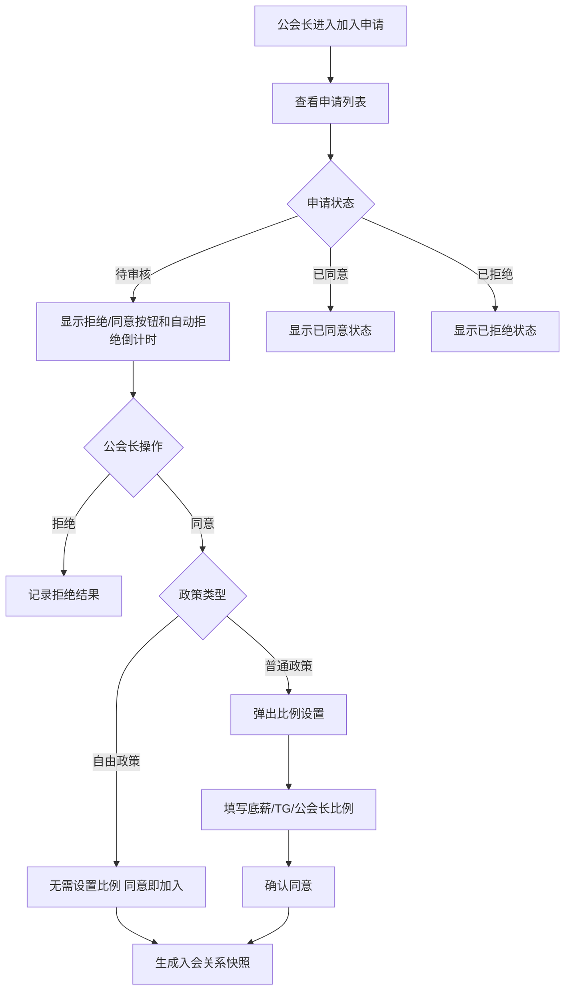

#### 交互逻辑

1. 公会长进入入会申请管理页，默认展示全部或待处理申请。
2. 点击 `全部 / 已同意 / 待处理 / 已拒绝` 切换申请列表。
3. 待审核申请展示“拒绝”“同意”和自动拒绝倒计时。
4. 点击“拒绝”后记录拒绝结果，申请状态变为已拒绝。
5. 点击普通政策申请的“同意”，弹出比例设置弹窗。
6. 公会长确认比例后，申请状态变为已同意，并生成入会关系和薪资参数快照。
7. 点击自由政策申请的“同意”，无需设置比例，直接同意加入公会。

#### 系统后台核心逻辑

| 逻辑点 | 规则 |
|---|---|
| 申请唯一性 | 同一主播同一时间只能有一个申请中记录 |
| 自动拒绝 | 超过倒计时时间未处理时，系统自动拒绝并记录原因 |
| 自由政策通过 | 同意后生成入会关系快照 |
| 普通政策通过 | 同意前必须确认主播底薪分成比例、主播TG奖励分成比例、公会长分成比例 |
| 参数快照 | 普通政策比例写入主播薪资参数快照，历史结算按快照读取 |
| 审计日志 | 同意、拒绝、自动拒绝、比例设置都必须留痕 |

#### 边界情况

| 场景 | 处理规则 |
|---|---|
| 申请已自动拒绝 | 不允许再点击同意或拒绝 |
| 普通政策比例合计异常 | 禁止提交并提示比例不合法 |
| 公会被冻结 | 暂停处理待审核申请 |
| 公会长重复点击同意 | 使用申请状态保证幂等，只生成一次入会关系 |


### 6.3 公会长薪资数据页

#### 对应原型


**功能描述：** 公会长薪资数据页用于展示公会长本人当前周期收益结果。`公会长视角-薪资页面` 是公会长薪资模块总览图，展示公会长薪资数据、公会薪资数据、历史明细入口和历史详情链路；本小节专门描述其中的“公会长薪资数据”页。公会长具有双身份：既可能作为主播产生本人主播收益，也会作为公会管理者产生公会长管理收益。页面不承载后台结算细账，只展示公会长本人可理解的结果摘要和后续入口。
**关键交互：** 公会长在薪资数据模块中切换到“公会长薪资数据”，查看作为主播等级信息、公会长收入和公会长总薪资余额；点击 `提现` 进入公会长提现总流程；点击 `历史明细` 进入公会长历史明细页；涉及金币工资奖励时进入金币奖励工资明细。

**功能说明：** 结合业务建模，公会长并不是单一收入身份，而是同时可能拥有“公会长管理收益”和“本人主播收益”两条收入链。客户端本页的职责，不是把后台结算明细全部摊开，而是按原型先展示这两条链的结果摘要、总可提现结果和后续入口；当公会长本人作为主播适用普通政策时，本页需要展示普通政策相关的本期有效钻石余额、薪资等级、有效天数和作为主播总薪资，但不额外展示主播底薪、主播TG奖励明细；更细的工资项、扣减、预支对冲、余额池变化，统一通过历史结算、公会薪资或提现记录继续下钻。

**端内薪资口径备注：** 公会长端所有公会长/主播薪资类字段默认包含金币奖励工资部分；普通政策下展示的作为主播总薪资、主播底薪、主播TG奖励、公会长总薪资、公会长总薪资余额、公会薪资余额等结果，均以已扣除未达标天数罚金后的薪资结果为准。

#### 前置条件

| 条件 | 规则 |
|---|---|
| 用户为公会长 | 可查看公会长收益数据 |
| 公会长本人兼主播 | 展示本人主播工资路径；否则不展示本人主播字段 |
| 当前周期已结算 | 展示正式结算结果；未结算时展示预估或待结算状态 |

#### 字段与数据来源

| 字段 | 业务定义 | 计算方式 / 取值规则 | 数据来源 |
|---|---|---|---|
| 公会名称 | 当前管理公会名称 | 直接读取 | 公会资料 |
| 公会 ID | 当前管理公会编号 | 直接读取 | 公会资料 |
| 公会人数 | 页面展示的公会人数摘要 | 读取当前公会人数展示结果 | 公会成员关系 |
| 可提现薪资 | 页面展示的公会长可提现薪资摘要 | 公会长总薪资余额 + 金币工资奖励余额；薪资结果包含金币奖励工资部分，普通政策结果已扣除未达标天数罚金 | 余额池汇总 |
| 作为主播等级信息 | 页面中的主播等级信息区块 | 仅在公会长本人兼主播时展示 | 页面区块 / 结算快照 |
| 本期有效钻石流水 | 公会长本人作为主播时，本期进入结算的有效钻石流水 | 按当期有效钻石流水结果读取 | 钻石流水快照 |
| 本期有效钻石余额 | 公会长本人作为主播时，本期有效钻石余额 | 按当期有效钻石余额结果读取 | 结算快照 |
| 薪资等级 | 公会长本人作为主播且适用普通政策时的薪资等级 | 普通政策读取当期结算快照；自由政策不展示或显示“-” | 结算快照 |
| 有效天数 | 公会长本人作为主播且适用普通政策时的有效天数 | 普通政策读取当期有效天结果；自由政策不展示或显示“-” | 有效天快照 |
| 公会长收入 | 公会长管理收益与本人主播收益的结果区块 | 公会长管理收益 + 本人主播收益 | 页面区块 / 结算快照 |
| 作为主播总薪资 | 公会长本人作为主播时的工资总额 | 自由政策读取本人按“有效钻石余额 × 自由政策分成比 ÷ 钻石折算美元工资比例 × 主播分成比例”换算后的主播工资结果；普通政策按“主播底薪 + 主播TG奖励”展示已扣除未达标天数罚金后的汇总结果；均包含金币工资奖励部分，不在本页拆出底薪/TG明细 | 主播结算明细 |
| 公会长总薪资 | 公会长管理收益结果 | 自由政策：汇总公会长分成工资；非自由政策：汇总所有主播对应的公会长奖励贡献 = 各主播公会长分成结果之和；包含金币奖励工资部分，普通政策结果已扣除未达标天数罚金 | 公会长收益明细 |
| 预支金额 | 当前周期计入本页结果的预支对冲金额 | 汇总当前周期已发生并计入本页结果的预支对冲金额 | 预支记录 / 结算抵扣单 |
| 公会长总薪资余额 | 公会长本人薪资余额结果 | 作为主播总薪资 + 公会长总薪资 - 预支金额；包含金币奖励工资部分，普通政策薪资结果已扣除未达标天数罚金 | 余额池汇总 |

#### 交互逻辑

1. 公会长进入薪资页后，默认展示公会长薪资数据。
2. 页面顶部展示公会基础信息和可提现薪资摘要。
3. 页面下方分为“作为主播等级信息”和“公会长收入”两个结果区。
4. 若公会长本人不是主播，则不展示“作为主播等级信息”相关字段。
5. 若公会长本人作为主播且适用普通政策，则“作为主播等级信息”区可展示本期有效钻石流水作为参考，同时必须展示本期有效钻石余额、薪资等级、有效天数和作为主播总薪资；作为主播总薪资按“主播底薪 + 主播TG奖励”的汇总结果展示，工资换算基数以有效钻石余额为准。
6. 若公会长本人作为主播但适用自由政策，则不展示薪资等级、有效天数等普通政策字段，只展示自由政策对应结果摘要。
7. 点击“公会薪资数据”切换到公会整体薪资页。
8. 点击“历史明细”进入公会长视角历史结算记录。
9. 点击“提现”进入公会长提现中心。

#### 系统后台核心逻辑

| 逻辑点 | 规则 |
|---|---|
| 双身份拆分 | 公会长本人作为主播的收益和公会长管理收益必须分别生成工资项，不能先汇总再拆分 |
| 普通政策本人主播收益 | 公会长本人作为主播且适用普通政策时，需按主播侧普通政策生成主播底薪、主播TG奖励、有效天统计和薪资等级快照；薪资结果已扣除未达标天数罚金且包含金币奖励工资部分；客户端本页只展示普通政策汇总字段，不额外展示底薪/TG明细 |
| 普通政策页面裁剪 | 公会长薪资数据页按原型展示普通政策相关结果摘要；主播底薪、主播TG奖励属于计算明细，不作为本页前端必显字段；汇总结果已扣除未达标天数罚金且包含金币奖励工资部分 |
| 预支对冲对象 | 公会长侧预支对冲只处理公会长本人主播身份下的预支，不替其他主播偿还预支 |
| 金币奖励拆分 | 公会长各工资项也必须同步拆分金币工资奖励和非金币工资奖励 |
| 余额池生成 | 非金币工资奖励进入个人薪资余额；金币工资奖励进入金币工资奖励余额池；主播转账单独进入主播转入薪资余额 |
| 历史追溯 | 历史公会长收益读取当期政策快照、身份快照、工资项拆分快照 |

#### 边界情况

| 场景 | 处理规则 |
|---|---|
| 公会长本人不作为主播 | 页面仅展示管理收益结果 |
| 公会长本人作为主播且适用普通政策 | 展示本期有效钻石余额、薪资等级、有效天数和作为主播总薪资，作为主播总薪资按主播底薪 + 主播TG奖励汇总展示，已扣除未达标天数罚金且包含金币奖励工资部分 |
| 公会长本人作为主播但适用自由政策 | 不展示薪资等级、有效天数等普通政策字段 |
| 管理收益被冻结 | 页面展示冻结提示 |

---
### 6.4 公会薪资数据页

#### 对应原型


**功能描述：** 公会薪资数据页用于展示当前公会维度的薪资总账结果，帮助公会长理解整个公会的主播薪资、公会长薪资、预支抵扣和公会薪资余额。它对应 `公会长视角-薪资页面` 总览图中的“公会薪资数据”Tab，是公会维度摘要页，不是后台财务审计明细页。
**关键交互：** 公会长可下钻查看主播明细和历史结算快照。

**功能说明：** 公会薪资数据页用于公会长查看整个公会的结算总账和主播分账，页面按原型展示总账结果与下钻入口。

#### 前置条件

| 条件 | 规则 |
|---|---|
| 用户为公会长 | 只能查看本人管理公会的数据 |
| 当前公会有结算数据 | 展示总账和成员分账 |
| 当前周期未结算 | 展示预估或待结算状态，并标明最终以结算快照为准 |

#### 字段与数据来源

| 字段 | 业务定义 | 计算方式 / 取值规则 | 数据来源 |
|---|---|---|---|
| 公会名称 | 当前结算公会名称 | 直接读取 | 公会资料 |
| 公会ID | 当前结算公会编号 | 直接读取 | 公会资料 |
| 公会人数 | 页面展示的当前公会人数摘要 | 页面展示结果 | 公会成员关系 |
| 个人可提现薪资 | 页面顶部展示的个人可提现薪资摘要 | 页面展示结果；薪资结果包含金币奖励工资部分，普通政策结果已扣除未达标天数罚金 | 余额池汇总 |
| 钻石流水数据 | 页面中的钻石流水数据区块 | 页面区块 | 页面区块 / 结算快照 |
| 本期有效钻石流水 | 当前公会本期有效钻石流水 | 汇总当前公会本期有效钻石流水；冻结、拒付、无效流水不计入 | 钻石流水快照 |
| 本期有效钻石余额 | 当前公会本期有效钻石余额 | 汇总当前公会本期有效钻石余额结果 | 结算快照 |
| 公会薪资明细 | 页面中的公会薪资明细区块 | 页面区块；薪资结果包含金币奖励工资部分，普通政策结果已扣除未达标天数罚金 | 页面区块 / 结算快照 |
| 主播总薪资 | 当前公会内主播工资合计 | 汇总当前公会内所有主播的主播总薪资结果 = 各主播主播总薪资之和；包含金币奖励工资部分，普通政策结果已扣除未达标天数罚金 | 主播结算明细 |
| 公会长总薪资 | 当前公会内公会长侧收益合计 | 汇总当前公会内所有公会长侧收益结果 = 各主播对应公会长奖励贡献之和；包含金币奖励工资部分，普通政策结果已扣除未达标天数罚金 | 公会长收益明细 + 主播结算明细 |
| 公会总薪资 | 当前公会当期工资总盘子 | 主播总薪资 + 公会长总薪资；包含金币奖励工资部分，普通政策结果已扣除未达标天数罚金 | 结算单 |
| 公会总预支金额 | 当前公会当期预支抵扣合计 | 汇总该期所有主播及公会长本人已发生并计入本期对冲的预支金额 | 预支记录 / 结算快照 |
| 公会薪资余额 | 当前公会当期薪资余额结果 | 主播总薪资 + 公会长总薪资 - 公会总预支金额；包含金币奖励工资部分，普通政策结果已扣除未达标天数罚金 | 余额池汇总 |
| 历史明细 | 查看历史结算明细的入口 | 点击后进入公会历史结算列表或详情 | 历史结算记录 |

#### 交互逻辑

1. 公会长从薪资页切换到“公会薪资数据”。
2. 页面顶部展示公会基础信息和当前政策。
3. 页面展示公会总账结果，并支持下钻查看成员分账。
4. 页面展示成员分账列表，支持查看单个主播薪资链路。
5. 点击历史明细，按月份进入历史公会结算快照。

#### 系统后台核心逻辑

| 逻辑点 | 规则 |
|---|---|
| 总账生成 | 公会结算单生成时同步生成公会总账和成员分账 |
| 成员分账 | 每位主播和公会长收益都必须有独立明细，不能只保留总额 |
| 校验关系 | 公会薪资总额必须能被主播明细、公会长收益明细、扣减、预支对冲解释 |
| 历史快照 | 历史公会薪资页读取结算快照，不读取实时流水重算 |
| 权限范围 | 公会长只能查看本人公会范围内成员分账，不能查看其他公会 |

#### 边界情况

| 场景 | 处理规则 |
|---|---|
| 主播月中离会 | 历史结果仍按快照展示 |
| 某主播冻结 | 页面展示对应状态提示 |

---
### 6.5 主播管理（公会长）

#### 对应原型


**功能描述：** 公会长主播管理页用于查看当前公会主播成员、搜索主播、调整政策、调整比例、配置限制兑钻余额数，并发起移出公会。
**关键交互：** 公会长通过“输入ID搜索主播成员”搜索主播；点击主播卡片右上角菜单后，可选择调整政策、调整比例或移出公会；点击“限制兑钻余额数配置”可配置钻石余额限制阈值。

**功能说明：** 主播管理页展示的是公会长对主播成员的管理入口。页面字段按原型保留主播卡片、比例字段和弹窗字段；每月1号可调整、比例快照、移除前强制结算等业务规则放在系统后台核心逻辑，不塞进页面字段表当作可见字段。

#### 前置条件

| 条件 | 规则 |
|---|---|
| 用户为公会长 | 才能进入主播管理 |
| 主播属于当前公会 | 才在主播成员列表展示 |
| 公会长拥有管理权限 | 才可执行调整政策、调整比例、移出公会 |

#### 页面字段与数据来源

| 字段 | 业务定义 | 取值规则 | 数据来源 |
|---|---|---|---|
| 公会名称 | 当前公会名称 | 读取当前管理公会 | 公会资料 |
| 公会ID | 当前公会ID，示例 `232323` | 读取当前管理公会 | 公会资料 |
| 公长ID | 当前公会长ID | 读取公会长账号ID | 公会关系 |
| 个人可提现薪资 | 公会长可提现金额摘要 | 读取余额池汇总；薪资结果包含金币奖励工资部分，普通政策结果已扣除未达标天数罚金 | 余额池快照 |
| 提现 | 提现入口按钮 | 点击进入公会长提现总流程 | 页面按钮 |
| 薪资数据 | 顶部导航入口 | 点击进入薪资数据 | 页面导航 |
| 入会申请 | 顶部导航入口 | 点击进入入会申请管理 | 页面导航 |
| 入会申请角标 | 图上示例为 `1` | 展示待处理申请数 | 入会申请记录 |
| 主播管理 | 当前页面导航入口 | 高亮当前模块 | 页面导航 |
| 限制兑钻余额数配置 | 配置入口 | 点击打开限制兑钻余额数弹窗 | 页面按钮 |
| 主播总人数 | 当前公会主播人数 | 读取当前公会主播数量，示例 `12` | 公会成员关系 |
| 主播成员搜索 | 搜索框，提示“输入ID搜索主播成员” | 按主播ID搜索当前公会成员 | 用户输入 / 公会成员关系 |
| 搜索 | 搜索按钮 | 点击执行搜索 | 页面按钮 |
| 主播名称 | 主播成员卡片名称 | 读取主播昵称 | 公会成员关系 / 用户资料 |
| 主播ID | 主播成员卡片ID | 读取主播ID | 公会成员关系 |
| 加入时间 | 主播加入当前公会时间 | 读取入会关系快照 | 入会关系快照 |
| 政策类型 | 当前主播政策类型 | 普通政策 / 自由政策 | 政策快照 |
| 奖励比例 | 主播当前奖励比例 | 读取当前比例快照 | 薪资参数快照 |
| 底薪奖励比例 | 普通政策主播底薪奖励比例 | 读取当前比例快照 | 薪资参数快照 |
| 公会长比例 | 普通政策下公会长分成比例 | 读取当前比例快照 | 薪资参数快照 |
| 调整政策 | 底部操作入口 | 打开调整主播政策弹窗 | 页面按钮 |
| 调整比例 | 底部操作入口 | 打开调整比例弹窗 | 页面按钮 |
| 移出公会 | 底部操作入口 | 打开移出公会确认弹窗 | 页面按钮 |

##### 限制兑钻余额数配置弹窗

| 字段 | 业务定义 | 取值规则 | 数据来源 |
|---|---|---|---|
| 限制兑钻余额数 | 弹窗标题和配置项 | 公会长输入限制阈值，示例 `4500000` | 后台配置 |
| 限制说明 | “主播钻石余额大于等于阈值时，将无法兑换钻石” | 固定提示或按配置展示 | 页面提示 |
| 取消 | 取消按钮 | 关闭弹窗不保存 | 页面按钮 |
| 确认 | 确认按钮 | 保存限制阈值 | 页面按钮 |

##### 调整比例弹窗

| 字段 | 业务定义 | 取值规则 | 数据来源 |
|---|---|---|---|
| 主播名称 | 被调整主播名称 | 读取当前主播 | 公会成员关系 |
| 主播ID | 被调整主播ID | 读取当前主播ID | 公会成员关系 |
| 加入时间 | 主播加入时间 | 读取入会快照 | 入会关系快照 |
| 政策类型 | 被调整主播当前政策类型 | 普通政策 / 自由政策 | 政策快照 |
| 主播底薪分成比例 | 普通政策底薪比例 | 公会长输入，示例 `45.34%` | 用户输入 / 配置校验 |
| 主播分成比例 | 主播分成比例 | 公会长输入，示例 `45.34%` | 用户输入 / 配置校验 |
| 公会长分成比例 | 公会长分成比例 | 系统联动或公会长输入，示例 `9.32%` | 用户输入 / 配置校验 |
| 取消 | 取消按钮 | 关闭弹窗不保存 | 页面按钮 |
| 同意 | 确认按钮 | 保存比例调整申请 | 页面按钮 |

##### 调整主播政策弹窗

| 字段 | 业务定义 | 取值规则 | 数据来源 |
|---|---|---|---|
| 调整主播政策 | 弹窗标题 | 固定展示 | 页面标题 |
| 自由政策 | 政策选项 | 选择后切换为自由政策 | 政策配置 |
| 普通政策 | 政策选项 | 选择后切换为普通政策 | 政策配置 |
| 取消 | 取消按钮 | 关闭弹窗不保存 | 页面按钮 |
| 确认 | 确认按钮 | 提交政策调整 | 页面按钮 |

##### 移出公会确认弹窗

| 字段 | 业务定义 | 取值规则 | 数据来源 |
|---|---|---|---|
| 主播头像 | 被移出主播头像 | 读取主播头像 | 用户资料 |
| 主播名称 | 被移出主播名称 | 读取主播昵称 | 用户资料 |
| 确认提示 | “确认要将该主播移出公会吗？” | 固定提示 | 页面弹窗 |
| 取消 | 取消移出 | 关闭弹窗 | 页面按钮 |
| 确认 | 确认移出 | 发起移出公会流程 | 页面按钮 |

#### 交互逻辑

1. 公会长进入主播管理，页面展示公会信息、个人可提现薪资、主播总人数和主播成员列表。
2. 公会长在搜索框输入主播ID并点击搜索，仅在当前公会成员范围内匹配。
3. 点击主播卡片右上角菜单，显示调整政策、调整比例、移出公会等操作。
4. 点击“限制兑钻余额数配置”，弹出阈值配置弹窗。
5. 点击“调整比例”，弹出比例设置弹窗；图上提示“仅每月1号可调整”。
6. 点击“调整政策”，弹出自由政策/普通政策选择弹窗。
7. 点击“移出公会”，弹出确认移出弹窗。

#### 系统后台核心逻辑

| 逻辑点 | 规则 |
|---|---|
| 搜索范围 | 只能搜索当前公会内主播成员 |
| 每月1号限制 | 调整政策和调整比例仅每月1号开放，非开放日不可提交 |
| 比例快照 | 调整比例成功后写入主播薪资参数快照，历史结算读取快照 |
| 政策调整快照 | 调整政策成功后写入政策绑定快照，不影响已结算历史周期 |
| 限制兑钻配置 | 保存后影响主播钻石余额达到阈值时的兑换能力 |
| 移出公会 | 公会长可发起移出，但不得跳过当期结算、预支抵扣和余额归属处理 |

#### 边界情况

| 场景 | 处理规则 |
|---|---|
| 搜索无结果 | 展示空状态，不扩大到其他公会搜索 |
| 非每月1号调整比例或政策 | 禁止提交并提示仅每月1号可调整 |
| 比例合计不合法 | 禁止保存并提示比例错误 |
| 主播存在未结算工资或预支 | 移出公会前必须进入结算保护流程 |
| 公会长移出主播后 | 结算后的余额和可提现资格挂主播本人，不被公会接管 |


### 6.6 公会长提现总流程

#### 对应原型


**功能描述：** 公会长提现总流程页用于汇总展示公会长可用余额池、可选提现出口和当前可申请金额。它是公会长从收益结果进入提现分流的入口，不直接提交申请。  
**关键交互：** 公会长从总流程页选择提现金币或提现现金；系统根据余额池类型、时间窗口和角色规则控制各出口可见性。

#### 前置条件

| 条件 | 规则 |
|---|---|
| 公会长存在可用余额 | 至少存在个人薪资余额、主播转入薪资余额或金币工资奖励余额 |
| 出口开放 | 现金提现仅每月1号开放 |
| 提现关系有效 | 提现逻辑读取当前余额池和角色规则 |

#### 字段与数据来源

##### 总览字段

| 字段 | 说明 | 数据来源 |
|---|---|---|
| 总可提现展示金额 | 公会长总薪资余额 + 金币工资奖励余额；薪资结果包含金币奖励工资部分，普通政策结果已扣除未达标天数罚金 | 公会长当前可见总额 |
| 提现金币入口 | 进入金币提现申请页 | 页面配置 |
| 提现现金入口 | 进入现金提现申请页 | 页面配置 |
| 金币工资奖励限制提示 | 当存在仅支持提现为金币的公会长本人金币工资奖励余额时，在提现现金或转账给他人/币商等非金币入口下方单独提示该金额 | 金币工资奖励余额 |
| 查看原因 | 打开“仅支持提现为金币的金额”说明弹窗 | 页面操作 |
| 当前审核中的申请数 | 当前待审核提现申请数量 | 提现申请记录 |

#### 交互逻辑

1. 公会长从首页或薪资页进入提现总流程页。
2. 系统展示当前可提现结果摘要。
3. 页面按规则开放提现金币和提现现金两个出口。
4. 当公会长存在金币工资奖励余额，且当前操作为提现现金、转账给他人/币商等非金币出口时，页面必须在金额区域下方单独展示提示：“有$X为回充工资仅支持提现为金币”，右侧展示“查看原因 >”。
5. 点击“查看原因 >”后，弹出“仅支持提现为金币的金额”说明弹窗，展示仅支持提现为金币的金额、限制原因、主按钮“去提现”和次级入口“查看明细”。
6. 点击“去提现”时，切换或跳转到提现金币流程；点击“查看明细”时，进入金币工资明细页，默认展示收入 Tab。
7. 点击具体出口后，进入对应申请页；总流程页本身不提交申请。
8. 若当前存在审核中的申请，页面展示申请状态并提供进入提现记录的入口。

#### 系统后台核心逻辑

- 提现总流程页只负责分流和规则展示，不直接消耗余额池。
- 各出口可见性必须由后台规则控制，不能只靠前端写死。
- 提交时必须在具体申请页重新读取余额池和冻结状态。
- 总流程页展示金额仅作引导，不作为最终申请金额依据。

#### 边界情况

| 场景 | 处理规则 |
|---|---|
| 仅有金币工资奖励余额 | 只开放提现金币 |
| 非金币出口中存在金币工资奖励余额 | 单独展示提示条和原因弹窗，输入上限不包含该部分金额 |
| 仅有主播转入薪资余额 | 可提现金币或现金，按出口规则处理 |
| 无任何可提现余额 | 展示空状态，不显示提交入口 |
| 现金提现非开放日 | 现金入口置灰并展示开放时间 |

### 6.7 公会长提现为金币

#### 对应原型


**功能描述：** 公会长提现为金币申请页，处理个人薪资余额、主播转入薪资余额和金币工资奖励余额参与金币提现的申请。这个页面回答的是“公会长这次提多少、折成多少金币”。  
**关键交互：** 公会长输入提现金额后提交；系统校验金额与入口规则后生成 Waiting 状态提现单。

#### 前置条件

| 条件 | 规则 |
|---|---|
| 公会长存在可提现金币余额 | 至少有个人薪资余额、主播转入薪资余额或金币工资奖励余额 |
| 提现金额合法 | 金额必须大于0且不超过金币出口可用总额 |
| 汇率可用 | 当前金币提现汇率配置有效 |

#### 字段与数据来源

##### 表单字段

| 字段 | 说明 | 数据来源 |
|---|---|---|
| 个人余额 | 个人薪资余额 | 公会长余额池 |
| 主播转入金额 | 主播转入薪资余额 | 主播转入薪资记录 |
| 金币工资奖励限制提示 | 提示公会长本人仅支持提现为金币的金币工资奖励金额 | 金币工资奖励余额 |
| 查看原因 | 打开“仅支持提现为金币的金额”说明弹窗 | 页面操作 |
| 提现金额 | 本次申请金额 | 用户输入 |
| All Balance | 一键填入全部余额 | 页面操作 |
| Exchange Coins | 页面展示的兑换金币说明区 | 页面展示结果 |
| 预计到账金币 | 页面展示的预计到账金币数量 | 页面计算结果 |
| 提现状态 | Waiting、Approved、Rejected、打款失败、已回滚 | 提现申请记录 |

#### 交互逻辑

1. 公会长进入金币提现页后，系统展示个人余额、主播转入金额和兑换金币说明。
2. 若从“仅支持提现为金币的金额”弹窗点击“去提现”进入本页，页面默认使用金币提现出口，并将公会长本人金币工资奖励余额纳入可提现金币金额。
3. 点击 All Balance 时，填入金币出口可用总额：个人薪资余额 + 主播转入薪资余额 + 金币工资奖励余额。
4. 输入提现金额后，系统即时校验是否超过当前可提现金额。
5. 页面同步展示预计到账金币数量。
6. 提交成功后，系统冻结对应金额并生成 Waiting 状态提现申请。
7. 提现记录中必须拆分展示“扣除可提现工资部分”和“扣除金币工资部分”。

#### 系统后台核心逻辑

- 个人薪资组内部扣减顺序固定为金币工资奖励余额＞个人薪资余额。
- 主播转入薪资余额与个人薪资组分开记录来源和扣减金额，不允许混成一个来源字段。
- 金币提现申请快照必须分别记录扣除可提现工资部分、扣除金币工资部分和扣除主播转入薪资部分。
- 提交时冻结对应金额；审核通过后正式扣减并发放金币。
- 审核拒绝或打款失败时，必须按原余额池释放或回滚。

#### 边界情况

| 场景 | 处理规则 |
|---|---|
| 金额超过当前可提现金额 | 禁止提交 |
| 提交后余额变化 | 以提交时冻结结果为准 |

### 6.8 公会长提现为现金

#### 对应原型


**功能描述：** 公会长提现为现金申请页，处理公会长工资型余额的现金提现。它承接的是“公会长把工资型余额按外部收款方式提走”，金币工资奖励余额在这里不可用。  
**关键交互：** 公会长填写提现金额和收款方式后提交；系统校验金额、入口规则并生成 Waiting 状态提现单。

#### 前置条件

| 条件 | 规则 |
|---|---|
| 现金入口开放 | 现金提现仅每月1号开放入口 |
| 公会长存在工资型余额 | 至少存在个人薪资余额或主播转入薪资余额 |
| 金币工资奖励余额不可用 | 该余额不能提现现金 |
| 收款方式有效 | 需填写并校验收款方式和账号 |

#### 字段与数据来源

##### 表单字段

| 字段 | 说明 | 数据来源 |
|---|---|---|
| 个人余额 | 个人薪资余额 | 公会长余额池 |
| 主播转入金额 | 主播转入薪资余额 | 主播转入薪资记录 |
| 回充工资提示 | 金币工资奖励余额仅支持金币提现，不参与现金提现 | 页面展示结果 |
| 查看原因 | 查看回充工资说明入口 | 页面操作 |
| 提现金额 | 本次申请金额 | 用户输入 |
| 提现方式 | USDT、Bank、Vodafone、Shamcash、Easypaisa、JazzCash 等 | 提现渠道配置 |
| Account | 收款账号输入项 | 用户输入 / 历史账号 |
| 提现状态 | Waiting、Approved、Rejected、打款失败、已回滚 | 提现申请记录 |
| 现金开放说明 | 现金提现仅在开放时间窗口内可提交 | 页面展示结果 |

#### 交互逻辑

1. 公会长进入现金提现页后，系统展示个人余额、主播转入金额和回充工资提示。
2. 当公会长存在金币工资奖励余额时，页面不把该金额计入现金可提现额度，而是在金额区域下方单独展示“有$X为回充工资仅支持提现为金币”，右侧展示“查看原因 >”。
3. 点击“查看原因 >”打开“仅支持提现为金币的金额”说明弹窗；点击弹窗“去提现”切换到提现金币流程，点击“查看明细”进入金币工资明细页。
4. 页面展示可选提现方式和 Account 输入项。
5. 公会长填写金额和收款方式后，系统即时校验金额、账号和开放时间，金额上限不包含金币工资奖励余额。
6. 提交成功后，系统冻结对应金额并生成 Waiting 状态提现申请。
7. 审核、打款、失败和回滚结果在提现记录中查看。

#### 系统后台核心逻辑

- 金币工资奖励余额不得提现现金，系统必须阻断而不是只前端置灰。
- 提交时冻结对应金额；审核通过后正式扣减并执行外部打款。
- 主播转入薪资余额与公会长个人薪资余额虽同属工资型余额，但来源必须分开记录。
- 审核拒绝和打款失败时，必须按原余额池释放或回滚。

#### 边界情况

| 场景 | 处理规则 |
|---|---|
| 只选主播转入薪资余额 | 允许提交现金提现 |
| 金币奖励余额尝试提现现金 | 禁止提交并提示转到金币提现 |
| 收款账号为空或格式错误 | 禁止提交 |
| 非开放日进入页面 | 允许查看，不允许提交 |


### 6.8A 金币工资明细（公会长视角）

#### 对应原型


**功能描述：** 本节由两张原型共同组成：`主播_公会长-金币工资奖励说明` 对应非金币出口下的限制提示、原因弹窗和跳转入口；`金币奖励工资明细` 对应进入明细页后的 `收入 / 提现` 两个 Tab。该页只解释公会长本人可用余额中的金币工资奖励部分，不解释主播转入薪资余额。
**关键交互：** 公会长在提现现金等非金币出口看到限制提示后，点击“查看原因 >”打开说明弹窗；点击“去提现”进入金币提现；点击“查看明细”进入金币工资明细页，默认收入 Tab，可切换到提现 Tab 查看每笔金币提现对普通可提现工资和金币工资部分的扣减。

#### 字段与数据来源

##### 说明弹窗字段

| 字段 | 说明 | 数据来源 |
|---|---|---|
| 仅支持提现为金币的金额 | 公会长本人当前仅能走金币提现出口的金币工资奖励余额 | 金币工资奖励余额 |
| 限制说明 | 说明该部分金额属于金币工资奖励，仅支持提现为金币 | 页面文案配置 |
| 去提现 | 跳转或切换到公会长提现金币流程 | 页面操作 |
| 查看明细 | 进入金币工资明细页，默认收入 Tab | 页面操作 |

##### 收入 Tab 字段

| 字段 | 说明 | 数据来源 |
|---|---|---|
| 工资周期 | 金币工资奖励产生的结算周期 | 结算快照 |
| 总工资 | 公会长本人该周期参与金币工资奖励拆分的工资总额 | 结算快照 |
| 金币工资奖励占比 | 该周期工资中拆为金币工资奖励的比例 | 政策结算快照 |
| 金币工资金额 | 该周期产生的金币工资奖励金额 | 金币工资奖励明细 |

##### 提现 Tab 字段

| 字段 | 说明 | 数据来源 |
|---|---|---|
| UserId | 公会长用户 ID | 提现申请记录 |
| Withdrawal Amount | 本次提现金额 | 提现申请记录 |
| Withdrawal Method | 提现方式，原型展示为 coins | 提现申请记录 |
| 扣除可提现工资部分 | 本次金币提现中消耗的普通可提现工资金额 | 提现扣减快照 |
| 扣除金币工资部分 | 本次金币提现中消耗的金币工资奖励金额 | 提现扣减快照 |
| 审核状态 | Approved、Waiting、Rejected、打款失败、已回滚等状态 | 提现申请记录 |
| 提现时间 | 提现申请或审核通过时间 | 提现申请记录 |

#### 交互逻辑

1. 公会长非金币出口中若存在本人金币工资奖励余额，页面展示限制提示和“查看原因 >”。
2. 点击“查看原因 >”后弹出说明弹窗，展示仅支持提现为金币的金额和限制原因。
3. 点击“去提现”时进入公会长提现金币流程，金币工资奖励余额参与金币提现可用金额。
4. 点击“查看明细”时进入金币工资明细页，默认展示收入 Tab。
5. 公会长点击“收入 / 提现”Tab 时，在金币工资奖励产生明细和金币提现消耗明细之间切换。

#### 系统后台核心逻辑

- 本页只统计公会长本人金币工资奖励，不把主播转入薪资余额误算为金币工资奖励。
- 弹窗金额、提示条金额和明细页余额必须读取同一套金币工资奖励余额口径。
- 公会长金币提现若同时消耗普通可提现工资和金币工资奖励，申请快照必须分别记录两部分扣减金额。
- 现金提现不得消耗金币工资奖励余额，系统必须在提交侧阻断。

#### 边界情况

| 场景 | 处理规则 |
|---|---|
| 公会长本人金币工资奖励余额为0 | 不展示限制提示，不展示“查看原因”入口 |
| 仅有主播转入薪资余额 | 不展示金币工资奖励限制提示 |
| 点击去提现但金币出口不可用 | 展示不可提现原因，不允许提交 |
| 明细为空 | 收入或提现 Tab 分别展示空状态 |
### 6.9 历史结算记录列表（公会长视角）

#### 对应原型


**功能描述：** 公会长历史明细页按月份展示当前公会的历史结算快照，包含公会薪资数据和主播薪资数据卡片。`公会长视角-薪资页面` 总览图展示了从“公会薪资数据 / 公会长薪资数据”点击 `历史明细` 进入本页的链路；本节引用的 `公会长视角-历史结算记录` 是历史明细专属图，列表和详情在同一历史明细页中展开展示。
**关键交互：** 公会长通过“选择日期”切换月份，页面读取该月历史快照；左上角返回上一层。


#### 前置条件

| 条件 | 规则 |
|---|---|
| 用户为公会长 | 只能查看本人管理公会范围内历史结算 |
| 存在历史结算快照 | 按月份展示历史明细 |
| 公会已停用或解散 | 历史已结算数据仍可查看 |

#### 页面字段与数据来源

##### 顶部与筛选字段

| 字段 | 业务定义 | 取值规则 | 数据来源 |
|---|---|---|---|
| 历史明细 | 页面标题 | 固定展示 | 页面标题 |
| 返回 | 左上角返回入口 | 点击返回上一层 | 页面按钮 |
| 公会头像 | 当前公会头像 | 读取历史快照或当前公会头像 | 公会快照 |
| 公会名称 | 历史周期对应公会名称 | 读取历史快照 | 公会快照 |
| 公会ID | 历史周期对应公会ID | 读取历史快照，示例 `232323` | 公会快照 |
| 公会人数 | 历史周期公会人数 | 读取历史快照，示例 `1/200` | 公会快照 |
| 选择日期 | 月份选择入口 | 按月份切换历史快照，示例 `2015-10` | 日期选择 / 结算快照 |

##### 公会薪资数据字段

| 字段 | 业务定义 | 取值规则 | 数据来源 |
|---|---|---|---|
| 公会薪资数据 | 公会历史总账区块 | 展示所选月份公会结算摘要 | 页面区块 / 结算快照 |
| 钻石流水数据 | 钻石流水摘要区块 | 展示有效流水与有效余额 | 页面区块 / 钻石流水快照 |
| 本期有效钻石流水 | 公会当期有效钻石流水 | 读取历史结算快照 | 钻石流水快照 |
| 本期有效钻石余额 | 公会当期有效钻石余额 | 读取历史结算快照 | 结算快照 |
| 公会薪资明细 | 公会历史薪资汇总区块 | 展示公会总账结果；薪资结果包含金币奖励工资部分，普通政策结果已扣除未达标天数罚金 | 页面区块 / 结算快照 |
| 主播总薪资 | 当期主播侧工资合计 | 汇总该期所有主播总薪资；包含金币奖励工资部分，普通政策结果已扣除未达标天数罚金 | 主播结算明细 |
| 公会长总薪资 | 当期公会长侧收益合计 | 汇总该期公会长分成和管理收益；包含金币奖励工资部分，普通政策结果已扣除未达标天数罚金 | 公会长收益明细 |
| 公会总薪资 | 当期公会总工资盘子 | 公会总薪资 = 主播总薪资 + 公会长总薪资；包含金币奖励工资部分，普通政策结果已扣除未达标天数罚金 | 结算快照 |
| 公会总预支金额 | 当期纳入抵扣链路的预支合计 | 汇总该期主播与公会长本人预支抵扣金额 | 预支记录 / 结算抵扣单 |
| 公会薪资余额 | 当期公会工资余额结果 | 公会薪资余额 = 公会总薪资 - 公会总预支金额；包含金币奖励工资部分，普通政策结果已扣除未达标天数罚金 | 余额池汇总 |

##### 主播薪资数据卡片字段

| 字段 | 业务定义 | 取值规则 | 数据来源 |
|---|---|---|---|
| 本月主播薪资数据 | 主播历史结算卡片区块 | 每个主播展示一张历史薪资卡片 | 页面区块 / 主播结算快照 |
| 未达标 | 主播该期达标状态 | 读取该期结算快照 | 结算快照 |
| 已离职 | 主播历史状态标签 | 主播在当前查看时或该期后已离职时展示 | 主播关系快照 |
| 主播名称 | 主播卡片名称 | 读取主播快照 | 主播快照 |
| 主播ID | 主播卡片ID | 读取主播ID | 主播快照 |
| 加入时间 | 主播加入当前公会时间 | 读取入会快照 | 入会关系快照 |
| 政策类型 | 该历史周期主播适用政策 | 普通政策 / 自由政策 | 政策快照 |
| 奖励比例 | 普通政策卡片展示比例 | 读取该期参数快照 | 薪资参数快照 |
| 底薪奖励比例 | 普通政策底薪比例 | 读取该期参数快照 | 薪资参数快照 |
| 公会长比例 | 公会长分成比例 | 读取该期参数快照 | 薪资参数快照 |
| 本期有效钻石流水 | 主播该期有效钻石流水 | 读取主播历史快照 | 钻石流水快照 |
| 本期有效钻石余额 | 主播该期有效钻石余额 | 读取主播历史快照 | 结算快照 |
| 薪资等级 | 普通政策主播命中等级 | 普通政策展示，自由政策不展示 | 结算快照 |
| 有效天数 | 普通政策主播有效天数 | 普通政策展示，自由政策不展示 | 有效天统计快照 |
| 主播底薪 | 普通政策主播底薪结果 | 普通政策展示，自由政策不展示；已扣除未达标天数罚金，包含金币奖励工资部分 | 主播结算明细 |
| 主播TG奖励 | 普通政策主播TG奖励结果 | 普通政策展示，自由政策不展示；已扣除未达标天数罚金，包含金币奖励工资部分 | 主播结算明细 |
| 主播总薪资 | 主播该期总薪资 | 普通政策=主播底薪+主播TG奖励，且已扣除未达标天数罚金；自由政策=有效钻石余额 × 自由政策分成比 ÷ 钻石折算美元工资比例 × 主播分成比例；均包含金币工资奖励部分 | 主播结算明细 |
| 主播已预支 | 主播该期已进入抵扣链路的预支金额 | 读取该期抵扣结果 | 预支记录 / 结算抵扣单 |
| 主播薪资余额 | 主播该期工资型余额快照 | 主播总薪资 - 主播已预支金额；包含金币奖励工资部分，普通政策结果已扣除未达标天数罚金 | 余额池快照；后续资金动作不回写该快照 |
| 公会长分成 | 该主播给公会长侧产生的分成结果 | 读取该主播对应公会长分成快照 | 公会长收益明细 |

#### 交互逻辑

1. 公会长进入历史明细页，默认展示最近可查看月份。
2. 点击日期选择框切换月份。
3. 页面上方展示公会薪资数据，下方展示该期主播薪资数据卡片。
4. 普通政策主播卡片展示薪资等级、有效天数、主播底薪、主播TG奖励等字段。
5. 自由政策主播卡片不展示薪资等级、有效天数、主播底薪、主播TG奖励，只展示自由政策对应薪资结果。
6. 页面金额和状态均读取历史快照，不因当前政策或主播状态变化重算。

#### 系统后台核心逻辑

| 逻辑点 | 规则 |
|---|---|
| 快照不可重算 | 历史明细只读取当期快照，不读取当前最新政策配置 |
| 权限范围 | 公会长只能查看本人管理公会的历史结算 |
| 字段按政策裁剪 | 普通政策与自由政策主播卡片字段不同，不能共用一套字段模板 |
| 状态标签 | `已离职` 只表示主播状态，不改变该历史周期结算归属 |
| 对账用途 | 客服、财务、公会长争议处理均以该历史快照为准 |

#### 边界情况

| 场景 | 处理规则 |
|---|---|
| 历史快照缺失 | 标记异常记录，禁止作为正常对账依据 |
| 公会已解散 | 历史明细仍保留 |
| 主播已离会 | 展示历史期结果和状态标签，不影响历史金额 |
| 退款/拒付后续处置 | 当前页展示原期快照，具体处置在后台或补充记录中追溯 |
### 6.10 历史结算记录详情（公会长视角）

#### 对应原型


**功能描述：** 公会长历史结算详情与列表使用同一张历史明细原型，详情内容在页面中以公会薪资数据和主播薪资数据卡片展开。它用于解释所选月份的公会总账、主播分账和公会长分成。
**关键交互：** 公会长通过月份切换查看不同历史周期；页面展示公会总账区和主播卡片区，不提供重新计算或编辑入口。

**功能说明：** 本节补充 `6.9` 中同一历史明细原型的详情口径。由于原型未提供单独详情页截图，因此不硬编第二张详情图；详情能力以当前历史明细页中的展开卡片为准。

#### 前置条件

| 条件 | 规则 |
|---|---|
| 已进入某期历史记录 | 详情必须绑定具体结算月份 |
| 结算快照存在 | 所有金额读取当期快照 |
| 公会长权限有效 | 只能查看本人公会范围内明细 |

#### 详情字段

| 字段 | 业务定义 | 取值规则 | 数据来源 |
|---|---|---|---|
| 历史明细 | 当前查看的历史结算详情页 | 固定展示页面标题 | 页面标题 |
| 选择日期 | 当前历史月份 | 按月份读取历史快照 | 日期选择 / 结算快照 |
| 公会薪资数据 | 公会总账详情区块 | 展示钻石流水、公会薪资明细和余额结果；薪资结果包含金币奖励工资部分，普通政策结果已扣除未达标天数罚金 | 结算快照 |
| 钻石流水数据 | 公会有效流水摘要 | 展示本期有效钻石流水、本期有效钻石余额 | 钻石流水快照 |
| 公会薪资明细 | 公会工资汇总区块 | 展示主播总薪资、公会长总薪资、公会总薪资、公会总预支金额、公会薪资余额；薪资结果包含金币奖励工资部分，普通政策结果已扣除未达标天数罚金 | 结算快照 |
| 本月主播薪资数据 | 主播分账详情卡片 | 展示主播基础信息、政策类型、比例、状态和薪资结果 | 主播结算快照 |
| 政策类型 | 主播该期政策类型 | 普通政策 / 自由政策 | 政策快照 |
| 奖励比例 | 普通政策奖励比例 | 普通政策主播卡片展示 | 薪资参数快照 |
| 底薪奖励比例 | 普通政策底薪比例 | 普通政策主播卡片展示 | 薪资参数快照 |
| 公会长比例 | 公会长分成比例 | 普通政策和自由政策按原型展示 | 薪资参数快照 |
| 薪资等级 | 普通政策薪资等级 | 普通政策展示，自由政策不展示 | 结算快照 |
| 有效天数 | 普通政策有效天数 | 普通政策展示，自由政策不展示 | 有效天统计快照 |
| 主播底薪 | 普通政策主播底薪 | 普通政策展示，自由政策不展示；已扣除未达标天数罚金，包含金币奖励工资部分 | 主播结算明细 |
| 主播TG奖励 | 普通政策主播TG奖励 | 普通政策展示，自由政策不展示；已扣除未达标天数罚金，包含金币奖励工资部分 | 主播结算明细 |
| 主播总薪资 | 主播该期总薪资 | 普通政策=主播底薪+主播TG奖励，且已扣除未达标天数罚金；自由政策=有效钻石余额 × 自由政策分成比 ÷ 钻石折算美元工资比例 × 主播分成比例；均包含金币工资奖励部分 | 主播结算明细 |
| 主播已预支 | 主播该期预支抵扣金额 | 读取该期抵扣结果 | 预支记录 / 结算抵扣单 |
| 主播薪资余额 | 主播该期工资型余额快照 | 主播总薪资 - 主播已预支金额；包含金币奖励工资部分，普通政策结果已扣除未达标天数罚金 | 余额池快照；后续资金动作不回写该快照 |
| 公会长分成 | 单个主播对应的公会长侧分成 | 读取该主播对应分成结果 | 公会长收益明细 |

#### 交互逻辑

1. 公会长进入历史明细后，页面按所选月份展示详情数据。
2. 公会薪资数据展示公会总账摘要。
3. 本月主播薪资数据以卡片形式展示主播级分账。
4. 普通政策主播卡片展示等级、有效天、底薪、TG奖励和预支抵扣。
5. 自由政策主播卡片不展示普通政策专属字段。
6. 页面不提供重新计算、修改比例、审核或导出操作；这些动作属于后台。

#### 系统后台核心逻辑

| 逻辑点 | 规则 |
|---|---|
| 同图详情 | 详情能力来自同一历史明细原型的展开内容，不单独编造详情专属图 |
| 快照锁定 | 详情页所有金额读取历史快照，不随当前政策变化重算 |
| 政策裁剪 | 普通政策和自由政策主播卡片字段必须按原型裁剪 |
| 状态展示 | `未达标`、`已离职` 作为历史状态标签展示，不改变历史金额 |

#### 边界情况

| 场景 | 处理规则 |
|---|---|
| 自由政策主播卡片 | 不展示薪资等级、有效天数、主播底薪、主播TG奖励 |
| 普通政策未达标 | 展示未达标标签，金额读取历史快照 |
| 主播已离职 | 展示已离职标签，历史归属不重算 |
| 历史快照异常 | 标记异常，禁止作为正常对账依据 |


### 6.11 主播移除与离会处理（公会长发起）

#### 对应原型


**功能描述：** 主播管理中的离会/移除处理入口，用于公会长发起主动移除或查看主播离会状态。
**关键交互：** 公会长发起移除后，系统继续处理该主播后续离会流程。

**功能说明：** 公会长可发起移除主播，但不得绕过结算。页面用于确认移除动作和当前状态，具体结算处理按系统规则执行。

#### 前置条件

| 条件 | 规则 |
|---|---|
| 公会长拥有管理权限 | 只能移除本人公会内主播 |
| 主播属于当前公会 | 已离会主播不可重复移除 |
| 公会主动移除场景 | 默认不对主播收取违约金；被公会移出后也进入冷静期 |

#### 字段与数据来源

| 字段 | 说明 | 数据来源 |
|---|---|---|
| 主播ID / 昵称 | 被移除主播 | 用户资料 |
| 当前公会 | 主播当前所属公会 | 公会关系快照 |
| 当前政策 | 主播当前适用政策 | 政策绑定快照 |
| 主播ID / 昵称 | 被移除主播 | 用户资料 |
| 当前公会 | 主播当前所属公会 | 公会关系快照 |
| 当前政策 | 主播当前适用政策 | 政策绑定快照 |
| 操作人 / 操作时间 | 公会长发起记录 | 审计日志 |

#### 业务流程图

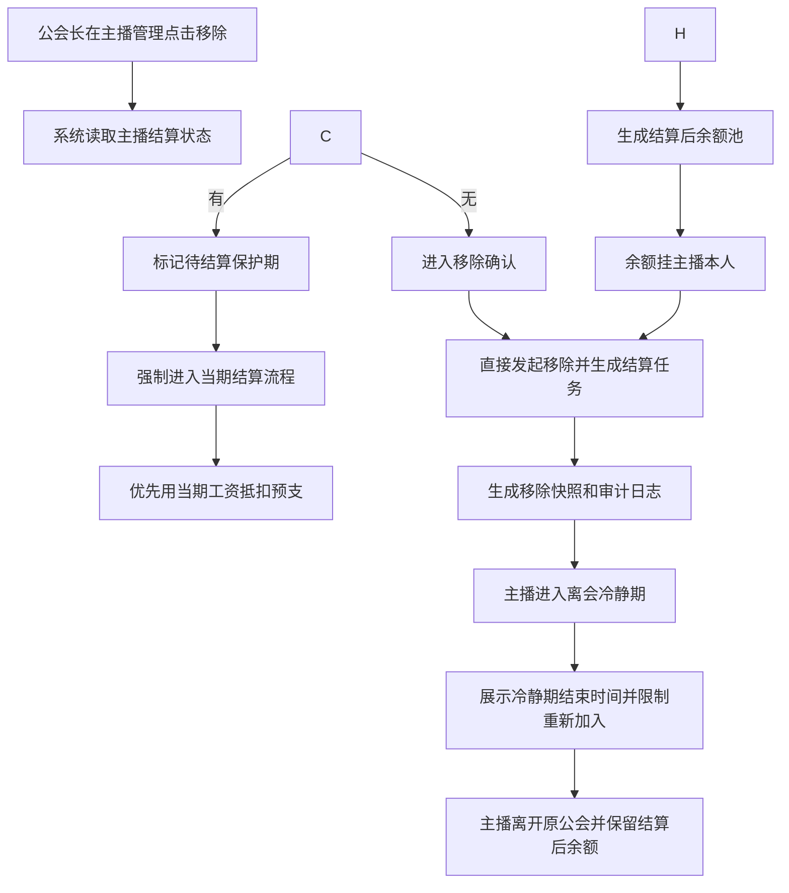

#### 交互逻辑

**入口与初始化**
1. 公会长在主播管理列表点击“移除主播”。
2. 系统弹出移除确认页，展示主播基础信息和当前状态。

**确认与执行**
3. 公会长确认移除后，系统继续处理该主播后续离会流程。

**结果与后续**
4. 历史结果仍按快照保留。

#### 系统后台核心逻辑

| 逻辑点 | 规则 |
|---|---|
| 不允许直接移除 | 公会主动移除可以发起，但不得跳过当期结算流程 |
| 预支优先抵扣 | 当期工资优先用于抵扣主播本人预支，未结清部分继续挂主播本人 |
| 违约金 | 公会主动移除默认不对主播收取违约金；如产品后续另有规则需单独配置 |
| 余额归属 | 结算后的余额和可提现资格挂主播本人，不随主播后续公会变化转移 |
| 历史流水归属 | 移除前已产生流水仍按原公会快照结算 |
| 审计日志 | 记录移除发起人、发起时间、结算完成时间、余额快照 |
| 冷静期 | 公会主动移除后进入冷静期，冷静期内不可重新加入公会 |

#### 边界情况

| 场景 | 处理规则 |
|---|---|
| 主播存在未结算工资 | 进入待结算保护期，结算完成后才能正式离开 |
| 主播有未抵扣预支 | 当期工资优先抵扣，不足部分继续挂主播本人 |
| 公会主动移除无过错主播 | 默认豁免违约金 |
| 移除后主播加入新公会 | 新公会只影响离会后新产生流水，不接管旧周期余额 |

---

## 九、后台需求

### 9.1 后台工作台

#### 功能说明


#### 字段与数据来源

| 字段 | 说明 | 统计方式 | 数据来源 |
|---|---|---|---|
| 当月钻石流水 | 当前月所有有效公会钻石流水 | 按自然月汇总 | 钻石流水 |
| 待结算公会数 | 当前周期需要结算但未确认的公会数 | 结算状态=待确认 | 结算单 |
| 待审核提现单数 | Waiting 状态提现单数量 | 状态汇总 | 提现申请 |
| 待处理预支单数 | 待审核或待发放预支单数量 | 状态汇总 | 预支记录 |
| 高风险公会数 | 触发高风险标签的公会数量 | 风险标签汇总 | 事件/公会资料 |

### 9.2 公会管理

#### 对应原型


#### 前置条件

| 条件 | 处理规则 |
|---|---|
| 操作人权限 | 操作人已登录后台，并具备公会管理查看权限；导出Excel需具备公会数据导出权限 |
| 公会主体有效 | 新增或编辑公会时，必须存在有效公会主体资料、负责人账号和收款主体 |
| 政策绑定前置 | 绑定政策前，公会状态必须为正常或运营允许处理状态 |
| 状态变更留痕 | 冻结、解散、清退类操作必须填写原因并写入审计日志 |

#### 字段与数据来源

##### 列表字段

| 字段 | 说明 | 数据来源 |
|---|---|---|
| 公会名称 | 公会展示名称 | 公会资料 |
| 公会ID | 公会唯一编号 | 公会资料 |
| 公会长名称 | 当前公会长名称 | 公会关系 / 用户资料 |
| 公会长ID | 当前公会长账号ID | 公会关系 / 用户资料 |
| 主播数量 | 当前有效主播数量 | 公会成员关系 |
| 创建时间 | 公会创建时间 | 公会资料 |
| 操作 | 编辑、解散、导出Excel | 权限配置 / 导出日志 |

##### 弹窗字段

| 字段 | 说明 | 数据来源 |
|---|---|---|
| 公会名称 | 新建/编辑公会时填写的公会名称 | 公会资料 / 用户输入 |
| 公会长ID | 新建/编辑公会时填写的公会长账号ID | 用户资料 / 用户输入 |
| 推荐人ID | 新建公会时填写的推荐人账号ID | 用户资料 / 用户输入 |
| 备注 | 新建公会时的补充说明 | 用户输入 |
| 用户名称 | 编辑公会时公会长信息卡片中的用户名称 | 用户资料 |
| 用户ID | 编辑公会时公会长信息卡片中的用户账号ID | 用户资料 |
| 用户昵称ID | 编辑公会时公会长信息卡片中的昵称或业务ID | 用户资料 |

##### 校验规则

| 校验项 | 规则 |
|---|---|
| 公会长ID存在性 | 输入公会长ID后，系统必须校验该账号是否存在；不存在则禁止创建/保存 |
| 公会长ID唯一性 | 输入公会长ID后，系统必须校验该账号是否已存在于其他公会；若已绑定其他公会，则禁止重复创建/保存 |
| 公会名称必填 | 未填写公会名称时禁止创建/保存 |
| 解散确认 | 点击“解散”时弹出二次确认“确定要解散该公会吗?”，确认后才执行 |
| 编辑限制 | 历史结算快照和历史主体关系不允许直接通过编辑弹窗篡改 |

#### 交互逻辑

1. 运营进入公会管理页后，默认查看公会列表。
2. 点击“新建”时，系统打开“新建公会”弹窗，展示字段：公会名称、公会长ID、推荐人ID、备注。
3. 点击“导出Excel”时，系统按当前公会名称、公会ID、公会长ID、状态等筛选条件导出列表字段，并记录导出人、导出时间和筛选条件。
3. 输入公会长ID后，系统立即校验该ID是否存在；若不存在，禁止创建并提示公会长ID不存在。
4. 若公会长ID存在，系统继续校验该ID是否已存在于其他公会；若已绑定其他公会，禁止创建并提示该公会长已存在公会。
5. 所有校验通过后，点击“创建”才允许生成公会记录。
6. 创建成功后，系统默认将“公会长作为主播”的政策初始化为“非自由政策”，后续如需调整，再通过后台政策绑定或主播政策配置处理。
7. 点击“编辑”时，系统打开“编辑公会”弹窗，展示公会名称、公会长ID、推荐人以及公会长信息卡片（用户名称、用户ID、用户昵称ID）。
8. 编辑时同样校验公会长ID存在性和唯一性；校验失败则禁止保存。
9. 点击“解散”时，系统弹出二次确认“确定要解散该公会吗?”，只有点击“确认”后才执行解散。

#### 系统后台核心逻辑

- 创建公会时，公会长ID必须经过“存在性 + 唯一性”双校验，任何一项失败都不得落库。
- 创建公会成功后，系统默认将公会长作为主播的政策初始化为“非自由政策”；该默认值用于公会长本人主播身份口径，不等同于整个平台公会策略自动绑定完成。
- 公会状态直接影响主播入会、结算、预支、提现，不允许只改前台展示状态。
- 政策绑定必须生成绑定快照，结算读取快照而不是读取最新编辑值。
- 公会解散时必须走确认动作，不得无确认直接执行。
- 公会解散或清退时，必须先处理未结算流水、主播工资、预支和余额归属，不能直接删除主体关系。
- 公会详情中的历史结算、历史提现、历史风险事件都必须可回溯到具体快照或日志。

#### 边界情况

| 场景 | 处理规则 |
|---|---|
| 公会状态为冻结 | 禁止新增绑定、限制新增预支和现金提现，已产生流水进入复核池 |
| 公会无有效政策 | 只记录钻石流水，不进入政策结算，需运营补绑定或确认默认政策 |
| 公会已解散 | 历史结算和余额仍保留，不能因主体状态变化而丢失快照 |

### 9.3 主播列表

#### 对应原型


#### 前置条件

| 条件 | 处理规则 |
|---|---|
| 操作人权限 | 操作人具备主播资料查看权限；主播薪资导出Excel需具备薪资数据导出权限 |
| 关系快照可读 | 主播列表读取当前主播状态，并可回看最近一次公会关系快照 |
| 敏感操作权限 | 冻结、解冻、移除、归属调整必须具备对应操作权限并填写原因 |

#### 字段与数据来源

##### 筛选项

| 字段 | 说明 | 数据来源 |
|---|---|---|
| 公会ID | 按公会ID筛选主播 | 公会关系快照 |
| 公会名称 | 按公会名称筛选主播 | 公会关系快照 |
| 公会长ID | 按公会长ID筛选主播 | 公会关系快照 / 用户资料 |
| 国家 | 按国家筛选主播所属公会 | 公会资料 |
| 政策结构 | 按主播当前政策结构筛选 | 政策绑定快照 |

##### 列表字段

| 字段 | 说明 | 数据来源 |
|---|---|---|
| 主播名称 | 主播名称 | 用户资料 |
| 主播ID | 主播唯一编号 | 用户资料 |
| 性别 | 主播性别 | 用户资料 |
| 公会名称 | 当前有效公会名称 | 公会关系快照 |
| 公会ID | 当前有效公会ID | 公会关系快照 |
| 结算政策 | 当前主播所属结算政策 | 政策绑定快照 |
| 国家 | 主播所属公会国家 | 公会资料 |
| 用户状态 | 正常、冻结、已离会等 | 主播状态 |
| 入会时间 | 当前公会加入时间 | 公会关系快照 |
| 操作 | 踢出公会、修改政策、禁止兑钻、解除禁止兑钻、导出Excel | 权限配置 / 导出日志 |

##### 弹窗与操作字段

| 字段 | 说明 | 数据来源 |
|---|---|---|
| 新增成员 | 新增成员弹窗标题 | 页面状态 |
| 主播ID | 新增成员时输入的主播ID | 用户输入 / 用户资料 |
| 会长长ID | 新增成员时显示或绑定的会长ID字段 | 用户输入 / 用户资料 |
| 政策 | 新增成员时选择的政策字段 | 政策绑定快照 / 用户输入 |
| 已在其他公会提示 | 主播已归属其他公会时的拦截提示文案 | 页面文案 |
| 普通政策 | 政策字段的可选项之一 | 政策配置 |
| 用户名 | 主播信息卡片中的用户名 | 用户资料 |
| 用户id | 主播信息卡片中的用户账号ID | 用户资料 |
| 踢出公会确认文案 | “确定要将该主播踢出该公会吗?” | 页面文案 |
| 禁止兑钻确认文案 | “确定要将禁止该主播兑钻吗?” | 页面文案 |
| 解除禁止兑钻确认文案 | “确定要将解除该主播禁止兑钻限制吗?” | 页面文案 |

#### 交互逻辑

1. 运营进入主播列表页后，默认按公会ID、公会名称、公会长ID、国家、政策结构筛选主播。
2. 点击“新增”时，系统打开“新增成员”弹窗，展示字段：主播ID、会长长ID、政策。
3. 点击“导出Excel”时，系统按当前公会ID、公会名称、公会长ID、国家、政策结构等筛选条件导出主播列表字段，并记录导出人、导出时间和筛选条件。
3. 输入主播ID后，系统读取并展示主播信息卡片（用户名、用户id），同时校验该主播当前是否已存在有效公会归属。
4. 若主播已在其他公会，系统拦截新增动作，并 toast 提示“该主播已在其他公会，不可重复添加”。
5. 后台新增成员时，不校验主播离开公会后的冷静期；只要该主播当前没有有效公会归属，即可继续添加。
6. 点击“踢出公会”时，弹出确认文案“确定要将该主播踢出该公会吗?”；确认后才执行踢出逻辑。
7. 点击“修改政策”时，打开政策修改动作，按当前主播政策规则进行校验和保存。
8. 点击“禁止兑钻”时，弹出确认文案“确定要将禁止该主播兑钻吗?”；确认后将该主播状态改为禁止兑钻。
9. 点击“解除禁止兑钻”时，弹出确认文案“确定要将解除该主播禁止兑钻限制吗?”；确认后解除该主播兑钻限制。

#### 系统后台核心逻辑

- 主播列表中的所属公会必须读取当前有效关系；历史薪资和历史结算仍以结算快照为准。
- 后台新增主播到公会时，必须先校验“当前是否已有有效公会归属”；若已在其他公会，直接拦截并 toast 报错，不允许重复挂靠。
- 后台新增主播到公会时，不校验离会冷静期；冷静期限制仅作用于主播前台主动申请加入公会场景。
- “禁止兑钻 / 解除禁止兑钻”必须写入主播状态或单独限制记录，不能只改前端按钮展示。
- “踢出公会”必须走确认动作和后续结算保护流程，不得直接删关系。
- “修改政策”必须读取当前主播政策和可选政策范围，保存后写入快照。
- 主播离会或被移除前，必须先走当期结算保护和预支抵扣，不允许直接切断工资归属。

#### 边界情况

| 场景 | 处理规则 |
|---|---|
| 后台新增主播时该主播已在其他公会 | 直接拦截新增，并 toast 提示“该主播已在其他公会，不可重复添加” |
| 后台新增主播时该主播处于离会冷静期但当前无有效公会 | 允许后台继续添加；不因冷静期拦截 |
| 主播处于申请中 | 只展示申请状态，不允许再次提交新的入会申请 |
| 主播待完善薪资参数 | 非自由政策下不得直接进入正式可结算状态 |
| 主播被冻结 | 限制新增预支、现金提现和离会结算动作 |
| 主播已离会 | 历史结算和历史余额仍可追溯，当前公会关系置空 |

### 9.4 主播薪资

#### 对应原型


**关键交互：** 财务和运营可按结算月份、公会、主播、政策类型筛选；日期筛选只允许选择单月范围，不能跨月查询；查看主播工资项、有效天扣减、预支对冲、金币工资奖励/非金币工资奖励、历史结算快照和异常标记；点击 `导出Excel` 时，按当前筛选条件导出主播薪资列表和关键快照字段。

#### 前置条件

| 条件 | 处理规则 |
|---|---|
| 周期已确定 | 页面查询必须指定结算月份；默认展示最近一个可结算周期 |
| 日期筛选合法 | 日期筛选只允许选择单月范围；开始日期和结束日期必须落在同一个自然月内 |
| 数据已生成 | 已生成或预生成当前周期主播薪资数据 |
| 结算粒度明确 | 主播同一结算月份内若加入过多个公会，必须按“主播 + 结算月份 + 公会归属快照”拆成多条结算记录展示，不允许按主播和月份合并成一条 |
| 政策类型明确 | 自由政策和非自由政策使用不同薪资字段结构，不得用同一套模板硬套 |
| 金额来源可信 | 薪资明细金额必须读取系统结算快照或预结算结果，不能读取页面展示值反算 |

#### 字段与数据来源

##### 筛选项

| 字段 | 说明 | 数据来源 |
|---|---|---|
| 公会ID | 按公会ID筛选所属公会，支持精确查询 | 公会资料 / 结算快照 |
| 公会名称 | 按公会名称筛选所属公会，支持模糊查询 | 公会资料 / 结算快照 |
| 公会长ID | 按公会长ID筛选主播归属范围 | 公会关系快照 / 用户资料 |
| 政策结构 | 按当前主播适用的政策结构筛选，区分自由政策、普通政策/非自由政策 | 政策绑定快照 |
| 日期 | 原型展示为月份选择，如 `2026.1`；用于定位结算自然月 | 结算周期配置 / 结算快照 |
| 查询 | 按当前筛选条件加载主播薪资列表和汇总数据 | 页面操作 |
| 重置 | 清空筛选条件并恢复默认查询范围 | 页面操作 |
| 展开 | 展开更多筛选条件或高级筛选区域 | 页面状态 |
| 导出Excel | 按当前筛选条件导出主播薪资列表和关键快照字段 | 导出日志 / 结算快照 |

##### 列表字段

| 字段 | 业务定义 | 计算方式 / 取值规则 | 数据来源 |
|---|---|---|---|
| 主播名称 | 当前被结算主播的名称 | 直接读取，不参与金额计算 | 用户资料 |
| 主播ID | 当前被结算主播的账号ID | 直接读取，不参与金额计算 | 用户资料 |
| 公会名称 | 当前结算周期归属公会名称 | 读取结算快照中的公会归属；若为未确认周期，可读取当前有效关系并在确认时固化快照 | 公会关系快照 |
| 公会ID | 当前结算周期归属公会编号 | 与公会名称同源，必须和结算快照中的归属保持一致；同一主播同月存在多个公会归属快照时，每个公会ID生成一条独立结算记录 | 公会关系快照 |
| 公会长名称 | 当前公会绑定的公会长名称 | 读取结算周期内的公会长关系快照，不以后续换会长结果覆盖历史 | 公会关系快照 / 用户资料 |
| 公会长ID | 当前公会绑定的公会长账号ID | 读取结算周期内的公会长关系快照 | 公会关系快照 / 用户资料 |
| 所属大区 | 当前主播所属运营大区 | 按主播归属公会或运营配置映射 | 用户资料 / 归属关系 |
| 结算政策 | 当前主播当期结算采用的政策结构 | 读取当期绑定快照，展示自由政策或普通政策/非自由政策 | 政策绑定快照 |
| 起始钻石余额 | 本结算周期开始时主播可参与工资换算的钻石余额基准 | 取周期开始快照；用于解释最终钻石余额和兑换钻石变化，不直接替代本期有效钻石余额 | 钻石余额期初快照 |
| 最终钻石余额 | 本结算周期结束或结算时主播钻石余额快照 | 最终钻石余额 = 起始钻石余额 + 本期有效钻石余额 - 兑换钻石 - 无效/冻结调整；以结算快照为准 | 钻石余额期末快照 / 结算快照 |
| 兑换钻石 | 周期内主播已兑换或转出的钻石数量 | 汇总周期内已确认兑换钻石记录；用于解释余额变化和公会总兑换钻 | 兑换钻石记录 |
| 本期有效钻石余额 | 当前周期内用于主播工资换算的有效钻石余额 | 主播工资统一使用有效钻石余额进入政策换算；自由政策按分成比换算，普通政策按钻石余额命中档位 | 结算快照 / 钻石余额快照 |
| 主播底薪 | 普通政策下主播基础薪资项 | 按该主播当月有效钻石余额命中档位；若超档，先计算超档后的主播薪资基数，再拆为主播底薪；有效天未达标时先扣减；结果包含金币工资奖励部分 | 普通政策档位配置 / 主播结算明细 |
| 主播TG奖励 | 普通政策下主播TG奖励项 | 按该主播当月有效钻石余额命中档位；若超档，先计算超档后的主播薪资基数，再拆为主播TG奖励；有效天未达标时先扣减；结果包含金币工资奖励部分 | 普通政策档位配置 / 主播结算明细 |
| 主播总薪资 | 当前主播当期应发工资合计 | 自由政策：有效钻石余额 × 自由政策分成比 ÷ 钻石折算美元工资比例 × 主播分成比例；普通政策：主播底薪 + 主播TG奖励；薪资结果包含金币工资奖励部分，普通政策结果已扣除未达标天数罚金 | 主播结算明细 |
| 主播总预支 | 当前主播当期已发放且进入抵扣链路的预支合计 | 汇总本周期已审核通过、已发放、需要从主播本人薪资中抵扣的预支金额；预支给他人也挂在预支人本人名下 | 预支记录 / 预支抵扣单 |
| 金币工资奖励 | 主播工资中只能进入金币提现余额池的部分 | 从主播底薪、主播TG奖励或自由政策主播工资项中按金币工资奖励比例拆出；不得用于现金提现、提现给公会长或预支对冲 | 工资项拆分结果 / 金币工资奖励配置 |
| 主播薪资余额 | 当前主播当期/往期薪资余额快照 | 主播薪资余额 = 主播总薪资 - 主播总预支；该字段是结算形成的薪资余额快照，后续提现、转账、冻结不回写该快照 | 余额池快照 / 结算快照 |
| 贡献公会长分成 | 该主播本周期为公会长贡献的管理收益 | 自由政策按该主播政策流水参与公会长分成；普通政策按该主播当月有效钻石流水命中公会长分成Y，若超档先形成超档后的公会长分成基数；有效天未达标时扣减该主播贡献部分 | 公会长收益明细 / 政策绑定快照 |
| 作为公会长总工资 | 当前账号同时作为公会长时的公会长侧工资合计 | 汇总该账号作为公会长获得的管理收益、分成奖励以及本人兼主播场景下归属公会长侧的工资型收入；不等同于该主播本人总薪资 | 公会长收益明细 / 角色汇总快照 |
| 作为公会长薪资余额 | 当前账号作为公会长身份下的薪资余额 | 作为公会长薪资余额 = 作为主播总薪资 + 公会长总薪资 - 预支金额；后续提现、转账、冻结不回写该薪资快照 | 公会长余额池快照 / 结算快照 |
| 有效天 | 普通政策下主播当月有效开播天数 | 每天上麦时长 ≥ 3 小时计为 1 个有效天；当月有效天数 > 14 天为达标；未达标且非新手保护期时扣减主播工资和该主播贡献的公会长分成 | 上麦时长日志 / 有效天统计快照 |
| 可提现余额 | 结算后当前主播可进入提现链路的工资型余额 | 以结算时的可提现余额快照为准；通常来自非金币工资奖励经预支对冲后的工资型余额，不包含只能提金币的金币工资奖励 | 余额池快照 / 提现资格快照 |
| 通过主播转账金额 | 该账号通过主播转账链路收到或形成的转入金额 | 汇总其他主播“提现给公会长”审核通过后进入该账号的主播转入薪资余额；用于解释可用余额来源，不得再次通过提现给公会长出口循环转出 | 主播转入薪资记录 / 提现给公会长记录 |

##### 详情区块

| 字段 | 业务定义 | 说明 / 取值规则 | 数据来源 |
|---|---|---|---|
| 公会钻石总流水 | 当前筛选范围内公会维度的有效钻石流水汇总 | 汇总筛选条件下主播本期有效钻石流水；用于公会政策和公会长收益参考，不直接等同主播工资换算基数 | 钻石流水快照 |
| 公会总工资 | 当前筛选范围内主播侧与公会长侧工资总额 | 公会总工资 = 主播工资汇总 + 公会长工资汇总，按结算快照读取，不用页面字段反算 | 结算单 / 公会薪资快照 |
| 公会总兑换钻 | 当前筛选范围内已确认兑换钻石汇总 | 汇总主播周期内已确认兑换钻石记录，用于解释公会余额与兑换变化 | 兑换钻石记录 |
| 公会金币工资 | 当前筛选范围内金币工资奖励汇总 | 汇总主播侧与公会长侧所有金币工资奖励金额；该部分只能进入金币提现余额池 | 工资项拆分结果 |
| 公会总余额 | 当前筛选范围内结算后余额汇总 | 汇总工资型余额、主播转入薪资余额等可追溯余额池；具体是否可提现按余额池出口规则判断 | 余额池快照 |
| 预支总额 | 当前筛选范围内已发放并进入抵扣链路的预支汇总 | 汇总主播本人预支、公会长本人主播身份预支等待抵扣或已抵扣金额；金币工资奖励不得用于预支对冲 | 预支记录 / 预支抵扣单 |
| 结算快照版本 | 当前读取的结算快照版本 | 用于追溯主播在该周期使用的政策版本、归属关系、工资项拆分、预支对冲和余额池结果；同月多公会场景下，不同公会记录必须拥有各自的归属快照和结算快照版本 | 结算快照 |
| 扣减原因 | 当期所有扣减的来源说明 | 包括有效天扣减扣减、预支对冲等原因；用于解释主播总薪资和余额变化 | 结算单 / 处理记录 / 预支记录 |
| 提现去向摘要 | 该主播余额池后续被如何提现或转账的摘要 | 查看金币提现、现金提现、提现给公会长等去向结果；不反向改写主播薪资余额快照 | 提现申请快照 / 主播转入薪资记录 |
| 导出Excel | 按当前查询条件导出主播薪资列表 | 导出字段至少包含筛选条件、汇总字段、列表字段、结算快照版本、导出人和导出时间 | 导出日志 / 结算快照 |

#### 交互逻辑

1. 财务或运营先选择结算月份，再选择该月份内的日期范围、公会、主播，系统加载该主播当期结算链路。
2. 列表页按原型展示当前结算结果；若主播在同一结算月份内加入过多个公会，列表必须展示多条记录，每条记录对应一个公会归属快照和该公会下的结算结果。
3. 同月多公会记录点击明细时，只展示该条公会归属周期内产生的工资项、预支抵扣、金币工资奖励和余额池结果；不得把其他公会期间的数据合并到同一条明细。
4. 点击“导出Excel”时，系统按当前结算月份、日期范围、公会、主播、国家、政策结构等筛选条件导出列表字段；导出文件必须记录导出人、导出时间、筛选条件、结算快照版本和公会归属快照。
5. 点击某期明细时，系统下钻到主播级结算详情，展示工资项拆分、扣减明细、预支抵扣和余额池结果。
6. 点击历史快照时，系统读取该期结算快照，而不是当前最新政策或最新公会关系。

#### 系统后台核心逻辑

- 主播薪资必须先按工资项生成金额，再拆金币工资奖励和非金币工资奖励，不能先汇总后倒拆。
- 后台主播薪资页的日期筛选必须绑定结算月份，开始日期和结束日期只能落在同一个自然月；一旦跨月，系统禁止查询并提示重新选择。
- 同一主播同一结算月份内存在多个公会归属时，结算记录按公会归属快照拆分；记录唯一性为“主播 + 结算月份 + 公会ID + 归属时间段/归属快照”，不能只按“主播 + 月份”去重。
- 有效天扣减发生在工资项拆分前，按当前结算规则执行。
- 预支对冲只能使用非金币工资奖励；公式为：预支对冲 = min（非金币工资奖励，已预支金额 + 待抵扣余额）。
- 金币工资奖励直接进入金币工资奖励余额池，不参与现金提现，也不参与预支对冲。
- 历史已确认薪资读取结算快照，不因主播后续转会、离会或政策变更重算。

#### 边界情况

| 场景 | 处理规则 |
|---|---|
| 日期范围跨月 | 不允许查询；提示“后台主播薪资仅支持单月范围查询，请重新选择同一自然月内日期” |
| 主播同月加入多个公会 | 列表展示多条结算记录，每条记录分别显示对应公会名称、公会ID、公会长、政策结构、工资项、预支对冲和余额池结果；汇总时按筛选范围累加，明细时按单条公会快照查看 |
| 自由政策主播 | 不展示薪资等级和有效天数作为前端必显字段 |
| 非自由政策主播未达标 | 先扣有效天，再继续后续拆分和对冲 |
| 预支大于当期非金币工资奖励 | 形成待抵扣余额，继续挂在主播本人名下 |
| 主播转会后查看历史 | 历史结果仍按原快照展示，不按当前公会归属重算 |

### 9.5 公会薪资

#### 对应原型


**功能描述：** 后台公会薪资页，按公会维度生成、预览、复核、确认和导出月度结算。它承接的是“整个月公会到底产出了多少流水、命中了什么政策、主播和公会长怎么分账、总账和分账是否对得上”的后台总账逻辑。  
**关键交互：** 运营/财务选择结算月份后，再选择该月份内的单月日期范围；系统仍按自然月口径汇总公会钻石流水、匹配政策、计算工资、拆余额池，生成结算快照，并支持下钻查看主播分账、公会长收益和扣减明细；点击 `导出Excel` 时，按当前筛选条件导出公会薪资总账和关键快照字段；日期筛选不允许跨月。

#### 前置条件

| 条件 | 处理规则 |
|---|---|
| 政策绑定有效 | 公会在当前结算周期存在有效政策绑定快照，或按默认自由政策规则进入结算 |
| 日期筛选合法 | 日期筛选只允许选择单月范围；开始日期和结束日期必须落在同一个自然月内 |
| 查询结果口径固定 | 页面结果始终按自然月结算口径展示，不因所选日期范围变成局部重算结果 |
| 快照不可改写 | 结算确认前可预览和复核；结算确认后只能查看快照，不允许直接改历史结果；导出Excel只能导出当前可见快照，不触发重算 |

#### 字段与数据来源

##### 筛选项

| 字段 | 业务定义 | 计算方式 / 取值规则 | 数据来源 |
|---|---|---|---|
| 公会ID | 按公会ID查询目标公会 | 输入精确公会ID后查询；为空时不限制该条件 | 公会资料 |
| 公会名称 | 按公会名称查询目标公会 | 支持按公会名称模糊查询；为空时不限制该条件 | 公会资料 |
| 公会长ID | 按公会长ID查询公会 | 输入公会长账号ID后查询其当前绑定公会 | 公会关系 / 用户资料 |
| 政策结构 | 按公会当前政策结构筛选 | 读取当期公会绑定政策快照，可筛自由政策、非自由政策等结构 | 政策绑定快照 |
| 日期 | 查询目标结算月份 | 原型按月份展示，如 `2026.1`；系统按该自然月读取结算快照，不按跨月范围重算 | 结算周期配置 / 结算快照 |
| 导出Excel | 按当前查询条件导出公会薪资总账 | 导出Excel需具备公会薪资导出权限；导出范围受当前筛选条件和数据权限限制 | 导出日志 / 结算快照 |

##### 汇总字段

| 字段 | 业务定义 | 计算方式 / 取值规则 | 数据来源 |
|---|---|---|---|
| 公会总数 | 当前查询条件下汇总的公会数量 | 按当前筛选条件统计公会条数；若为单公会查询则通常为1 | 公会资料 / 查询结果 |
| 活跃主播数 | 当前查询范围内进入有效结算范围的主播数量 | 统计当期存在有效钻石流水或有效结算记录的主播数；冻结、无效、已剔除主播按结论处理 | 主播结算明细 / 钻石流水快照 |
| 当前周期总工资 | 当前查询范围内公会工资总盘子 | 当前周期总工资 = 主播工资总额 + 公会长工资总额；展示结算后工资结果，包含金币工资奖励部分，普通政策结果已处理未达标天数扣减 | 结算单 |
| 预支总额 | 当前查询范围内已进入月结对冲链路的预支金额合计 | 汇总主播本人及公会长本人主播身份下已审核通过、需在本期工资中抵扣的预支金额；金币工资奖励不得用于预支对冲 | 预支记录 / 结算单 |
| 主播工资总额 | 当期所有主播侧应发工资合计 | 自由政策：汇总各主播按有效钻石余额 × 自由政策分成比 ÷ 钻石折算美元工资比例 × 主播分成比例计算后的主播工资结果；非自由政策：汇总各主播按当月钻石余额档位形成的主播底薪X和主播TG奖励Z，薪资结果包含金币工资奖励部分 | 主播结算明细 |
| 公会长工资总额 | 当期公会长侧应发工资合计 | 自由政策：汇总公会长分成；非自由政策：汇总所有主播按当月钻石流水档位形成的公会长奖励Y贡献，并叠加公会长本人兼主播工资结果 | 公会长收益明细 / 主播结算明细 |
| 公会金币工资 | 当前查询范围内只能进入金币提现余额池的工资奖励合计 | 汇总主播工资和公会长工资中按金币工资奖励比例拆出的部分；不得用于现金提现、提现给公会长或预支对冲 | 工资拆分明细 / 金币工资奖励规则 |

##### 列表字段

| 字段 | 业务定义 | 计算方式 / 取值规则 | 数据来源 |
|---|---|---|---|
| 公会名称 | 当前被结算公会的名称 | 直接读取，不参与金额计算 | 公会资料 |
| 公会ID | 当前被结算公会的唯一编号 | 直接读取，不参与金额计算 | 公会资料 |
| 公会长名称 | 当前公会绑定的公会长名称 | 读取当前有效公会关系和用户资料 | 公会关系 / 用户资料 |
| 公会长ID | 当前公会绑定的公会长账号ID | 读取当前有效公会关系 | 公会关系 / 用户资料 |
| 成员总数 | 当前公会成员规模 | 统计当前公会有效成员总数；用于运营规模参考，不直接参与薪资计算 | 公会成员关系 |
| 起始钻石余额 | 本结算周期开始时公会维度可参与结算解释的钻石余额基准 | 取周期开始快照；用于解释最终钻石余额、兑换钻石和有效钻石余额变化，不直接替代工资换算基数 | 钻石余额期初快照 |
| 最终钻石余额 | 本结算周期结束时公会维度钻石余额结果 | 取周期结束快照；与起始钻石余额、兑换钻石共同用于对账 | 钻石余额期末快照 |
| 兑换钻石 | 本结算周期内公会维度发生的兑换钻石总额 | 汇总周期内主播侧兑换钻石记录；用于解释余额变化，不直接等同工资金额 | 钻石兑换记录 |
| 本期有效钻石余额 | 当前周期内公会维度参与主播工资换算的有效钻石余额汇总 | 汇总公会内主播本期有效钻石余额；主播工资统一使用有效钻石余额进入政策换算，流水仅作来源和公会长收益参考 | 钻石余额结算快照 |
| 主播总薪资 | 当前公会当期主播侧工资合计 | 主播总薪资 = 公会内所有主播工资结果汇总；自由政策按“有效钻石余额 × 自由政策分成比 ÷ 钻石折算美元工资比例 × 主播分成比例”逐主播计算后汇总；非自由政策按主播底薪X + 主播TG奖励Z汇总；薪资结果包含金币工资奖励部分，普通政策结果已扣未达标天数罚金 | 主播结算明细 |
| 公会长总薪资 | 当前公会当期公会长侧工资合计 | 公会长总薪资 = 公会长管理收益 + 公会长本人作为主播产生的工资结果；自由政策按公会长分成，非自由政策按公会长奖励Y及本人主播工资汇总 | 公会长收益明细 / 主播结算明细 |
| 公会总薪资 | 当前公会当期工资总盘子 | 公会总薪资 = 主播总薪资 + 公会长总薪资；该字段是结算后应发工资结果，包含金币工资奖励部分 | 结算单 |
| 公会总预支 | 当前公会范围内本期需要对冲的预支总额 | 公会总预支 = 公会内主播已审核通过需抵扣预支 + 公会长本人主播身份下需抵扣预支；只能用非金币工资奖励收入对冲 | 预支记录 / 结算单 |
| 公会总金币工资奖励 | 当前公会当期工资中只能进入金币提现余额池的部分 | 汇总主播总薪资和公会长总薪资中按金币工资奖励比例拆出的金额；不得用于现金提现、提现给公会长或预支对冲 | 工资拆分明细 / 金币工资奖励规则 |
| 公会总薪资余额 | 当前公会当期完成预支对冲后的工资余额 | 公会总薪资余额 = 公会总薪资 - 公会总预支；其中金币工资奖励部分仍只能进入金币提现余额池，非金币部分可进入现金/其他工资提现出口 | 结算单 / 余额池结果 |

##### 详情区块

| 字段 | 业务定义 | 计算方式 / 取值规则 | 数据来源 |
|---|---|---|---|
| 公会名称 | 当前详情对应的公会名称 | 直接读取，不参与计算 | 公会资料 |
| 公会ID | 当前详情对应的公会编号 | 直接读取，不参与计算 | 公会资料 |
| 公会长名称 | 当前公会绑定的公会长名称 | 读取当前有效公会关系和用户资料 | 公会关系 / 用户资料 |
| 公会长ID | 当前公会绑定的公会长账号ID | 读取当前有效公会关系 | 公会关系 / 用户资料 |
| 本期有效钻石余额 | 当前周期内参与主播工资换算的有效钻石余额汇总 | 汇总主播本期有效钻石余额；主播工资统一使用有效钻石余额进入政策换算 | 钻石余额结算快照 |
| 主播总薪资 | 当前详情内所有主播侧工资合计 | 与列表字段口径一致；用于解释主播分账总盘子 | 主播结算明细 |
| 公会长总薪资 | 当前详情内公会长侧工资合计 | 与列表字段口径一致；用于解释公会长收益总盘子 | 公会长收益明细 / 主播结算明细 |
| 公会总薪资 | 当前公会当期工资总盘子 | 公会总薪资 = 主播总薪资 + 公会长总薪资；按结算快照读取，不因后续提现、转账或冲正改写原始结算结果 | 结算单 |
| 公会总预支 | 当前详情内需抵扣的预支总额 | 与列表字段口径一致；仅使用非金币工资奖励收入对冲，金币工资奖励不得参与 | 预支记录 / 结算单 |
| 公会总金币工资奖励 | 当前详情内金币工资奖励合计 | 与列表字段口径一致；仅进入金币提现余额池 | 工资拆分明细 / 金币工资奖励规则 |
| 公会总薪资余额 | 当前详情内完成预支对冲后的工资余额 | 公会总薪资余额 = 公会总薪资 - 公会总预支；余额池需继续区分金币工资奖励余额与非金币工资余额 | 结算单 / 余额池结果 |

#### 交互逻辑

1. 运营或财务先选择结算月份，再选择该月份内的日期范围、公会后，系统加载该公会当期结算草稿或历史结算记录。
2. 页面先按原型展示公会当期结算汇总结果；更细的分账过程通过下钻查看。
3. 点击“查看主播分账”时，系统下钻到主播级结算列表，展示每位主播工资项、扣减项和余额池结果。
4. 点击“导出Excel”时，系统按当前日期、公会ID、公会名称、公会长ID、政策结构等筛选条件导出公会薪资总账；导出文件必须记录导出人、导出时间、筛选条件和结算快照版本。
5. 点击“查看公会长收益”时，系统展示公会长管理收益、本人兼主播收益和余额池结果。

#### 系统后台核心逻辑

- 结算单生成时必须锁定政策版本、公会绑定、主播归属、流水和计算结果。
- 后台公会薪资页的日期筛选必须绑定结算月份，开始日期和结束日期只能落在同一个自然月；跨月选择直接拦截，不进入结算查询。
- 后台公会薪资页即使允许选择该自然月内日期范围，展示和结算口径仍按自然月读取，不按所选日期范围局部重算。
- 已确认结算快照不因后续政策、公会、主播归属变化自动重算。
- 结算确认后才能开放对应余额池提现。
- 总账页必须能追溯到主播分账和公会长收益，不能只保留一个总结果值。
- 公会总薪资、公会总预支、公会总金币工资奖励、公会总薪资余额必须来自同一结算快照版本，禁止跨版本拼接。
- 公会总薪资余额只表达结算完成后的余额结果，后续提现、转账、冻结、冲正必须另走资金流水或冲正记录，不得回写原始薪资快照。

#### 边界情况

| 场景 | 处理规则 |
|---|---|
| 日期范围跨月 | 不允许查询；提示“后台公会薪资仅支持单月范围查询，请重新选择同一自然月内日期” |
| 公会无有效政策 | 只记录钻石流水，不生成政策工资 |
| 高档政策未复核 | 只允许预览，不允许确认结算 |
| 金币工资奖励占比存在 | 公会总金币工资奖励必须单独拆分进入金币余额池，不得并入可现金提现工资 |
| 公会总薪资余额为负 | 不开放提现；差额进入待抵扣或人工复核，不得用金币工资奖励冲抵 |
| 历史结算导出后发现新问题 | 不能直接覆盖旧结果，应生成新复核记录或冲正链路 |

### 9.6 政策与分成配置（前期不做后台页面）

#### 功能说明


该章节仅定义前期配置口径，避免把政策后台配置页误判为本期开发范围。

#### 前期配置方式

| 配置项 | 维护方式 | 说明 |
|---|---|---|
| 政策类型 | 数据库配置表 | 区分自由政策、非自由政策 |
| 公会政策绑定 | 数据库配置表 | 记录公会绑定的政策、绑定生效时间和失效时间 |
| 非自由政策档位 | 数据库配置表 | 维护档位门槛、主播底薪、主播TG奖励、公会长分成、超档规则 |
| 自由政策分成比 | 数据库配置表 | 维护自由政策下主播/公会长分成比例 |
| 金币工资奖励比例 | 数据库配置表 | 维护工资中金币工资奖励占比，供结算和提现限制读取 |
| 周期封顶 | 数据库配置表 | 高档政策需要配置周期封顶或补贴上限 |
| 政策版本 | 数据库配置表 | 每次调整生成新版本，历史结算继续读取原版本快照 |

#### 系统后台核心逻辑

- 本期后台不提供政策模板新增、编辑、启用、停用、复制版本等页面操作。
- 政策配置由研发或授权管理员通过数据库配置表维护，修改前必须确认影响范围。
- 已生效政策不允许原地覆盖历史版本；需要调整时新增配置版本，并记录生效时间。
- 结算读取公会绑定时的政策快照，历史结算不因后续数据库配置变更而重算。
- X + Y + Z 必须等于 100%。

### 9.7 后台提现审核

#### 对应原型


**功能描述：** 后台提现审核页，用于处理待审核提现申请，重点承接“这笔提现来自哪个角色、走哪个出口、用掉哪些余额池、审核通过后会扣哪里、驳回后退哪里”。它不是历史查询页，而是动作页。  
**关键交互：** 财务查看申请快照、余额池组合、提现出口、扣减顺序和收款信息后，执行通过或拒绝；通过后进入扣减和打款链路，拒绝后释放冻结金额；点击 `导出Excel` 时，按当前筛选条件导出待审核/审核列表。

#### 前置条件

| 条件 | 处理规则 |
|---|---|
| 申请已提交 | 提现申请已由客户端提交，并生成提现申请快照 |
| 金额已锁定 | 申请金额对应余额池已被冻结或锁定，防止重复提交消耗同一余额 |
| 审核权限 | 财务审核人具备提现审核权限；导出Excel需具备提现审核导出权限 |
| 出口合规 | 提现出口必须符合角色和余额池规则，如金币奖励余额不能提现现金 |

#### 字段与数据来源

##### 筛选项

| 字段 | 说明 | 数据来源 |
|---|---|---|
| 提现单号 | 精确查询提现申请 | 提现申请 |
| 用户ID/昵称 | 查询申请人 | 用户资料/提现申请 |
| 角色 | 主播/公会长 | 提现申请 |
| 提现出口 | 金币/现金/提现给公会长 | 提现申请 |
| 状态 | Waiting、Approved、Rejected、打款失败、已回滚 | 提现申请 |
| 申请时间 | 按提交时间筛选 | 提现申请 |
| 导出Excel | 按当前查询条件导出提现审核列表 | 导出日志 / 提现申请快照 |

##### 审核区块字段

| 字段 | 说明 | 数据来源 |
|---|---|---|
| 提现单号 | 当前审核申请编号 | 提现申请 |
| 申请人信息 | 申请人ID、昵称、角色、公会信息 | 提现申请/用户资料 |
| 提现金额 | 本次申请金额 | 提现申请 |
| 所选余额池 | 本次使用的余额池组合 | 提现申请快照 |
| 扣减顺序 | 余额池扣减规则 | 提现申请快照 |
| 提现方式 | 外部渠道或内部转账 | 提现申请 |
| 收款账号/收款人 | 外部账号或公会长 | 提现申请 |
| 手续费 | 渠道手续费 | 渠道配置/提现申请 |
| 实际到账金额 | 扣手续费后的到账金额 | 系统计算 |
| 审核意见 | 财务通过/拒绝意见 | 审核记录 |
| 导出Excel | 导出当前筛选范围内申请快照、余额池、出口、收款与审核字段 | 导出日志 / 提现申请快照 / 审核记录 |

#### 交互逻辑

**入口与初始化**
1. 财务进入提现审核页后，优先查看 Waiting 状态申请。
2. 点击某条申请时，系统展示申请快照、余额池组合、扣减顺序、出口类型和收款信息。

**审核处理**
3. 点击“通过”时，系统先校验余额池冻结状态，再进入扣减和打款链路。
4. 点击“拒绝”时，系统要求填写拒绝原因，并释放冻结金额。

**结果回写**
5. 审核完成后，系统回写审核状态、审核人、审核时间和后续打款状态。

#### 系统后台核心逻辑

- 审核前不得实际扣减余额池；提交申请时只允许冻结本次申请金额。
- 审核通过后先进入“审核通过待打款”中间态，再执行扣减和打款；若打款失败，必须回滚冻结或扣减结果。
- 审核驳回必须填写原因，并释放冻结金额。
- 所有提现申请必须记录申请时余额池快照和扣减顺序，方便财务追溯。
- 审核页只处理动作和申请快照，不作为历史明细沉淀页替代历史记录页。

#### 边界情况

| 场景 | 处理规则 |
|---|---|
| 余额池冻结丢失 | 禁止通过，进入异常处理 |
| 金币奖励余额申请现金提现 | 审核前即判定不合法，不允许通过 |
| 同一申请重复审核 | 使用申请状态和审核幂等控制，只允许一次有效审核结果 |
| 打款失败 | 进入失败回滚链路，恢复余额池或恢复冻结状态 |

### 9.8 后台提现记录

#### 对应原型


**功能描述：** 后台提现记录页，用于查看已提交提现申请的审核状态、打款状态、到账金额、失败回滚和快照信息。它承接的是“这笔提现后来怎么样了”，和审核页的“现在批不批”是两件事。  
**关键交互：** 财务按状态、用户、出口、时间筛选记录；查看每笔申请的所选余额池、扣减顺序、审核结果、打款结果和异常回滚情况；点击 `导出Excel` 时，按当前筛选条件导出提现记录。

#### 前置条件

| 条件 | 处理规则 |
|---|---|
| 历史记录可读 | 提现申请已生成历史记录和快照 |
| 审核链路存在 | 提现记录至少存在申请状态、审核状态或打款状态 |
| 快照可回溯 | 历史记录必须可回看申请时的余额池、出口和扣减顺序 |

#### 字段与数据来源

##### 筛选项

| 字段 | 说明 | 数据来源 |
|---|---|---|
| 提现单号 | 精确查询历史申请 | 提现申请 |
| 用户ID/昵称 | 查询申请人 | 用户资料/提现申请 |
| 角色 | 主播/公会长 | 提现申请 |
| 提现出口 | 金币/现金/提现给公会长 | 提现申请 |
| 审核状态 | Waiting、Approved、Rejected | 审核记录 |
| 打款状态 | 待打款、成功、失败、已回滚 | 打款记录 |
| 时间范围 | 按申请、审核、打款时间筛选 | 提现申请/审核记录/打款记录 |

##### 列表字段

| 字段 | 说明 | 数据来源 |
|---|---|---|
| 提现单号 | 申请编号 | 提现申请 |
| 申请人信息 | 申请人ID、昵称、角色 | 提现申请/用户资料 |
| 提现金额 | 本次申请金额 | 提现申请 |
| 所选余额池 | 本次使用的余额池 | 提现申请快照 |
| 扣减顺序 | 余额池扣减规则 | 提现申请快照 |
| 提现方式 | 外部渠道或内部转账 | 提现申请 |
| 收款账号/收款人 | 外部账号或公会长 | 提现申请 |
| 手续费 | 渠道手续费 | 渠道配置/提现申请 |
| 实际到账金额 | 扣手续费后的到账金额 | 打款记录 |
| 审核状态 | 当前审核状态 | 审核记录 |
| 打款状态 | 当前打款状态 | 打款记录 |
| 审核人/审核时间 | 最近一次审核信息 | 审核记录 |

#### 交互逻辑

**入口与筛选**
1. 财务进入提现记录页后，可按申请人、出口、审核状态、打款状态、时间范围筛选历史记录。

**详情查看**
2. 点击某条记录时，系统展示申请快照、审核结果、打款结果和回滚记录。
3. 若记录为失败或回滚状态，系统展示失败原因和余额恢复结果。

**导出与复盘**
4. 导出记录时，系统按查询条件导出申请、审核、打款和快照字段。

#### 系统后台核心逻辑

- 提现记录页必须沉淀完整历史链路：申请快照、审核结果、打款结果、失败回滚结果。
- 审核状态和打款状态要分开存储，不能用一个字段混写。
- 历史记录读取的是当时快照，不能用当前余额池反推历史申请。
- 导出必须保留查询条件、导出时间和导出人，便于财务复盘和审计。

#### 边界情况

| 场景 | 处理规则 |
|---|---|
| 审核通过但打款失败 | 展示为打款失败或已回滚，不回退成 Waiting |
| 申请已驳回 | 保留驳回记录和驳回原因，不得物理删除 |
| 历史快照字段缺失 | 标记异常记录，禁止作为正常对账依据 |
| 多次重试打款 | 保留每次打款尝试和最终结果 |

### 9.9 后台提现到公会长记录

#### 对应原型


**功能描述：** 后台提现到公会长记录页，专门追踪主播转账给公会长的申请、审核和公会长侧入账结果。它不是普通提现记录的重复页，而是针对“主播工资转给公会长”这条专属链路做单独追溯。  
**关键交互：** 财务按主播、公会长、申请状态、审核状态查看记录；核对主播侧冻结金额、公会长侧主播转入薪资余额入账结果和失败回滚记录；点击 `导出Excel` 时，按当前筛选条件导出提现到公会长记录。

#### 前置条件

| 条件 | 处理规则 |
|---|---|
| 申请类型明确 | 申请必须为“提现给公会长”出口；导出Excel只导出该专属出口记录，不混入普通提现记录 |
| 主播与公会长关系有效 | 提交申请时必须存在有效公会关系或允许的历史结算关系 |
| 金额冻结有效 | 主播侧申请金额已冻结或锁定 |
| 公会长账户有效 | 审核通过前必须确认目标公会长账户可入账 |

#### 字段与数据来源

##### 筛选项

| 字段 | 说明 | 数据来源 |
|---|---|---|
| 提现单号 | 精确查询申请 | 提现申请 |
| 主播ID/昵称 | 查询发起主播 | 用户资料/提现申请 |
| 公会长ID/昵称 | 查询接收方公会长 | 用户资料/提现申请 |
| 状态 | Waiting、Approved、Rejected、打款失败、已回滚 | 提现申请/审核记录/打款记录 |
| 申请时间 | 按提交时间筛选 | 提现申请 |
| 导出Excel | 按当前查询条件导出提现到公会长记录 | 导出日志 / 提现申请快照 |

##### 列表字段

| 字段 | 说明 | 数据来源 |
|---|---|---|
| 提现单号 | 申请编号 | 提现申请 |
| 主播信息 | 发起主播ID、昵称 | 用户资料/提现申请 |
| 公会长信息 | 接收方公会长ID、昵称 | 用户资料/提现申请 |
| 申请金额 | 本次转账金额 | 提现申请 |
| 主播侧扣减余额池 | 主播使用的余额池 | 提现申请快照 |
| 审核状态 | 当前审核状态 | 审核记录 |
| 公会长入账状态 | 是否已入账主播转入薪资余额 | 入账记录 |
| 回滚状态 | 失败后是否已回滚 | 回滚记录 |
| 审核人/审核时间 | 最近一次审核信息 | 审核记录 |
| 导出Excel | 导出主播、公会长、申请金额、扣减余额池、审核状态、入账状态和回滚状态 | 导出日志 / 提现申请快照 / 入账记录 |

#### 交互逻辑

**入口与筛选**
1. 财务进入提现到公会长记录页后，可按主播、公会长、时间和状态查询记录。
2. 点击“导出Excel”时，系统按当前主播、公会长、状态、时间范围筛选条件导出记录，并记录导出人、导出时间和筛选条件。

**详情查看**
2. 点击某条申请时，系统展示主播侧余额池扣减信息、公会长侧目标账户信息和申请快照。

**审核与结果**
3. 审核通过后，系统将金额入账到公会长主播转入薪资余额。
4. 审核失败或入账失败时，系统释放或回滚主播冻结金额，并记录失败原因。

#### 系统后台核心逻辑

- 提现给公会长审核通过后，金额必须入账公会长主播转入薪资余额，而不是公会长个人薪资余额。
- 审核失败时，系统释放主播侧冻结金额，不得产生半扣减半入账的脏状态。
- 公会长侧入账结果必须可追溯到主播原始申请和申请快照。
- 该页面必须单独保留“主播→公会长”链路，不可与普通金币/现金提现混为一谈。

#### 边界情况

| 场景 | 处理规则 |
|---|---|
| 公会长账户异常 | 禁止入账，申请进入失败处理 |
| 主播申请已冻结但审核失败 | 释放主播侧冻结金额 |
| 入账成功后历史关系变化 | 不影响已入账历史记录 |
| 重复入账风险 | 使用申请状态和入账幂等控制，只允许一次有效入账 |

### 9.10 后台预支管理

#### 功能说明

第一期预支由后台运营发起，支持预支给本人和预支给他人。

#### 发起字段

| 字段 | 说明 | 必填 |
|---|---|---:|
| 预支人ID | 债务归属用户 | 是 |
| 预支类型 | 预支给本人/预支给他人 | 是 |
| 收款人ID | 预支给他人时填写 | 条件必填 |
| 预支金额 | 本次预支金额；不得超过发起时可预支金额 | 是 |
| 发起时可预支金额 | 系统根据预支人当前余额池快照自动计算并展示；可预支金额 = 当前周期已结算但未提现、未转账、未被冻结的非金币工资奖励余额 - 已审核通过且尚未完成抵扣的预支金额 - 待抵扣余额；小于0按0展示 | 系统自动展示 |
| 到账货币 | 发放的货币类型 | 是 |
| 到账数量 | 实际发放数量 | 是 |
| 预支原因 | 后台操作说明 | 是 |

#### 预支流程图

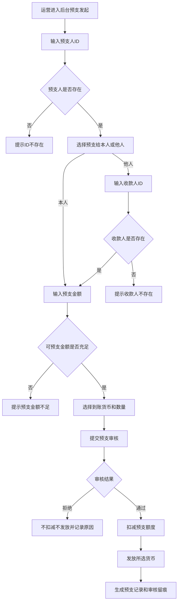

#### 系统后台核心逻辑

- 预支发起成功仅生成待审核记录。
- 后台发起预支时必须先计算并展示发起时可预支金额；金币工资奖励、仅支持提现为金币的部分、冻结金额、已提现金额、已转账金额不得计入。
- 若本次预支金额大于发起时可预支金额，系统禁止提交并提示预支金额不足。
- 审核通过后才扣减预支额度和发放货币。
- 预支债务挂预支人本人，不挂收款人。
- 月结时对冲预支人当期工资，不扣收款人工资。

### 9.11 用户资产操作

#### 对应原型


**功能描述：** 后台用户资产操作页，用于对用户资产做单边加减、双账号划转和预支/借支/线下处理。这个模块承接的是“平台主动改用户资产”这类强后台动作，因此重点不是表单长什么样，而是操作会影响哪些余额、哪些历史链路、如何留痕。  
**关键交互：** 操作人先确认账号关系和资产快照，再选择币种、渠道、加减方式、金额和理由，提交后系统写入资产快照和审计日志；高风险动作需二次确认。

#### 前置条件

| 条件 | 处理规则 |
|---|---|
| 操作权限 | 操作人具备资产操作权限，高风险资产操作需二次确认或高级权限 |
| 账号有效 | 扣款账号、充值账号必须能检索到有效用户；双账号划转时两者都必须确认 |
| 余额预览 | 提交前必须展示操作前余额、预计操作后余额、币种、渠道和原因 |
| 敏感操作依据 | 减资产、借支、预支转移、线下处理、赠送等敏感操作必须记录审批或操作依据 |

#### 字段与数据来源

##### 表单字段

| 字段 | 类型 | 必填 | 说明 |
|---|---|---:|---|
| 扣款账号 | 用户选择/搜索 | 否 | 双账号划转时作为扣减方 |
| 充值账号 | 用户选择/搜索 | 是 | 入账方 |
| 扣款账号信息 | 系统展示 | 否 | 昵称、UID、身份、公会、余额等 |
| 充值账号信息 | 系统展示 | 是 | 昵称、UID、身份、公会、余额等 |
| 币种类型 | 单选 | 是 | 金币/钻石 |
| 渠道 | 单选 | 是 | 柚子、vodafen、其他线下、预支、借支、预支转移、赠送、充币 |
| 方式 | 单选 | 是 | 加/减 |
| 金额 | 数字输入 | 是 | 美元金额或业务金额 |
| 币数 | 数字输入 | 是 | 自动换算，可手动修改 |
| 理由 | 文本 | 建议必填 | 操作原因，最多200字 |

##### 快照字段

| 字段 | 说明 | 数据来源 |
|---|---|---|
| 操作前余额 | 提交前账户余额 | 资产账户 |
| 预计操作后余额 | 本次操作后的余额预估 | 系统计算 |
| 操作快照编号 | 本次操作快照唯一编号 | 资产操作快照 |
| 审批依据 | 高风险动作审批依据 | 审批记录/操作记录 |

#### 交互逻辑

1. 操作人进入资产操作页后，先选择充值账号，必要时选择扣款账号。
2. 系统加载双方账户摘要，展示当前余额、身份、公会等基础信息。
3. 操作人选择币种、渠道、方式、金额和理由后，系统即时校验组合是否合法。
4. 对敏感操作，系统弹出二次确认，提示可能影响结算、提现、预支或历史对账结果。
5. 提交成功后，系统生成资产操作快照和审计日志，再写入正式结果。

#### 系统后台核心逻辑

- 所有资产操作必须先生成操作快照，记录操作前余额、操作后余额、币种、渠道、金额和操作人。
- 双账号划转必须同时记录扣款方和入账方，不允许只记录入账结果。
- 预支、借支、预支转移类操作必须接入预支记录或资产审计链路，不能只改余额。
- 敏感操作提交后不可物理删除，只能通过反向调整或冲正记录修正。
- 资产操作产生的金币或钻石是否进入政策流水，必须按结算规则读取资产来源和用途配置；默认规则为：预支、借支、预支转移、赠送、线下处理、人工加钻石/金币均不直接计入政策流水，只有被明确配置为可计入结算口径的充值/兑换类来源才允许进入后续工资结算。

#### 边界情况

| 场景 | 处理规则 |
|---|---|
| 扣款账号余额不足 | 禁止提交，提示余额不足 |
| 双账号关系非法 | 禁止划转，提示账号关系不合法 |
| 渠道和币种组合非法 | 禁止提交，提示按后台配置选择合法组合 |
| 敏感操作缺审批依据 | 禁止提交，提示补充审批或操作依据 |

### 

### 9.14 审计日志与快照中心

#### 功能说明


#### 快照类型

| 快照类型 | 记录内容 | 产生时机 |
|---|---|---|
| 政策快照 | 政策版本、档位、比例、X/Y/Z、金币工资奖励比例 | 政策绑定或结算生成 |
| 公会绑定快照 | 公会、政策、开始结束时间、审批信息 | 公会绑定政策时 |
| 主播归属快照 | 主播、公会、加入/离会/移除时间 | 主播关系变更时 |
| 结算快照 | 流水、工资项、扣减、预支、余额池 | 月度结算生成时 |
| 提现申请快照 | 余额池余额、提现出口、扣减顺序、金额、账户 | 提交提现申请时 |
| 资产操作快照 | 操作前后余额、币种、渠道、金额、原因 | 后台资产操作提交时 |
## 十、核心状态机

### 10.1 提现状态机

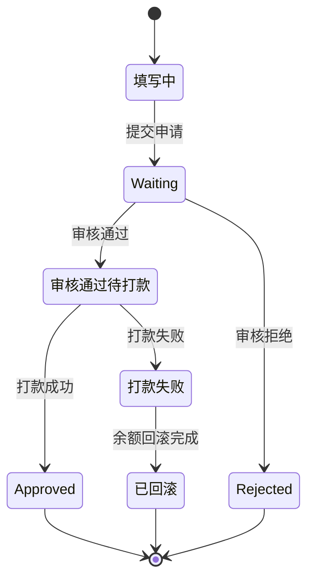

### 10.2 预支状态机

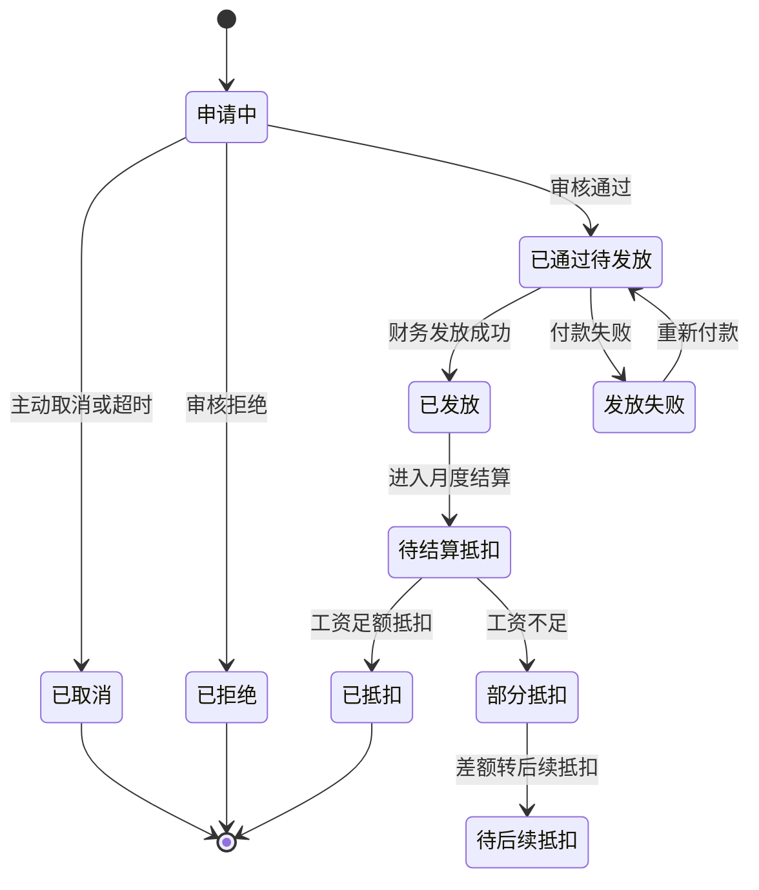

### 10.3 主播公会关系状态机

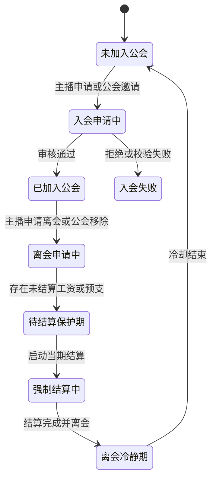

---

## 十一、待产品确认点

| 编号 | 待确认点 | 影响模块 | 建议默认值 |
|---|---|---|---|
| C1 | 客户端 `Other` 页签在原型中存在命名歧义 | 提现首页、提现记录、余额池展示 | 当前按“其他提现/内部转账”理解，但原型示例命名不作为最终需求依据 |
| C2 | 原型中金币汇率出现 `1$=1100 Coins` 与 `1$=11000 Coins` 的差异 | 提现金币、金币奖励工资明细、后台配置 | 以后台汇率配置为唯一需求依据，原型示例数字不作为需求口径 |
| C3 | 公会长端“主播收入金额/主播转入金额”是否等同于业务建模中的“主播转入薪资余额” | 公会长提现、余额池、历史快照 | 建议统一命名为“主播转入薪资余额” |
| C5 | `公会长私薪资` 的正式命名 | 薪资页面、结算单、历史明细 | 建议统一为“公会长管理收益” |
| C8 | 入会申请是否允许公会长主动邀请主播 | 加入公会、入会申请管理 | 建议支持邀请，但主播必须确认 |

---

## 十二、源材料覆盖核对

| 源材料 | 覆盖章节 |
|---|---|
| `TALO公会政策_客户端后台功能结构脑图.xmind` | 端口结构、客户端模块、后台模块、数据对象、流程、待确认点 |
| `公会入口.jpg` | 5.1 主播端首页 / 公会入口、6.1 公会长端首页 / 公会入口 |
| `加入公会.jpg` | 5.2 加入公会 |
| `主播申请管理.jpg` | 6.2 入会申请管理（公会长） |
| `薪资页面.jpg` / `薪资页面_1.jpg` | 5.3 主播本人薪资页、6.3 公会长薪资数据页、6.4 公会薪资数据页 |
| `主播视角-历史结算记录_自由政策.jpg` / `主播视角-历史结算记录_普通政策.jpg` | 5.11 历史结算记录列表（主播视角）、5.12 历史结算记录详情（主播视角） |
| `公会长视角-历史结算记录.jpg` | 6.9 历史结算记录列表（公会长视角）、6.10 历史结算记录详情（公会长视角） |
| `主播提现总流程.jpg` | 5.4 主播提现中心 |
| `公会长提现总流程.jpg` | 6.6 公会长提现中心 |
| `公会长提现-提现为金币.jpg` / `_1.jpg` | 5.4 主播提现中心、6.6 公会长提现中心 |
| `公会长提现-提现为现金.jpg` / `_1.jpg` | 5.4 主播提现中心、6.6 公会长提现中心 |
| `提现给公会长.jpg` | 5.4 主播提现中心 |
| `提现记录.jpg` | 5.8 提现记录（主播视角） |
| `主播_公会长-金币工资奖励说明.jpg` | 5.9 金币奖励工资明细（主播/公会长共用）、6.8A 金币工资明细（公会长视角） |
| `预支记录.jpg` | 5.10 预支记录 |
| `主播管理.jpg` | 6.5 主播管理（公会长） |
| `后台-公会管理.jpg` | 9.2 公会管理 |
| `后台-主播列表.jpg` | 9.3 主播列表 |
| `后台-主播薪资.jpg` | 9.4 主播薪资 |
| `后台-公会薪资.jpg` | 9.5 公会薪资 |
| `后台-提现.jpg` / `后台-提现记录.jpg` / `后台-提现到公会长记录.jpg` | 9.7 提现审核与记录 |
| `后台-用户资产操作.jpg` | 9.9 用户资产操作 |
| `后台-币商交易记录.jpg` | 9.10 币商交易记录 |

---

## 十三、逻辑暗坑审计结论

| 编号 | 类型 | 风险点 | 当前处理 |
|---|---|---|---|
| G1 | 金钱口径 | 页面汇总可提现金额容易被误当成可直接提现金额 | PRD明确提现申请页必须拆余额池 |
| G2 | 预支对冲 | 若金币工资奖励也用于预支，会造成金币奖励被现金债务吃掉 | PRD明确只允许非金币工资奖励对冲 |
| G3 | 双身份 | 公会长本人作为主播时，主播收入和管理收益容易混算 | PRD明确两条链路分别计算，页面可合并展示 |
| G4 | 离会边界 | 未结算直接离会会导致工资和预支债务悬空 | PRD明确强制先结算再离会 |
| G5 | 历史追溯 | 当前政策变更后可能误重算历史工资 | PRD明确历史读取结算快照 |
| G6 | 提现失败 | 审核通过但打款失败若无回滚会造成余额丢失 | PRD明确打款失败需回滚并留痕 |
| G7 | 汇率冲突 | 原型内金币汇率示例不一致 | PRD列为待确认，建议以后台配置为准 |
| G8 | 资产操作 | 后台人工加减资产高风险 | PRD明确二次确认、余额校验、前后余额快照、审计日志 |

---

## 十四、交付结论

本 PRD 已将客户端和后台拆成两套产品结构，但工资、预支、提现、余额池和历史快照按同一条业务资金链闭环。

开发和测试最需要盯死的主链路是：

```text
钻石流水 → 政策结算 → 工资项拆分 → 预支对冲 → 余额池 → 提现申请 → 后台审核 → 打款/驳回/回滚 → 历史快照
```
